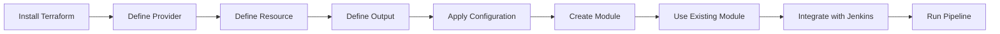

## Introduction to Infrastructure as Code (IaC) with Terraform

Infrastructure as Code (IaC) is a practice where infrastructure is defined and managed through machine-readable files rather than manual processes. This approach allows for automation, consistency, and version control of infrastructure configurations. One of the most popular tools for IaC is Terraform, developed by HashiCorp. In this chapter, we will delve into the fundamentals of Terraform, including its syntax, key concepts, and practical applications.

### Installing Terraform

Before diving into the syntax and concepts, ensure that Terraform is installed on your system. You can download it from the official HashiCorp website. Installation typically involves downloading the appropriate binary for your operating system and placing it in your PATH.

```bash
# Example installation command for Linux
curl -O https://releases.hashicorp.com/terraform/1.0.0/terraform_1.0.0_linux_amd64.zip
unzip terraform_1.0.0_linux_amd64.zip
sudo mv terraform /usr/local/bin/
```

### Basic Syntax of Terraform Configuration Files

Terraform uses a declarative language called HCL (HashiCorp Configuration Language) to define infrastructure. A typical Terraform configuration consists of one or more `.tf` files.

#### Providers

A provider is a plugin that provides access to a specific cloud service or infrastructure. For example, the `aws` provider is used to interact with Amazon Web Services (AWS).

```hcl
provider "aws" {
  region = "us-west-2"
}
```

**Explanation:**
- **Provider:** Specifies the cloud provider Terraform will interact with.
- **Region:** Specifies the geographical location where the resources will be created.

#### Resources

Resources represent the actual infrastructure components, such as servers, databases, or networks.

```hcl
resource "aws_instance" "example" {
  ami           = "ami-0c94855ba95b798c7"
  instance_type = "t2.micro"

  tags = {
    Name = "example-instance"
  }
}
```

**Explanation:**
- **Resource Type:** `aws_instance` indicates that we are creating an EC2 instance.
- **Instance ID:** `example` is a unique identifier for this resource.
- **AMI:** The Amazon Machine Image (AMI) ID specifies the base image for the instance.
- **Instance Type:** Defines the type of instance (e.g., `t2.micro`).
- **Tags:** Metadata attached to the instance for easy identification.

#### Data Sources

Data sources allow you to retrieve information from a provider, which can be used to populate variables or conditionally create resources.

```hcl
data "aws_ami" "example" {
  most_recent = true

  filter {
    name   = "name"
    values = ["amzn2-ami-hvm*"]
  }

  owners = ["amazon"]
}
```

**Explanation:**
- **Data Source:** Retrieves the latest AMI from Amazon.
- **Filter:** Specifies criteria to match the desired AMI.
- **Owners:** Specifies the owner of the AMI.

### Terraform State

The Terraform state is a file that tracks the lifecycle of resources managed by Terraform. It stores metadata about the resources, their dependencies, and their current state.

```bash
terraform init
terraform apply
```

**Explanation:**
- **Init:** Initializes the working directory, downloading necessary plugins and setting up the state.
- **Apply:** Applies the changes described in the configuration files.

### Outputs

Outputs allow you to expose values from your Terraform configuration, making them available for use in other parts of your infrastructure or scripts.

```hcl
output "instance_ip" {
  value = aws_instance.example.public_ip
}
```

**Explanation:**
- **Output:** Exposes the public IP address of the created instance.

### Variables

Variables allow you to parameterize your Terraform configuration, making it more flexible and reusable.

```hcl
variable "region" {
  default = "us-west-2"
}

variable "instance_type" {
  default = "t2.micro"
}
```

**Explanation:**
- **Variable:** Defines a variable with a default value.

### Practical Example: Creating an EC2 Server on AWS

Let's walk through a practical example of creating an EC2 server on AWS using Terraform.

#### Step 1: Define the Provider

```hcl
provider "aws" {
  region = var.region
}
```

#### Step 2: Define the Resource

```hcl
resource "aws_instance" "example" {
  ami           = "ami-0c94855ba95b798c7"
  instance_type = var.instance_type

  tags = {
    Name = "example-instance"
  }
}
```

#### Step 3: Define the Output

```hcl
output "instance_ip" {
  value = aws_instance.example.public_ip
}
```

#### Step 4: Apply the Configuration

```bash
terraform init
terraform apply
```

### Reusing and Modularizing Terraform Configurations

To make Terraform configurations reusable and modular, you can use Terraform modules. Modules are reusable packages of Terraform configurations.

#### Creating Your Own Module

```hcl
module "ec2_server" {
  source = "./modules/ec2_server"

  region        = var.region
  instance_type = var.instance_type
}
```

#### Using Existing Modules from the Terraform Registry

```hcl
module "eks_cluster" {
  source  = "terraform-aws-modules/eks/aws"
  version = "~> 18.0"

  cluster_name     = "my-cluster"
  cluster_version  = "1.21"
  subnets          = ["subnet-1", "subnet-2"]
  vpc_id           = "vpc-12345678"
  enable_irsa      = true
}
```

### Integrating Terraform with Jenkins CI/CD Pipeline

To automate the provisioning of infrastructure and deployment of applications, you can integrate Terraform with Jenkins.

#### Step 1: Define the Jenkins Pipeline

```groovy
pipeline {
  agent any

  stages {
    stage('Provision Infrastructure') {
      steps {
        script {
          sh 'terraform init'
          sh 'terraform apply -auto-approve'
        }
      }
    }
    stage('Deploy Application') {
      steps {
        // Steps to deploy the application
      }
    }
  }
}
```

#### Step 2: Run the Pipeline

```bash
jenkins-cli build job-name
```

### Real-World Examples and Recent Breaches

Recent breaches and vulnerabilities often involve misconfigurations or lack of proper access controls. For example, the Capital One breach in 2019 was due to misconfigured AWS S3 buckets. Proper use of Terraform and IaC can help prevent such issues by ensuring consistent and secure configurations.

### Common Pitfalls and How to Prevent Them

#### Pitfall 1: Hardcoding Secrets

**Example:**

```hcl
resource "aws_s3_bucket" "example" {
  bucket = "my-bucket"
  acl    = "private"

  server_side_encryption_configuration {
    rule {
      apply_server_side_encryption_by_default {
        sse_algorithm = "AES256"
      }
    }
  }
}
```

**Secure Fix:**

Use environment variables or secrets management tools like AWS Secrets Manager.

```hcl
resource "aws_s3_bucket" "example" {
  bucket = "my-bucket"
  acl    = "private"

  server_side_encryption_configuration {
    rule {
      apply_server_side_encryption_by_default {
        sse_algorithm = "AES256"
      }
    }
  }

  lifecycle_rule {
    id      = "log-retention"
    enabled = true

    transition {
      days          = 30
      storage_class = "GLACIER"
    }
  }
}
```

#### Pitfall 2: Inconsistent State Management

**Example:**

```bash
terraform apply
```

**Secure Fix:**

Use version control for Terraform state files and ensure consistent state management across environments.

```bash
terraform init
terraform plan
terraform apply
```

### Conclusion

By mastering Terraform and IaC, you can automate the provisioning and management of infrastructure, ensuring consistency, security, and scalability. This knowledge makes you invaluable in any IT team, whether in your current or future company.

### Practice Labs

For hands-on experience, consider the following labs:

- **PortSwigger Web Security Academy:** Focuses on web application security but includes sections on IaC.
- **OWASP Juice Shop:** A deliberately insecure web application for practicing security skills.
- **DVWA (Damn Vulnerable Web Application):** Another web application for learning security practices.
- **WebGoat:** An interactive web application designed to teach web application security lessons.

These labs provide practical scenarios to apply your knowledge of Terraform and IaC.



This concludes the comprehensive guide to Infrastructure as Code with Terraform. By following these steps and examples, you will be well-equipped to automate and manage your infrastructure effectively.

---
<!-- nav -->
[[DevOps/DevOps Bootcamp/08-Infrastructure as Code (Terraform)/10-Infrastructure As Code With Terraform/00-Overview|Overview]] | [[DevOps/DevOps Bootcamp/08-Infrastructure as Code (Terraform)/10-Infrastructure As Code With Terraform/02-Introduction to Infrastructure as Code (IaC)|Introduction to Infrastructure as Code (IaC)]]
