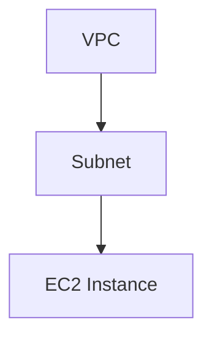

## Introduction to Infrastructure as Code (IaC)

Infrastructure as Code (IaC) is a practice in which infrastructure is defined and managed using code rather than manual processes. This approach allows teams to automate the provisioning, configuration, and management of infrastructure resources, making it more efficient, consistent, and scalable. In the context of DevOps, IaC is a critical component of automating the entire lifecycle of an application, including the creation and maintenance of the underlying infrastructure.

### Why Infrastructure as Code?

Before diving into the details, it's essential to understand why IaC is necessary. Traditionally, infrastructure was set up manually, which led to several issues:

1. **Consistency**: Manual setups often result in inconsistencies across different environments (development, testing, production).
2. **Reproducibility**: It's challenging to reproduce the exact same environment setup multiple times.
3. **Scalability**: Scaling infrastructure manually is time-consuming and error-prone.
4. **Documentation**: Manual setups lack proper documentation, making it difficult for new team members to understand the infrastructure.

By using IaC, these issues can be mitigated. Infrastructure definitions are stored in version control systems, allowing teams to collaborate, review changes, and maintain a history of infrastructure configurations.

### What is Terraform?

Terraform is one of the most popular tools for implementing IaC. Developed by HashiCorp, Terraform allows you to define and provision infrastructure resources across multiple cloud providers and on-premises environments using a declarative configuration language called HCL (HashiCorp Configuration Language).

#### Key Features of Terraform

1. **Multi-cloud Support**: Terraform supports a wide range of cloud providers, including AWS, Azure, Google Cloud, and others.
2. **State Management**: Terraform maintains a state file that tracks the current state of your infrastructure, ensuring consistency between the actual infrastructure and the desired state defined in the code.
3. **Resource Graph**: Terraform builds a dependency graph of resources, allowing it to apply changes in the correct order and handle dependencies effectively.
4. **Version Control**: Since Terraform configurations are stored in version control systems, you can track changes, collaborate with team members, and roll back to previous versions if needed.
5. **Provisioning and Destruction**: Terraform can both create and destroy resources, making it easy to manage the entire lifecycle of your infrastructure.

### Basic Concepts of Terraform

To get started with Terraform, it's important to understand some fundamental concepts:

1. **Providers**: Providers are plugins that allow Terraform to interact with different cloud providers or services. Each provider has its own set of resources and data sources.
2. **Resources**: Resources represent the infrastructure components you want to manage, such as EC2 instances, VPCs, or RDS databases.
3. **Data Sources**: Data sources allow you to retrieve information from cloud providers or other external sources. This information can then be used to configure your resources.
4. **Variables**: Variables allow you to parameterize your Terraform configurations, making them more flexible and reusable.
5. **Outputs**: Outputs allow you to export values from your Terraform configurations, making it easier to share information between different modules or configurations.

### Example: Creating an EC2 Instance with Terraform

Let's walk through an example of creating an EC2 instance using Terraform. This example will cover the basic steps involved in defining and provisioning infrastructure resources.

#### Step 1: Initialize Terraform

First, you need to initialize Terraform by creating a `main.tf` file and specifying the required provider. For AWS, the provider configuration looks like this:

```hcl
provider "aws" {
  region = "us-west-2"
}
```

#### Step 2: Define the EC2 Instance Resource

Next, define the EC2 instance resource using the `aws_instance` resource type. Here's an example configuration:

```hcl
resource "aws_instance" "example" {
  ami           = "ami-0c55b159cbfafe1f0"
  instance_type = "t2.micro"

  tags = {
    Name = "example-instance"
  }
}
```

#### Step 3: Apply the Configuration

Once the configuration is defined, you can apply it using the following commands:

```sh
terraform init
terraform plan
terraform apply
```

The `terraform init` command initializes the Terraform working directory, downloading any necessary provider plugins. The `terraform plan` command generates an execution plan, showing you what changes Terraform will make. Finally, the `terraform apply` command applies the plan, creating the EC2 instance.

### Dependency Management with Terraform

One of the key strengths of Terraform is its ability to manage dependencies between resources. Terraform automatically builds a dependency graph based on the relationships between resources, ensuring that resources are created and destroyed in the correct order.

For example, consider a scenario where you need to create a VPC, a subnet within that VPC, and an EC2 instance within that subnet. The dependency graph would look like this:



In this case, Terraform ensures that the VPC is created first, followed by the subnet, and finally the EC2 instance.

### Real-World Examples and Recent Breaches

Recent breaches and vulnerabilities have highlighted the importance of proper IaC practices. For example, the Capital One breach in 2019 exposed sensitive customer data due to misconfigured AWS S3 buckets. Proper IaC practices could have helped prevent such misconfigurations by ensuring that infrastructure settings are consistently applied and reviewed.

Another example is the Equifax breach in 2017, which exposed personal data of millions of customers. While the breach was primarily due to a vulnerability in Apache Struts, proper IaC practices could have helped ensure that security patches were consistently applied across all infrastructure components.

### How to Prevent / Defend

To prevent and defend against infrastructure-related vulnerabilities, follow these best practices:

1. **Use Version Control**: Store your Terraform configurations in a version control system like Git. This allows you to track changes, collaborate with team members, and roll back to previous versions if needed.
2. **Automate Testing**: Implement automated testing for your Terraform configurations to catch errors and misconfigurations early. Tools like `terraform validate` can help with this.
3. **Use Modules**: Organize your Terraform configurations into reusable modules. This makes it easier to maintain and update your infrastructure.
4. **Enforce Policies**: Use tools like Terrascan or Checkov to enforce security policies and detect misconfigurations in your Terraform configurations.
5. **Regular Audits**: Regularly audit your infrastructure configurations to ensure they comply with security policies and best practices.

### Complete Example: Creating an EKS Cluster with Terraform

Let's walk through a more complex example of creating an EKS (Elastic Kubernetes Service) cluster using Terraform. This example will cover the steps involved in defining and provisioning an EKS cluster, including the necessary roles and networking configuration.

#### Step 1: Initialize Terraform

Create a `main.tf` file and specify the required provider:

```hcl
provider "aws" {
  region = "us-west-2"
}
```

#### Step 2: Define the EKS Cluster

Define the EKS cluster using the `aws_eks_cluster` resource type. Here's an example configuration:

```hcl
resource "aws_eks_cluster" "example" {
  name     = "example-cluster"
  role_arn = aws_iam_role.example.arn

  vpc_config {
    subnet_ids = [aws_subnet.example.id]
  }

  depends_on = [aws_iam_role_policy_attachment.example]
}

resource "aws_iam_role" "example" {
  name = "example-role"

  assume_role_policy = jsonencode({
    Version = "2012-10-17"
    Statement = [
      {
        Action = "sts:AssumeRole"
        Effect = "Allow"
        Principal = {
          Service = "eks.amazonaws.com"
        }
      },
    ]
  })
}

resource "aws_iam_role_policy_attachment" "example" {
  policy_arn = "arn:aws:iam::aws:policy/AmazonEKSClusterPolicy"
  role_arn   = aws_iam_role.example.arn
}

resource "aws_subnet" "example" {
  vpc_id     = aws_vpc.example.id
  cidr_block = "10.0.1.0/24"
  availability_zone = "us-west-2a"
}

resource "aws_vpc" "example" {
  cidr_block = "10.0.0.0/16"
}
```

#### Step 3: Apply the Configuration

Apply the configuration using the following commands:

```sh
terraform init
terraform plan
terraform apply
```

This will create an EKS cluster with the specified roles and networking configuration.

### Conclusion

Infrastructure as Code (IaC) is a crucial practice in modern DevOps workflows. By using tools like Terraform, you can automate the provisioning, configuration, and management of infrastructure resources, making it more efficient, consistent, and scalable. Understanding the key concepts and best practices of IaC can help you build and maintain robust and secure infrastructure.

### Practice Labs

To gain hands-on experience with Terraform and IaC, consider the following practice labs:

- **PortSwigger Web Security Academy**: Offers a variety of labs focused on web application security, including some that involve setting up and securing infrastructure.
- **OWASP Juice Shop**: A deliberately insecure web application for security training, which can be deployed using Terraform.
- **CloudGoat**: A series of labs designed to teach cloud security concepts, including IaC practices using Terraform.

These labs provide practical experience in applying IaC principles and tools to real-world scenarios.

---
<!-- nav -->
[[01-Introduction to Infrastructure as Code (IaC) with Terraform|Introduction to Infrastructure as Code (IaC) with Terraform]] | [[DevOps/DevOps Bootcamp/08-Infrastructure as Code (Terraform)/10-Infrastructure As Code With Terraform/00-Overview|Overview]] | [[DevOps/DevOps Bootcamp/08-Infrastructure as Code (Terraform)/10-Infrastructure As Code With Terraform/03-Practice Questions & Answers|Practice Questions & Answers]]
