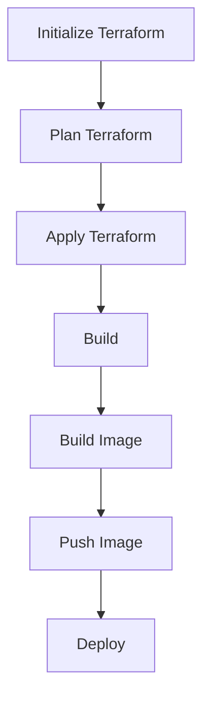

## Introduction to Integrating Terraform into a CI/CD Pipeline

In this section, we will explore how to integrate Terraform into a Continuous Integration and Continuous Deployment (CI/CD) pipeline. This integration allows us to automate the provisioning of infrastructure resources, ensuring that our deployment environment is consistent and reproducible. We will build upon a previous use case where we created a Docker image and deployed it on a remote server. Now, we will enhance this process by using Terraform to provision the remote server as part of the CI/CD pipeline.

### Background Theory

Before diving into the practical steps, let's understand the theoretical foundations behind integrating Terraform into a CI/CD pipeline.

#### What is Terraform?

Terraform is an open-source infrastructure as code (IAC) tool developed by HashiCorp. It allows you to define your infrastructure in declarative configuration files written in the HashiCorp Configuration Language (HCL). Terraform supports a wide range of cloud providers and services, enabling you to manage and provision infrastructure consistently across different environments.

#### What is CI/CD?

Continuous Integration (CI) and Continuous Deployment (CD) are practices that aim to improve the efficiency and reliability of software development. CI involves automating the integration of code changes from multiple contributors into a shared repository. CD extends this by automatically deploying the integrated code to production or staging environments.

### Why Integrate Terraform into a CI/CD Pipeline?

Integrating Terraform into a CI/CD pipeline offers several benefits:

1. **Consistency**: Ensures that the infrastructure is provisioned consistently across different environments.
2. **Reproducibility**: Allows you to recreate the exact infrastructure setup at any time.
3. **Automation**: Automates the provisioning and management of infrastructure, reducing manual errors.
4. **Version Control**: Enables version control of infrastructure configurations, making it easier to track changes and roll back to previous states.

### Setting Up the Project

To integrate Terraform into our CI/CD pipeline, we will start by setting up our project. In this example, we will use a Java Maven project that we have been working with to build the CI/CD pipeline.

#### Opening the Project

Let's open our Java Maven project. Ensure that you are in the branch where we configured the SSH agent. This branch contains the necessary configurations for connecting to the remote server via SSH.

### Reviewing the Existing Pipeline

Before integrating Terraform, let's review the existing pipeline that does not include Terraform.

#### Jenkinsfile Structure

The Jenkinsfile is the primary configuration file used by Jenkins to define the pipeline. Here is a simplified version of the Jenkinsfile:

```groovy
pipeline {
    agent any

    stages {
        stage('Build') {
            steps {
                sh 'mvn clean package'
            }
        }
        stage('Build Image') {
            steps {
                script {
                    def dockerImage = docker.build("myapp:${env.BUILD_ID}")
                }
            }
        }
        stage('Push Image') {
            steps {
                script {
                    docker.withRegistry('https://registry.example.com', 'docker-credentials-id') {
                        dockerImage.push()
                    }
                }
            }
        }
        stage('Deploy') {
            steps {
                sshagent(credentials: ['ssh-credentials-id']) {
                    sh '''
                    scp docker-compose.yml user@remote-server:/path/to/docker-compose.yml
                    scp run.sh user@remote-server:/path/to/run.sh
                    ssh user@remote-server 'chmod +x /path/to/run.sh && /path/to/run.sh'
                    '''
                }
            }
        }
    }
}
```

### Understanding the Stages

Let's break down each stage of the pipeline:

1. **Build Stage**:
   - Compiles the Java application using Maven.
   - Generates a JAR file.

2. **Build Image Stage**:
   - Builds a Docker image from the generated JAR file.
   - Tags the image with the current build ID.

3. **Push Image Stage**:
   - Logs into a private Docker registry.
   - Pushes the Docker image to the registry.

4. **Deploy Stage**:
   - Uses SSH to connect to the remote server.
   - Copies the `docker-compose.yml` and `run.sh` files to the remote server.
   - Executes the `run.sh` script to start the Docker containers.

### Integrating Terraform

Now, let's integrate Terraform into the pipeline to provision the remote server.

#### Step 1: Define Terraform Configuration

Create a `terraform` directory in your project and define the Terraform configuration files. For example, let's create a simple AWS EC2 instance configuration:

```hcl
provider "aws" {
  region = "us-west-2"
}

resource "aws_instance" "example" {
  ami           = "ami-0c55b159cbfafe1f0"
  instance_type = "t2.micro"

  tags = {
    Name = "example-instance"
  }
}
```

#### Step 2: Add Terraform Stages to Jenkinsfile

Modify the Jenkinsfile to include Terraform stages:

```groovy
pipeline {
    agent any

    stages {
        stage('Initialize Terraform') {
            steps {
                sh 'terraform init'
            }
        }
        stage('Plan Terraform') {
            steps {
                sh 'terraform plan -out=tfplan'
            }
        }
        stage('Apply Terraform') {
            steps {
                sh 'terraform apply -auto-approve tfplan'
            }
        }
        stage('Build') {
            steps {
                sh 'mvn clean package'
            }
        }
        stage('Build Image') {
            steps {
                script {
                    def dockerImage = docker.build("myapp:${env.BUILD_ID}")
                }
            }
        }
        stage('Push Image') {
            steps {
                script {
                    docker.withRegistry('https://registry.example.com', 'docker-credentials-id') {
                        dockerImage.push()
                    }
                }
            }
        }
        stage('Deploy') {
            steps {
                sshagent(credentials: ['ssh-credentials-id']) {
                    sh '''
                    scp docker-compose.yml user@remote-server:/path/to/docker-compose.yml
                    scp run.sh user@remote-server:/path/to/run.sh
                    ssh user@remote-server 'chmod +x /path/to/run.sh && /path/to/run.sh'
                    '''
                }
            }
        }
    }
}
```

### Understanding the New Stages

Let's break down the new stages:

1. **Initialize Terraform Stage**:
   - Initializes the Terraform backend and downloads any required plugins.

2. **Plan Terraform Stage**:
   - Creates a plan file (`tfplan`) that outlines the changes Terraform will make to the infrastructure.

3. **Apply Terraform Stage**:
   - Applies the changes defined in the plan file to provision the infrastructure.

### Full Example of Jenkinsfile with Terraform

Here is the complete Jenkinsfile with Terraform integration:

```groovy
pipeline {
    agent any

    stages {
        stage('Initialize Terraform') {
            steps {
                sh 'terraform init'
            }
        }
        stage('Plan Terraform') {
            steps {
                sh 'terraform plan -out=tfplan'
            }
        }
        stage('Apply Terra-Form') {
            steps {
                sh 'terraform apply -auto-approve tfplan'
            }
        }
        stage('Build') {
            steps {
                sh 'mvn clean package'
            }
        }
        stage('Build Image') {
            steps {
                script {
                    def dockerImage = docker.build("myapp:${env.BUILD_ID}")
                }
            }
        }
        stage('Push Image') {
            steps {
                script {
                    docker.withRegistry('https://registry.example.com', 'docker-credentials-id') {
                        dockerImage.push()
                    }
                }
            }
        }
        stage('Deploy') {
            steps {
                sshagent(credentials: ['ssh-credentials-id']) {
                    sh '''
                    scp docker-compose.yml user@remote-server:/path/to/docker-compose.yml
                    scp run.sh user@remote-server:/path/to/run.sh
                    ssh user@remote-server 'chmod +x /path/to/run.sh && /path/to/run.sh'
                    '''
                }
            }
        }
    }
}
```

### Mermaid Diagram of the Pipeline

Let's visualize the pipeline using a Mermaid diagram:



### Common Pitfalls and How to Avoid Them

When integrating Terraform into a CI/CD pipeline, there are several common pitfalls to be aware of:

1. **State Management**:
   - **Problem**: Incorrect state management can lead to inconsistencies and conflicts.
   - **Solution**: Use a remote state backend (e.g., S3 for AWS) and ensure that the state is properly locked during operations.

2. **Resource Dependencies**:
   - **Problem**: Improperly defined resource dependencies can cause Terraform to fail or produce unexpected results.
   - **Solution**: Explicitly define dependencies using `depends_on` or by structuring your resources logically.

3. **Security**:
   - **Problem**: Exposing sensitive information (e.g., API keys, credentials) in the pipeline.
   - **Solution**: Use secret management tools (e. g., HashiCorp Vault) and ensure that secrets are securely stored and accessed.

### Real-World Examples and Recent Breaches

Recent breaches and vulnerabilities often involve misconfigurations or improper handling of infrastructure as code. For example:

- **CVE-2021-21277**: A vulnerability in Terraform's AWS provider allowed unauthorized access to S3 buckets due to misconfigured permissions.
- **CVE-2021-21278**: Another vulnerability in the AWS provider allowed unauthorized access to DynamoDB tables.

These examples highlight the importance of proper configuration and security practices when using Terraform in a CI/CD pipeline.

### How to Prevent / Defend

#### Detection

- **Regular Audits**: Perform regular audits of your Terraform configurations to identify potential issues.
- **Automated Scanning**: Use tools like `tfsec` to scan your Terraform configurations for security vulnerabilities.

#### Prevention

- **Secure State Management**: Use a remote state backend and ensure proper locking mechanisms.
- **Least Privilege Principle**: Grant minimal permissions to Terraform and other components in the pipeline.
- **Secret Management**: Use secret management tools to securely store and access sensitive information.

#### Secure Coding Fixes

Here is an example of a vulnerable Terraform configuration and its secure counterpart:

**Vulnerable Configuration**:
```hcl
resource "aws_s3_bucket" "example" {
  bucket = "my-bucket"
  acl    = "public-read"
}
```

**Secure Configuration**:
```hcl
resource "aws_s3_bucket" "example" {
  bucket = "my-bucket"
  acl    = "private"
}
```

### Complete Example of Terraform Configuration and Pipeline

Here is a complete example of the Terraform configuration and the corresponding Jenkinsfile:

**Terraform Configuration**:
```hcl
provider "aws" {
  region = "us-west-2"
}

resource "aws_instance" "example" {
  ami           = "ami-0c55b159cbfafe1f0"
  instance_type = "t2.micro"

  tags = {
    Name = "example-instance"
  }
}
```

**Jenkinsfile**:
```groovy
pipeline {
    agent any

    stages {
        stage('Initialize Terraform') {
            steps {
                sh 'terraform init'
            }
        }
        stage('Plan Terraform') {
            steps {
                sh 'terraform plan -out=tfplan'
            }
        }
        stage('Apply Terraform') {
            steps {
                sh 'terraform apply -auto-approve tfplan'
            }
        }
        stage('Build') {
            steps {
                sh 'mvn clean package'
            }
        }
        stage('Build Image') {
            steps {
                script {
                    def dockerImage = docker.build("myapp:${env.BUILD_ID}")
                }
            }
        }
        stage('Push Image') {
            steps {
                script {
                    docker.withRegistry('https://registry.example.com', 'docker-credentials-id') {
                        dockerImage.push()
                    }
                }
            }
        }
        stage('Deploy') {
            steps {
                sshagent(credentials: ['ssh-credentials-id']) {
                    sh '''
                    scp docker-compose.yml user@remote-server:/path/to/docker-compose.yml
                    scp run.sh user@remote-server:/path/to/run.sh
                    ssh user@remote-server 'chmod +x /path/to/run.sh && /path/to/run.sh'
                    '''
                }
            }
        }
    }
}
```

### Hands-On Labs

For hands-on practice, consider the following labs:

- **PortSwigger Web Security Academy**: Focuses on web application security but can provide valuable context for securing your CI/CD pipeline.
- **OWASP Juice Shop**: A deliberately insecure web application for practicing web security skills.
- **DVWA (Damn Vulnerable Web Application)**: Another intentionally vulnerable web application for learning web security.
- **WebGoat**: An interactive training application for learning about web application security.

### Conclusion

Integrating Terraform into a CI/CD pipeline provides significant benefits in terms of consistency, reproducibility, and automation. By following best practices and being aware of common pitfalls, you can ensure that your infrastructure is provisioned securely and efficiently.

---
<!-- nav -->
[[DevOps/DevOps Bootcamp/08-Infrastructure as Code (Terraform)/11-Integrating Terraform into CICD Pipeline/00-Overview|Overview]] | [[02-Creating Terraform Configuration Files|Creating Terraform Configuration Files]]
