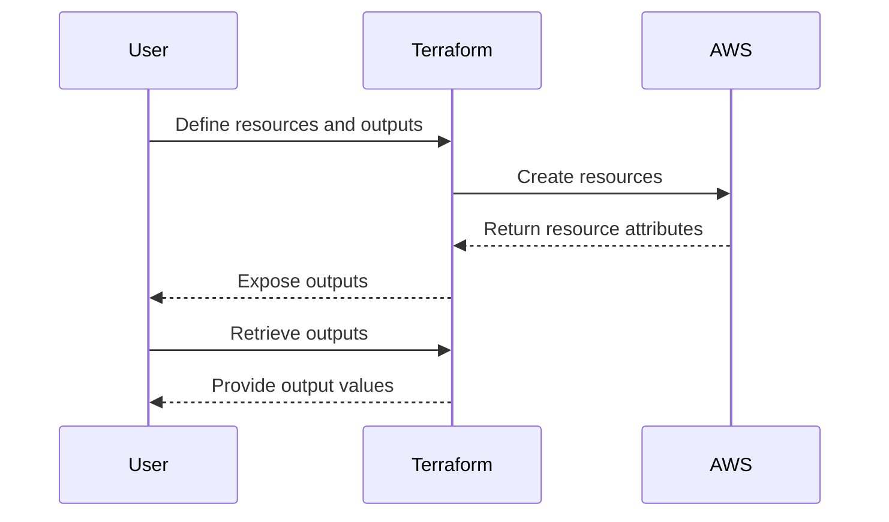

## Terraform Output Values for Resource Attributes

### Introduction to Terraform Outputs

Terraform is an infrastructure as code (IaC) tool that allows you to define and provision your infrastructure using declarative configuration files. One of the key features of Terraform is the ability to define outputs, which are values that can be accessed after the execution of a Terraform plan or apply operation. These outputs are particularly useful when you want to retrieve specific attributes of resources created by Terraform.

#### What Are Terraform Outputs?

Terraform outputs are defined within a Terraform module and allow you to expose certain attributes of the resources created by that module. These attributes can then be used in other parts of your infrastructure or even outside of Terraform, such as in scripts or other tools.

#### Why Use Terraform Outputs?

Using Terraform outputs provides several benefits:

1. **Ease of Access**: Instead of manually searching through the state file to find resource attributes, you can easily access them via the `terraform output` command.
2. **Automation**: Outputs can be used in automation scripts to dynamically configure other services or applications based on the infrastructure created by Terraform.
3. **Documentation**: Outputs serve as a form of documentation, making it clear what attributes are available and how they can be used.

### Defining Terraform Outputs

To define an output in Terraform, you use the `output` block within your Terraform configuration file. Here’s an example of how to define an output for a resource attribute:

```hcl
resource "aws_instance" "example" {
  ami           = "ami-0c55b159cbfafe1f0"
  instance_type = "t2.micro"
}

output "public_ip" {
  value = aws_instance.example.public_ip
}
```

In this example, we create an AWS EC2 instance and define an output named `public_ip` that exposes the public IP address of the instance.

### Using Terraform Outputs

Once you have defined outputs in your Terraform configuration, you can access them using the `terraform output` command. Here’s how you can retrieve the value of the `public_ip` output:

```sh
terraform output public_ip
```

This command will print the public IP address of the EC2 instance created by Terraform.

### Real-World Example: Public IP Addresses of Server Instances

Let’s consider a scenario where you are creating multiple server instances and want to retrieve their public IP addresses. This is a common requirement in many DevOps workflows, especially when setting up load balancers or configuring DNS records.

Here’s a more complex example involving multiple server instances:

```hcl
variable "instance_count" {
  default = 3
}

resource "aws_instance" "example" {
  count         = var.instance_count
  ami           = "ami-0c55b159cbfafe1f0"
  instance_type = "t2.micro"
}

output "public_ips" {
  value = [for i in aws_instance.example : i.public_ip]
}
```

In this example, we create three EC2 instances and define an output named `public_ips` that exposes a list of public IP addresses for these instances.

### Retrieving Outputs

To retrieve the list of public IP addresses, you would run:

```sh
terraform output public_ips
```

This command will print the list of public IP addresses for the EC2 instances created by Terraform.

### Diagramming the Workflow

Let’s visualize the workflow using a Mermaid diagram:



### Pitfalls and Best Practices

While Terraform outputs are powerful, there are some pitfalls to be aware of:

1. **Security Considerations**: Ensure that sensitive information is not exposed via outputs. Use Terraform’s built-in mechanisms for handling secrets, such as `terraform state rm` or `terraform state replace-module`.
2. **Output Consistency**: Ensure that outputs are consistent across different environments (e.g., development, staging, production). This can be achieved by using variables and modules effectively.
3. **Output Documentation**: Document the purpose and usage of each output to ensure that other team members understand how to use them.

### How to Prevent / Defend

#### Detection

To detect misconfigurations or security issues related to Terraform outputs, you can use tools like `tfsec`, `trivy`, or `checkov`. These tools can scan your Terraform configuration files and identify potential issues.

For example, using `tfsec`:

```sh
tfsec .
```

This command will scan your Terraform configuration files and report any security issues.

#### Prevention

To prevent security issues related to Terraform outputs, follow these best practices:

1. **Use Variables for Sensitive Data**: Store sensitive data in variables and reference them in your Terraform configuration files.
2. **Limit Output Exposure**: Only expose necessary attributes via outputs. Avoid exposing sensitive information.
3. **Use Modules**: Organize your Terraform configuration using modules to improve reusability and maintainability.

#### Secure Coding Fix

Here’s an example of a vulnerable Terraform configuration and its secure counterpart:

**Vulnerable Configuration:**

```hcl
output "secret_key" {
  value = "my_secret_key"
}
```

**Secure Configuration:**

```hcl
variable "secret_key" {
  type    = string
  default = "my_secret_key"
}

output "secret_key" {
  value = var.secret_key
}
```

In the secure configuration, the secret key is stored as a variable and referenced in the output. This ensures that the secret key is not hardcoded in the Terraform configuration file.

### Complete Example: Full Terraform Configuration

Here’s a complete example of a Terraform configuration that creates multiple EC2 instances and defines outputs for their public IP addresses:

```hcl
variable "instance_count" {
  default = 3
}

resource "aws_instance" "example" {
  count         = var.instance_count
  ami           = "ami-0c55b159cbfafe1f0"
  instance_type = "t2.micro"
}

output "public_ips" {
  value = [for i in aws_instance.example : i.public_ip]
}
```

### Full HTTP Request and Response Example

While Terraform itself does not involve HTTP requests directly, you might use the outputs in scripts that make HTTP requests. Here’s an example of how you might use the public IP addresses in an HTTP request:

```http
GET http://<public_ip>/api/status
Host: <public_ip>
Accept: application/json
```

The corresponding response might look like this:

```http
HTTP/1.1 200 OK
Content-Type: application/json

{
  "status": "OK",
  "message": "Server is running"
}
```

### Practice Labs

To practice working with Terraform outputs, you can use the following labs:

- **PortSwigger Web Security Academy**: While primarily focused on web security, this platform also covers infrastructure as code and can help you understand how to integrate Terraform outputs into your workflows.
- **OWASP Juice Shop**: This platform includes a variety of challenges that involve infrastructure as code and can help you practice using Terraform outputs in a real-world context.
- **Terraform Official Documentation**: The official Terraform documentation includes numerous examples and tutorials that cover the use of outputs in various scenarios.

By following these guidelines and practicing with real-world examples, you can master the use of Terraform outputs and effectively manage your infrastructure as code.

---
<!-- nav -->
[[01-Introduction to Terraform Output Values|Introduction to Terraform Output Values]] | [[DevOps/DevOps Bootcamp/08-Infrastructure as Code (Terraform)/16-Terraform Output Values For Resource Attributes/00-Overview|Overview]] | [[DevOps/DevOps Bootcamp/08-Infrastructure as Code (Terraform)/16-Terraform Output Values For Resource Attributes/03-Practice Questions & Answers|Practice Questions & Answers]]
