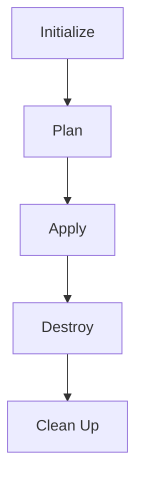

## Terraform Destroy Command

The `terraform destroy` command is used to delete all resources defined in the Terraform configuration. This command is particularly useful when you want to completely clean up your infrastructure, such as during testing or when you no longer need the resources.

### Syntax and Usage

The basic syntax for the `terraform destroy` command is:

```sh
terraform destroy [options] [target]
```

- **[options]**: Various options can be passed to customize the behavior of the command.
- **[target]**: A specific resource or module can be targeted for destruction. If no target is specified, all resources are destroyed.

### Example Execution

Let's walk through an example of using the `terraform destroy` command. Consider the following Terraform configuration:

```hcl
provider "aws" {
  region = "us-west-2"
}

resource "aws_vpc" "example" {
  cidr_block = "10.0.0.0/16"
}

resource "aws_subnet" "example" {
  vpc_id     = aws_vpc.example.id
  cidr_block = "10.0.1.0/24"
}
```

To destroy all resources defined in this configuration, run:

```sh
terraform destroy
```

### Interactive Confirmation

By default, Terraform prompts for confirmation before destroying resources. You can bypass this prompt using the `-auto-approve` flag:

```sh
terraform destroy -auto-approve
```

### Preview of Destruction

When you run `terraform destroy`, Terraform first generates a preview of what will be destroyed. This preview is similar to the output of `terraform plan`, but it shows the resources that will be deleted instead of created.

For example, the output might look like this:

```sh
Terraform will destroy the following resources:

  - aws_subnet.example
  - aws_vpc.example

Do you really want to destroy these resources?
  Terraform will destroy 2 resources.
  Only 'yes' will be accepted to confirm.

  Enter a value: yes
```

### Dependencies and Order of Destruction

Terraform automatically determines the dependencies between resources and destroys them in the correct order. This ensures that no orphaned resources are left behind.

### Real-World Example: AWS VPC Cleanup

Consider a scenario where you have created a VPC and several subnets in AWS using Terraform. After testing, you decide to clean up the environment. Here is a more detailed example:

#### Initial Setup

```hcl
provider "aws" {
  region = "us-west-2"
}

resource "aws_vpc" "example" {
  cidr_block = "10.0.0.0/16"
}

resource "aws_subnet" "public" {
  vpc_id     = aws_vpc.example.id
  cidr_block = "10.0.1.0/24"
}

resource "aws_subnet" "private" {
  vpc_id     = aws_vpc.example.id
  cidr_block = "10.0.2.0/24"
}
```

#### Applying the Configuration

```sh
terraform init
terraform apply
```

#### Destroying the Resources

```sh
terraform destroy
```

### Mermaid Diagram: Terraform Workflow

A visual representation of the Terraform workflow can help understand the process better:



### Pitfalls and Best Practices

While the `terraform destroy` command is powerful, there are several pitfalls to be aware of:

1. **Accidental Deletion**: Ensure you understand the scope of the destruction. Always review the preview before confirming.
2. **State Management**: Keep your state file backed up and secure. Losing the state file can make it difficult to recover your infrastructure.
3. **Dependencies**: Understand the dependencies between resources. Terraform handles this automatically, but it's good to be aware of the order of destruction.

### How to Prevent / Defend

#### Detection

- **Audit Logs**: Enable audit logs in your cloud provider to track changes made by Terraform.
- **Monitoring Tools**: Use monitoring tools to detect unexpected changes in your infrastructure.

#### Prevention

- **Access Controls**: Restrict access to Terraform commands and configurations using IAM roles and policies.
- **Code Reviews**: Perform regular code reviews to catch potential issues before they are applied.

#### Secure Coding Fixes

Compare the insecure and secure versions of a Terraform configuration:

**Insecure Version**

```hcl
resource "aws_instance" "example" {
  ami           = "ami-0c55b159cbfafe1f0"
  instance_type = "t2.micro"
}
```

**Secure Version**

```hcl
resource "aws_instance" "example" {
  ami           = "ami-0c55b159cbfafe1f0"
  instance_type = "t2.micro"
  tags = {
    Name = "example-instance"
  }
}
```

### Conclusion

The `terraform destroy` command is a powerful tool for managing your infrastructure. By understanding its usage, pitfalls, and best practices, you can effectively use Terraform to maintain a clean and consistent environment. Always remember to review the preview and take necessary precautions to avoid accidental deletions.

### Practice Labs

For hands-on experience with Terraform, consider the following labs:

- **PortSwigger Web Security Academy**: Offers a comprehensive set of labs covering various aspects of web application security.
- **OWASP Juice Shop**: A deliberately insecure web application for security training.
- **DVWA (Damn Vulnerable Web Application)**: Another popular web application for security training.
- **WebGoat**: An interactive web application designed to teach web application security lessons.

These labs provide practical experience in managing infrastructure using Terraform and other DevOps tools.

---
<!-- nav -->
[[02-Introduction to Terraform and Infrastructure Management|Introduction to Terraform and Infrastructure Management]] | [[DevOps/DevOps Bootcamp/08-Infrastructure as Code (Terraform)/17-Terraform Plan Command Preview Without Application/00-Overview|Overview]] | [[04-Understanding Terraform `plan` Command and Resource Removal|Understanding Terraform `plan` Command and Resource Removal]]
