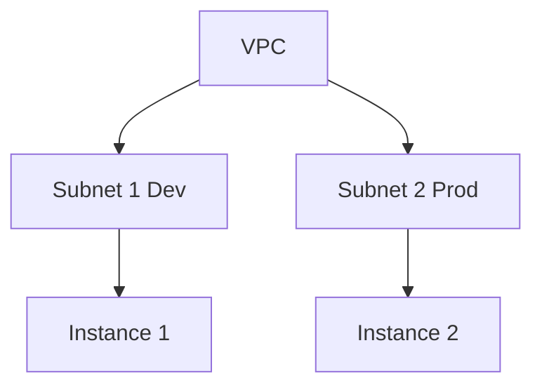

## Understanding Terraform `plan` Command and Resource Removal

### Background Theory

Terraform is an infrastructure as code (IaC) tool developed by HashiCorp. It allows you to define your infrastructure using declarative configuration files written in the HashiCorp Configuration Language (HCL). These configurations describe the desired state of your infrastructure, which can include virtual machines, networks, storage, and more.

The `terraform plan` command is one of the most critical commands in the Terraform workflow. It generates an execution plan that outlines the changes Terraform will make to reach the desired state specified in your configuration files. This plan is crucial because it allows you to review the changes before applying them, ensuring that you understand the impact of your actions.

### The `terraform plan` Command in Action

Let's consider a scenario where we have defined a Virtual Private Cloud (VPC) and a subnet within it using Terraform. Here’s an example configuration:

```hcl
provider "aws" {
  region = "us-west-2"
}

resource "aws_vpc" "main" {
  cidr_block = "10.0.0.0/16"
}

resource "aws_subnet" "dev" {
  vpc_id     = aws_vpc.main.id
  cidr_block = "10.0.1.0/24"
}
```

To generate a plan, you would run:

```sh
terraform plan
```

This command will output a detailed plan showing what Terraform intends to create, modify, or delete based on the current state and the desired state defined in your configuration files.

### Removing Resources

In the given scenario, the VPC and Subnet 1 Dev have been removed. Let's explore how this happens and what the implications are.

#### Example Configuration After Removal

Here’s what the configuration might look like after removing the VPC and Subnet 1 Dev:

```hcl
provider "aws" {
  region = "us-west-2"
}
```

Now, if you run `terraform plan`, the output will indicate that the VPC and Subnet 1 Dev will be destroyed:

```sh
terraform plan
```

Output:

```
Terraform will perform the following actions:

  # aws_subnet.dev will be destroyed
  - resource "aws_subnet" "dev" {
      - id         = "subnet-1234567890abcdef0" -> null
      - vpc_id     = "vpc-0987654321fedcba0" -> null
      - cidr_block = "10.0.1.0/24" -> null
    }

  # aws_vpc.main will be destroyed
  - resource "aws_vpc" "main" {
      - id         = "vpc-0987654321fedcba0" -> null
      - cidr_block = "1.0.0.0/16" -> null
    }

Plan: 0 to add, 0 to change, 2 to destroy.
```

### Understanding the Impact

Removing resources like a VPC and subnet can have significant implications:

1. **Network Isolation**: Removing a VPC can isolate all resources within that VPC from the internet and other VPCs.
2. **Data Loss**: Any data stored within the VPC or subnet may be lost unless properly backed up.
3. **Service Disruption**: Services running within the VPC or subnet will be disrupted and may become unavailable.

### Real-World Examples

Consider a recent breach where an organization accidentally deleted their VPC due to misconfiguration in their Terraform scripts. This led to a significant service outage and data loss. Such incidents highlight the importance of careful planning and testing before making destructive changes.

### How to Prevent / Defend

#### Detection

To detect unintended deletions, you can set up monitoring and alerting mechanisms:

1. **CloudTrail**: Enable AWS CloudTrail to log API calls and monitor for `DeleteVpc` and `DeleteSubnet` actions.
2. **Terraform State**: Regularly back up the Terraform state file to track changes.

#### Prevention

1. **Version Control**: Store your Terraform configuration files in a version control system like Git. This allows you to track changes and revert to previous versions if needed.
2. **Review Process**: Implement a review process for Terraform plans before applying them. Tools like Terraform Cloud offer built-in plan approval workflows.
3. **Dry Run**: Always run `terraform plan` before `terraform apply` to review the changes.

#### Secure Coding Fixes

Here’s how you can ensure secure coding practices:

**Vulnerable Code:**

```hcl
resource "aws_vpc" "main" {
  cidr_block = "10.0.0.0/16"
}

resource "aws_subnet" "dev" {
  vpc_id     = aws_vpc.main.id
  cidr_block = "10.0.1.0/24"
}
```

**Secure Code:**

Ensure you have proper version control and review processes in place. Additionally, use tags to identify critical resources and prevent accidental deletion:

```hcl
resource "aws_vpc" "main" {
  cidr_block = "10.0.0.0/16"
  tags = {
    Name = "Main-VPC"
    Critical = "true"
  }
}

resource "aws_subnet" "dev" {
  vpc_id     = aws_vpc.main.id
  cidr_block = "10.0.1.0/24"
  tags = {
    Name = "Dev-Subnet"
    Critical = "true"
  }
}
```

### Network Topology Diagram

A visual representation of the network topology can help understand the impact of removing resources:



### Conclusion

Understanding the `terraform plan` command and the implications of removing resources like a VPC and subnet is crucial for maintaining a stable and secure infrastructure. By implementing proper detection, prevention, and secure coding practices, you can avoid unintended deletions and ensure the reliability of your infrastructure.

### Practice Labs

For hands-on practice with Terraform and IaC, consider the following labs:

- **Terraform Official Documentation**: Offers extensive tutorials and examples.
- **HashiCorp Learn**: Provides interactive courses on Terraform.
- **Terraform Cloud**: Allows you to practice Terraform workflows in a managed environment.

These resources will help you gain a deeper understanding of Terraform and IaC principles.

---
<!-- nav -->
[[03-Terraform Destroy Command|Terraform Destroy Command]] | [[DevOps/DevOps Bootcamp/08-Infrastructure as Code (Terraform)/17-Terraform Plan Command Preview Without Application/00-Overview|Overview]] | [[DevOps/DevOps Bootcamp/08-Infrastructure as Code (Terraform)/17-Terraform Plan Command Preview Without Application/05-Practice Questions & Answers|Practice Questions & Answers]]
