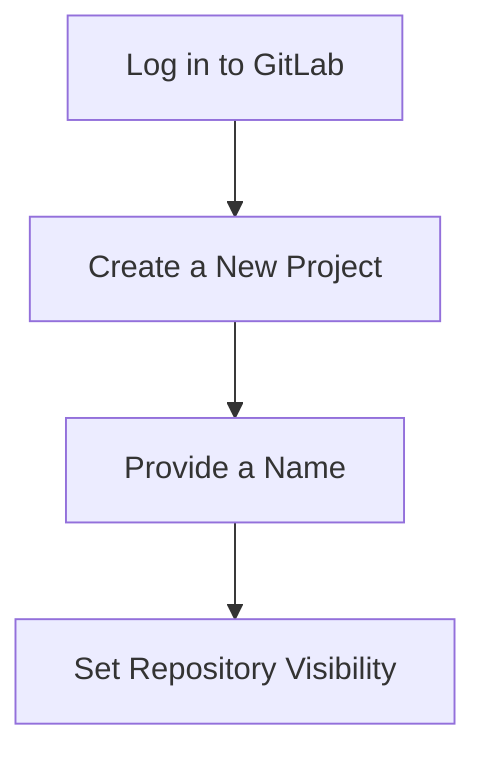

## Introduction to Git and Version Control in DevOps

Version control systems (VCS) are essential tools in modern software development, allowing teams to manage changes to their codebase efficiently. One of the most popular VCS is Git, which provides a robust framework for tracking changes, managing branches, and collaborating with other developers. In the context of DevOps, integrating Git with infrastructure-as-code (IaC) tools like Terraform is crucial for maintaining a consistent and reproducible environment.

### What is Git?

Git is a distributed version control system designed to handle everything from small to very large projects with speed and efficiency. It was created by Linus Torvalds in 2005 for the development of the Linux kernel. Git stores information about changes made to files in a repository, allowing developers to track the history of their code and collaborate effectively.

#### Why Use Git?

1. **Track Changes**: Git allows you to track changes to your codebase, providing a detailed history of modifications.
2. **Collaboration**: Multiple developers can work on the same codebase simultaneously, merging changes seamlessly.
3. **Branching and Merging**: Git supports branching and merging, enabling developers to work on different features or bug fixes without interfering with each other.
4. **Backup and Recovery**: Git repositories can be backed up easily, ensuring that your code is safe even in case of hardware failure or accidental deletion.

### What is Terraform?

Terraform is an open-source infrastructure-as-code (IaC) tool developed by HashiCorp. It allows you to define and provision your infrastructure using declarative configuration files written in the HashiCorp Configuration Language (HCL). Terraform supports a wide range of cloud providers and services, making it a versatile tool for managing infrastructure across different environments.

#### Why Use Terraform?

1. **Consistency**: Terraform ensures that your infrastructure is consistent across different environments, reducing the risk of configuration drift.
2. **Reproducibility**: By defining your infrastructure in code, you can reproduce your environment consistently, ensuring that it behaves the same way every time.
3. **Automation**: Terraform integrates well with CI/CD pipelines, allowing you to automate the provisioning and management of your infrastructure.

### Integrating Git with Terraform

Integrating Git with Terraform is a best practice in DevOps, as it allows you to manage changes to your infrastructure configuration in a controlled and collaborative manner. This integration provides several benefits:

1. **Version Control**: You can track changes to your Terraform configuration files, ensuring that you have a history of modifications.
2. **Collaboration**: Multiple developers can work on the same Terraform project, merging changes seamlessly.
3. **Auditability**: Git provides an audit trail of changes, making it easier to trace who made what changes and when.

### Creating a Git Repository for Your Terraform Project

To integrate Git with your Terraform project, you need to create a Git repository and initialize it in your local project directory. Here’s a step-by-step guide to creating a Git repository for your Terraform project.

#### Step 1: Create a New Git Repository

First, you need to create a new Git repository in a Git hosting service such as GitLab, GitHub, or Bitbucket. For this example, we will use GitLab.

1. **Log in to GitLab**: Open your browser and navigate to GitLab (https://gitlab.com).
2. **Create a New Project**: Click on the "New project" button and provide a name for your project. For this example, let's call it `terraform-learn`.
3. **Set Repository Visibility**: Choose whether you want the repository to be public or private. For this example, we will set it to public so that others can access your project.



#### Step 2: Initialize Git in Your Local Project Directory

Once you have created the Git repository, you need to initialize Git in your local project directory.

1. **Navigate to Your Project Directory**: Open your terminal and navigate to the root directory of your Terraform project.
2. **Initialize Git**: Run the following command to initialize Git in your local project directory.

```bash
cd /path/to/your/terraform/project
git init
```

This command initializes an empty Git repository in your local project directory.

#### Step 3: Connect to the Remote Repository

Next, you need to connect your local Git repository to the remote repository you created earlier.

1. **Add Remote Repository**: Run the following command to add the remote repository URL.

```bash
git remote add origin https://gitlab.com/yourusername/terraform-learn.git
```

Replace `yourusername` with your actual GitLab username.

2. **Verify Remote Repository**: Run the following command to verify that the remote repository has been added successfully.

```bash
git remote -v
```

This command should display the URL of the remote repository.

#### Step 4: Check Status and Add Files

Before you commit your changes, you need to check the status of your local repository and add your files to the staging area.

1. **Check Status**: Run the following command to check the status of your local repository.

```bash
git status
```

This command displays the files that are ready to be committed.

2. **Add Files**: Run the following command to add all files to the staging area.

```bash
git add .
```

This command adds all files in the current directory to the staging area.

#### Step 5: Commit Changes

After adding your files to the staging area, you can commit your changes to the local repository.

1. **Commit Changes**: Run the following command to commit your changes.

```bash
git commit -m "Initial commit"
```

This command commits your changes with the specified commit message.

#### Step 6: Push Changes to the Remote Repository

Finally, you need to push your changes to the remote repository.

1. **Push Changes**: Run the following command to push your changes to the remote repository.

```bash
git push -u origin master
```

This command pushes your changes to the `master` branch of the remote repository.

### Creating a `.gitignore` File

Before committing your changes, it is a good practice to create a `.gitignore` file to specify which files and directories should be ignored by Git. This helps keep your repository clean and avoids unnecessary files from being tracked.

1. **Create `.gitignore` File**: Run the following command to create a `.gitignore` file.

```bash
touch .gitignore
```

2. **Edit `.gitignore` File**: Open the `.gitignore` file in your preferred text editor and add the following lines to ignore specific files and directories.

```plaintext
# Ignore Terraform state files
*.tfstate
*.tfstate.*

# Ignore compiled files
*.o
*.a

# Ignore log files
*.log

# Ignore backup files
*.bak
*.swp
*.tmp
```

3. **Add `.gitignore` File to Staging Area**: Run the following command to add the `.gitignore` file to the staging area.

```bash
git add .gitignore
```

4. **Commit `.gitignore` File**: Run the following command to commit the `.gitignore` file.

```bash
git commit -m "Add .gitignore file"
```

5. **Push `.gitignore` File to Remote Repository**: Run the following command to push the `.gitignore` file to the remote repository.

```bash
git push -u origin master
```

### Real-World Example: Recent Breaches and Vulnerabilities

One recent example of a breach involving Git repositories is the SolarWinds supply chain attack in 2020. In this attack, hackers compromised the build server used to compile SolarWinds Orion software, inserting malicious code into the software updates. This allowed the attackers to gain unauthorized access to the networks of SolarWinds customers.

In this scenario, proper version control practices could have helped detect and mitigate the attack. By maintaining a detailed history of changes to the codebase and using automated tools to scan for vulnerabilities, organizations can reduce the risk of such attacks.

### How to Prevent / Defend

#### Detection

1. **Automated Scanning Tools**: Use automated scanning tools like GitGuardian or SonarQube to detect sensitive information and vulnerabilities in your codebase.
2. **Code Reviews**: Implement a code review process to ensure that changes are reviewed by multiple developers before being merged into the main branch.

#### Prevention

1. **Secure Access Controls**: Use secure access controls to restrict access to your Git repositories. Limit access to only those who need it and use multi-factor authentication (MFA) to enhance security.
2. **Regular Audits**: Perform regular audits of your Git repositories to ensure that they are secure and that no unauthorized changes have been made.

#### Secure Coding Fixes

Here is an example of a vulnerable `.gitignore` file and the corresponding secure version:

**Vulnerable `.gitignore` File**

```plaintext
# Ignore Terraform state files
*.tfstate
*.tfstate.*

# Ignore compiled files
*.o
*.a

# Ignore log files
*.log

# Ignore backup files
*.bak
*.swp
*.tmp
```

**Secure `.gitignore` File**

```plaintext
# Ignore Terraform state files
*.tfstate
*.tfstate.*

# Ignore compiled files
*.o
*.a

# Ignore log files
*.log

# Ignore backup files
*.bak
*.swp
*.tmp

# Ignore sensitive files
*.env
*.key
*.pem
```

By adding these additional lines to the `.gitignore` file, you can ensure that sensitive files are not accidentally committed to the repository.

### Conclusion

Integrating Git with Terraform is a best practice in DevOps, providing version control, collaboration, and auditability for your infrastructure-as-code projects. By following the steps outlined in this chapter, you can create a Git repository for your Terraform project, initialize Git in your local project directory, connect to the remote repository, and create a `.gitignore` file to keep your repository clean and secure.

### Practice Labs

For hands-on experience with integrating Git with Terraform, consider the following practice labs:

- **PortSwigger Web Security Academy**: Offers a variety of labs focused on web application security, including some that involve using Git and Terraform.
- **OWASP Juice Shop**: A deliberately insecure web application that can be used to practice various security techniques, including using Git and Terraform.
- **DVWA (Damn Vulnerable Web Application)**: Another intentionally vulnerable web application that can be used to practice security techniques, including using Git and Terraform.
- **WebGoat**: An interactive web application that teaches web application security lessons, including some that involve using Git and Terraform.

These labs provide a practical way to apply the concepts learned in this chapter and gain hands-on experience with integrating Git with Terraform.

---
<!-- nav -->
[[DevOps/DevOps Bootcamp/08-Infrastructure as Code (Terraform)/18-Terraform Project Version Control With Git/00-Overview|Overview]] | [[02-Introduction to Terraform Project Version Control with Git|Introduction to Terraform Project Version Control with Git]]
