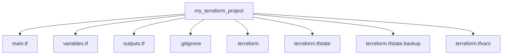
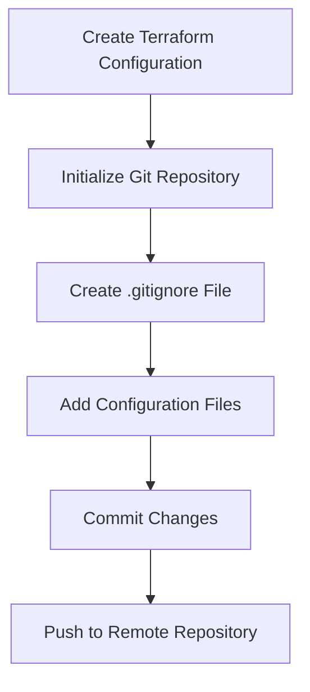

## Introduction to Terraform and Version Control with Git

In the realm of infrastructure as code (IaC), Terraform is a powerful tool that allows developers and DevOps engineers to define and provision infrastructure resources using declarative configuration files. One of the key aspects of managing Terraform configurations is integrating them with version control systems like Git. This ensures that the infrastructure definitions are tracked, versioned, and can be collaborated on by multiple team members.

### Why Use Git with Terraform?

Using Git with Terraform provides several benefits:

1. **Version Control**: Git allows you to track changes to your Terraform configuration files over time. This means you can revert to previous versions if something goes wrong, or understand the history of changes made to your infrastructure.
2. **Collaboration**: Multiple team members can work on the same Terraform project simultaneously. Git helps manage conflicts and merges changes effectively.
3. **Auditability**: Every change to the Terraform configuration is recorded, making it easy to audit who made what changes and when.
4. **Reproducibility**: By storing the Terraform configuration in a version-controlled repository, you ensure that the exact same infrastructure can be recreated at any point in time.

### Setting Up Git for Terraform Projects

To set up Git for a Terraform project, you first need to initialize a Git repository within your Terraform project directory. This can be done using the following commands:

```bash
mkdir my_terraform_project
cd my_terraform_project
git init
```

Once the repository is initialized, you can start adding your Terraform configuration files to it. However, not all files should be committed to the repository. Some files are generated locally and do not need to be version-controlled.

### Creating a `.gitignore` File

A `.gitignore` file is used to specify which files and directories should be ignored by Git. This is particularly important in Terraform projects because certain files are generated locally and should not be committed to the repository.

Let's create a `.gitignore` file and add the necessary entries:

```bash
touch .gitignore
```

Now, open the `.gitignore` file and add the following lines:

```plaintext
# Local Terraform directory
.terraform/

# Terraform state files
*.tfstate
*.tfstate.*

# Terraform variable files
*.tfvars
```

### Explanation of Each Entry

#### 1. `.terraform/`

The `.terraform` directory is created by Terraform when you run `terraform init`. This directory contains the provider plugins that are downloaded locally. Since these plugins are specific to the local environment, they do not need to be committed to the repository.

**Why Ignore?**
- The `.terraform` directory is automatically created and populated by Terraform during initialization.
- Committing this directory would lead to unnecessary bloat in the repository and potential conflicts between different environments.

**How to Prevent / Defend**
- Ensure that the `.terraform` directory is included in the `.gitignore` file.
- Run `terraform init` in each environment to download the necessary provider plugins.

#### 2. `*.tfstate`

Terraform state files (`*.tfstate`) are generated when you run `terraform apply`. These files contain metadata about the current state of your infrastructure, including resource IDs, dependencies, and other details.

**Why Ignore?**
- State files are specific to the local environment and should not be shared across different environments.
- Committing state files can lead to conflicts and inconsistencies between different environments.

**How to Prevent / Defend**
- Ensure that `*.tfstate` files are included in the `.gitignore` file.
- Use remote state storage (e.g., S3, Azure Blob Storage) to store state files outside of the repository.
- Configure Terraform to use a backend for state management.

#### 3. `*.tfstate.*`

These are backup copies of the state files. They are created by Terraform to ensure that you can recover from accidental deletions or corruptions.

**Why Ignore?**
- Backup state files are also specific to the local environment and should not be committed to the repository.
- Committing these files can lead to unnecessary bloat in the repository and potential conflicts.

**How to Prevent / Defend**
- Ensure that `*.tfstate.*` files are included in the `.gitignore` file.
- Use remote state storage to manage state files.

#### 4. `*.tfvars`

Terraform variable files (`*.tfvars`) are used to pass variables to Terraform configurations. These files often contain sensitive information such as API keys, passwords, and other secrets.

**Why Ignore?**
- Variable files may contain sensitive information that should not be committed to the repository.
- Committing variable files can lead to security risks if the repository is publicly accessible.

**How to Prevent / Defend**
- Ensure that `*.tfvars` files are included in the `.gitignore` file.
- Use environment variables or secret management tools (e.g., HashiCorp Vault, AWS Secrets Manager) to manage sensitive data.
- Store sensitive data outside of the repository and reference it in Terraform configurations using environment variables or secret management tools.

### Example of a Complete `.gitignore` File

Here is an example of a complete `.gitignore` file for a Terraform project:

```plaintext
# Local Terraform directory
.terraform/

# Terraform state files
*.tfstate
*.tfstate.*

# Terraform variable files
*.tfvars

# Other generated files
*.log
*.tmp
*.bak
```

### Adding and Committing Files to the Repository

Once the `.gitignore` file is set up, you can start adding your Terraform configuration files to the repository. Here is an example of a simple Terraform configuration file:

```hcl
provider "aws" {
  region = "us-west-2"
}

resource "aws_instance" "example" {
  ami           = "ami-0c55b159cbfafe1f0"
  instance_type = "t2.micro"
}
```

To add and commit this file to the repository, use the following commands:

```bash
git add main.tf
git commit -m "Add initial Terraform configuration"
```

### Real-World Examples and Recent Breaches

#### Example: AWS Access Key Exposure

In a real-world scenario, consider a situation where a developer accidentally commits an `*.tfvars` file containing AWS access keys to a public GitHub repository. This can lead to unauthorized access to AWS resources and potential financial losses.

**CVE Example:**
- **CVE-2021-22800**: This CVE highlights the risk of exposing AWS credentials in public repositories. Attackers can use these credentials to gain unauthorized access to AWS resources.

**How to Prevent / Defend**
- Use secret management tools to store and manage sensitive data.
- Regularly scan repositories for exposed credentials using tools like `trufflehog`.
- Implement strict access controls and least privilege principles in your AWS environment.

### Mermaid Diagrams

#### Directory Structure

Here is a mermaid diagram showing the directory structure of a Terraform project with a `.gitignore` file:



#### Workflow Diagram

Here is a mermaid diagram showing the workflow of adding and committing files to a Git repository:



### Conclusion

Integrating Terraform with Git is essential for managing infrastructure as code effectively. By setting up a `.gitignore` file correctly, you can ensure that only the necessary files are committed to the repository, avoiding unnecessary bloat and security risks. Always follow best practices for managing sensitive data and regularly review your repository for potential security issues.

### Practice Labs

For hands-on practice with Terraform and Git, consider the following labs:

- **PortSwigger Web Security Academy**: Offers a variety of labs related to web application security, including some that involve using Terraform and Git.
- **OWASP Juice Shop**: A deliberately insecure web application for security training. While primarily focused on web app security, it can be used to practice integrating Terraform and Git.
- **DVWA (Damn Vulnerable Web Application)**: Another web application for security training. Similar to OWASP Juice Shop, it can be used to practice integrating Terraform and Git.

By following these guidelines and practicing with real-world examples, you can master the integration of Terraform and Git in your DevOps workflows.

---
<!-- nav -->
[[02-Introduction to Terraform Project Version Control with Git|Introduction to Terraform Project Version Control with Git]] | [[DevOps/DevOps Bootcamp/08-Infrastructure as Code (Terraform)/18-Terraform Project Version Control With Git/00-Overview|Overview]] | [[DevOps/DevOps Bootcamp/08-Infrastructure as Code (Terraform)/18-Terraform Project Version Control With Git/04-Practice Questions & Answers|Practice Questions & Answers]]
