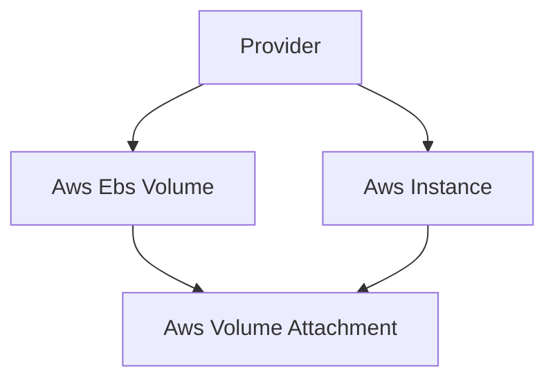

## Introduction to Terraform Providers

In the realm of infrastructure as code (IaC), Terraform stands out as one of the most powerful and versatile tools available today. At its core, Terraform allows you to define your infrastructure in declarative configuration files, which can then be applied to create, modify, or destroy resources across various cloud platforms and services. One of the key components that make Terraform so flexible and widely adopted is the concept of **providers**.

### What is a Provider?

A **provider** in Terraform is essentially a plugin or module that enables Terraform to interact with a specific technology or service. This could be a cloud platform like Amazon Web Services (AWS), Microsoft Azure, or Google Cloud Platform (GCP); a container orchestration system like Kubernetes; or even a traditional database system. Each provider is responsible for understanding the API of the respective technology and translating Terraform's declarative configurations into actions that create, update, or delete resources within that technology.

#### Why Providers Matter

Providers are crucial because they abstract away the complexities of interacting with different APIs and services. Without providers, you would need to write custom scripts or use low-level SDKs to manage your infrastructure, which can be error-prone and time-consuming. By leveraging providers, you can focus on defining your infrastructure in a high-level, human-readable format, and let Terraform handle the details of provisioning and managing those resources.

### How Providers Work Under the Hood

When you define a resource in a Terraform configuration file, you specify the type of resource and its attributes. For example, if you want to create an EC2 instance in AWS, you might write:

```hcl
resource "aws_instance" "example" {
  ami           = "ami-0c94855ba95b798c7"
  instance_type = "t2.micro"

  tags = {
    Name = "example-instance"
  }
}
```

Here, `aws_instance` is a resource type provided by the AWS provider. When you run `terraform apply`, Terraform uses the AWS provider to translate this configuration into API calls that create the specified EC2 instance.

#### Provider Configuration

To use a provider, you need to configure it in your Terraform configuration file. This typically involves specifying credentials and other necessary parameters. For example, to configure the AWS provider, you might write:

```hcl
provider "aws" {
  region = "us-west-2"
  access_key = "YOUR_ACCESS_KEY"
  secret_key = "YOUR_SECRET_KEY"
}
```

This configuration tells Terraform which AWS region to use and provides the necessary credentials to authenticate with the AWS API.

### Commonly Used Providers

Terraform supports a wide range of providers, but some are more commonly used than others. Let's take a closer look at some of the most popular providers:

#### AWS Provider

The AWS provider is one of the most widely used providers in Terraform. This is due to several reasons:

1. **Granularity and Modularity**: AWS offers a vast array of services, each with its own set of features and capabilities. Managing these services manually can be complex and error-prone.
2. **Powerful API**: AWS provides a rich set of APIs that allow for fine-grained control over resources. However, this power comes with complexity, making automation essential.
3. **Widespread Adoption**: Many organizations rely heavily on AWS for their cloud infrastructure, making the AWS provider a critical component of their DevOps workflows.

#### Azure Provider

The Azure provider allows Terraform to interact with Microsoft Azure. Like AWS, Azure offers a broad range of services and a powerful API. Using the Azure provider can help streamline the management of Azure resources, especially in large-scale environments.

#### Google Cloud Provider

The Google Cloud provider enables Terraform to manage resources in Google Cloud Platform (GCP). GCP is another major player in the cloud computing space, offering a variety of services and APIs. The Google Cloud provider helps automate the provisioning and management of GCP resources.

#### Kubernetes Provider

The Kubernetes provider allows Terraform to interact with Kubernetes clusters. Kubernetes is a popular container orchestration system, and using the Kubernetes provider can help automate the deployment and management of Kubernetes resources.

### Real-World Examples

Let's consider a real-world scenario where Terraform providers are used to manage cloud infrastructure. Suppose you are working for a company that uses AWS for its cloud infrastructure. You need to create an EC2 instance and attach an EBS volume to it. Here’s how you might define this in Terraform:

```hcl
provider "aws" {
  region = "us-west-2"
  access_key = "YOUR_ACCESS_KEY"
  secret_key = "YOUR_SECRET_KEY"
}

resource "aws_instance" "example" {
  ami           = "ami-0c94855ba95b798c7"
  instance_type = "t2.micro"

  tags = {
    Name = "example-instance"
  }
}

resource "aws_ebs_volume" "example" {
  availability_zone = "us-west-2a"
  size              = 10
}

resource "aws_volume_attachment" "example" {
  device_name = "/dev/sdh"
  volume_id   = aws_ebs_volume.example.id
  instance_id = aws_instance.example.id
}
```

In this example, we define an AWS provider and use it to create an EC2 instance and an EBS volume. We then attach the EBS volume to the EC2 instance using the `aws_volume_attachment` resource.

### Mermaid Diagrams

To visualize the relationship between the resources defined in the Terraform configuration, we can use a mermaid diagram:



This diagram shows how the provider interacts with the resources and how the resources are related to each other.

### Pitfalls and Best Practices

While Terraform providers are incredibly powerful, there are several pitfalls to be aware of:

1. **Credential Management**: Storing credentials in plain text in your Terraform configuration files can be a security risk. Instead, use environment variables or a secrets manager to securely store and manage credentials.
2. **Resource Dependencies**: Ensure that your resources are properly ordered and that dependencies are correctly defined. Terraform will automatically determine dependencies based on the configuration, but it's important to understand how these dependencies work.
3. **State Management**: Terraform maintains a state file that tracks the current state of your infrastructure. Mismanagement of this state file can lead to inconsistencies and errors. Always ensure that the state file is backed up and version-controlled.

### How to Prevent / Defend

#### Secure Credential Management

To securely manage credentials, you can use environment variables or a secrets manager. For example, instead of hardcoding your AWS credentials in the Terraform configuration, you can use environment variables:

```sh
export AWS_ACCESS_KEY_ID=YOUR_ACCESS_KEY
export AWS_SECRET_ACCESS_KEY=YOUR_SECRET_KEY
```

Then, in your Terraform configuration, you can reference these environment variables:

```hcl
provider "aws" {
  region = "us-west-2"
}
```

#### Detecting and Preventing Misconfigurations

One way to detect and prevent misconfigurations is to use Terraform modules and validate your configurations using tools like `terraform validate`. Additionally, you can use third-party tools like `tfsec` to scan your Terraform configurations for security issues.

For example, using `tfsec` to scan your Terraform configuration:

```sh
tfsec .
```

This will analyze your Terraform configuration and report any potential security issues.

### Conclusion

In conclusion, Terraform providers are a fundamental component of the Terraform ecosystem. They enable Terraform to interact with a wide range of technologies and services, making it possible to manage complex infrastructure in a declarative and automated manner. By understanding how providers work and following best practices, you can effectively leverage Terraform to manage your infrastructure.

### Practice Labs

To gain hands-on experience with Terraform providers, consider the following practice labs:

- **PortSwigger Web Security Academy**: While primarily focused on web application security, this platform also includes exercises that involve using Terraform to manage cloud infrastructure.
- **OWASP Juice Shop**: Another web application security platform that includes exercises involving Terraform.
- **Terraform Official Documentation**: The official Terraform documentation includes numerous examples and tutorials that cover the use of various providers.
- **HashiCorp Learn**: HashiCorp provides a series of interactive tutorials and labs that cover the use of Terraform and its providers.

By completing these labs, you can gain practical experience with Terraform providers and improve your skills in managing cloud infrastructure.

---
<!-- nav -->
[[01-Introduction to Terraform Providers for AWS and Beyond|Introduction to Terraform Providers for AWS and Beyond]] | [[DevOps/DevOps Bootcamp/08-Infrastructure as Code (Terraform)/19-Terraform Providers for AWS and Beyond/00-Overview|Overview]] | [[03-Terraform Providers for AWS and Beyond|Terraform Providers for AWS and Beyond]]
