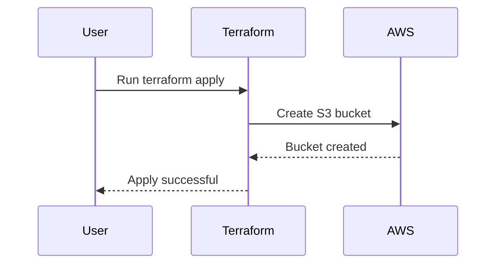
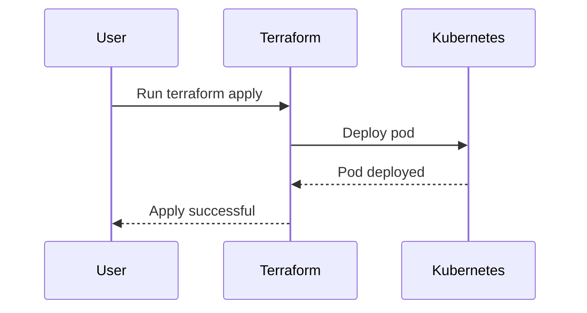

## Terraform Providers for AWS and Beyond

### What Are Terraform Providers?

Terraform providers are essential components of the Terraform ecosystem. They are plugins that allow Terraform to interact with various infrastructure services and APIs. Essentially, a provider is a piece of code that knows how to communicate with a specific technology or service, such as AWS, Kubernetes, or GitHub. By using providers, Terraform can manage resources across different platforms without requiring users to understand the intricacies of each API.

#### Why Do We Need Providers?

Providers abstract away the complexities of interacting with different APIs. Instead of needing to know how to make API calls to AWS, Kubernetes, or other services, you can use Terraform's declarative language to describe the desired state of your infrastructure. The provider then translates this description into the appropriate API calls to achieve that state.

For example, consider managing an AWS EC2 instance. Without a provider, you would need to manually construct and send HTTP requests to the AWS API to create, modify, or delete instances. With the AWS provider, you simply define the instance in your Terraform configuration, and the provider handles the communication with AWS.

### How Providers Work Under the Hood

When you run `terraform apply`, Terraform uses the specified providers to interact with the target infrastructure. Each provider is responsible for:

1. **Authentication**: Establishing a secure connection to the service.
2. **Resource Management**: Creating, updating, or deleting resources based on the Terraform configuration.
3. **State Management**: Tracking the current state of resources to ensure consistency between the desired state and the actual state.

#### Example: AWS Provider

Let's take a closer look at how the AWS provider works. Suppose you want to create an S3 bucket using Terraform. Your configuration might look like this:

```hcl
provider "aws" {
  region = "us-west-2"
}

resource "aws_s3_bucket" "example" {
  bucket = "my-example-bucket"
}
```

Here’s what happens when you run `terraform apply`:

1. **Provider Initialization**: Terraform initializes the AWS provider with the specified region.
2. **Resource Creation**: The provider sends an API request to AWS to create the S3 bucket.
3. **State Update**: Once the bucket is created, the provider updates the Terraform state to reflect the new resource.

### Providers for Different Technologies

Terraform supports a wide range of providers, including but not limited to:

- **AWS**
- **Kubernetes**
- **GitHub**
- **HTTP**
- **Console**

Each provider is designed to work with a specific technology or service. For example, the Kubernetes provider allows you to manage Kubernetes resources, while the GitHub provider enables you to manage repositories and other GitHub resources.

#### Example: Kubernetes Provider

Suppose you want to deploy a pod in a Kubernetes cluster using Terraform. Your configuration might look like this:

```hcl
provider "kubernetes" {
  config_path = "~/.kube/config"
}

resource "kubernetes_pod" "example" {
  metadata {
    name = "example-pod"
  }

  spec {
    container {
      image = "nginx:latest"
      name  = "nginx"
    }
  }
}
```

Here’s what happens when you run `terraform apply`:

1. **Provider Initialization**: Terraform initializes the Kubernetes provider with the specified configuration path.
2. **Resource Creation**: The provider sends an API request to the Kubernetes cluster to create the pod.
3. **State Update**: Once the pod is created, the provider updates the Terraform state to reflect the new resource.

### Verified and Community Providers

Terraform providers are categorized into two main groups: verified and community providers.

#### Verified Providers

Verified providers are officially supported and maintained by HashiCorp. These providers undergo rigorous testing and validation to ensure reliability and security. Examples of verified providers include those for AWS, Azure, Google Cloud Platform, and Kubernetes.

#### Community Providers

Community providers are created and maintained by the Terraform community. These providers are often developed by individual contributors or teams of developers and published to the Terraform Registry. While they may not receive the same level of support as verified providers, they can still be highly useful for integrating with a wide range of technologies.

### Real-World Examples and Recent Breaches

Recent breaches and vulnerabilities have highlighted the importance of proper configuration and management of infrastructure resources. For example, the 2021 SolarWinds breach involved unauthorized access to sensitive systems and data. Proper use of Terraform providers can help mitigate such risks by ensuring consistent and secure configurations.

#### Example: Artifactory from JFrog

JFrog provides an Artifactory provider for Terraform, allowing you to manage Artifactory repositories and configurations. This can be particularly useful for organizations that rely on Artifactory for artifact management.

### Common Pitfalls and How to Prevent Them

Using Terraform providers effectively requires careful consideration of several factors to avoid common pitfalls.

#### Authentication Issues

One common issue is authentication problems. Ensure that you provide the necessary credentials and configuration details to authenticate with the target service.

**Example: AWS Provider Configuration**

```hcl
provider "aws" {
  region     = "us-west-2"
  access_key = var.aws_access_key
  secret_key = var.aws_secret_key
}
```

**Secure Coding Fix**

Always store sensitive information such as access keys and secret keys securely. Consider using environment variables or Terraform's built-in support for secrets management.

#### Resource Conflicts

Another common issue is resource conflicts, where multiple Terraform configurations attempt to manage the same resource. This can lead to inconsistencies and errors.

**Example: Multiple Configurations Managing the Same S3 Bucket**

```hcl
# Configuration 1
resource "aws_s3_bucket" "example" {
  bucket = "my-example-bucket"
}

# Configuration 2
resource "aws_s3_bucket" "example" {
  bucket = "my-example-bucket"
}
```

**Secure Coding Fix**

Use unique names for resources to avoid conflicts. Alternatively, use Terraform modules to encapsulate and manage resources more effectively.

### Detection and Prevention

To ensure the security and integrity of your infrastructure, it is crucial to implement robust detection and prevention mechanisms.

#### Detection

Regularly monitor your infrastructure for any unauthorized changes or anomalies. Tools like Terraform Cloud can help with this by providing detailed logs and audit trails.

#### Prevention

Implement strict access controls and least privilege principles. Ensure that only authorized personnel have access to sensitive resources and configurations.

### Complete Code Examples

#### Example: AWS S3 Bucket Creation

```hcl
provider "aws" {
  region = "us-west-2"
}

resource "aws_s3_bucket" "example" {
  bucket = "my-example-bucket"
}
```

#### Example: Kubernetes Pod Deployment

```hcl
provider "kubernetes" {
  config_path = "~/.kube/config"
}

resource "kubernetes_pod" "example" {
  metadata {
    name = "example-pod"
  }

  spec {
    container {
      image = "nginx:latest"
      name  = "nginx"
    }
  }
}
```

### Mermaid Diagrams

#### AWS Provider Interaction



#### Kubernetes Provider Interaction



### Hands-On Labs

For practical experience with Terraform providers, consider the following labs:

- **PortSwigger Web Security Academy**: Focuses on web application security but includes Terraform integration exercises.
- **OWASP Juice Shop**: A deliberately insecure web application for practicing web security skills, which can be deployed using Terraform.
- **DVWA (Damn Vulnerable Web Application)**: Another web application for learning web security, which can be managed with Terraform.
- **CloudGoat**: A set of vulnerable AWS environments for practicing cloud security.
- **Pacu**: A collection of tools for auditing AWS environments, which can be used alongside Terraform for comprehensive security testing.

By thoroughly understanding and effectively using Terraform providers, you can significantly enhance your ability to manage and secure your infrastructure across various platforms.

---
<!-- nav -->
[[02-Introduction to Terraform Providers|Introduction to Terraform Providers]] | [[DevOps/DevOps Bootcamp/08-Infrastructure as Code (Terraform)/19-Terraform Providers for AWS and Beyond/00-Overview|Overview]] | [[DevOps/DevOps Bootcamp/08-Infrastructure as Code (Terraform)/19-Terraform Providers for AWS and Beyond/04-Practice Questions & Answers|Practice Questions & Answers]]
