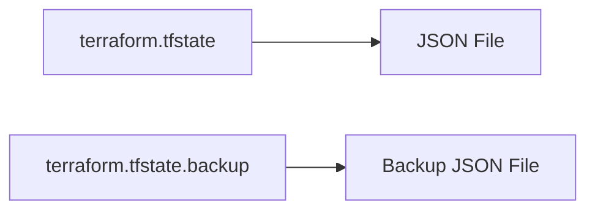

## Terraform State Management and Refresh Mechanism

### Introduction to Terraform State Management

Terraform is an infrastructure as code (IaC) tool that allows you to define your infrastructure in declarative configuration files. One of the core concepts in Terraform is state management. Terraform maintains a record of the current state of your infrastructure, which it uses to determine what actions need to be taken to reconcile the actual state with the desired state defined in your configuration files.

### Understanding the Current and Desired States

#### Current State
The **current state** refers to the actual state of your infrastructure at any given moment. This includes all the resources that are currently deployed, their attributes, and their relationships. Terraform tracks this state in a file named `terraform.tfstate`.

#### Desired State
The **desired state** is the state you want your infrastructure to be in, as defined in your Terraform configuration files (`.tf` files). These files contain declarations of the resources you want to create, update, or delete.

### Terraform State Files

When you run `terraform init`, Terraform initializes the working directory and creates two important files:

1. **`terraform.tfstate`**: This is the primary state file that contains the current state of your infrastructure. It is a JSON file that lists all the resources and their current states.
2. **`terraform.tfstate.backup`**: This is a backup of the state file. Terraform automatically creates a backup before making any changes to the state file.



### How Terraform Tracks the Current State

When you run `terraform apply`, Terraform performs the following steps:

1. **Read Configuration**: Terraform reads the `.tf` files to understand the desired state.
2. **Connect to Provider**: Terraform connects to the cloud provider (e.g., AWS, Azure, GCP) using the credentials specified in the configuration.
3. **Fetch Current State**: Terraform fetches the current state of the resources from the provider.
4. **Compare States**: Terraform compares the current state with the desired state.
5. **Plan Actions**: Terraform determines the actions needed to transition from the current state to the desired state.
6. **Apply Changes**: Terraform applies the necessary changes to the infrastructure.
7. **Update State**: Terraform updates the `terraform.tfstate` file to reflect the new current state.

### Example: Creating an EC2 Instance

Let's walk through an example of creating an EC2 instance using Terraform.

#### Step 1: Define the Desired State

Create a file named `main.tf` with the following content:

```hcl
provider "aws" {
  region = "us-west-2"
}

resource "aws_instance" "example" {
  ami           = "ami-0c55b159cbfafe1f0"
  instance_type = "t2.micro"
}
```

#### Step 2: Initialize Terraform

Run the following command to initialize Terraform:

```bash
terraform init
```

This command initializes the working directory and downloads the necessary provider plugins.

#### Step 3: Plan the Changes

Run the following command to plan the changes:

```bash
terraform plan
```

This command shows the proposed changes Terraform will make to achieve the desired state.

#### Step 4: Apply the Changes

Run the following command to apply the changes:

```bash
terraform apply
```

This command applies the changes and updates the `terraform.tfstate` file.

### Refresh Mechanism

The refresh mechanism is crucial for ensuring that Terraform has an accurate view of the current state of your infrastructure. Every time you run `terraform apply`, Terraform refreshes the state of the resources defined in your configuration files.

#### How Refresh Works

1. **Fetch Resource Data**: Terraform fetches the latest data about the resources from the cloud provider.
2. **Update State**: Terraform updates the `terraform.tfstate` file with the refreshed data.

### Real-World Example: CVE-2021-21277

In 2021, a critical vulnerability was discovered in Terraform (`CVE-2021-21277`). This vulnerability allowed an attacker to manipulate the state file, leading to unintended changes in the infrastructure.

#### Vulnerability Details

- **CVE ID**: CVE-2021-21277
- **Description**: An attacker could modify the `terraform.tfstate` file to cause unexpected behavior during the `terraform apply` process.
- **Impact**: This could lead to unauthorized changes in the infrastructure, such as deleting critical resources or modifying sensitive configurations.

#### Detection and Prevention

To detect and prevent such vulnerabilities, follow these best practices:

1. **Secure State Files**: Ensure that the `terraform.tfstate` file is stored securely and is not accessible to unauthorized users.
2. **Use Version Control**: Store your Terraform configuration files in a version control system (e.g., Git) and regularly review changes.
3. **Automated Testing**: Implement automated testing to verify the integrity of the state file before applying changes.

### Secure Coding Practices

Here’s an example of how to securely manage Terraform state files:

#### Vulnerable Code

```hcl
# main.tf
resource "aws_s3_bucket" "example" {
  bucket = "my-bucket"
  acl    = "public-read"
}
```

#### Secure Code

```hcl
# main.tf
resource "aws_s3_bucket" "example" {
  bucket = "my-bucket"
  acl    = "private"
}
```

### Hands-On Labs

For practical experience with Terraform state management and refresh mechanisms, consider the following labs:

- **PortSwigger Web Security Academy**: Offers a module on IaC security, including Terraform.
- **OWASP Juice Shop**: Provides a hands-on environment to practice securing IaC configurations.
- **DVWA (Damn Vulnerable Web Application)**: Useful for learning about various security vulnerabilities, including those related to IaC.

### Conclusion

Understanding Terraform state management and the refresh mechanism is crucial for effectively managing your infrastructure as code. By maintaining an accurate state and regularly refreshing it, you can ensure that your infrastructure remains in the desired state. Always follow best practices for securing your state files and implementing automated testing to prevent unintended changes.

---
<!-- nav -->
[[DevOps/DevOps Bootcamp/08-Infrastructure as Code (Terraform)/21-Terraform State Management And Refresh Mechanism/00-Overview|Overview]] | [[DevOps/DevOps Bootcamp/08-Infrastructure as Code (Terraform)/21-Terraform State Management And Refresh Mechanism/02-Practice Questions & Answers|Practice Questions & Answers]]
