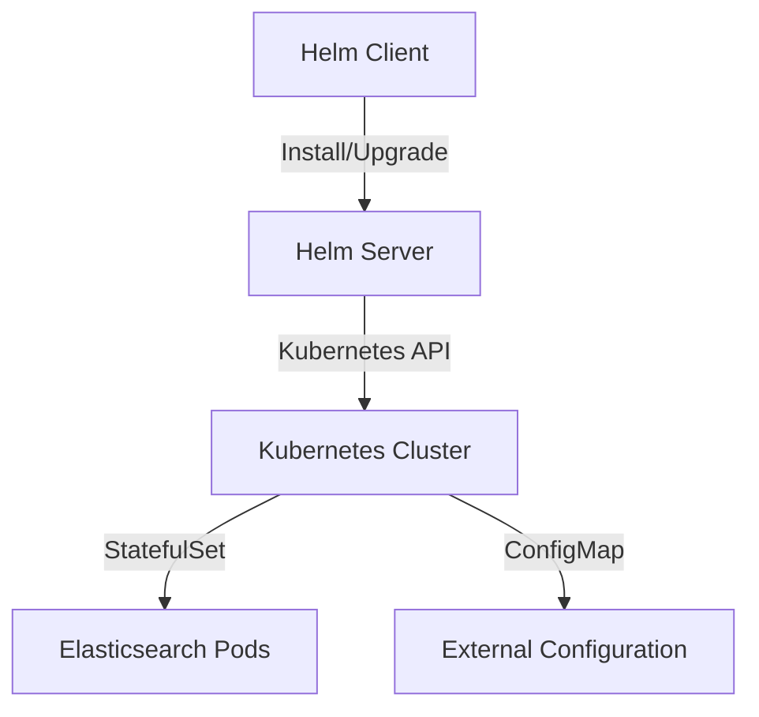

## Introduction to Helm and Its Role in Kubernetes

Helm is a package manager for Kubernetes, designed to simplify the deployment and management of applications within a Kubernetes cluster. It serves as an abstraction layer on top of Kubernetes, providing a higher level of convenience and flexibility. To understand Helm fully, it is essential to grasp its core concepts, such as Helm charts, Tiller, and the overall architecture. This chapter will delve into these concepts, provide practical examples, and discuss recent real-world scenarios where Helm has been utilized effectively.

### What is Helm?

Helm can be thought of as a package manager for Kubernetes, similar to `apt`, `yum`, or `Homebrew` for Linux and macOS systems. It allows users to package and distribute collections of Kubernetes YAML files, making it easier to manage complex applications and their dependencies.

#### Core Features of Helm

1. **Package Manager**: Helm simplifies the process of deploying and managing applications by packaging them into reusable units called charts.
2. **Configuration Management**: Helm allows users to configure and customize applications using values files, making it easy to adapt deployments to different environments.
3. **Version Control**: Helm supports versioning of charts, enabling users to track and manage different versions of their applications.

### Helm Charts

A Helm chart is a collection of files that describe a related set of Kubernetes resources. These resources can include Deployments, StatefulSets, ConfigMaps, and other Kubernetes objects. A chart is essentially a template that can be customized and deployed into a Kubernetes cluster.

#### Structure of a Helm Chart

A typical Helm chart consists of the following directories and files:

- `Chart.yaml`: Contains metadata about the chart, such as its name, version, and description.
- `values.yaml`: Default values for parameters that can be overridden during installation.
- `templates/`: Directory containing the Kubernetes resource templates.
- `charts/`: Directory for sub-charts, allowing nested charts.

Here is an example structure of a Helm chart:

```yaml
# Chart.yaml
apiVersion: v2
name: mychart
version: 0.1.0
description: A Helm chart for my application

# values.yaml
replicaCount: 1
image:
  repository: myapp
  tag: latest
```

```yaml
# templates/deployment.yaml
apiVersion: apps/v1
kind: Deployment
metadata:
  name: {{ .Release.Name }}-deployment
spec:
  replicas: {{ .Values.replicaCount }}
  template:
    spec:
      containers:
        - name: {{ .Chart.Name }}
          image: "{{ .Values.image.repository }}:{{ .Values.image.tag }}"
```

### Use Cases for Helm

Helm is particularly useful in scenarios where you need to deploy and manage complex applications with multiple components. Here are some common use cases:

1. **Deploying Stateful Applications**: Helm can be used to deploy stateful applications like databases, which require persistent storage and state management.
2. **Customizing Deployments**: Helm allows users to customize deployments using values files, making it easy to adapt applications to different environments.
3. **Managing Dependencies**: Helm can manage dependencies between different components of an application, ensuring that all required resources are deployed correctly.

### Example: Deploying Elasticsearch with Helm

Let's consider a scenario where you want to deploy Elasticsearch in your Kubernetes cluster. Elasticsearch is a distributed search and analytics engine that requires multiple Kubernetes components, including StatefulSets and ConfigMaps.

#### Step-by-Step Deployment

1. **Create a Helm Chart for Elasticsearch**:
   - Define the `Chart.yaml` and `values.yaml` files.
   - Create the necessary Kubernetes resource templates in the `templates/` directory.

```yaml
# Chart.yaml
apiVersion: v2
name: elasticsearch
version: 0.1.0
description: A Helm chart for Elasticsearch

# values.yaml
replicaCount: 3
image:
  repository: docker.elastic.co/elasticsearch/elasticsearch
  tag: 7.10.2
```

```yaml
# templates/statefulset.yaml
apiVersion: apps/v1
kind: StatefulSet
metadata:
  name: {{ .Release.Name }}-elasticsearch
spec:
  serviceName: {{ .Release.Name }}-elasticsearch
  replicas: {{ .Values.replicaCount }}
  template:
    spec:
      containers:
        - name: elasticsearch
          image: "{{ .Values.image.repository }}:{{ .Values.image.tag }}"
          ports:
            - containerPort: 9200
              name: http
            - containerPort: 9300
              name: transport
```

2. **Install the Helm Chart**:
   - Use the `helm install` command to deploy the Elasticsearch chart.

```bash
helm install my-elasticsearch ./elasticsearch
```

3. **Verify the Deployment**:
   - Check the status of the StatefulSet and pods to ensure that Elasticsearch is running correctly.

```bash
kubectl get statefulset my-elasticsearch
kubectl get pods
```

### Tiller and Helm Architecture

Tiller was the server-side component of Helm that managed the installation and upgrade of charts in a Kubernetes cluster. However, starting with Helm 3, Tiller has been removed, and Helm now operates client-side only.

#### Helm 3 Architecture

In Helm 3, the client-side operations are performed directly against the Kubernetes API, eliminating the need for Tiller. This change simplifies the architecture and reduces the attack surface.

### Real-World Examples and Recent Breaches

Recent real-world examples and breaches involving Helm include:

1. **CVE-2020-11655**: A vulnerability in Helm 2 allowed unauthorized access to Tiller, potentially leading to unauthorized modifications of Kubernetes resources.
2. **CVE-2020-11656**: Another vulnerability in Helm 2 allowed attackers to bypass authentication mechanisms, further compromising the security of Kubernetes clusters.

These vulnerabilities highlight the importance of keeping Helm and Kubernetes up to date and implementing proper security measures.

### How to Prevent / Defend

To prevent and defend against potential security issues with Helm, follow these best practices:

1. **Keep Helm and Kubernetes Updated**: Regularly update Helm and Kubernetes to the latest versions to ensure you have the latest security patches.
2. **Use RBAC for Access Control**: Implement Role-Based Access Control (RBAC) to restrict access to Helm and Kubernetes resources.
3. **Secure Configuration Files**: Ensure that sensitive information in Helm configuration files is properly encrypted and protected.
4. **Monitor and Audit**: Regularly monitor and audit Helm and Kubernetes activities to detect and respond to suspicious behavior.

### Complete Example: Secure Deployment of Elasticsearch with Helm

Here is a complete example of deploying Elasticsearch securely using Helm:

#### Vulnerable Version

```yaml
# values.yaml (vulnerable)
replicaCount: 3
image:
  repository: docker.elastic.co/elasticsearch/elasticsearch
  tag: 7.10.2
```

```yaml
# templates/statefulset.yaml (vulnerable)
apiVersion: apps/v1
kind: StatefulSet
metadata:
  name: {{ .Release.Name }}-elasticsearch
spec:
  serviceName: {{ .Release.Name }}-elasticsearch
  replicas: {{ .Values.replicaCount }}
  template:
    spec:
      containers:
        - name: elasticsearch
          image: "{{ .Values.image.repository }}:{{ .Values.image.tag }}"
          ports:
            - containerPort: 9200
              name: http
            - containerPort: 9300
              name: transport
```

#### Secure Version

```yaml
# values.yaml (secure)
replicaCount: 3
image:
  repository: docker.elastic.co/elasticsearch/elasticsearch
  tag: 7.10.2
securityContext:
  runAsUser: 1000
  fsGroup: 1000
```

```yaml
# templates/statefulset.yaml (secure)
apiVersion: apps/v1
kind: StatefulSet
metadata:
  name: {{ .Release.Name }}-elasticsearch
spec:
  serviceName: {{ .Release.Name }}-elasticsearch
  replicas: {{ .Values.replicaCount }}
  template:
    spec:
      securityContext:
        runAsUser: {{ .Values.securityContext.runAsUser }}
        fsGroup: {{ .Values.securityContext.fsGroup }}
      containers:
        - name: elasticsearch
          image: "{{ .Values.image.repository }}:{{ .Values.image.tag }}"
          ports:
            - containerPort: 9200
              name: http
            - containerPort: 10300
              name: transport
```

### Detection and Prevention

To detect and prevent unauthorized access to Helm and Kubernetes resources, implement the following measures:

1. **Audit Logs**: Enable and review audit logs to detect unauthorized access attempts.
2. **Network Policies**: Implement network policies to restrict access to sensitive resources.
3. **Security Scanning**: Use tools like Trivy or Aqua Security to scan Helm charts and Kubernetes resources for vulnerabilities.

### Mermaid Diagrams

Here is a mermaid diagram illustrating the architecture of a Helm-based deployment:



### Conclusion

Helm is a powerful tool for managing Kubernetes applications, offering a convenient way to package and deploy complex applications. By understanding its core concepts, use cases, and security considerations, you can effectively leverage Helm to streamline your DevOps processes and enhance the security of your Kubernetes deployments.

### Practice Labs

For hands-on experience with Helm and Kubernetes, consider the following labs:

- **PortSwigger Web Security Academy**: Offers a variety of labs focused on web application security, including Kubernetes-related challenges.
- **OWASP Juice Shop**: A deliberately insecure web application for practicing web security skills, including Kubernetes deployments.
- **DVWA (Damn Vulnerable Web Application)**: A PHP/MySQL web application that is riddled with vulnerabilities, useful for learning about web security and Kubernetes.
- **WebGoat**: An interactive, gamified training application for learning about web application security, including Kubernetes deployments.

By completing these labs, you can gain practical experience with Helm and Kubernetes, enhancing your ability to manage and secure complex applications in a Kubernetes environment.

---
<!-- nav -->
[[01-Introduction to Helm Charts|Introduction to Helm Charts]] | [[DevOps/DevOps Bootcamp/09-Container Orchestration (Kubernetes)/02-Helm Basics and Use Cases for Kubernetes/00-Overview|Overview]] | [[03-Introduction to Helm and Kubernetes Secrets|Introduction to Helm and Kubernetes Secrets]]
