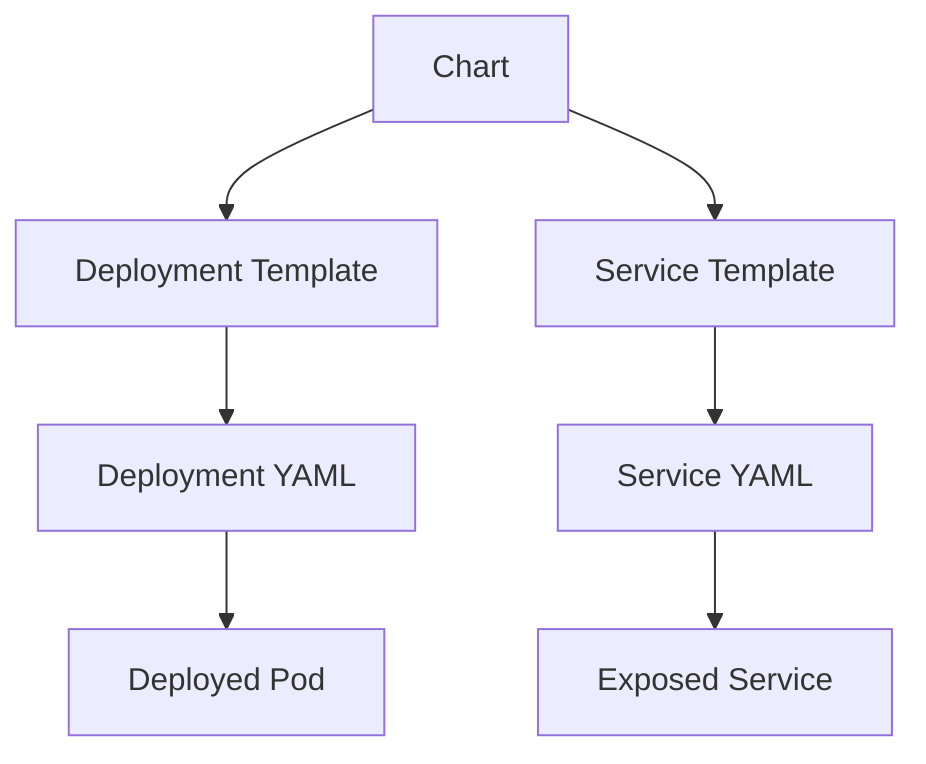

## Introduction to Helm and Kubernetes

Helm is a package manager for Kubernetes, designed to simplify the management and deployment of applications. In Kubernetes, applications are typically deployed as a collection of microservices, each with its own deployment and service definitions. These definitions are written in YAML files, which specify the desired state of the application. Without Helm, managing these YAML files can become cumbersome, especially when deploying multiple similar microservices with slight variations.

### Background Theory

Kubernetes is an open-source platform for automating deployment, scaling, and management of containerized applications. It groups containers that make up an application into logical units called pods, which are managed by controllers such as Deployments and StatefulSets. Each pod is assigned a unique IP address within the cluster, and services are used to expose these pods to the network.

When deploying multiple microservices, each with its own deployment and service definitions, the YAML files can become repetitive. This is where Helm comes in. Helm allows you to create reusable templates for your Kubernetes resources, reducing the amount of boilerplate code and making it easier to manage variations between deployments.

### Helm Concepts

#### Chart

A Helm chart is a collection of files that describe a related set of Kubernetes resources. A chart is essentially a template for a Kubernetes application. Charts can be packaged and shared, allowing you to reuse and distribute your Kubernetes applications.

#### Template

In Helm, a template is a YAML file that contains placeholders for dynamic values. These placeholders are replaced at runtime with actual values from a `values.yaml` file. This allows you to define a common blueprint for your microservices and customize them with specific values.

#### Values File

The `values.yaml` file contains the dynamic values that are used to populate the placeholders in the template. This file is separate from the template and allows you to easily modify the values without changing the template itself.

### Example: Deploying Multiple Microservices

Let's consider an example where we have multiple microservices, each with its own deployment and service definitions. Without Helm, we would need to write separate YAML files for each microservice, with only minor differences in the application name and version.

#### Without Helm

```yaml
# deployment-microservice-a.yaml
apiVersion: apps/v1
kind: Deployment
metadata:
  name: microservice-a
spec:
  replicas: 3
  selector:
    matchLabels:
      app: microservice-a
  template:
    metadata:
      labels:
        app: microservice-a
    spec:
      containers:
      - name: microservice-a
        image: myregistry/microservice-a:v1.0.0
        ports:
        - containerPort: 8080

---
# service-microservice-a.yaml
apiVersion: v1
kind: Service
metadata:
  name: microservice-a
spec:
  selector:
    app: microservice-a
  ports:
  - protocol: TCP
    port: 80
    targetPort: 8080
```

```yaml
# deployment-microservice-b.yaml
apiVersion: apps/v1
kind: Deployment
metadata:
  name: microservice-b
spec:
  replicas: 3
  selector:
    matchLabels:
      app: microservice-b
  template:
    metadata:
      labels:
        app: microservice-b
    spec:
      containers:
      - name: microservice-b
        image: myregistry/microservice-b:v1.0.0
        ports:
        - containerPort: 8080

---
# service-microservice-b.yaml
apiVersion: v1
kind: Service
metadata:
  name: microservice-b
spec:
  selector:
    app: microservice-b
  ports:
  - protocol: TCP
    port: 80
    targetPort:  8080
```

As you can see, the only differences between these YAML files are the application names and the Docker image names. This repetition can be avoided using Helm.

#### With Helm

Using Helm, we can create a template file that defines the common structure of our microservices and uses placeholders for the dynamic values.

```yaml
# templates/deployment.yaml
apiVersion: apps/v1
kind: Deployment
metadata:
  name: {{ .Release.Name }}-{{ .Values.appName }}
spec:
  replicas: {{ .Values.replicas }}
  selector:
    matchLabels:
      app: {{ .Values.appName }}
  template:
    metadata:
      labels:
        app: {{ .Values.appName }}
    spec:
      containers:
      - name: {{ .Values.appName }}
        image: {{ .Values.image.repository }}:{{ .Values.image.tag }}
        ports:
        - containerPort: {{ .Values.containerPort }}

---
# templates/service.yaml
apiVersion: v1
kind: Service
metadata:
  name: {{ .Release.Name }}-{{ .Values.appName }}
spec:
  selector:
    app: {{ .Values.appName }}
  ports:
  - protocol: TCP
    port: {{ .Values.servicePort }}
    targetPort: {{ .Values.containerPort }}
```

We also need a `values.yaml` file to provide the dynamic values:

```yaml
# values.yaml
appName: microservice-a
replicas: 3
image:
  repository: myregistry/microservice-a
  tag: v1.0.0
containerPort: 8080
servicePort: 80
```

To deploy the microservice, we can use the following Helm commands:

```sh
helm install microservice-a ./chart --values values.yaml
```

This will generate the necessary YAML files and deploy the microservice to the Kubernetes cluster.

### Mermaid Diagrams

Let's visualize the structure of the Helm chart and the deployment process using Mermaid diagrams.



### Pitfalls and Best Practices

#### Common Mistakes

1. **Hardcoding Values**: One common mistake is hardcoding values directly in the template files instead of using placeholders. This defeats the purpose of using Helm and makes it difficult to manage variations between deployments.
   
2. **Incorrect Placeholder Syntax**: Using incorrect syntax for placeholders can lead to errors during deployment. Ensure that you use the correct syntax (`{{ .Values.key }}`) and that the keys match the values defined in the `values.yaml` file.

3. **Overcomplicating Templates**: While templates can be powerful, overcomplicating them can make them difficult to maintain. Keep the templates simple and use separate `values.yaml` files for different configurations.

#### How to Prevent / Defend

1. **Use Version Control**: Store your Helm charts in a version control system like Git. This allows you to track changes, collaborate with others, and roll back to previous versions if needed.

2. **Automate Testing**: Automate testing of your Helm charts using tools like `helm test`. This ensures that your charts work as expected and helps catch issues early.

3. **Secure Configuration Management**: Use secure practices for managing your `values.yaml` files. Avoid storing sensitive information directly in the files and use environment variables or secrets management tools like Kubernetes Secrets.

4. **Regular Audits**: Regularly audit your Helm charts and `values.yaml` files to ensure they are up-to-date and secure. Remove unused or deprecated configurations and update dependencies as needed.

### Real-World Examples

#### Recent CVEs and Breaches

One recent example of a vulnerability related to Helm is the CVE-2021-25742, which affected the `helm serve` command. This vulnerability allowed an attacker to execute arbitrary code on the server by manipulating the `--tiller-host` flag. To prevent such vulnerabilities, always keep your Helm and Kubernetes installations up-to-date and follow best practices for securing your environment.

### Complete Example

Let's walk through a complete example of creating and deploying a Helm chart for a microservice.

#### Step 1: Create the Chart

First, create a new Helm chart using the `helm create` command:

```sh
helm create my-chart
```

This will create a directory structure for your chart, including the necessary template files and a `values.yaml` file.

#### Step 2: Define the Templates

Edit the `templates/deployment.yaml` and `templates/service.yaml` files to define the structure of your microservice.

```yaml
# templates/deployment.yaml
apiVersion: apps/v1
kind: Deployment
metadata:
  name: {{ .Release.Name }}-{{ .Values.appName }}
spec:
  replicas: {{ .Values.replicas }}
  selector:
    matchLabels:
      app: {{ .Values.appName }}
  template:
    metadata:
      labels:
        app: {{ .Values.appName }}
    spec:
      containers:
      - name: {{ .Values.appName }}
        image: {{ .Values.image.repository }}:{{ .Values.image.tag }}
        ports:
        - containerPort: {{ .Values.containerPort }}

---
# templates/service.yaml
apiVersion: v1
kind: Service
metadata:
  name: {{ .Release.Name }}-{{ .Values.appName }}
spec:
  selector:
    app: {{ .Values.appName }}
  ports:
  - protocol: TCP
    port: {{ .Values.servicePort }}
    targetPort: {{ .Values.containerPort }}
```

#### Step 3: Define the Values

Edit the `values.yaml` file to provide the dynamic values for your microservice.

```yaml
# values.yaml
appName: microservice-a
replicas: 3
image:
  repository: myregistry/microservice-a
  tag: v1.0.0
containerPort: 8080
servicePort: 80
```

#### Step 4: Deploy the Chart

Deploy the chart using the `helm install` command:

```sh
helm install my-release ./my-chart --values values.yaml
```

This will generate the necessary YAML files and deploy the microservice to the Kubernetes cluster.

### Conclusion

Helm simplifies the management and deployment of Kubernetes applications by providing a package manager for charts. By using templates and `values.yaml` files, you can define a common blueprint for your microservices and customize them with specific values. This reduces the amount of boilerplate code and makes it easier to manage variations between deployments.

### Hands-On Labs

For hands-on practice with Helm and Kubernetes, consider the following labs:

- **PortSwigger Web Security Academy**: Offers interactive labs for learning web security concepts.
- **OWASP Juice Shop**: A deliberately insecure web application for practicing web security skills.
- **DVWA (Damn Vulnerable Web Application)**: A PHP/MySQL web application that is riddled with vulnerabilities for educational purposes.
- **WebGoat**: An interactive, gamified training application for learning about web application security.

These labs provide practical experience with deploying and managing applications using Helm and Kubernetes.

By following these steps and best practices, you can effectively use Helm to manage and deploy your Kubernetes applications.

---
<!-- nav -->
[[03-Introduction to Helm and Kubernetes Secrets|Introduction to Helm and Kubernetes Secrets]] | [[DevOps/DevOps Bootcamp/09-Container Orchestration (Kubernetes)/02-Helm Basics and Use Cases for Kubernetes/00-Overview|Overview]] | [[DevOps/DevOps Bootcamp/09-Container Orchestration (Kubernetes)/02-Helm Basics and Use Cases for Kubernetes/05-Practice Questions & Answers|Practice Questions & Answers]]
