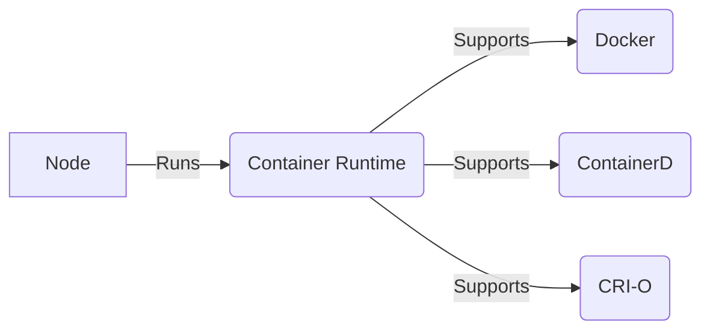
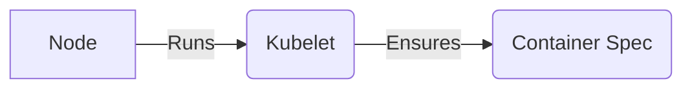
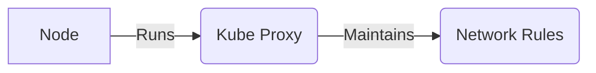
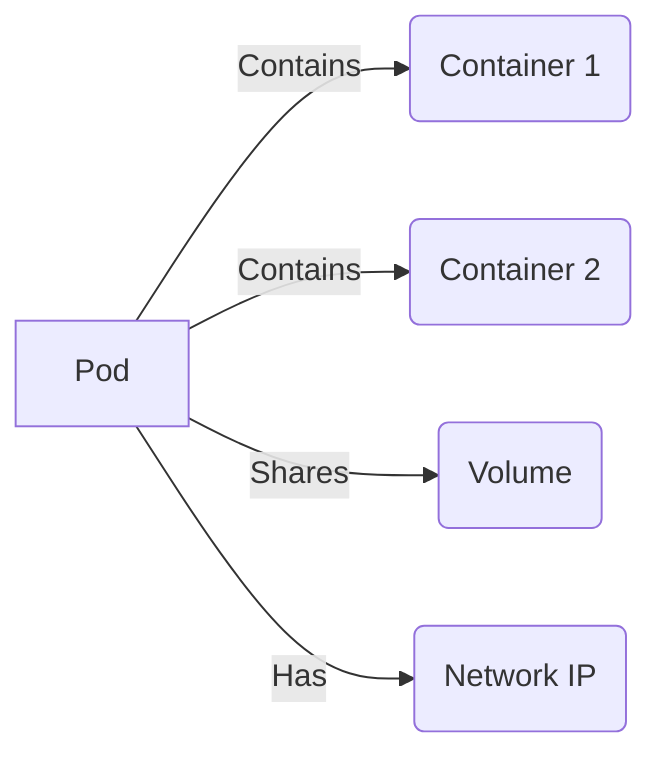

## Introduction to Kubernetes Architecture

Kubernetes is an open-source system for automating deployment, scaling, and management of containerized applications. At its core, Kubernetes provides a framework for running distributed systems resiliently. This chapter delves into the fundamental architecture of Kubernetes, focusing on the roles of nodes and pods, and the processes that enable these components to function effectively.

### Nodes in Kubernetes

Nodes are the worker machines in a Kubernetes cluster. These can be physical or virtual machines. Each node is managed by the Kubernetes control plane and runs the necessary services to host pods. The primary components of a node include:

1. **Container Runtime**: Responsible for running containers.
2. **Kubelet**: A node agent that ensures containers are running in a pod.
3. **Kube Proxy**: Maintains network rules on the node.

#### Container Runtime

The container runtime is responsible for running containers on the node. Kubernetes supports various container runtimes, including Docker, ContainerD, and CRI-O. The choice of container runtime can significantly impact performance and resource utilization.

**ContainerD**: ContainerD is a lightweight container runtime that is widely adopted in Kubernetes clusters. It is designed to be highly efficient and integrates seamlessly with Kubernetes. ContainerD is preferred over Docker due to its lower overhead and better performance.



**Recent Real-World Example**: In 2021, a significant vulnerability was discovered in Docker (CVE-2021-29449), which allowed attackers to execute arbitrary code on the host machine. This highlights the importance of choosing a lightweight and secure container runtime like ContainerD.

### Kubelet

Kubelet is the primary "node agent" that runs on each node. It ensures that containers are created, started, and stopped as specified by the Kubernetes API. Kubelet takes a set of PodSpecs (a description of a pod) that are provided through various mechanisms and ensures that the containers described in those PodSpecs are started and kept running.



**Recent Real-World Example**: In 2022, a vulnerability was found in Kubelet (CVE-2022-25239) that allowed unauthorized access to the Kubernetes API server. This underscores the importance of securing Kubelet and ensuring it is properly configured.

### Kube Proxy

Kube Proxy is a network proxy that runs on each node. It maintains network rules on the node and can perform connection forwarding. Kube Proxy allows the Kubernetes service abstraction to work by maintaining network rules on the node.



**Recent Real-World Example**: In 2021, a vulnerability was discovered in Kube Proxy (CVE-2021-25741) that allowed attackers to bypass network policies. This highlights the importance of configuring Kube Proxy securely and regularly updating it to mitigate such vulnerabilities.

### Pods in Kubernetes

Pods are the smallest deployable units in Kubernetes. A pod encapsulates application containers, storage resources, a unique network IP, and options that govern how the container(s) should run. Multiple containers within a pod share the same network namespace and can communicate with each other via localhost.

#### Pod Components

1. **Containers**: Each pod can contain one or more containers.
2. **Volumes**: Shared storage volumes that can be mounted by containers within the pod.
3. **Network**: Each pod gets its own IP address, allowing containers within the pod to communicate with each other and with other pods.



**Recent Real-World Example**: In 2_2021, a vulnerability was discovered in Kubernetes (CVE-2021-25742) that allowed attackers to inject malicious containers into pods. This highlights the importance of validating and securing pod configurations.

### Basic Setup of a Node with Two Application Pods

Let's consider a basic setup of a node with two application pods running on it. We'll walk through the steps to create and manage these pods.

#### Creating a Pod

To create a pod, you define a `Pod` object in a YAML file. Here’s an example of a simple pod definition:

```yaml
apiVersion: v1
kind: Pod
metadata:
  name: my-pod
spec:
  containers:
  - name: container1
    image: nginx:latest
  - name: container2
    image: redis:latest
```

This YAML defines a pod named `my-pod` with two containers: `container1` running the `nginx` image and `container2` running the `redis` image.

#### Deploying the Pod

To deploy the pod, you use the `kubectl` command-line tool:

```sh
kubectl apply -f pod-definition.yaml
```

This command applies the pod definition to the Kubernetes cluster, creating the pod and its containers.

#### Monitoring the Pod

Once the pod is deployed, you can monitor its status using `kubectl`:

```sh
kubectl get pods
```

This command lists all the pods in the cluster, showing their names and statuses.

### Self-Management and Self-Healing in Kubernetes

Kubernetes is designed to be self-managing and self-healing. This means that the system automatically detects and recovers from failures, ensuring high availability and reliability.

#### Self-Management

Self-management refers to the ability of Kubernetes to manage itself. This includes tasks such as:

1. **Scaling**: Automatically scaling the number of pods based on demand.
2. **Rollouts**: Performing rolling updates to ensure zero downtime during deployments.
3. **Health Checks**: Regularly checking the health of pods and restarting unhealthy ones.

#### Self-Healing

Self-healing refers to the ability of Kubernetes to recover from failures. This includes:

1. **Restarting Failed Pods**: Automatically restarting pods that fail.
2. **Replacing Unhealthy Pods**: Replacing pods that are not healthy.
3. **Rebalancing Workloads**: Rebalancing workloads across nodes to ensure optimal resource utilization.

### How to Prevent / Defend Against Vulnerabilities

#### Detection

Regularly scan your Kubernetes cluster for vulnerabilities using tools like Trivy, Clair, or Aqua Security. These tools can help identify and remediate security issues.

#### Prevention

1. **Secure Configuration**: Ensure that all components are configured securely. Use least privilege principles and avoid running containers with root privileges.
2. **Regular Updates**: Keep all components up to date with the latest security patches.
3. **Network Policies**: Implement strict network policies to restrict communication between pods and external networks.

#### Secure Coding Fixes

Here’s an example of a vulnerable pod definition and its secure counterpart:

**Vulnerable Pod Definition**:

```yaml
apiVersion: v1
kind: Pod
metadata:
  name: vulnerable-pod
spec:
  containers:
  - name: container1
    image: nginx:latest
    securityContext:
      privileged: true
```

**Secure Pod Definition**:

```yaml
apiVersion: v1
kind: Pod
metadata:
  name: secure-pod
spec:
  containers:
  - name: container1
    image: nginx:latest
    securityContext:
      privileged: false
```

In the secure version, the `privileged` flag is set to `false`, ensuring that the container does not run with elevated privileges.

### Conclusion

Understanding the architecture of Kubernetes, particularly the roles of nodes and pods, is crucial for effective deployment and management of containerized applications. By leveraging the self-managing and self-healing capabilities of Kubernetes, you can ensure high availability and reliability of your applications. Additionally, by implementing robust security measures, you can protect your Kubernetes cluster from potential vulnerabilities.

### Practice Labs

For hands-on experience with Kubernetes architecture, consider the following practice labs:

- **Kubernetes Goat**: A hands-on lab that simulates a Kubernetes environment with various security challenges.
- **OWASP WrongSecrets**: A series of challenges that focus on securing Kubernetes and containerized applications.
- **kube-hunter**: A tool for hunting down misconfigurations and vulnerabilities in Kubernetes clusters.

These labs provide practical experience in managing and securing Kubernetes clusters, helping you to master the concepts covered in this chapter.

---
<!-- nav -->
[[DevOps/DevOps Bootcamp/09-Container Orchestration (Kubernetes)/03-Kubernetes Architecture Basics Nodes And Pods/00-Overview|Overview]] | [[02-Kubernetes Architecture Basics Nodes and Pods|Kubernetes Architecture Basics Nodes and Pods]]
