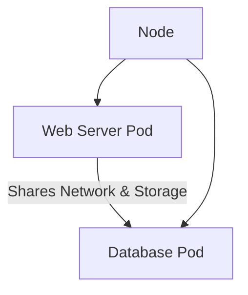

## Introduction to Kubernetes Basics

Kubernetes, often abbreviated as K8s, is an open-source system for automating deployment, scaling, and management of containerized applications. It was originally designed by Google and is now maintained by the Cloud Native Computing Foundation. Kubernetes aims to provide a platform for automating deployment, scaling, and operations of application containers across clusters of hosts. This chapter will focus on the basics of Kubernetes, particularly the concept of pods and their deployment.

### Components of Kubernetes

Kubernetes consists of several key components that work together to manage and orchestrate containerized applications. While Kubernetes has numerous components, most users typically interact with a subset of these components. Here are some of the core components:

1. **Nodes**: These are the worker machines in a Kubernetes cluster that run applications packaged in containers. A node may be a virtual machine or a physical machine, depending on the cluster. Each node is managed by the Kubernetes control plane.

2. **Pods**: Pods are the smallest deployable units in Kubernetes. They encapsulate application containers (such as Docker containers), storage resources, a unique network IP, and options that govern how the container should run. Pods are the fundamental building blocks of Kubernetes.

3. **Control Plane**: The control plane is responsible for managing the cluster. It includes components such as the API server, etcd, controller manager, scheduler, and cloud controller manager.

4. **Services**: Services provide a stable network endpoint for accessing groups of pods. They enable load balancing and service discovery.

5. **Deployments**: Deployments are used to create and update instances of applications in a declarative way. They ensure that a specified number of pod replicas are running at any given time.

### Understanding Pods

A pod is the basic execution unit in Kubernetes. It represents a group of one or more application containers that share storage and network resources. Pods are designed to be ephemeral, meaning they can be created, destroyed, and replaced without affecting the overall application.

#### What is a Pod?

A pod is essentially an abstraction over a container. While containers are the fundamental units of packaging and deploying applications, pods provide a higher level of abstraction that allows for better management and orchestration. Pods can contain multiple containers, but they are typically designed to run a single application container.

##### Why Use Pods?

Pods serve several purposes:

1. **Abstraction Over Container Runtime**: Kubernetes abstracts away the underlying container runtime (e.g., Docker) so that you can replace it if needed. This allows for greater flexibility and portability.

2. **Shared Resources**: Containers within a pod share the same network namespace and can communicate with each other using `localhost`. They also share storage volumes, allowing data to be shared between containers.

3. **Simplified Management**: By grouping related containers into a pod, Kubernetes simplifies the management of complex applications. You can manage multiple containers as a single unit, making it easier to deploy, scale, and maintain applications.

4. **Isolation**: Pods provide a level of isolation between different parts of an application. This isolation helps in maintaining the integrity and security of the application.

#### Pod Architecture

To understand how pods work, let's look at a typical pod architecture. Consider a simple application consisting of a web server and a database. In Kubernetes, you would typically deploy these components as separate pods.



In this diagram, the web server pod and the database pod are deployed on the same node. They share the same network namespace and can communicate with each other using `localhost`.

### Creating a Pod

To create a pod, you need to define a pod specification in a YAML file. Here is an example of a pod specification for a simple web server:

```yaml
apiVersion: v1
kind: Pod
metadata:
  name: web-server-pod
spec:
  containers:
  - name: web-server
    image: nginx:latest
    ports:
    - containerPort: 80
```

This YAML file defines a pod named `web-server-pod` that contains a single container running the `nginx` image. The container listens on port 80.

#### Deploying the Pod

To deploy the pod, you can use the `kubectl` command-line tool, which is the primary interface for interacting with Kubernetes clusters.

```bash
kubectl apply -f pod-definition.yaml
```

This command applies the pod definition to the Kubernetes cluster, creating the pod.

### Pod Lifecycle

Pods go through several lifecycle states during their existence. These states include:

1. **Pending**: The pod has been accepted by the Kubernetes system, but one or more containers have not been started.
2. **Running**: The pod has been bound to a node, and all of its containers have been created.
3. **Succeeded**: All containers in the pod have terminated successfully.
4. **Failed**: All containers in the pod have terminated, and at least one container has terminated in failure.
5. **Unknown**: The state of the pod cannot be obtained, typically due to issues with communication with the node where the pod is running.

### Multiple Containers in a Pod

While pods are typically designed to run a single application container, they can contain multiple containers. This is useful for scenarios where multiple containers need to work together closely, such as a web server and a sidecar container for logging.

Here is an example of a pod specification with multiple containers:

```yaml
apiVersion: v1
kind: Pod
metadata:
  name: multi-container-pod
spec:
  containers:
  - name: web-server
    image: nginx:latest
    ports:
    - containerPort: 80
  - name: logger
    image: busybox:latest
    command: ["sh", "-c", "while true; do echo $(date -u) >> /var/log/app.log; sleep 5; done"]
    volumeMounts:
    - name: log-volume
      mountPath: /var/log
  volumes:
  - name: log-volume
    emptyDir: {}
```

In this example, the pod contains two containers: a web server and a logger. The logger container writes logs to a shared volume.

### How to Prevent / Defend

While pods provide a powerful abstraction for managing containerized applications, they also introduce potential security risks. Here are some best practices to prevent and defend against these risks:

1. **Least Privilege Principle**: Ensure that pods run with the minimum necessary privileges. Avoid running containers as root unless absolutely necessary.

2. **Network Policies**: Use Kubernetes network policies to restrict traffic between pods. This helps in isolating sensitive services and preventing unauthorized access.

3. **Image Scanning**: Regularly scan container images for vulnerabilities. Tools like Trivy and Clair can help in identifying and fixing security issues in container images.

4. **Pod Security Policies**: Implement pod security policies to enforce security rules at the pod level. This includes restricting the use of privileged containers, limiting the use of host namespaces, and enforcing SELinux labels.

5. **Monitoring and Logging**: Enable monitoring and logging for pods to detect and respond to security incidents. Tools like Prometheus and Fluentd can help in collecting and analyzing logs.

### Real-World Examples

#### Example: CVE-2021-25741

CVE-2021-25741 is a vulnerability in Kubernetes that allows an attacker to escalate privileges by manipulating the `seccomp` profile. This vulnerability affects Kubernetes versions prior to 1.21.2.

**Impact**: An attacker could potentially gain elevated privileges within a pod, leading to further compromise of the cluster.

**Prevention**:
- **Update Kubernetes**: Ensure that your Kubernetes cluster is up to date with the latest security patches.
- **Enable Seccomp Profiles**: Configure seccomp profiles to restrict the system calls available to containers.

#### Example: CVE-2021-25742

CVE-2021-25742 is another vulnerability in Kubernetes that allows an attacker to bypass pod security policies. This vulnerability affects Kubernetes versions prior to 1.21.2.

**Impact**: An attacker could potentially bypass pod security policies and execute arbitrary commands within a pod.

**Prevention**:
- **Update Kubernetes**: Ensure that your Kubernetes cluster is up to date with the latest security patches.
- **Implement Pod Security Policies**: Enforce strict pod security policies to limit the capabilities of containers.

### Conclusion

Pods are the fundamental building blocks of Kubernetes. They provide a higher level of abstraction over containers, enabling better management and orchestration of applications. By understanding the concepts and best practices around pods, you can effectively deploy and manage containerized applications in a Kubernetes cluster.

### Practice Labs

For hands-on experience with Kubernetes, consider the following practice labs:

- **Kubernetes Goat**: A hands-on lab for learning Kubernetes security.
- **OWASP WrongSecrets**: A series of challenges for learning about Kubernetes and container security.
- **kube-hunter**: A tool for discovering and exploiting misconfigurations in Kubernetes clusters.

These labs provide practical experience in deploying and securing Kubernetes applications, helping you to master the concepts covered in this chapter.

---
<!-- nav -->
[[01-Introduction to Kubernetes Basics and Pod Deployment|Introduction to Kubernetes Basics and Pod Deployment]] | [[DevOps/DevOps Bootcamp/09-Container Orchestration (Kubernetes)/04-Kubernetes Basics Pod Deployment Walkthrough/00-Overview|Overview]] | [[03-Introduction to Kubernetes ConfigMaps and Secrets|Introduction to Kubernetes ConfigMaps and Secrets]]
