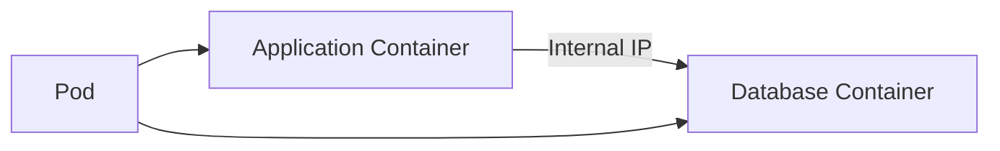

## Kubernetes Basics: Pod Deployment Walkthrough

### Introduction to Pods in Kubernetes

In Kubernetes, a **Pod** is the smallest deployable unit of computing that can be created and managed in the system. A Pod encapsulates one or more application containers, storage resources, a unique network identity, and specifications for how to run the containers. Pods are designed to host one or more tightly coupled containers that share resources and are managed together.

#### Why Pods Matter

Pods are essential because they provide a way to group containers that need to work closely together. This grouping allows containers within the same Pod to share resources such as storage volumes and network interfaces. Additionally, containers within a Pod can communicate with each other using `localhost`, which simplifies inter-container communication.

#### How Pods Work Under the Hood

Each Pod in Kubernetes is assigned a unique IP address, which is used for communication between different Pods. This IP address is internal to the cluster and is not exposed publicly. Containers within the same Pod share the same network namespace, meaning they can communicate using `localhost` and standard networking protocols.

### Communication Between Containers in a Pod

When you have multiple containers within a Pod, they can communicate with each other using the shared network namespace. This communication is seamless and does not require external network configurations.

#### Example: Application Container and Database Container

Consider a scenario where you have an application container and a database container within the same Pod. The application container can communicate with the database container using the Pod's internal IP address.



### Ephemeral Nature of Pods

One of the key characteristics of Pods in Kubernetes is their ephemeral nature. This means that Pods can be created, destroyed, and replaced at any time. This is particularly important for maintaining high availability and resilience in a Kubernetes cluster.

#### What Happens When a Pod Dies?

If a Pod dies due to a container crash, resource exhaustion, or any other reason, Kubernetes will automatically create a new Pod to replace the old one. This new Pod will be assigned a new IP address, which can cause issues if the original IP address was hardcoded into the application.

#### Real-World Example: CVE-2021-25741

CVE-2021-25741 is a vulnerability in Kubernetes that allows an attacker to manipulate the IP addresses assigned to Pods. This can lead to unexpected behavior and potential security risks. To mitigate this, it is crucial to ensure that your applications are resilient to changes in Pod IP addresses.

### Services in Kubernetes

To address the issue of ephemeral Pods and dynamic IP addresses, Kubernetes provides a higher-level abstraction called a **Service**. A Service is an abstraction that defines a logical set of Pods and a policy by which to access them.

#### How Services Work

A Service in Kubernetes provides a stable IP address and DNS name that can be used to access a set of Pods. This IP address remains constant even if the underlying Pods are replaced. Services can be configured to expose a specific port and to load balance traffic across multiple Pods.

#### Example: Configuring a Service

Here is an example of a Kubernetes Service configuration:

```yaml
apiVersion: v1
kind: Service
metadata:
  name: my-service
spec:
  selector:
    app: MyApp
  ports:
    - protocol: TCP
      port: 80
      targetPort: 9376
```

This Service configuration selects Pods with the label `app: MyApp` and exposes port 80, which forwards traffic to port 9376 on the selected Pods.

### Full HTTP Request and Response Example

Let's consider a scenario where we have a Service exposing a web application running in a Pod. Here is a full HTTP request and response example:

```http
GET /api/data HTTP/1.1
Host: my-service.default.svc.cluster.local
User-Agent: curl/7.64.1
Accept: */*
```

```http
HTTP/1.1 200 OK
Date: Mon, 20 Mar 2023 12:00:00 GMT
Content-Type: application/json
Content-Length: 34

{
  "data": "Hello, World!"
}
```

### How to Prevent / Defend Against Issues with Ephemeral Pods

#### Detection

To detect issues related to ephemeral Pods, you can monitor the Kubernetes events and logs. Tools like `kubectl describe pod <pod-name>` and `kubectl logs <pod-name>` can help you identify when a Pod has been recreated.

#### Prevention

To prevent issues caused by ephemeral Pods, you should avoid hardcoding IP addresses in your applications. Instead, use Kubernetes Services to abstract away the underlying Pod IP addresses.

#### Secure Coding Fixes

Here is an example of a vulnerable application that hardcodes an IP address:

```python
# Vulnerable Code
import requests

response = requests.get('http://10.0.0.1/api/data')
print(response.json())
```

Here is the corrected secure version that uses a Service:

```python
# Secure Code
import requests

response = requests.get('http://my-service.default.svc.cluster.local/api/data')
print(response.json())
```

### Hands-On Labs

For hands-on practice with Kubernetes Pods and Services, you can use the following labs:

- **Kubernetes Goat**: A hands-on lab for learning Kubernetes security concepts.
- **OWASP WrongSecrets**: A series of challenges to learn about Kubernetes security.

These labs provide practical experience in deploying and managing Pods and Services in a Kubernetes environment.

### Conclusion

Understanding the basics of Pods and Services in Kubernetes is crucial for effective deployment and management of containerized applications. By leveraging the ephemeral nature of Pods and the stability provided by Services, you can build resilient and scalable applications in a Kubernetes cluster.

---
<!-- nav -->
[[03-Introduction to Kubernetes ConfigMaps and Secrets|Introduction to Kubernetes ConfigMaps and Secrets]] | [[DevOps/DevOps Bootcamp/09-Container Orchestration (Kubernetes)/04-Kubernetes Basics Pod Deployment Walkthrough/00-Overview|Overview]] | [[05-Deploying Database Applications Using StatefulSets in Kubernetes|Deploying Database Applications Using StatefulSets in Kubernetes]]
