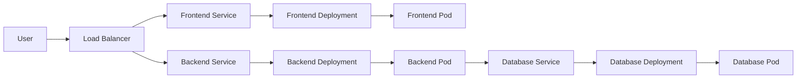
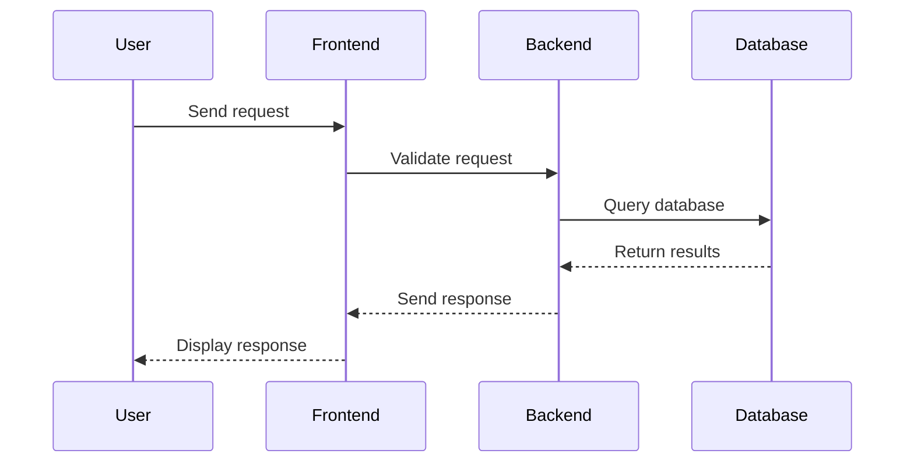

## Introduction to Kubernetes and Container Orchestration

### What is Kubernetes?

Kubernetes, often abbreviated as K8s, is an open-source container orchestration framework that was initially developed by Google. It is designed to automate the deployment, scaling, and management of containerized applications. Kubernetes provides a robust platform for managing applications that consist of hundreds or even thousands of containers across various environments, including physical machines, virtual machines, cloud environments, and hybrid deployments.

#### Background Theory

To understand Kubernetes, it's essential to first grasp the concept of containerization. Containers are lightweight, portable, and self-sufficient units of software that package code and dependencies together so the application runs reliably in any environment. Docker is one of the most popular container platforms, but Kubernetes is agnostic to the container runtime and can work with other container technologies such as rkt (Rocket).

Containerization solves many issues related to software development and deployment, such as ensuring that an application will run consistently across different computing environments. However, managing a large number of containers manually can become extremely complex and error-prone. This is where Kubernetes comes into play.

### Problems Kubernetes Solves

The rise of microservices architecture has significantly increased the usage of container technologies. Microservices are small, independent services that communicate with each other using well-defined APIs. Each microservice can be developed, deployed, and scaled independently, making the overall system more flexible and resilient.

However, as the number of microservices grows, so does the complexity of managing them. A typical modern application might consist of hundreds or even thousands of containers, each running a different microservice. Managing these containers across multiple environments using manual scripts and custom tools can quickly become unmanageable.

This is where container orchestration tools like Kubernetes come in. They provide automated solutions for deploying, scaling, and managing containerized applications. Kubernetes ensures that the desired state of the application is maintained, regardless of the underlying infrastructure.

### Key Features of Kubernetes

Kubernetes offers several key features that make it an indispensable tool for managing containerized applications:

1. **High Availability**: Kubernetes ensures that your application remains available even in the face of hardware failures or other disruptions.
2. **Scalability**: Kubernetes can automatically scale your application based on demand, ensuring that you have enough resources to handle traffic spikes.
3. **Self-healing**: Kubernetes can automatically restart failed containers, replace unhealthy containers, and reschedule containers as needed.
4. **Rolling Updates**: Kubernetes supports rolling updates, allowing you to update your application without downtime.
5. **Service Discovery and Load Balancing**: Kubernetes provides built-in service discovery and load balancing capabilities, making it easy to manage communication between microservices.
6. **Storage Orchestration**: Kubernetes can manage storage volumes and ensure that data is persisted even when containers are rescheduled.

### High Availability

One of the primary goals of Kubernetes is to ensure high availability of your applications. High availability means that your application remains accessible and operational even in the event of hardware failures or other disruptions.

#### How Kubernetes Ensures High Availability

Kubernetes achieves high availability through several mechanisms:

1. **Replica Sets**: Replica sets ensure that a specified number of pod replicas are running at any given time. If a pod fails, Kubernetes automatically replaces it with a new one.
2. **Pods**: Pods are the smallest deployable units in Kubernetes. Each pod contains one or more containers and shares the same network namespace and storage volumes.
3. **Nodes**: Nodes are the physical or virtual machines that run the pods. Kubernetes distributes pods across nodes to ensure that the workload is balanced and that the application remains available even if a node fails.
4. **Health Checks**: Kubernetes performs health checks on pods to determine whether they are running correctly. If a pod is deemed unhealthy, Kubernetes can replace it with a new one.

#### Example: High Availability in Action

Consider a simple web application that consists of a frontend and a backend. The frontend is responsible for serving static content, while the backend handles dynamic requests. To ensure high availability, we can deploy the frontend and backend as separate pods and use a replica set to ensure that multiple replicas of each pod are running.

```yaml
apiVersion: apps/v1
kind: Deployment
metadata:
  name: frontend-deployment
spec:
  replicas: 3
  selector:
    matchLabels:
      app: frontend
  template:
    metadata:
      labels:
        app: frontend
    spec:
      containers:
      - name: frontend-container
        image: my-frontend-image:latest
        ports:
        - containerPort: 80
---
apiVersion: apps/v1
kind: Deployment
metadata:
  name: backend-deployment
spec:
  replicas: 3
  selector:
    matchLabels:
      app: backend
  template:
    metadata:
      labels:
        app: backend
    spec:
      containers:
      - name: backend-container
        image: my-backend-image:latest
        ports:
        - containerPort: 8080
```

In this example, we have defined two deployments: one for the frontend and one for the backend. Each deployment specifies three replicas, ensuring that multiple instances of each pod are running. If one of the pods fails, Kubernetes will automatically replace it with a new one, ensuring that the application remains available.

### Scalability

Another key feature of Kubernetes is its ability to scale applications based on demand. Scaling can be done manually or automatically based on predefined metrics.

#### Manual Scaling

Manual scaling involves increasing or decreasing the number of replicas of a pod. This can be done using the `kubectl scale` command.

```bash
kubectl scale deployment/frontend-deployment --replicas=5
```

In this example, we are increasing the number of replicas of the `frontend-deployment` to five. Kubernetes will automatically create additional replicas of the pod to meet the new requirement.

#### Automatic Scaling

Automatic scaling involves setting up horizontal pod autoscalers (HPAs) that automatically adjust the number of replicas based on predefined metrics. HPAs can be configured to scale based on CPU utilization, memory usage, or custom metrics.

```yaml
apiVersion: autoscaling/v2beta2
kind: HorizontalPodAutoscaler
metadata:
  name: frontend-autoscaler
spec:
  scaleTargetRef:
    apiVersion: apps/v1
    kind: Deployment
    name: frontend-deployment
  minReplicas: 3
  maxReplicas: 10
  metrics:
  - type: Resource
    resource:
      name: cpu
      target:
        type: Utilization
        averageUtilization: 50
```

In this example, we have defined an HPA that scales the `frontend-deployment` based on CPU utilization. The HPA will automatically increase the number of replicas if the average CPU utilization exceeds 5.0%, and decrease the number of replicas if the average CPU utilization falls below 5.0%.

### Self-healing

Kubernetes provides built-in self-healing capabilities that ensure that your application remains healthy and operational. If a pod fails, Kubernetes can automatically replace it with a new one. If a node fails, Kubernetes can reschedule the pods running on that node to other healthy nodes.

#### Health Checks

Kubernetes performs health checks on pods to determine whether they are running correctly. There are two types of health checks: liveness probes and readiness probes.

- **Liveness Probes**: Liveness probes check whether a pod is running correctly. If a liveness probe fails, Kubernetes will automatically restart the pod.
- **Readiness Probes**: Readiness probes check whether a pod is ready to receive traffic. If a readiness probe fails, Kubernetes will stop sending traffic to the pod until it becomes ready again.

```yaml
apiVersion: v1
kind: Pod
metadata:
  name: my-pod
spec:
  containers:
  - name: my-container
    image: my-image:latest
    livenessProbe:
      httpGet:
        path: /healthz
        port: 8080
      initialDelaySeconds: 5
      periodSeconds: 10
    readinessProbe:
      httpGet:
        path: /readyz
        port: 8080
      initialDelaySeconds: 5
      periodSeconds: 10
```

In this example, we have defined a pod with a liveness probe and a readiness probe. The liveness probe checks whether the `/healthz` endpoint is responding correctly, while the readiness probe checks whether the `/readyz` endpoint is responding correctly. If either probe fails, Kubernetes will take appropriate action to ensure that the pod remains healthy.

### Rolling Updates

Kubernetes supports rolling updates, which allow you to update your application without downtime. Rolling updates involve gradually replacing old pods with new ones, ensuring that the application remains available throughout the update process.

```yaml
apiVersion: apps/v1
kind: Deployment
metadata:
  name: my-deployment
spec:
  replicas: 3
  strategy:
    type: RollingUpdate
    rollingUpdate:
      maxSurge: 1
      maxUnavailable: 1
  template:
    metadata:
      labels:
        app: my-app
    spec:
      containers:
      - name: my-container
        image: my-image:latest
```

In this example, we have defined a deployment with a rolling update strategy. The `maxSurge` parameter specifies the maximum number of additional pods that can be created during the update process, while the `maxUnavailable` parameter specifies the maximum number of pods that can be unavailable during the update process. Kubernetes will gradually replace the old pods with new ones, ensuring that the application remains available throughout the update process.

### Service Discovery and Load Balancing

Kubernetes provides built-in service discovery and load balancing capabilities that make it easy to manage communication between microservices. Services in Kubernetes expose a stable IP address and DNS name that can be used to access the pods running behind them.

```yaml
apiVersion: v1
kind: Service
metadata:
  name: my-service
spec:
  selector:
    app: my-app
  ports:
  - protocol: TCP
    port: 80
    targetPort: 8080
  type: ClusterIP
```

In this example, we have defined a service that exposes port 80 and forwards traffic to port 8080 on the pods running behind it. The service uses a selector to match the pods running the `my-app` label. Kubernetes will automatically load balance traffic between the matching pods.

### Storage Orchestration

Kubernetes can manage storage volumes and ensure that data is persisted even when containers are rescheduled. Persistent volumes (PVs) and persistent volume claims (PVCs) are used to manage storage in Kubernetes.

```yaml
apiVersion: v1
kind: PersistentVolume
metadata:
  name: my-pv
spec:
  capacity:
    storage: 10Gi
  accessModes:
  - ReadWriteOnce
  hostPath:
    path: /data
---
apiVersion: v1
kind: PersistentVolumeClaim
metadata:
  name: my-pvc
spec:
  accessModes:
  - ReadWriteOnce
  resources:
    requests:
      storage: 10Gi
```

In this example, we have defined a persistent volume (PV) and a persistent volume claim (PVC). The PV specifies a capacity of 10 GiB and an access mode of `ReadWriteOnce`. The PVC requests 10 GiB of storage and an access mode of `ReadWriteOnce`. Kubernetes will bind the PVC to the PV and mount the volume to the pods running the PVC.

### Real-World Examples

#### Recent CVEs and Breaches

Kubernetes has been involved in several recent CVEs and breaches. One notable example is the Kubernetes API server vulnerability (CVE-2021-25741), which allowed attackers to bypass authentication and gain unauthorized access to the cluster. This vulnerability highlights the importance of keeping your Kubernetes cluster up-to-date and applying security patches promptly.

#### Real-World Deployment

A real-world example of Kubernetes in action is the deployment of a microservices-based e-commerce application. The application consists of multiple microservices, each running in its own container. Kubernetes is used to manage the deployment, scaling, and availability of the microservices.



In this example, the user interacts with the load balancer, which routes traffic to the frontend service. The frontend service communicates with the frontend deployment, which manages the frontend pods. Similarly, the backend service communicates with the backend deployment, which manages the backend pods. The backend pods communicate with the database service, which manages the database pods.

### How to Prevent / Defend

#### Detection

To detect potential issues in your Kubernetes cluster, you can use monitoring and logging tools such as Prometheus and Fluentd. These tools can help you identify performance bottlenecks, security vulnerabilities, and other issues in real-time.

```yaml
apiVersion: monitoring.coreos.com/v1
kind: ServiceMonitor
metadata:
  name: my-service-monitor
spec:
  selector:
    matchLabels:
      app: my-app
  endpoints:
  - port: http
    interval: 15s
```

In this example, we have defined a service monitor that collects metrics from the pods running the `my-app` label. The service monitor uses the `http` port and collects metrics every 15 seconds.

#### Prevention

To prevent issues in your Kubernetes cluster, you should follow best practices such as:

- Keeping your cluster up-to-date with the latest security patches.
- Using network policies to restrict traffic between pods.
- Limiting the permissions of service accounts to the minimum necessary.
- Using secrets to store sensitive information securely.

```yaml
apiVersion: networking.k8s.io/v1
kind: NetworkPolicy
metadata:
  name: my-network-policy
spec:
  podSelector:
    matchLabels:
      app: my-app
  ingress:
  - from:
    - podSelector:
        matchLabels:
          app: my-other-app
```

In this example, we have defined a network policy that allows traffic from pods running the `my-other-app` label to pods running the `my-app` label.

#### Secure Coding Fixes

To ensure that your application is secure, you should follow secure coding practices such as:

- Validating user input to prevent injection attacks.
- Encrypting sensitive data to prevent data breaches.
- Using secure protocols to prevent man-in-the-middle attacks.



In this example, the user sends a request to the frontend, which validates the request and sends it to the backend. The backend queries the database and returns the results to the frontend, which sends the response back to the user.

### Conclusion

Kubernetes is a powerful container orchestration framework that provides automated solutions for deploying, scaling, and managing containerized applications. By ensuring high availability, scalability, self-healing, rolling updates, service discovery and load balancing, and storage orchestration, Kubernetes makes it easy to manage complex applications in a variety of environments. By following best practices and using monitoring and logging tools, you can ensure that your Kubernetes cluster remains secure and reliable.

### Practice Labs

For hands-on experience with Kubernetes, consider the following practice labs:

- **Kubernetes Goat**: A hands-on lab for learning Kubernetes security.
- **OWASP WrongSecrets**: A series of challenges for learning about secure coding practices in Kubernetes.
- **kube-hunter**: A tool for discovering and exploiting vulnerabilities in Kubernetes clusters.

These labs provide practical experience with Kubernetes and help you develop the skills needed to manage containerized applications effectively.

---
<!-- nav -->
[[DevOps/DevOps Bootcamp/09-Container Orchestration (Kubernetes)/05-Kubernetes Fundamentals And Container Orchestration/00-Overview|Overview]] | [[02-Disaster Recovery|Disaster Recovery]]
