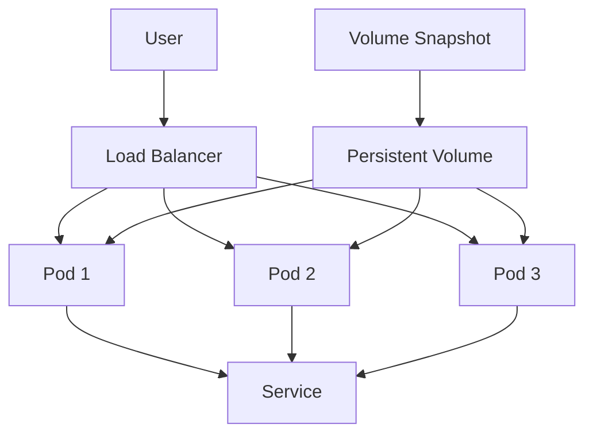

## Disaster Recovery

### What is Disaster Recovery?

Disaster recovery (DR) refers to the processes and procedures used to recover and protect a business IT infrastructure in the event of a disaster. This includes both natural disasters (such as earthquakes and floods) and man-made disasters (such as cyber attacks and hardware failures).

### Why is Disaster Recovery Important?

Disaster recovery is important because it ensures that the business can continue to operate even in the face of a catastrophic event. Without proper disaster recovery measures, a business could suffer significant financial losses and reputational damage.

### How Does Disaster Recovery Work?

Disaster recovery typically involves creating backups of critical data and systems, and having a plan in place to restore them in the event of a disaster. Kubernetes provides several mechanisms to support disaster recovery, including persistent volumes and volume snapshots.

### Example: Disaster Recovery in Kubernetes

Persistent volumes (PVs) and persistent volume claims (PVCs) allow you to store data outside of the pods, ensuring that the data persists even if the pods are deleted. Volume snapshots can be used to create backups of the data.

#### Code Example: Configuring Persistent Volumes

```yaml
apiVersion: v1
kind: PersistentVolume
metadata:
  name: my-pv
spec:
  capacity:
    storage: 10Gi
  accessModes:
    - ReadWriteOnce
  hostPath:
    path: /data/my-pv
---
apiVersion: v1
kind: PersistentVolumeClaim
metadata:
  name: my-pvc
spec:
  accessModes:
    - ReadWriteOnce
  resources:
    requests:
      storage: 10Gi
```

This PV and PVC configuration ensures that the data is stored persistently.

### Mermaid Diagram: Disaster Recovery Architecture



### Pitfalls and How to Prevent

One common pitfall is not properly testing the disaster recovery plan. This can lead to issues when trying to restore the system in the event of a disaster.

**How to Prevent:**

1. **Regular Testing**: Regularly test the disaster recovery plan to ensure it works as expected.
2. **Backup Verification**: Verify that the backups are complete and can be restored successfully.

### Real-World Example: Disaster Recovery in Cloud Services

A cloud service provider experienced a significant outage due to a data center failure. By implementing a robust disaster recovery plan using Kubernetes, they were able to quickly restore their services and minimize the impact on their customers.

---
<!-- nav -->
[[01-Introduction to Kubernetes and Container Orchestration|Introduction to Kubernetes and Container Orchestration]] | [[DevOps/DevOps Bootcamp/09-Container Orchestration (Kubernetes)/05-Kubernetes Fundamentals And Container Orchestration/00-Overview|Overview]] | [[03-High Availability|High Availability]]
