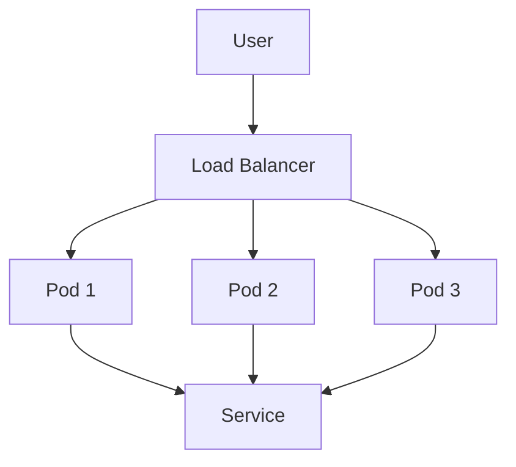

## High Availability

### What is High Availability?

High availability (HA) refers to a system or application's ability to operate continuously without interruption. In other words, it ensures that the application remains accessible to users at all times, even during maintenance or hardware failures. This is crucial for applications that require continuous uptime, such as financial systems, e-commerce platforms, and critical services.

### Why is High Availability Important?

High availability is essential because downtime can lead to significant financial losses, customer dissatisfaction, and damage to a company's reputation. For instance, a major e-commerce platform experiencing downtime during a holiday season could result in millions of dollars in lost sales. Therefore, ensuring high availability is a key aspect of maintaining business continuity and customer trust.

### How Does High Availability Work?

High availability is typically achieved through redundancy and failover mechanisms. Redundancy involves having multiple instances of the same service running simultaneously, so if one fails, another can take over immediately. Failover mechanisms ensure that the system can switch to a backup instance without any noticeable downtime.

### Example: High Availability in Kubernetes

Kubernetes provides several mechanisms to achieve high availability:

1. **ReplicaSets**: Ensure that a specified number of pod replicas are running at any given time.
2. **Deployments**: Manage ReplicaSets and provide rolling updates and rollbacks.
3. **StatefulSets**: Manage stateful applications that require stable network identifiers and persistent storage.

#### Code Example: Deploying a Highly Available Application

```yaml
apiVersion: apps/v1
kind: Deployment
metadata:
  name: my-app
spec:
  replicas: 3
  selector:
    matchLabels:
      app: my-app
  template:
    metadata:
      labels:
        app: my-app
    spec:
      containers:
      - name: my-app-container
        image: my-app-image:latest
        ports:
        - containerPort: 8080
```

This deployment ensures that three replicas of the `my-app` container are running at all times.

### Mermaid Diagram: High Availability Architecture



### Pitfalls and How to Prevent

One common pitfall is not properly configuring the load balancer to distribute traffic evenly among the replicas. This can lead to uneven load distribution and potential failures.

**How to Prevent:**

1. **Use a Load Balancer**: Ensure that a load balancer is configured to distribute traffic evenly among the replicas.
2. **Monitor and Scale**: Continuously monitor the application's performance and scale the number of replicas as needed.

### Real-World Example: High Availability in Financial Systems

A financial institution experienced a significant outage due to a single point of failure in their database server. This led to a loss of millions of dollars in transactions and a severe hit to their reputation. By implementing a highly available architecture using Kubernetes, they were able to avoid such outages in the future.

---
<!-- nav -->
[[02-Disaster Recovery|Disaster Recovery]] | [[DevOps/DevOps Bootcamp/09-Container Orchestration (Kubernetes)/05-Kubernetes Fundamentals And Container Orchestration/00-Overview|Overview]] | [[04-Practice Labs|Practice Labs]]
