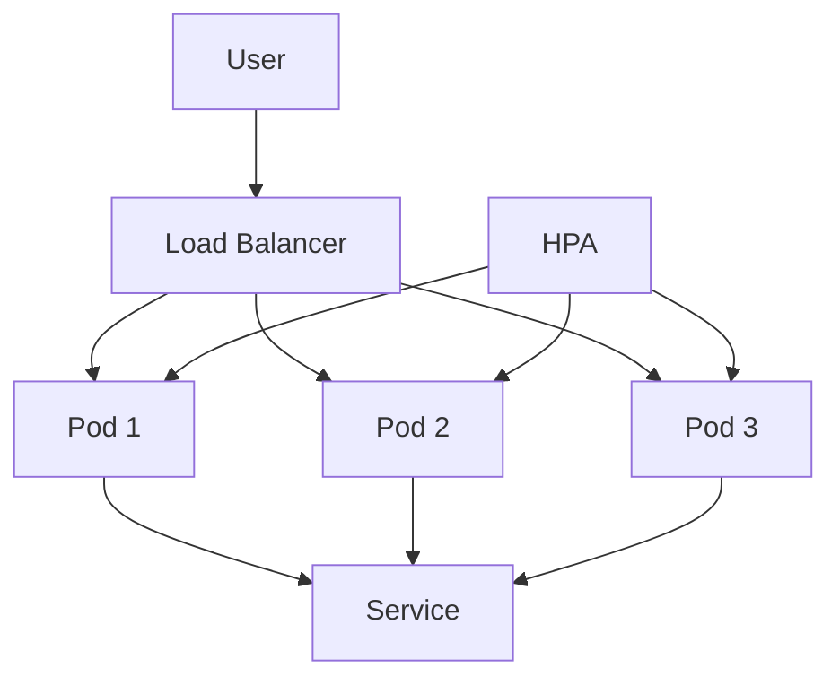

## Scalability

### What is Scalability?

Scalability refers to the ability of a system to handle increased load by adding more resources. This includes both vertical scaling (adding more power to existing resources) and horizontal scaling (adding more resources).

### Why is Scalability Important?

Scalability is important because it allows an application to handle increasing user demand without degradation in performance. For example, an e-commerce site may experience a surge in traffic during a sale event. Without proper scalability, the site could become slow or unresponsive, leading to a poor user experience and potential loss of sales.

### How Does Scalability Work?

Scalability is typically achieved through auto-scaling mechanisms that automatically adjust the number of resources based on current demand. Kubernetes provides built-in support for auto-scaling through Horizontal Pod Autoscalers (HPAs).

### Example: Auto-Scaling in Kubernetes

Horizontal Pod Autoscalers (HPAs) automatically scale the number of pods based on CPU utilization or custom metrics.

#### Code Example: Configuring an HPA

```yaml
apiVersion: autoscaling/v2beta2
kind: HorizontalPodAutoscaler
metadata:
  name: my-app-hpa
spec:
  scaleTargetRef:
    apiVersion: apps/v1
    kind: Deployment
    name: my-app
  minReplicas: 1
  maxReplicas: 10
  metrics:
  - type: Resource
    resource:
      name: cpu
      target:
        type: Utilization
        averageUtilization: 50
```

This HPA scales the `my-app` deployment between 1 and 10 replicas based on CPU utilization.

### Mermaid Diagram: Auto-Scaling Architecture



### Pitfalls and How to Prevent

One common pitfall is not properly configuring the HPA to scale based on the correct metrics. This can lead to either over-provisioning or under-provisioning of resources.

**How to Prevent:**

1. **Monitor Metrics**: Continuously monitor the application's performance metrics to determine the appropriate scaling criteria.
2. **Test Scaling**: Test the scaling behavior under different load conditions to ensure it works as expected.

### Real-World Example: Scalability in Social Media Platforms

A social media platform experienced significant performance issues during peak usage times. By implementing auto-scaling using Kubernetes, they were able to handle the increased load without any degradation in performance.

---
<!-- nav -->
[[04-Practice Labs|Practice Labs]] | [[DevOps/DevOps Bootcamp/09-Container Orchestration (Kubernetes)/05-Kubernetes Fundamentals And Container Orchestration/00-Overview|Overview]] | [[DevOps/DevOps Bootcamp/09-Container Orchestration (Kubernetes)/05-Kubernetes Fundamentals And Container Orchestration/06-Conclusion|Conclusion]]
