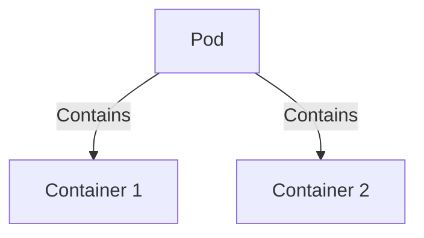
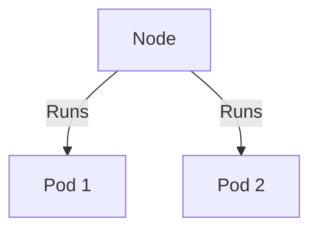
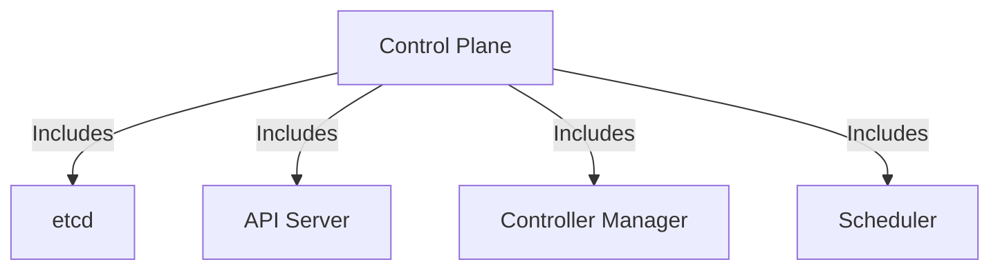
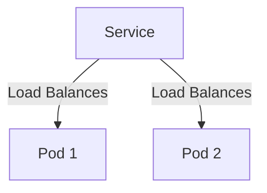
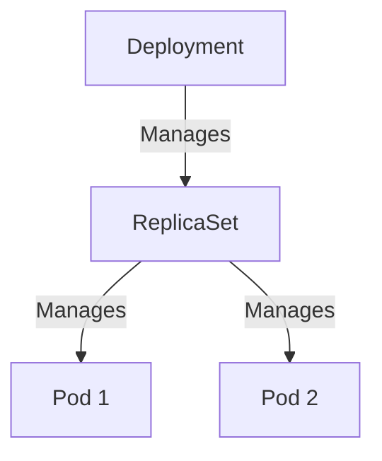

## Introduction to Kubernetes

Kubernetes, often abbreviated as K8s, is an open-source system for automating deployment, scaling, and management of containerized applications. It was originally designed by Google and is now maintained by the Cloud Native Computing Foundation. Kubernetes addresses the challenges of deploying and managing large-scale containerized applications, which can involve hundreds, thousands, or even tens of thousands of containers. This makes it a crucial tool in the modern DevOps landscape.

### What is Kubernetes?

Kubernetes is a container orchestration platform that automates the deployment, scaling, and management of containerized applications. It provides a framework for running distributed systems resiliently. It works with a variety of container tools, including Docker, and can be deployed on-premises, in the cloud, or in hybrid environments.

#### Problems Kubernetes Solves

Before Kubernetes, managing large-scale containerized applications was challenging due to the following issues:

1. **Scalability**: Scaling applications manually across multiple nodes is time-consuming and error-prone.
2. **Resource Management**: Efficiently allocating resources (CPU, memory, etc.) to containers is difficult without a centralized system.
3. **Service Discovery**: Containers need to discover and communicate with other services dynamically.
4. **Rollouts and Rollbacks**: Updating applications without downtime and rolling back changes if necessary is complex.
5. **Self-Healing**: Automatically restarting failed containers and rescheduling them is essential for reliability.

Kubernetes addresses these issues by providing a robust framework for managing containerized applications at scale.

### Kubernetes Architecture Concepts

To understand Kubernetes, it's essential to grasp its core architectural components and how they interact.

#### Core Components

1. **Pods**
2. **Nodes**
3. **Control Plane**
4. **Services**
5. **Deployments**

##### Pods

A pod is the smallest deployable unit in Kubernetes. It consists of one or more containers that share storage and network resources. All containers within a pod are guaranteed to be co-located and co-scheduled on the same node.



##### Nodes

Nodes are the worker machines in a Kubernetes cluster. They can be physical or virtual machines. Each node runs the necessary services to host pods and is managed by the control plane.



##### Control Plane

The control plane is responsible for maintaining the desired state of the cluster. It includes several key components:

- **etcd**: A distributed key-value store used to store the cluster's configuration data.
- **API Server**: Exposes the Kubernetes API.
- **Controller Manager**: Runs controllers that watch the state of the cluster and make changes to move towards the desired state.
- **Scheduler**: Watches for newly created pods that have not yet been assigned to a node and selects a node for them to run on.



##### Services

Services provide a stable network endpoint for a set of pods. They enable load balancing and service discovery between pods.



##### Deployments

Deployments are used to manage the lifecycle of application deployments. They ensure that a specified number of pod replicas are running at any given time.



### Setting Up a Local Kubernetes Cluster

To get started with Kubernetes, you can set up a local cluster using Minikube. Minikube is a tool that makes it easy to run a single-node Kubernetes cluster on your local machine.

#### Installing Minikube

First, you need to install Minikube. You can download it from the official website or use a package manager like Homebrew on macOS.

```bash
# Using Homebrew on macOS
brew install minikube
```

#### Starting Minikube

Once installed, you can start a local Kubernetes cluster using Minikube.

```bash
minikube start
```

This command starts a single-node Kubernetes cluster on your local machine. You can verify that the cluster is running by checking the status of the nodes.

```bash
kubectl get nodes
```

#### Installing kubectl

`kubectl` is the command-line tool for interacting with the Kubernetes API server. You need to install `kubectl` to manage your cluster.

```bash
# Using Homebrew on macOS
brew install kubectl
```

### Working with Kubernetes Components

Now that you have a local Kubernetes cluster set up, you can start creating, updating, and debugging different Kubernetes components.

#### Creating a Pod

To create a pod, you need to define a pod specification in a YAML file. Here is an example of a simple pod definition:

```yaml
apiVersion: v1
kind: Pod
metadata:
  name: my-pod
spec:
  containers:
  - name: my-container
    image: nginx:latest
```

You can apply this configuration using `kubectl`.

```bash
kubectl apply -f pod.yaml
```

#### Updating a Pod

To update a pod, you can modify the YAML file and reapply the configuration.

```yaml
apiVersion: v1
kind: Pod
metadata:
  name: my-pod
spec:
  containers:
  - name: my-container
    image: nginx:1.19
```

Apply the updated configuration.

```bash
kubectl apply -f pod.yaml
```

#### Debugging a Pod

To debug a pod, you can use various `kubectl` commands. For example, you can check the logs of a pod.

```bash
kubectl logs my-pod
```

You can also exec into a running container to inspect it further.

```bash
kubectl exec -it my-pod -- /bin/sh
```

### Hands-On Demos

In this section, we will walk through some hands-on demos to illustrate how to use Kubernetes in real projects.

#### Demo 1: Deploying a Simple Application

Let's deploy a simple web application using Kubernetes.

1. **Create a Deployment**

   Define a deployment in a YAML file.

   ```yaml
   apiVersion: apps/v1
   kind: Deployment
   metadata:
     name: web-deployment
   spec:
     replicas: 3
     selector:
       matchLabels:
         app: web
     template:
       metadata:
         labels:
           app: web
       spec:
         containers:
         - name: web
           image: nginx:latest
           ports:
           - containerPort: 80
   ```

   Apply the deployment.

   ```bash
   kubectl apply -f deployment.yaml
   ```

2. **Expose the Deployment as a Service**

   Create a service to expose the deployment.

   ```yaml
   apiVersion: v1
   kind: Service
   metadata:
     name: web-service
   spec:
     selector:
       app: web
     ports:
     - protocol: TCP
       port: 80
       targetPort: 80
     type: LoadBalancer
   ```

   Apply the service.

   ```bash
   kubectl apply -f service.yaml
   ```

3. **Access the Application**

   Get the external IP address of the service.

   ```bash
   kubectl get svc web-service
   ```

   Access the application using the external IP address.

#### Demo 2: Rolling Updates

Let's demonstrate how to perform rolling updates to a deployment.

1. **Update the Deployment**

   Modify the deployment YAML file to use a new image version.

   ```yaml
   apiVersion: apps/v1
   kind: Deployment
   metadata:
     name: web-deployment
   spec:
     replicas: 3
     selector:
       matchLabels:
         app: web
     strategy:
       type: RollingUpdate
       rollingUpdate:
         maxSurge: 1
         maxUnavailable: 1
     template:
       metadata:
         labels:
           app: web
       spec:
         containers:
         - name: web
           image: nginx:1.19
           ports:
           - containerPort: 80
   ```

   Apply the updated deployment.

   ```bash
   kubectl apply -f deployment.yaml
   ```

2. **Monitor the Rolling Update**

   Watch the rolling update process.

   ```bash
   kubectl rollout status deployment/web-deployment
   ```

### Common Pitfalls and How to Prevent Them

When working with Kubernetes, there are several common pitfalls to be aware of. Here are some of the most common ones and how to prevent them.

#### 1. Resource Overcommitment

**Problem:** Overcommitting resources can lead to performance degradation and instability.

**Prevention:**
- Use resource requests and limits in your pod specifications.
- Monitor resource usage and adjust as needed.

```yaml
apiVersion: v1
kind: Pod
metadata:
  name: my-pod
spec:
  containers:
  - name: my-container
    image: nginx:latest
    resources:
      requests:
        cpu: "200m"
        memory: "128Mi"
      limits:
        cpu: "500m"
        memory: "256Mi"
```

#### 2. Inadequate Logging and Monitoring

**Problem:** Without proper logging and monitoring, it's difficult to diagnose issues and maintain stability.

**Prevention:**
- Use centralized logging solutions like ELK Stack or Fluentd.
- Set up monitoring with Prometheus and Grafana.

```bash
# Example Prometheus configuration
scrape_configs:
  - job_name: 'kubernetes-pods'
    kubernetes_sd_configs:
      - role: pod
```

#### 3. Insecure Configuration

**Problem:** Misconfigured security settings can expose your cluster to vulnerabilities.

**Prevention:**
- Use RBAC (Role-Based Access Control) to restrict access.
- Enable network policies to control traffic between pods.

```yaml
apiVersion: networking.k8s.io/v1
kind: NetworkPolicy
metadata:
  name: deny-all-ingress
spec:
  podSelector: {}
  ingress: []
```

### Real-World Examples and CVEs

Kubernetes has faced several security vulnerabilities over the years. Here are some notable examples and how they were addressed.

#### CVE-2020-8558: Container Escape via `hostPath` Volumes

**Description:** A vulnerability in Kubernetes allowed attackers to escape from a container and gain elevated privileges on the host node.

**Impact:** Attackers could potentially execute arbitrary code on the host node.

**Mitigation:**
- Ensure that `hostPath` volumes are used judiciously and only with trusted sources.
- Use PodSecurityPolicies to enforce strict volume mounting rules.

```yaml
apiVersion: policy/v1beta1
kind: PodSecurityPolicy
metadata:
  name: restricted
spec:
  volumes:
  - configMap
  - secret
  - emptyDir
  - persistentVolumeClaim
  - downwardAPI
  - projected
  - ephemeral
  readOnlyRootFilesystem: true
```

#### CVE-2021-25741: Privilege Escalation via `kubelet` API

**Description:** A vulnerability in the `kubelet` API allowed attackers to escalate their privileges and execute arbitrary code.

**Impact:** Attackers could potentially take control of the entire cluster.

**Mitigation:**
- Restrict access to the `kubelet` API using network policies.
- Enable authentication and authorization mechanisms like TLS certificates and RBAC.

```yaml
apiVersion: v1
kind: Pod
metadata:
  name: my-pod
spec:
  containers:
  - name: my-container
    image: nginx:latest
    securityContext:
      privileged: false
```

### Conclusion

Kubernetes is a powerful tool for managing containerized applications at scale. By understanding its core concepts and architecture, you can effectively deploy, scale, and manage complex applications. With proper configuration and security measures, you can ensure the stability and security of your Kubernetes clusters.

### Further Reading and Practice Labs

For hands-on practice, consider the following resources:

- **Kubernetes Goat**: A hands-on lab for learning Kubernetes security.
- **OWASP WrongSecrets**: A series of challenges for learning Kubernetes and container security.
- **Minikube Documentation**: Official documentation for setting up and using Minikube.

By combining theoretical knowledge with practical experience, you can become proficient in using Kubernetes for your DevOps projects.

---
<!-- nav -->
[[01-Introduction to Kubernetes Fundamentals and Practical Applications|Introduction to Kubernetes Fundamentals and Practical Applications]] | [[DevOps/DevOps Bootcamp/09-Container Orchestration (Kubernetes)/06-Kubernetes Fundamentals And Practical Applications/00-Overview|Overview]] | [[DevOps/DevOps Bootcamp/09-Container Orchestration (Kubernetes)/06-Kubernetes Fundamentals And Practical Applications/03-Practice Questions & Answers|Practice Questions & Answers]]
