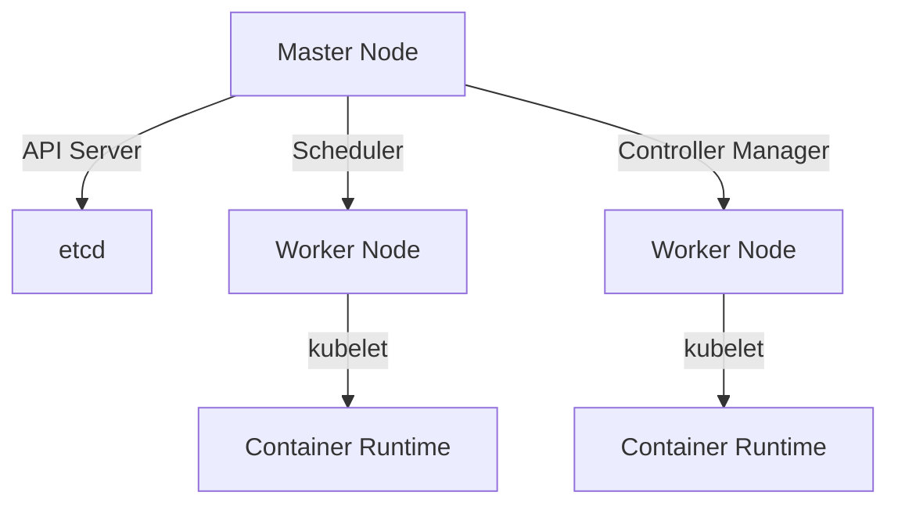

## Introduction to MiniCube and Cube CTL

In this section, we will delve into the concepts of MiniCube and Cube CTL, which are essential tools for testing and developing applications locally within a Kubernetes environment. We'll start by explaining what Kubernetes is, why it's important, and then move on to the specifics of MiniCube and Cube CTL.

### What is Kubernetes?

Kubernetes (often abbreviated as K8s) is an open-source system for automating deployment, scaling, and management of containerized applications. It was originally designed by Google and is now maintained by the Cloud Native Computing Foundation. Kubernetes provides a platform for automating the deployment and management of containerized applications, making it easier to scale and manage complex systems.

#### Kubernetes Architecture

A typical Kubernetes cluster consists of:

- **Master Nodes**: These are the control plane nodes that manage the cluster. They include the API server, etcd (the key-value store), scheduler, controller manager, and cloud controller manager.
- **Worker Nodes**: These are the nodes where the actual workloads (containers) run. They include the kubelet (the agent that runs on each node), kube-proxy (network proxy), and container runtime (like Docker).



### Why Use MiniCube?

MiniCube is an open-source tool that simplifies the process of setting up a local Kubernetes cluster. In a production environment, setting up a Kubernetes cluster can be quite complex and resource-intensive. You typically need multiple master nodes and worker nodes, each with its own responsibilities. This setup requires significant computational resources, including memory and CPU power.

However, when you're working on a local development environment, you often don't have the luxury of these resources. Additionally, setting up a full-fledged Kubernetes cluster on your local machine can be time-consuming and challenging. This is where MiniCube comes in.

#### Key Features of MiniCube

- **Single Node Cluster**: MiniCube sets up a single-node Kubernetes cluster where both the master processes and the worker processes run on the same node.
- **Docker Container Runtime**: The node comes with a Docker container runtime pre-installed, allowing you to run containers or pods with containers on this node.
- **Virtualization**: MiniCube runs on your laptop through a virtualization tool like VirtualBox or another hypervisor.

### Setting Up MiniCube

To set up MiniCube, you'll need to follow a series of steps. Let's go through the process in detail.

#### Prerequisites

Before you begin, ensure you have the following installed on your machine:

- **VirtualBox**: A virtualization tool that allows you to run virtual machines on your local machine.
- **Docker**: A container runtime that allows you to run containers.
- **kubectl**: The command-line tool for interacting with a Kubernetes cluster.

#### Installation Steps

1. **Install VirtualBox**:
   Download and install VirtualBox from the official website: https://www.virtualbox.org/wiki/Downloads

2. **Install Docker**:
   Install Docker according to the instructions provided on the official Docker website: https://docs.docker.com/get-docker/

3. **Install kubectl**:
   Follow the official Kubernetes documentation to install `kubectl`: https://kubernetes.io/docs/tasks/tools/install-kubectl/

4. **Download MiniCube**:
   Download the MiniCube binary from the official repository: https://github.com/kubevirt/minikube/releases

5. **Start MiniCube**:
   Run the following command to start MiniCube:

   ```bash
   minikube start --vm-driver=virtualbox
   ```

   This command starts MiniCube using VirtualBox as the virtualization driver.

6. **Verify Installation**:
   Once MiniCube is started, you can verify the installation by checking the status of the cluster:

   ```bash
   minikube status
   ```

   This command should return the status of the MiniCube cluster, indicating that it is running.

### Using Cube CTL

Cube CTL is a command-line tool that allows you to interact with your MiniCube cluster. It provides a set of commands to manage your cluster, deploy applications, and perform various administrative tasks.

#### Key Commands

- **`minikube start`**: Starts the MiniCube cluster.
- **`minikube stop`**: Stops the MiniCube cluster.
- **`minikube delete`**: Deletes the MiniCube cluster.
- **`kubectl get pods`**: Lists all the pods running in the cluster.
- **`kubectl apply -f <filename>`**: Applies the configuration specified in the file to the cluster.

#### Example: Deploying an Application

Let's walk through an example of deploying an application using MiniCube and Cube CTL.

1. **Create a Deployment File**:
   Create a file named `deployment.yaml` with the following content:

   ```yaml
   apiVersion: apps/v1
   kind: Deployment
   metadata:
     name: my-app
   spec:
     replicas: 3
     selector:
       matchLabels:
         app: my-app
     template:
       metadata:
         labels:
           app: my-app
       spec:
         containers:
         - name: my-app
           image: nginx:latest
           ports:
           - containerPort: 80
   ```

2. **Apply the Deployment**:
   Apply the deployment to the MiniCube cluster using the following command:

   ```bash
   kubectl apply -f deployment.yaml
   ```

3. **Verify the Deployment**:
   Check the status of the deployment using the following command:

   ```bash
   kubectl get pods
   ```

   This command should list the pods running in the cluster, confirming that the deployment was successful.

### Pitfalls and Best Practices

While MiniCube and Cube CTL make it easy to set up and manage a local Kubernetes cluster, there are several pitfalls to be aware of:

- **Resource Constraints**: Ensure that your local machine has sufficient resources (memory and CPU) to run a MiniCube cluster.
- **Network Configuration**: Make sure that your network settings are configured correctly to allow communication between the host machine and the virtual machine.
- **Security Considerations**: While MiniCube is primarily used for development purposes, it's important to ensure that sensitive data is not stored in the cluster.

#### How to Prevent / Defend

- **Resource Management**: Monitor the resource usage of your MiniCube cluster and adjust the settings as needed.
- **Network Isolation**: Use network isolation techniques to prevent unauthorized access to the cluster.
- **Secure Configuration**: Follow best practices for securing your Kubernetes cluster, such as using RBAC (Role-Based Access Control) and enabling encryption for sensitive data.

### Real-World Examples

#### Recent CVEs and Breaches

One notable example of a Kubernetes-related vulnerability is CVE-2021-25741, which affected the Kubernetes API server. This vulnerability allowed attackers to bypass authentication and gain unauthorized access to the cluster. To mitigate such vulnerabilities, it's crucial to keep your Kubernetes components up-to-date and to implement robust security measures.

#### Secure Coding Fixes

Here's an example of a vulnerable configuration and its secure counterpart:

**Vulnerable Configuration**:

```yaml
apiVersion: v1
kind: Pod
metadata:
  name: vulnerable-pod
spec:
  containers:
  - name: vulnerable-container
    image: nginx:latest
    ports:
    - containerPort: 80
```

**Secure Configuration**:

```yaml
apiVersion: v1
kind: Pod
metadata:
  name: secure-pod
spec:
  containers:
  - name: secure-container
    image: nginx:latest
    ports:
    - containerPort: 80
    securityContext:
      readOnlyRootFilesystem: true
      runAsNonRoot: true
```

In the secure configuration, we've added a `securityContext` to ensure that the root filesystem is read-only and that the container runs as a non-root user.

### Hands-On Labs

For hands-on practice with MiniCube and Cube CTL, consider the following labs:

- **PortSwigger Web Security Academy**: Offers a variety of labs focused on web application security, including Kubernetes-related challenges.
- **OWASP Juice Shop**: A deliberately insecure web application that can be used to practice security testing and penetration testing techniques.
- **DVWA (Damn Vulnerable Web Application)**: Another popular web application for practicing security testing.

These labs provide a practical way to apply the concepts learned in this chapter and to gain hands-on experience with MiniCube and Cube CTL.

### Conclusion

In this chapter, we've covered the basics of MiniCube and Cube CTL, including what they are, why they are useful, and how to set them up. We've also explored some real-world examples and best practices for using these tools effectively. By following the steps outlined in this chapter, you should be able to set up and manage a local Kubernetes cluster using MiniCube and Cube CTL, and to deploy and manage applications within that cluster.

---
<!-- nav -->
[[DevOps/DevOps Bootcamp/09-Container Orchestration (Kubernetes)/08-MiniCube and Cube CTL Setup Guide/00-Overview|Overview]] | [[02-Introduction to MiniCube and CubeCTL|Introduction to MiniCube and CubeCTL]]
