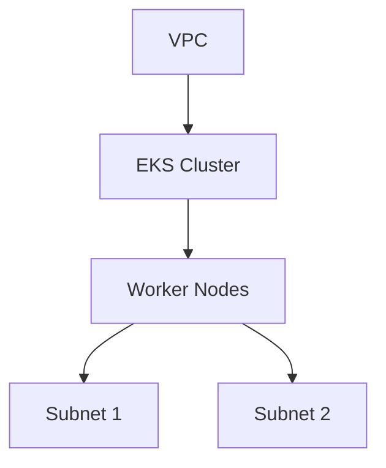

## Introduction to EKS Cluster Creation Using Terraform Module

In this section, we will delve into the process of creating an Amazon Elastic Kubernetes Service (EKS) cluster using Terraform modules. This approach leverages the power of Infrastructure as Code (IaC) to manage and automate the deployment of Kubernetes clusters on AWS. By the end of this chapter, you will have a comprehensive understanding of how to set up an EKS cluster using Terraform, including the necessary background theory, practical steps, and security considerations.

### Background Theory

Before diving into the practical aspects, let's understand the key concepts involved:

#### Amazon Elastic Kubernetes Service (EKS)

Amazon EKS is a managed service that makes it easy to run Kubernetes on AWS without needing expertise in Kubernetes cluster setup and management. EKS handles the availability and scalability of the Kubernetes control plane, allowing you to focus on deploying and managing applications.

#### Terraform

Terraform is an open-source infrastructure as code (IaC) tool that allows you to define and provision infrastructure using declarative configuration files. It supports a wide range of cloud providers, including AWS, and provides a consistent workflow to manage your infrastructure.

#### Terraform Modules

Terraform modules are reusable packages of Terraform configurations. They encapsulate complex logic and provide a simpler interface for users to interact with. By using modules, you can abstract away the details of resource creation and focus on higher-level abstractions.

### Prerequisites

To follow along with this chapter, you should have:

1. **AWS Account**: An active AWS account with appropriate permissions to create EKS clusters and other resources.
2. **Terraform Installed**: Ensure Terraform is installed on your local machine. You can download it from the official Terraform website.
3. **VPC Configuration**: A pre-configured Virtual Private Cloud (VPC) on AWS. This VPC will be used to host the EKS cluster.

### Step-by-Step Guide to Creating an EKS Cluster Using Terraform Module

#### Step 1: Create a New Terraform File

First, create a new Terraform file named `eks_cluster.tf`. This file will contain the configuration for creating the EKS cluster.

```bash
touch eks_cluster.tf
```

#### Step 2: Define the EKS Module Source

The EKS module is available in the Terraform Registry. We will use this module to create the EKS cluster. Add the following lines to your `eks_cluster.tf` file:

```hcl
module "eks_cluster" {
  source = "terraform-aws-modules/eks/aws"
  version = "~> 18.0"

  cluster_name = "my-eks-cluster"
  vpc_id       = "vpc-xxxxxxxx"
  subnet_ids   = ["subnet-xxxxxxxx", "subnet-yyyyyyyy"]
}
```

Here, we specify the source of the module and the version. The `cluster_name` is the name of the EKS cluster, and `vpc_id` and `subnet_ids` are the identifiers for the VPC and subnets where the cluster will be deployed.

#### Step 3: Initialize Terraform

Run the following command to initialize Terraform and download the module:

```bash
terraform init
```

This command downloads the specified module and any other dependencies required for the configuration.

#### Step 4: Plan the Deployment

Before applying the changes, it's a good practice to plan the deployment to see what changes will be made. Run the following command:

```bash
terraform plan
```

This command generates a plan that shows the resources that will be created or modified.

#### Step 5: Apply the Changes

Once you are satisfied with the plan, apply the changes to create the EKS cluster:

```bash
terraform apply
```

Follow the prompts to confirm the changes. Once applied, the EKS cluster will be created in your AWS account.

### Detailed Explanation of the EKS Module

The EKS module provided by the Terraform Registry simplifies the process of creating an EKS cluster. Let's break down the key components and parameters:

#### Key Parameters

1. **`cluster_name`**: The name of the EKS cluster. This is a required parameter.
2. **`vpc_id`**: The ID of the VPC where the cluster will be deployed. This is a required parameter.
3. **`subnet_ids`**: A list of subnet IDs where the worker nodes will be deployed. This is a required parameter.
4. **`version`**: The version of the EKS module to use. Specifying a version ensures consistency and helps with debugging.

#### Additional Parameters

The EKS module supports many additional parameters, such as:

- **`node_groups`**: Configuration for node groups.
- **`tags`**: Tags to be applied to the resources.
- **`region`**: The AWS region where the cluster will be deployed.

### Example Configuration

Let's expand the example configuration to include additional parameters:

```hcl
module "eks_cluster" {
  source = "terraform-aws-modules/eks/aws"
  version = "~> 18.0"

  cluster_name = "my-eks-cluster"
  vpc_id       = "vpc-xxxxxxxx"
  subnet_ids   = ["subnet-xxxxxxxx", "subnet-yyyyyyyy"]

  node_groups = [
    {
      name            = "ng-1"
      instance_types  = ["t3.medium"]
      desired_capacity = 2
      min_size        = 1
      max_size        = 3
    }
  ]

  tags = {
    Environment = "Production"
    Owner       = "DevOps Team"
  }

  region = "us-west-2"
}
```

### Mermaid Diagrams

To visualize the architecture, we can use a mermaid diagram:



### Common Pitfalls and How to Avoid Them

#### Incorrect VPC/Subnet Configuration

Ensure that the VPC and subnets are correctly configured and that the subnets are in different availability zones to ensure high availability.

**Secure Coding Fix:**

```hcl
# Vulnerable code
subnet_ids = ["subnet-xxxxxxxx"]

# Secure code
subnet_ids = ["subnet-xxxxxxxx", "subnet-yyyyyyyy"]
```

#### Missing Required Parameters

Ensure that all required parameters are provided. Missing parameters can lead to errors during the deployment.

**Secure Coding Fix:**

```hcl
# Vulnerable code
module "eks_cluster" {
  source = "terraform-aws-modules/eks/aws"
  version = "~> 18.0"
}

# Secure code
module "eks_cluster" {
  source = "terraform-aws-modules/eks/aws"
  version = "~> 18.0"
  cluster_name = "my-eks-cluster"
  vpc_id       = "vpc-xxxxxxxx"
  subnet_ids   = ["subnet-xxxxxxxx", "subnet-yyyyyyyy"]
}
```

### Detection and Prevention

#### Detection

Regularly review the Terraform state and logs to ensure that the EKS cluster is configured as intended. Use tools like AWS CloudTrail to monitor API calls related to EKS.

#### Prevention

1. **Version Control**: Use version control systems like Git to manage your Terraform configurations.
2. **Automated Testing**: Implement automated testing to validate your configurations.
3. **Security Best Practices**: Follow AWS security best practices for EKS, such as enabling encryption at rest and in transit.

### Real-World Examples

#### Recent CVEs/Breaches

- **CVE-2021-25741**: A vulnerability in the AWS EKS console allowed unauthorized access to sensitive information. Ensure that your EKS cluster is updated to the latest version and that you follow best practices for securing your environment.

### Hands-On Labs

For hands-on practice, consider the following labs:

- **PortSwigger Web Security Academy**: Offers a variety of labs focused on web application security.
- **OWASP Juice Shop**: A deliberately insecure web application for practicing web security skills.
- **CloudGoat**: A series of labs designed to help you learn about cloud security on AWS.

### Conclusion

Creating an EKS cluster using Terraform modules is a powerful way to automate and manage your Kubernetes infrastructure on AWS. By following the steps outlined in this chapter, you can successfully deploy an EKS cluster and ensure its security and reliability.

---
<!-- nav -->
[[DevOps/DevOps Bootcamp/09-Container Orchestration (Kubernetes)/10-Creating EKS Cluster Using Terraform Module/00-Overview|Overview]] | [[02-Introduction to EKS Cluster Creation Using Terraform Modules|Introduction to EKS Cluster Creation Using Terraform Modules]]
