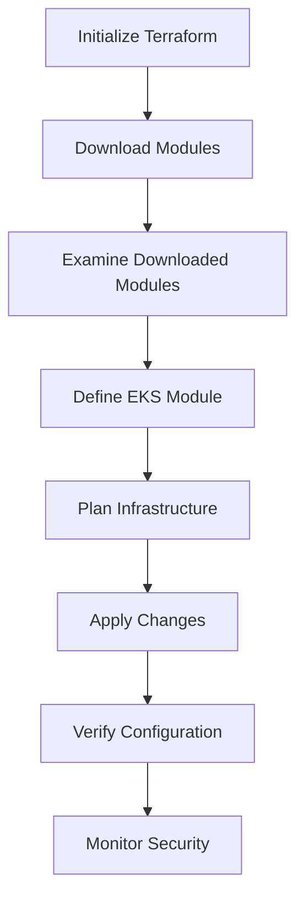

## Introduction to EKS Cluster Creation Using Terraform Modules

In this section, we delve into the process of creating an Amazon Elastic Kubernetes Service (EKS) cluster using Terraform modules. This approach leverages pre-built modules to simplify the creation and management of complex infrastructure. Understanding how these modules work and interact with the underlying AWS services is crucial for effective DevOps practices.

### Background Theory

#### What is Terraform?

Terraform is an infrastructure as code (IaC) tool developed by HashiCorp. It allows you to define and provision your infrastructure using declarative configuration files written in the HashiCorp Configuration Language (HCL). Terraform supports a wide range of cloud providers, including AWS, Azure, Google Cloud, and many others.

#### What is an EKS Cluster?

Amazon Elastic Kubernetes Service (EKS) is a managed service that makes it easy to run Kubernetes on AWS without needing to stand up or maintain your own Kubernetes control plane. EKS supports the Kubernetes API, so you can use existing tools to interact with the service.

### Why Use Terraform Modules for EKS Clusters?

Using Terraform modules for EKS clusters offers several advantages:

1. **Modularity**: Modules encapsulate reusable components, making it easier to manage and scale your infrastructure.
2. **Consistency**: Pre-built modules ensure consistent configurations across different environments.
3. **Ease of Use**: Modules abstract away the complexity of setting up Kubernetes clusters, allowing you to focus on higher-level tasks.

### Setting Up the Environment

Before diving into the specifics of creating an EKS cluster using Terraform modules, let's set up our environment.

#### Prerequisites

1. **AWS Account**: Ensure you have an active AWS account with appropriate permissions.
2. **Terraform Installation**: Install Terraform on your local machine. You can download it from the official HashiCorp website.
3. **AWS CLI**: Install and configure the AWS Command Line Interface (CLI) to interact with your AWS account.

#### Initializing Terraform

To start, you need to initialize Terraform. This process downloads the necessary providers and modules required for your project.

```sh
terraform init
```

This command performs the following actions:

1. **Downloads Providers**: Terraform downloads the specified providers (in this case, the AWS provider).
2. **Downloads Modules**: Terraform downloads the specified modules (such as the EKS module).

### Exploring the EKS Module

The EKS module is a pre-built Terraform module that simplifies the creation of an EKS cluster. Let's explore how this module works and interacts with the underlying AWS services.

#### Dependencies of the EKS Module

When you initialize Terraform, it downloads the EKS module and its dependencies. These dependencies include other modules such as VPC and other supporting modules.

```sh
terraform init
```

This command will download the following:

- **EKS Module**: Contains the logic to create an EKS cluster.
- **VPC Module**: Contains the logic to create a Virtual Private Cloud (VPC).
- **Provider Plugins**: Downloads the necessary provider plugins (e.g., AWS provider).

### Examining the Downloaded Modules

After initializing Terraform, you can examine the downloaded modules. The `.terraform` directory contains the downloaded modules and provider plugins.

```sh
ls .terraform/modules
```

This command lists the downloaded modules, including the EKS module.

#### Code Structure of the EKS Module

The EKS module contains various files that define the resources and configurations required to create an EKS cluster. One of the key files is `aws_auth.tf`, which defines the Kubernetes authentication configuration.

```sh
cat .terraform/modules/eks/aws_auth.tf
```

This file contains the configuration for Kubernetes authentication using the AWS provider. The resources are defined using the format `provider_name_resource_type`.

### Detailed Example: Creating an EKS Cluster

Let's walk through a detailed example of creating an EKS cluster using Terraform modules.

#### Step 1: Define the EKS Module

Create a `main.tf` file to define the EKS module.

```hcl
provider "aws" {
  region = "us-west-2"
}

module "eks_cluster" {
  source = "terraform-aws-modules/eks/aws"

  cluster_name = "my-eks-cluster"
  version      = "1.21"
  subnets      = ["subnet-1", "subnet-2"]
  vpc_id       = "vpc-12345678"
}
```

#### Step 2: Initialize Terraform

Run the `terraform init` command to download the necessary modules and providers.

```sh
terraform init
```

#### Step 3: Plan the Infrastructure

Run the `terraform plan` command to preview the changes that will be applied.

```sh
terraform plan
```

#### Step 4: Apply the Changes

Run the `terraform apply` command to create the EKS cluster.

```sh
terraform apply
```

### Common Pitfalls and How to Avoid Them

#### Pitfall 1: Incorrect Subnet Configuration

Ensure that the subnets specified in the EKS module exist and are correctly configured. Incorrect subnet configuration can lead to issues with node creation and connectivity.

**How to Prevent / Defend:**

- Verify the existence and configuration of the subnets before applying the Terraform configuration.
- Use the AWS CLI to list and inspect the subnets.

```sh
aws ec2 describe-subnets --subnet-ids subnet-1 subnet-2
```

#### Pitfall 2: Insufficient IAM Permissions

Ensure that the IAM role used by the EKS cluster has sufficient permissions to create and manage the required resources.

**How to Prevent / Defend:**

- Review the IAM policies attached to the role.
- Use the AWS Management Console to inspect the IAM role and its policies.

```sh
aws iam get-role --role-name eks-cluster-role
```

### Real-World Examples and Recent CVEs

#### Example: CVE-2021-44228 (Log4Shell)

While not directly related to EKS, the Log4Shell vulnerability highlights the importance of securing your infrastructure. Ensure that all components of your EKS cluster are up-to-date and patched against known vulnerabilities.

**How to Prevent / Defend:**

- Regularly update the Kubernetes version and associated components.
- Use the AWS Security Hub to monitor and remediate security findings.

```sh
aws eks update-cluster-version --name my-eks-cluster --version 1.21
```

### Conclusion

Creating an EKS cluster using Terraform modules simplifies the process and ensures consistency across different environments. By understanding the underlying mechanisms and potential pitfalls, you can effectively manage your Kubernetes infrastructure on AWS.

### Practice Labs

For hands-on practice, consider the following labs:

- **PortSwigger Web Security Academy**: Focuses on web application security but can provide valuable context for securing your EKS cluster.
- **OWASP Juice Shop**: A deliberately insecure web application for practicing web security skills.
- **CloudGoat**: A series of labs designed to help you learn about AWS security best practices.

These labs provide practical experience in managing and securing your EKS cluster using Terraform modules.



This diagram illustrates the steps involved in creating an EKS cluster using Terraform modules, highlighting the initialization, downloading, defining, planning, applying, verifying, and monitoring phases.

---
<!-- nav -->
[[01-Introduction to EKS Cluster Creation Using Terraform Module|Introduction to EKS Cluster Creation Using Terraform Module]] | [[DevOps/DevOps Bootcamp/09-Container Orchestration (Kubernetes)/10-Creating EKS Cluster Using Terraform Module/00-Overview|Overview]] | [[03-Introduction to EKS Cluster Creation Using Terraform|Introduction to EKS Cluster Creation Using Terraform]]
