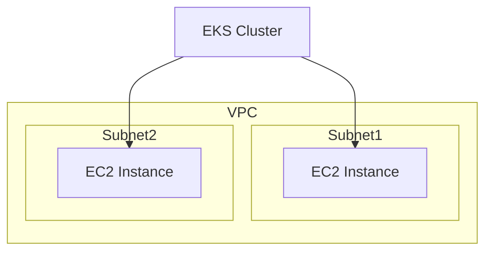
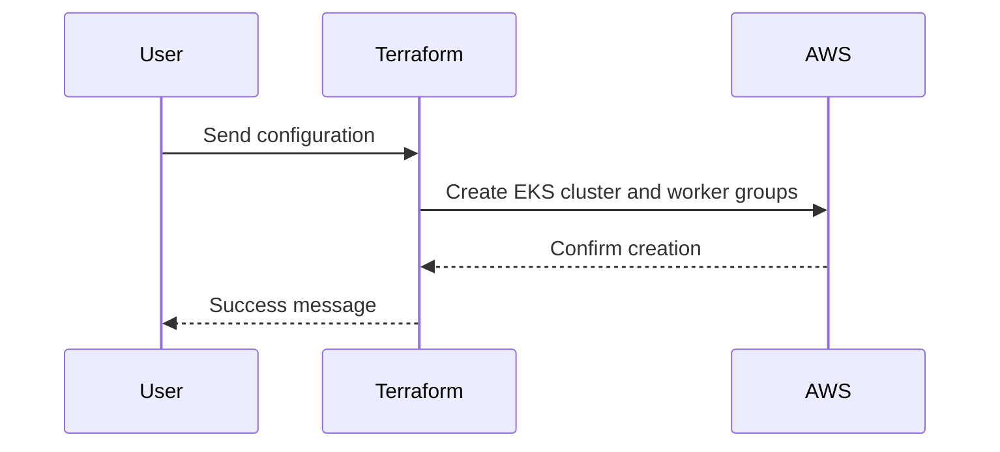

## Introduction to EKS Cluster Creation Using Terraform

In this section, we will delve into the process of creating an Amazon Elastic Kubernetes Service (EKS) cluster using Terraform modules. This approach allows us to manage our infrastructure as code, ensuring consistency and reproducibility across environments. We will cover the essential components required to set up an EKS cluster, including the Kubernetes version, subnets, VPC ID, and worker nodes. Additionally, we will explore various methods for managing worker nodes, such as self-managed EC2 instances, semi-managed EC2 instances via node groups, and Fargate profiles.

### Understanding Terraform Modules

Terraform modules are reusable configurations that encapsulate complex infrastructure setups. They provide a way to abstract away the details of resource creation, making it easier to manage and maintain your infrastructure. When working with Terraform modules, it is crucial to understand the attributes and outputs provided by the module.

#### Checking Module Outputs

To ensure you have the correct configuration, you can check the output part of the module. This section lists the attributes exposed by the module and how they are called. For instance, if you are using the `terraform-aws-modules/eks/aws` module, you can inspect the `outputs.tf` file to see the available attributes.

```terraform
module "eks_cluster" {
  source = "terraform-aws-modules/eks/aws"

  cluster_name = "my-cluster"
  cluster_version = "1.21"
  vpc_id = "vpc-12345678"
  subnet_ids = ["subnet-12345678", "subnet-23456789"]
}
```

### Basic Configuration Requirements

The minimum configuration required to create an EKS cluster includes:

1. **Kubernetes Version**: Specifies the version of Kubernetes to be used in the cluster.
2. **Subnets**: Defines the subnets where the worker nodes will reside.
3. **VPC ID**: Identifies the Virtual Private Cloud (VPC) where the cluster will be deployed.

These parameters are essential for setting up the basic structure of the EKS cluster.

### Worker Nodes Configuration

Worker nodes are the compute resources that run the Kubernetes pods. Configuring worker nodes is a critical step in setting up an EKS cluster. There are several methods to manage worker nodes:

1. **Self-managed EC2 Instances**: You can manually create and manage EC2 instances as worker nodes.
2. **Semi-managed EC2 Instances via Node Groups**: Node groups allow you to manage a group of EC2 instances as worker nodes.
3. **Fargate Profiles**: Fargate profiles enable you to run pods without managing EC2 instances.

#### Self-managed EC2 Instances

For simplicity, we will focus on configuring self-managed EC2 instances as worker nodes. This method provides more control over the worker nodes but requires manual management.

### Defining Worker Groups

Worker groups are a collection of worker nodes that share similar characteristics. In Terraform, you can define worker groups using the `worker_groups` attribute, which takes an array of worker node configuration objects.

#### Example Configuration

Here is an example of how to define worker groups in Terraform:

```terraform
module "eks_cluster" {
  source = "terraform-aws-modules/eks/aws"

  cluster_name = "my-cluster"
  cluster_version = "1.21"
  vpc_id = "vpc-12345678"
  subnet_ids = ["subnet-12345678", "subnet-23456789"]

  worker_groups = [
    {
      name = "worker-group-1"
      instance_type = "t3.medium"
      desired_capacity = 2
      min_size = 1
      max_size = 3
    },
    {
      name = "worker-group-2"
      instance_type = "t3.large"
      desired_capacity = 3
      min_size = 2
      max_size = 4
    }
  ]
}
```

### Detailed Explanation of Worker Group Attributes

Each worker group configuration object contains several key attributes:

1. **name**: A unique identifier for the worker group.
2. **instance_type**: The type of EC2 instance to be used.
3. **desired_capacity**: The number of instances to maintain in the worker group.
4. **min_size**: The minimum number of instances in the worker group.
5. **max_size**: The maximum number of instances in the worker group.

### Full HTTP Request and Response Example

When deploying the Terraform configuration, you can expect the following HTTP request and response:

#### HTTP Request

```http
POST /api/v1/apply HTTP/1.1
Host: terraform.example.com
Content-Type: application/json
Authorization: Bearer <your-token>

{
  "configuration": {
    "cluster_name": "my-cluster",
    "cluster_version": "1.21",
    "vpc_id": "vpc-12345678",
    "subnet_ids": ["subnet-12345678", "subnet-23456789"],
    "worker_groups": [
      {
        "name": "worker-group-1",
        "instance_type": "t3.medium",
        "desired_capacity": 2,
        "min_size": 1,
        "max_size": 3
      },
      {
        "name": "worker-group-2",
        "instance_type": "t3.large",
        "desired_capacity": 3,
        "min_size": 2,
        "max_size": 4
      }
    ]
  }
}
```

#### HTTP Response

```http
HTTP/1.1 200 OK
Content-Type: application/json

{
  "status": "success",
  "message": "Cluster and worker groups successfully created.",
  "cluster_id": "eks-cluster-id-12345678",
  "worker_group_ids": ["wg-12345678", "wg-23456789"]
}
```

### Mermaid Diagrams

#### Network Topology



#### Request/Response Flow



### Common Pitfalls and How to Avoid Them

#### Incorrect Subnet Configuration

One common pitfall is incorrectly configuring subnets. Ensure that the subnets specified in the Terraform configuration exist and are correctly associated with the VPC.

**Secure Coding Fix**

```terraform
# Correct configuration
subnet_ids = ["subnet-12345678", "subnet-23456789"]

# Incorrect configuration
subnet_ids = ["subnet-98765432", "subnet-87654321"] # Non-existent subnets
```

#### Insufficient Worker Node Capacity

Another issue is setting insufficient capacity for worker nodes, leading to performance issues.

**Secure Coding Fix**

```terraform
# Correct configuration
desired_capacity = 2
min_size = 1
max_size = 3

# Incorrect configuration
desired_capacity = 1
min_size = 1
max_size = 1 # Insufficient capacity
```

### Real-World Examples and Recent Breaches

#### Example: CVE-2021-25741

CVE-2021-25741 is a vulnerability in Kubernetes that allows an attacker to escalate privileges and gain unauthorized access to the cluster. This vulnerability highlights the importance of keeping your Kubernetes version up-to-date and securing your worker nodes.

**Detection and Prevention**

- **Detection**: Regularly scan your cluster for vulnerabilities using tools like Trivy or Aqua Security.
- **Prevention**: Ensure your Kubernetes version is up-to-date and apply security patches promptly.

### Hands-on Labs

For practical experience, consider the following labs:

- **PortSwigger Web Security Academy**: Focuses on web application security but can be adapted for understanding Kubernetes security.
- **OWASP Juice Shop**: A deliberately insecure web application for practicing security testing.
- **DVWA (Damn Vulnerable Web Application)**: Another web application for security testing.

### Conclusion

Creating an EKS cluster using Terraform modules is a powerful way to manage your Kubernetes infrastructure. By understanding the essential components and configurations, you can set up a robust and scalable cluster. Remember to follow best practices for security and regularly update your configurations to mitigate potential vulnerabilities.

---
<!-- nav -->
[[02-Introduction to EKS Cluster Creation Using Terraform Modules|Introduction to EKS Cluster Creation Using Terraform Modules]] | [[DevOps/DevOps Bootcamp/09-Container Orchestration (Kubernetes)/10-Creating EKS Cluster Using Terraform Module/00-Overview|Overview]] | [[04-Introduction to EKS Clusters and Terraform Modules|Introduction to EKS Clusters and Terraform Modules]]
