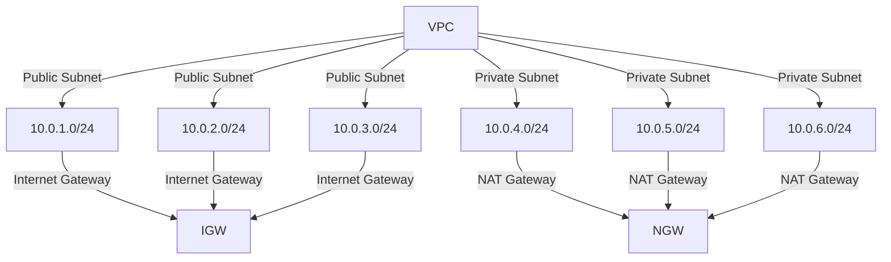

## Introduction to EKS Clusters and Terraform Modules

In this section, we will delve into the creation of an Amazon Elastic Kubernetes Service (EKS) cluster using Terraform modules. This process involves several key components and configurations, including setting up the cluster name, specifying the Kubernetes version, and defining the subnets where the worker nodes will reside. Each of these steps is crucial for ensuring a robust and secure deployment.

### Cluster Name and Kubernetes Version

The first step in creating an EKS cluster is to define the cluster name. This name is essential as it uniquely identifies your cluster within the AWS environment. In our example, the cluster name is `my_app_eks_cluster`. This name should be descriptive and unique to avoid conflicts with other clusters.

```terraform
resource "aws_eks_cluster" "example" {
  name     = "my_app_eks_cluster"
  role_arn = aws_iam_role.example.arn
}
```

Next, we need to specify the Kubernetes version. Kubernetes is an open-source system for automating deployment, scaling, and management of containerized applications. The version chosen can significantly impact the features and stability of your cluster. In our example, we set the Kubernetes version to `1.17`.

```terraform
resource "aws_eks_cluster" "example" {
  name     = "my_app_eks_cluster"
  version  = "1.17"
  role_arn = aws_iam_role.example.arn
}
```

### Subnet Configuration

Subnets are a fundamental part of the VPC (Virtual Private Cloud) architecture in AWS. They allow you to segment your network into smaller, isolated segments. In our setup, we have created a VPC with six subnets: three private subnets and three public subnets, distributed across different Availability Zones (AZs).

#### Public vs. Private Subnets

Public subnets are used for resources that require direct access to the internet, such as load balancers. These subnets typically have a route to an Internet Gateway (IGW). On the other hand, private subnets are used for internal resources that do not require direct internet access. These subnets often have a route to a NAT Gateway (NGW) to allow outbound traffic but prevent inbound traffic from the internet.

```terraform
resource "aws_subnet" "public" {
  count         = 3
  cidr_block    = ["10.0.${count.index + 1}.0/24"]
  vpc_id        = aws_vpc.main.id
  availability_zone = ["us-west-2a", "us-west-2b", "us-west-2c"][count.index]
  map_public_ip_on_launch = true
}

resource "aws_subnet" "private" {
  count         = 3
  cidr_block    = ["10.0.${count.index + 4}.0/24"]
  vpc_id        = aws_vpc.main.id
  availability_zone = ["us-west-2a", "us-west-2b", "us-west-2c"][count.index]
  map_public_ip_on_launch = false
}
```

#### Assigning Subnets to EKS Cluster

For the EKS cluster, we want to ensure that the worker nodes are placed in the private subnets for security reasons. This prevents the worker nodes from being directly exposed to the internet, reducing the attack surface.

```terraform
resource "aws_eks_node_group" "example" {
  cluster_name    = aws_eks_cluster.example.name
  node_group_name = "example-node-group"
  subnet_ids      = [aws_subnet.private.*.id]
  instance_types  = ["t3.medium"]
  ami_type        = "AL2_x86_64"
  disk_size       = 20
  min_size        = 2
  max_size        = 2
  desired_size    = 2
}
```

### Referencing Module Outputs

To reference the private subnets, we need to use the outputs from the VPC module. This ensures that the subnets are correctly identified and utilized by the EKS cluster.

```terraform
module "vpc" {
  source = "terraform-aws-modules/vpc/aws"

  name = "my-vpc"
  cidr = "10.0.0.0/16"

  azs             = ["us-west-2a", "us-west-2b", "us-west-2c"]
  public_subnets  = ["10.0.1.0/24", "10.0.2.0/24", "10.0.3.0/24"]
  private_subnets = ["10.0.4.0/24", "10.0.5.0/24", "10.0.6.0/24"]

  enable_nat_gateway = true
  enable_vpn_gateway = false
}

output "private_subnet_ids" {
  value = module.vpc.private_subnets
}
```

### Mermaid Diagrams

Let's visualize the VPC and subnet structure using a mermaid diagram:



### Common Pitfalls and How to Prevent Them

One common pitfall is misconfiguring the subnets, leading to worker nodes being placed in public subnets. This can expose your cluster to unnecessary risks. To prevent this, always double-check the subnet assignments and ensure that the private subnets are correctly referenced.

#### Secure Coding Practices

Ensure that the subnet IDs are correctly referenced in the Terraform configuration. Here is an example of both the insecure and secure versions:

**Insecure Example:**
```terraform
resource "aws_eks_node_group" "example" {
  cluster_name    = aws_eks_cluster.example.name
  node_group_name = "example-node-group"
  subnet_ids      = ["10.0.1.0/24", "10.0.2.0/24", "10.0.3.0/24"]  # Incorrectly referencing public subnets
  instance_types  = ["t3.medium"]
  ami_type        = "AL2_x86_64"
  disk_size       = 20
  min_size        = 2
  max_size        = 2
  desired_size    = 2
}
```

**Secure Example:**
```terraform
resource "aws_eks_node_group" "example" {
  cluster_name    = aws_eks_cluster.example.name
  node_group_name = "example-node-group"
  subnet_ids      = [aws_subnet.private.*.id]  # Correctly referencing private subnets
  instance_types  = ["t3.medium"]
  ami_type        = "AL2_x86_64"
  disk_size       = 20
  min_size        = 2
  max_size        = 2
  desired_size    = 2
}
```

### Detection and Prevention

To detect misconfigured subnets, you can use tools like AWS Config and AWS Trusted Advisor. These tools provide detailed insights into your infrastructure and can alert you to potential security issues.

#### AWS Config Example

AWS Config can monitor your VPC and subnet configurations and notify you if any changes are made that could affect security.

```yaml
---
Resources:
  MyConfigRule:
    Type: AWS::Config::ConfigRule
    Properties:
      Source:
        Owner: AWS
        SourceIdentifier: SUBNET_SECURITY_CHECK
      InputParameters:
        SubnetIds: !Ref PrivateSubnetIds
```

#### AWS Trusted Advisor Example

AWS Trusted Advisor provides checks for various aspects of your AWS environment, including VPC and subnet configurations.

```json
{
  "checkId": "SUBNET_SECURITY",
  "description": "Check if subnets are correctly configured for security.",
  "status": "OK",
  "metadata": [
    "Subnet ID: 10.0.4.0/24",
    "Subnet ID: 10.0.5.0/24",
    "Subnet ID: 10.0.6.0/24"
  ]
}
```

### Real-World Examples

Recent breaches and vulnerabilities have highlighted the importance of proper subnet configuration. For example, the Capital One breach in 2019 was partly due to misconfigured subnets that allowed unauthorized access to sensitive data.

#### CVE Example

CVE-2020-14774: This vulnerability in AWS Lambda allowed attackers to gain unauthorized access to the underlying EC2 instances due to misconfigured subnets and security groups.

### Hands-On Labs

To practice and reinforce the concepts covered in this section, consider the following labs:

- **PortSwigger Web Security Academy**: Focuses on web application security but includes modules on cloud security.
- **OWASP Juice Shop**: A deliberately insecure web application for practicing security testing.
- **DVWA (Damn Vulnerable Web Application)**: Another web application for practicing security testing.
- **WebGoat**: An interactive web application designed to teach web application security lessons.

These labs provide practical experience in configuring and securing cloud environments, including EKS clusters and VPCs.

By thoroughly understanding and implementing these principles, you can create a secure and efficient EKS cluster using Terraform modules.

---
<!-- nav -->
[[03-Introduction to EKS Cluster Creation Using Terraform|Introduction to EKS Cluster Creation Using Terraform]] | [[DevOps/DevOps Bootcamp/09-Container Orchestration (Kubernetes)/10-Creating EKS Cluster Using Terraform Module/00-Overview|Overview]] | [[05-Introduction to EKS Clusters and Worker Nodes|Introduction to EKS Clusters and Worker Nodes]]
