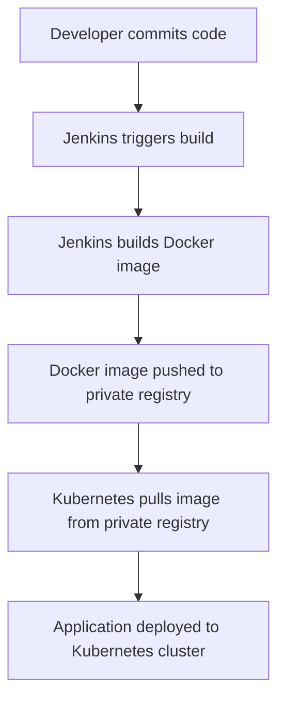
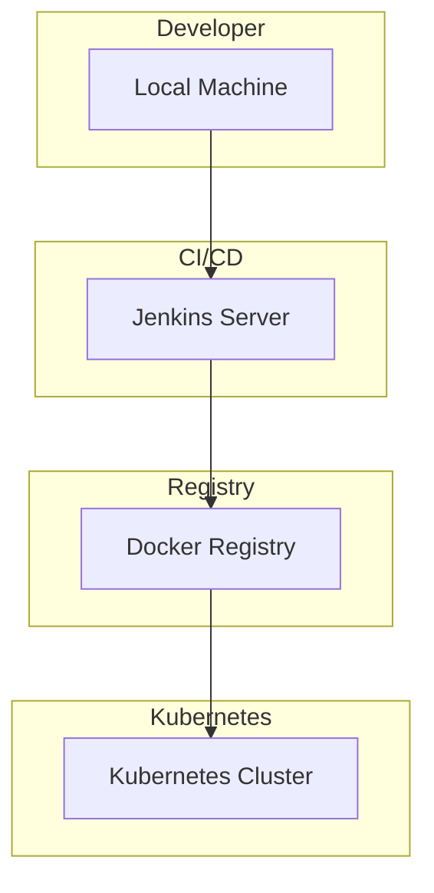

## Deploying Applications from Private Registries in Kubernetes

### Introduction

In this section, we will delve into the process of deploying applications from private registries in a Kubernetes cluster. This is a crucial aspect of modern DevOps practices, as it ensures that your applications are securely stored and deployed within your organization's infrastructure. We'll cover the entire workflow, from committing code to Git, triggering a Jenkins build, packaging the application into a Docker image, pushing it to a private Docker registry, and finally deploying it to a Kubernetes cluster.

### Workflow Overview

Let's break down the typical workflow:

1. **Commit Code to Git**: Developers commit their code changes to a Git repository.
2. **Trigger Jenkins Build**: A continuous integration (CI) system like Jenkins is triggered by the Git commit.
3. **Package Application into Docker Image**: Jenkins builds the application and packages it along with its environment configurations into a Docker image.
4. **Push Docker Image to Private Registry**: The Docker image is pushed to a private Docker registry such as Nexus, AWS ECR, or another private repository.
5. **Deploy to Kubernetes Cluster**: The Docker image is pulled from the private registry and deployed to the Kubernetes cluster.

### Committing Code to Git

The first step in the workflow is committing code to a Git repository. This is typically done by developers using tools like `git` on their local machines. Here’s an example of how a developer might commit code:

```bash
# Add all changes to the staging area
git add .

# Commit the changes with a descriptive message
git commit -m "Add new feature X"

# Push the changes to the remote repository
git push origin main
```

### Triggering Jenkins Build

Once the code is committed, a CI system like Jenkins is triggered to build the application. Jenkins can be configured to automatically trigger a build upon receiving a webhook from the Git repository.

#### Jenkins Configuration Example

Here’s an example of how you might configure a Jenkins job to build a Docker image:

```yaml
pipeline {
    agent any
    stages {
        stage('Build') {
            steps {
                script {
                    docker.build("myapp:${env.BUILD_ID}")
                }
            }
        }
        stage('Push') {
            steps {
                script {
                    docker.withRegistry('https://registry.example.com', 'docker-credentials-id') {
                        docker.push("myapp:${env.BUILD_ID}")
                    }
                }
            }
        }
    }
}
```

### Packaging Application into Docker Image

Jenkins builds the application and packages it into a Docker image. This involves creating a `Dockerfile` that specifies the base image, dependencies, and commands to run the application.

#### Example Dockerfile

```Dockerfile
FROM python:3.9-slim

WORKDIR /app

COPY requirements.txt .
RUN pip install --no-cache-dir -r requirements.txt

COPY . .

CMD ["python", "app.py"]
```

### Pushing Docker Image to Private Registry

After building the Docker image, it is pushed to a private Docker registry. This ensures that the image is stored securely within your organization's infrastructure.

#### Example of Pushing to AWS ECR

```bash
# Login to AWS ECR
aws ecr get-login-password --region us-west-2 | docker login --username AWS --password-stdin <account-id>.dkr.ecr.us-west-2.amazonaws.com

# Tag the Docker image
docker tag myapp:latest <account-id>.dkr.ecr.us-west-2.amazonaws.com/myapp:latest

# Push the Docker image
docker push <account-id>.dkr.ecr.us-west-2.amazonaws.com/myapp:latest
```

### Deploying to Kubernetes Cluster

To deploy the Docker image from a private registry to a Kubernetes cluster, you need to handle authentication to the private registry. This is done using Kubernetes secrets and configuring the deployment to use these secrets.

#### Creating a Secret for Registry Authentication

First, you need to create a Kubernetes secret that contains the credentials to access the private registry.

```yaml
apiVersion: v1
kind: Secret
metadata:
  name: regcred
type: kubernetes.io/dockerconfigjson
data:
  .dockerconfigjson: <base64-encoded-docker-config>
```

The `.dockerconfigjson` field should contain a base64-encoded JSON string representing the Docker configuration. Here’s an example of the JSON structure:

```json
{
  "auths": {
    "<registry-url>": {
      "username": "<username>",
      "password": "<password>",
      "email": "<email>"
    }
  }
}
```

You can encode this JSON string using a tool like `base64`.

#### Configuring Deployment to Use the Secret

Next, you need to configure your deployment or pod to use the secret for pulling the Docker image.

```yaml
apiVersion: apps/v1
kind: Deployment
metadata:
  name: myapp-deployment
spec:
  replicas: 3
  selector:
    matchLabels:
      app: myapp
  template:
    metadata:
      labels:
        app: myapp
    spec:
      containers:
      - name: myapp
        image: <registry-url>/myapp:latest
        ports:
        - containerPort: 80
      imagePullSecrets:
      - name: regcred
```

### Full Example of Raw HTTP Requests and Responses

When interacting with Kubernetes APIs, you often deal with HTTP requests and responses. Here’s an example of creating a secret and deploying an application using `kubectl`.

#### Creating a Secret

```http
POST /api/v1/namespaces/default/secrets HTTP/1.1
Host: localhost:8080
Content-Type: application/json

{
  "apiVersion": "v1",
  "kind": "Secret",
  "metadata": {
    "name": "regcred"
  },
  "type": "kubernetes.io/dockerconfigjson",
  "data": {
    ".dockerconfigjson": "<base64-encoded-docker-config>"
  }
}
```

#### Response

```http
HTTP/1.1 201 Created
Content-Type: application/json

{
  "kind": "Secret",
  "apiVersion": "v1",
  "metadata": {
    "name": "regcred",
    "namespace": "default",
    "selfLink": "/api/v1/namespaces/default/secrets/regcred",
    "uid": "c9b8d6a4-bd8d-4b8a-a7c6-4c7d8b6a4c8d",
    "resourceVersion": "123456",
    "creationTimestamp": "2023-10-01T12:00:00Z"
  },
  "type": "kubernetes.io/dockerconfigjson",
  "data": {
    ".dockerconfigjson": "<base64-encoded-docker-config>"
  }
}
```

#### Deploying an Application

```http
POST /apis/apps/v1/namespaces/default/deployments HTTP/1.1
Host: localhost:8080
Content-Type: application/json

{
  "apiVersion": "apps/v1",
  "kind": "Deployment",
  "metadata": {
    "name": "myapp-deployment"
  },
  "spec": {
    "replicas": 3,
    "selector": {
      "matchLabels": {
        "app": "myapp"
      }
    },
    "template": {
      "metadata": {
        "labels": {
          "app": "myapp"
        }
      },
      "spec": {
        "containers": [
          {
            "name": "myapp",
            "image": "<registry-url>/myapp:latest",
            "ports": [
              {
                "containerPort": 80
              }
            ]
          }
        ],
        "imagePullSecrets": [
          {
            "name": "regcred"
          }
        ]
      }
    }
  }
}
```

#### Response

```http
HTTP/1.1 201 Created
Content-Type: application/json

{
  "kind": "Deployment",
  "apiVersion": "apps/v1",
  "metadata": {
    "name": "myapp-deployment",
    "namespace": "default",
    "selfLink": "/apis/apps/v1/namespaces/default/deployments/myapp-deployment",
    "uid": "a9b8d6a4-bd8d-4b8a-a7c6-4c7d8b6a4c8d",
    "resourceVersion": "123457",
    "creationTimestamp": "2023-10-01T12:01:00Z"
  },
  "spec": {
    "replicas": 3,
    "selector": {
      "matchLabels": {
        "app": "myapp"
      }
    },
    "template": {
      "metadata": {
        "labels": {
          "app": "myapp"
        }
      },
      "spec": {
        "containers": [
          {
            "name": "myapp",
            "image": "<registry-url>/myapp:latest",
            "ports": [
              {
                "containerPort": 80
              }
            ]
          }
        ],
        "imagePullSecrets": [
          {
            "name": "regcred"
          }
        ]
      }
    }
  }
}
```

### Mermaid Diagrams

#### Workflow Diagram



#### Network Topology



### Common Pitfalls and How to Prevent Them

#### Incorrect Secret Configuration

**Issue**: If the secret is not correctly configured, Kubernetes will not be able to authenticate with the private registry, leading to deployment failures.

**Prevention**:
- Ensure the `.dockerconfigjson` data is correctly formatted and base64 encoded.
- Verify the secret is created in the correct namespace where the deployment is running.

#### Insufficient Permissions

**Issue**: If the service account used by the deployment does not have sufficient permissions to access the secret, the deployment will fail.

**Prevention**:
- Ensure the service account has the necessary RBAC permissions to access the secret.
- Use `kubectl auth can-i` to verify permissions.

#### Vulnerable Docker Images

**Issue**: Using outdated or vulnerable Docker images can expose your application to security risks.

**Prevention**:
- Regularly scan Docker images for vulnerabilities using tools like Trivy or Clair.
- Implement a CI/CD pipeline that fails if a vulnerable image is detected.

### Real-World Examples and Breaches

#### Example: Docker Hub Breach (CVE-2021-22555)

In 2021, Docker Hub experienced a breach where unauthorized users were able to access private repositories. This highlights the importance of securing your private registries and ensuring proper authentication mechanisms are in place.

#### Example: Kubernetes Secrets Leakage

In 2020, a misconfigured Kubernetes cluster led to the leakage of sensitive information, including Docker registry credentials. This underscores the need for strict access controls and regular audits.

### Secure Coding Practices

#### Vulnerable Code Example

```yaml
apiVersion: apps/v1
kind: Deployment
metadata:
  name: myapp-deployment
spec:
  replicas: 3
  selector:
    matchLabels:
      app: myapp
  template:
    metadata:
      labels:
        app: myapp
    spec:
      containers:
      - name: myapp
        image: <registry-url>/myapp:latest
        ports:
        - containerPort: 80
```

#### Secure Code Example

```yaml
apiVersion: apps/v1
kind: Deployment
metadata:
  name: myapp-deployment
spec:
  replicas: 3
  selector:
    matchLabels:
      app: myapp
  template:
    metadata:
      labels:
        app: myapp
    spec:
      containers:
      - name: myapp
        image: <registry-url>/myapp:latest
        ports:
        - containerPort: 80
      imagePullSecrets:
      - name: regcred
```

### Detection and Prevention

#### Detection

- Use Kubernetes audit logs to monitor access to secrets and images.
- Implement monitoring and alerting for unusual activity related to image pulls and secret usage.

#### Prevention

- Use RBAC to restrict access to secrets and images.
- Regularly review and update access controls and permissions.
- Implement multi-factor authentication (MFA) for accessing private registries.

### Hands-On Labs

For hands-on practice, consider the following labs:

- **PortSwigger Web Security Academy**: Offers exercises on securing Docker images and Kubernetes deployments.
- **OWASP Juice Shop**: Provides a vulnerable web application that can be deployed using Docker and Kubernetes.
- **Kubernetes Goat**: A deliberately insecure Kubernetes cluster designed for learning and testing security measures.

By following these detailed steps and best practices, you can ensure that your applications are securely deployed from private registries in a Kubernetes cluster.

---
<!-- nav -->
[[DevOps/DevOps Bootcamp/09-Container Orchestration (Kubernetes)/11-Deploying Applications from Private Registries in Kubernetes/00-Overview|Overview]] | [[DevOps/DevOps Bootcamp/09-Container Orchestration (Kubernetes)/11-Deploying Applications from Private Registries in Kubernetes/02-Practice Questions & Answers|Practice Questions & Answers]]
