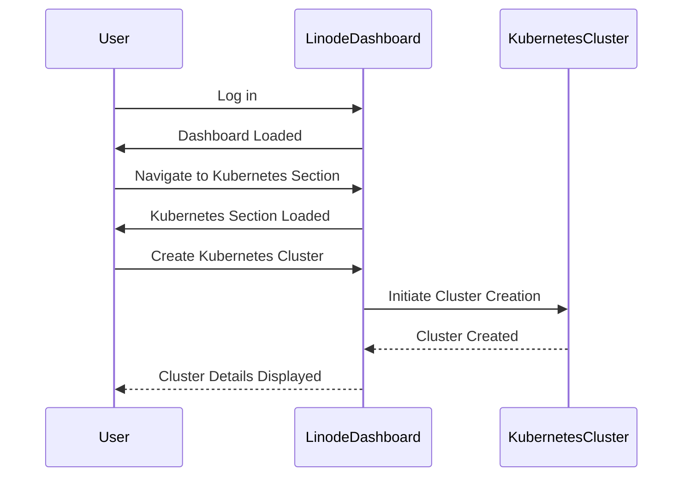
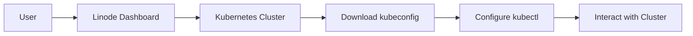
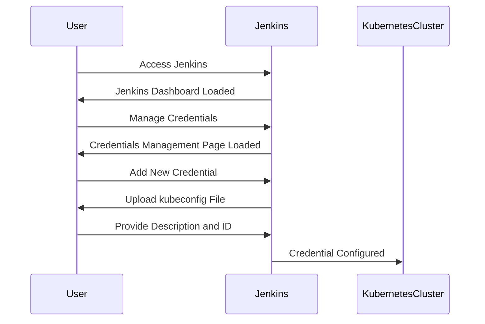
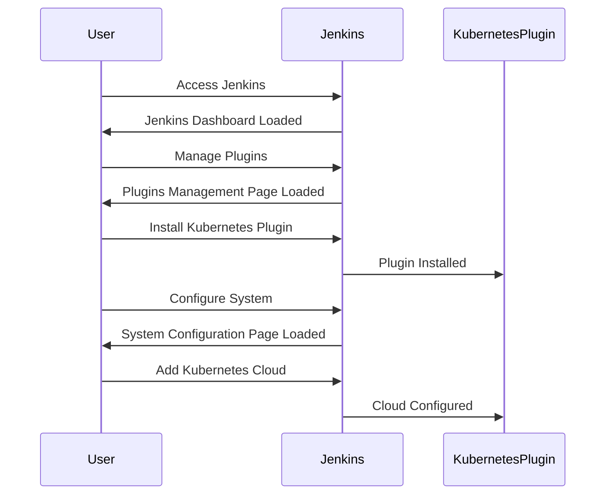
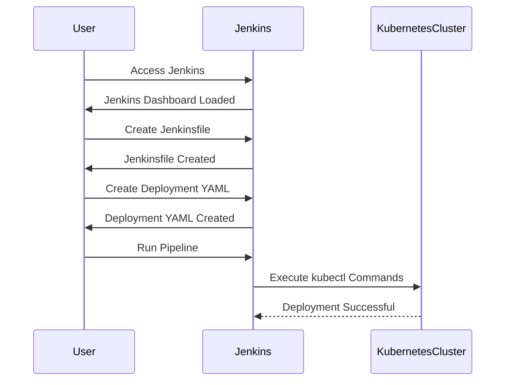

## Introduction to Jenkins Deployment on Kubernetes

In this section, we will delve into the process of deploying Jenkins on a Kubernetes cluster hosted on Linode. This approach leverages the power of Kubernetes for orchestration and Linode for hosting the infrastructure. We will cover the necessary steps to set up a Kubernetes cluster, configure Jenkins to interact with the cluster, and deploy Jenkins itself within the Kubernetes environment.

### Background Theory

#### What is Jenkins?

Jenkins is an open-source automation server that provides hundreds of plugins to support building, deploying, and automating any project. It is widely used in continuous integration and continuous delivery (CI/CD) pipelines to automate the testing and deployment processes.

#### What is Kubernetes?

Kubernetes is an open-source system for automating deployment, scaling, and management of containerized applications. It groups containers that make up an application into logical units called pods, which can be managed and scaled as a single entity.

#### Why Use Kubernetes for Jenkins?

Using Kubernetes for Jenkins offers several advantages:

1. **Scalability**: Kubernetes allows you to scale Jenkins dynamically based on demand.
2. **Resource Management**: Kubernetes efficiently manages resources, ensuring optimal utilization.
3. **High Availability**: Kubernetes supports high availability configurations, reducing downtime.
4. **Ease of Maintenance**: Kubernetes simplifies the maintenance of Jenkins by providing tools for rolling updates and rollbacks.

### Setting Up a Kubernetes Cluster on Linode

Before deploying Jenkins, we need to set up a Kubernetes cluster on Linode. Linode is a cloud hosting provider that offers a simple and cost-effective way to host your Kubernetes cluster.

#### Creating a Kubernetes Cluster on Linode

1. **Log in to Linode**:
   - Navigate to the Linode website and log in to your account.
   
2. **Create a New Kubernetes Cluster**:
   - Go to the Kubernetes section in the Linode dashboard.
   - Click on "Create Kubernetes Cluster".
   - Choose the smallest plan with one node. This is sufficient for our demonstration purposes.



#### Configuring the Cluster

Once the cluster is created, Linode provides the necessary configuration files to interact with the cluster. These files include the `kubeconfig` file, which is essential for authentication and communication with the Kubernetes API.



### Configuring Jenkins Credentials

To enable Jenkins to interact with the Kubernetes cluster, we need to configure credentials within Jenkins. This involves setting up the `kubeconfig` file as a credential in Jenkins.

#### Steps to Configure Credentials

1. **Access Jenkins**:
   - Open Jenkins in your browser.
   
2. **Navigate to Credentials**:
   - Go to `Manage Jenkins` > `Manage Credentials`.
   
3. **Add a New Credential**:
   - Click on `Global credentials (unrestricted)` and then `Add Credentials`.
   - Select `Kind` as `File`.
   - Upload the `kubeconfig` file.
   - Provide a description and ID for the credential.



### Using the Kubernetes Plugin in Jenkins

To deploy Jenkins on Kubernetes, we need to use the Kubernetes plugin in Jenkins. This plugin allows us to execute `kubectl` commands and manage deployments within the Kubernetes cluster.

#### Steps to Use the Kubernetes Plugin

1. **Install the Kubernetes Plugin**:
   - Go to `Manage Jenkins` > `Manage Plugins`.
   - Search for `Kubernetes` and install the plugin.
   
2. **Configure the Plugin**:
   - Go to `Manage Jenkins` > `Configure System`.
   - Scroll down to the `Cloud` section.
   - Add a new cloud and select `Kubernetes`.
   - Enter the necessary details such as the `Server URL`, `Credentials`, and `Namespace`.



### Deploying Jenkins on Kubernetes

Now that we have configured the Kubernetes plugin and set up the necessary credentials, we can proceed to deploy Jenkins on Kubernetes.

#### Steps to Deploy Jenkins

1. **Create a Jenkinsfile**:
   - Create a `Jenkinsfile` that defines the deployment steps.
   - Use the `kubectl` command to deploy Jenkins.

```yaml
pipeline {
    agent any
    stages {
        stage('Deploy Jenkins') {
            steps {
                script {
                    sh '''
                        kubectl apply -f jenkins-deployment.yaml
                    '''
                }
            }
        }
    }
}
```

2. **Create a Deployment YAML**:
   - Define the deployment YAML file (`jenkins-deployment.yaml`) that specifies the Jenkins deployment.

```yaml
apiVersion: apps/v1
kind: Deployment
metadata:
  name: jenkins
spec:
  replicas: 1
  selector:
    matchLabels:
      app: jenkins
  template:
    metadata:
      labels:
        app: jenkins
    spec:
      containers:
      - name: jenkins
        image: jenkins/jenkins:lts
        ports:
        - containerPort: 8080
```

3. **Run the Pipeline**:
   - Run the pipeline in Jenkins to deploy Jenkins on Kubernetes.



### Common Pitfalls and How to Prevent Them

#### Pitfall 1: Incorrect Configuration of `kubeconfig` File

**What Goes Wrong**:
If the `kubeconfig` file is incorrectly configured, Jenkins will not be able to communicate with the Kubernetes cluster.

**How to Prevent**:
Ensure that the `kubeconfig` file is correctly uploaded and configured in Jenkins. Verify the contents of the file and ensure that it includes the correct API server URL and credentials.

#### Pitfall 2: Insufficient Permissions

**What Goes Wrong**:
If the credentials used by Jenkins do not have sufficient permissions, Jenkins will not be able to perform operations on the Kubernetes cluster.

**How to Prevent**:
Ensure that the credentials used by Jenkins have the necessary permissions to perform operations on the Kubernetes cluster. You can use Role-Based Access Control (RBAC) to grant the required permissions.

### Real-World Examples and Recent Breaches

#### Example: CVE-2021-25741

CVE-2021-25741 is a critical vulnerability in Jenkins that allows attackers to execute arbitrary code on the Jenkins server. This vulnerability highlights the importance of securing Jenkins deployments, especially when running in a Kubernetes environment.

**Impact**:
Attackers could exploit this vulnerability to gain unauthorized access to the Jenkins server and potentially compromise the entire Kubernetes cluster.

**Mitigation**:
To mitigate this vulnerability, ensure that Jenkins is updated to the latest version and that all plugins are kept up to date. Additionally, use RBAC to restrict the permissions of the Jenkins service account.

### Secure Coding Practices

#### Vulnerable Code Example

```yaml
apiVersion: v1
kind: ServiceAccount
metadata:
  name: jenkins
---
apiVersion: rbac.authorization.k8s.io/v1
kind: ClusterRoleBinding
metadata:
  name: jenkins-admin
subjects:
- kind: ServiceAccount
  name: jenkins
  namespace: default
roleRef:
  kind: ClusterRole
  name: cluster-admin
  apiGroup: rbac.authorization.k8s.io
```

#### Secure Code Example

```yaml
apiVersion: v1
kind: ServiceAccount
metadata:
  name: jenkins
---
apiVersion: rbac.authorization.k8s.io/v1
kind: RoleBinding
metadata:
  name: jenkins-role-binding
  namespace: default
subjects:
- kind: ServiceAccount
  name: jenkins
  namespace: default
roleRef:
  kind: Role
  name: jenkins-role
  apiGroup: rbac.authorization.k8s.io
---
apiVersion: rbac.authorization.k8s.io/v1
kind: Role
metadata:
  name: jenkins-role
  namespace: default
rules:
- apiGroups: [""]
  resources: ["pods"]
  verbs: ["get", "list", "watch", "create", "update", "patch", "delete"]
- apiGroups: [""]
  resources: ["services"]
  verbs: ["get", "list", "watch", "create", "update", "patch", "delete"]
```

### Detection and Prevention

#### Detection

To detect potential issues with Jenkins deployments on Kubernetes, you can use tools like `kube-bench` and `kubescape`. These tools help you identify misconfigurations and vulnerabilities in your Kubernetes cluster.

#### Prevention

To prevent security issues, follow these best practices:

1. **Keep Jenkins and Plugins Updated**: Ensure that Jenkins and all plugins are kept up to date.
2. **Use RBAC**: Restrict the permissions of the Jenkins service account using RBAC.
3. **Monitor Logs**: Regularly monitor logs for suspicious activity.
4. **Use Network Policies**: Implement network policies to restrict traffic between pods.

### Hands-On Labs

For hands-on practice, consider the following labs:

- **PortSwigger Web Security Academy**: Offers a comprehensive set of labs for web application security.
- **OWASP Juice Shop**: A deliberately insecure web application for security training.
- **DVWA (Damn Vulnerable Web Application)**: A PHP/MySQL web application that is riddled with vulnerabilities.
- **WebGoat**: An interactive, gamified training application for learning about web application security.

These labs provide practical experience in deploying and securing Jenkins on Kubernetes.

### Conclusion

Deploying Jenkins on Kubernetes on Linode provides a scalable and efficient solution for managing CI/CD pipelines. By following the steps outlined in this chapter, you can successfully set up a Kubernetes cluster, configure Jenkins credentials, and deploy Jenkins using the Kubernetes plugin. Additionally, by adhering to secure coding practices and implementing robust detection and prevention measures, you can ensure the security of your Jenkins deployment.

---
<!-- nav -->
[[DevOps/DevOps Bootcamp/09-Container Orchestration (Kubernetes)/12-Deploying Jenkins to Kubernetes on Linode/00-Overview|Overview]] | [[02-Introduction to Jenkins and Kubernetes Integration|Introduction to Jenkins and Kubernetes Integration]]
