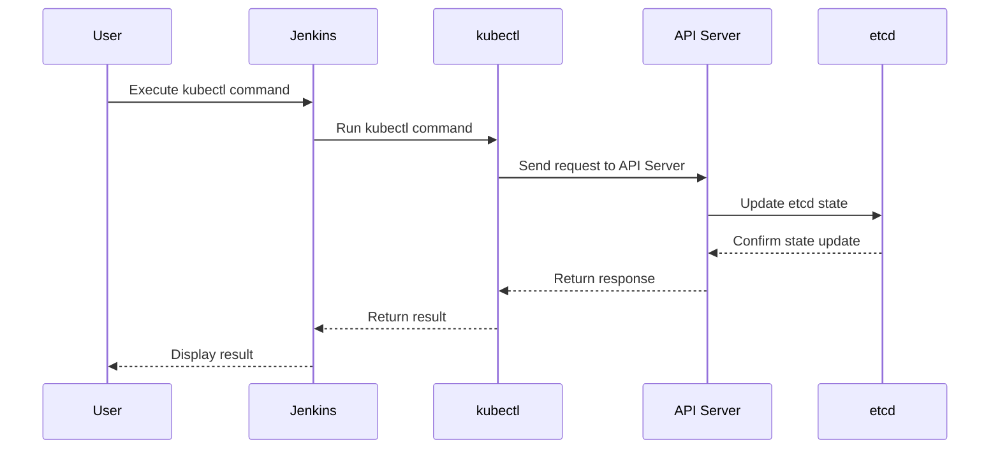

## Introduction to Jenkins and Kubernetes Integration

In this section, we will explore how to integrate Jenkins with a Kubernetes cluster hosted on Linode. This integration allows Jenkins to leverage the scalability and resource management capabilities of Kubernetes, making it an ideal setup for continuous integration and delivery (CI/CD) pipelines. We will cover the necessary steps to set up a simple Kubernetes cluster on Linode, configure Jenkins to interact with this cluster, and understand the underlying mechanisms that enable this interaction.

### Background Theory

#### What is Jenkins?
Jenkins is an open-source automation server that provides extensive support for continuous integration and continuous delivery (CI/CD) practices. It supports building, testing, and deploying software across various platforms and environments. Jenkins can be extended through numerous plugins, which allow it to integrate with various tools and services, including Kubernetes.

#### What is Kubernetes?
Kubernetes (often abbreviated as K8s) is an open-source system for automating deployment, scaling, and management of containerized applications. It was originally designed by Google and is now maintained by the Cloud Native Computing Foundation. Kubernetes provides a framework to run distributed systems resiliently and efficiently, managing the scheduling and placement of application containers onto clusters of physical or virtual machines.

#### Why Integrate Jenkins with Kubernetes?
Integrating Jenkins with Kubernetes offers several benefits:
1. **Scalability**: Kubernetes can dynamically scale Jenkins agents based on the workload, ensuring efficient resource utilization.
2. **Resource Management**: Kubernetes manages the lifecycle of Jenkins agents, automatically provisioning and terminating them as needed.
3. **Flexibility**: Jenkins can run builds and tests in isolated environments, reducing the risk of conflicts between different jobs.
4. **Automation**: Kubernetes simplifies the deployment and management of Jenkins, making it easier to maintain and scale.

### Setting Up a Kubernetes Cluster on Linode

Before we proceed with integrating Jenkins with Kubernetes, we need to set up a Kubernetes cluster on Linode. Linode is a cloud hosting provider that offers a simple and affordable way to host your applications and services.

#### Step 1: Create a Kubernetes Cluster on Linode

To create a Kubernetes cluster on Linode, follow these steps:

1. **Sign Up for Linode**: If you don't already have a Linode account, sign up at [Linode](https://www.linode.com/).

2. **Create a New Kubernetes Cluster**:
    - Log in to your Linode account.
    - Navigate to the "Kubernetes" section.
    - Click on "Create Kubernetes Cluster".
    - Choose the region and plan that suits your needs.
    - Configure the number of nodes and other settings as required.
    - Click "Create Cluster".

3. **Access the Kubernetes Cluster**:
    - Once the cluster is created, you can access it via the Linode dashboard.
    - Download the `kubeconfig` file, which contains the necessary credentials to interact with the cluster.

#### Step 2: Install `kubectl` in Jenkins Container

The first step in integrating Jenkins with Kubernetes is to ensure that the `kubectl` command is available within the Jenkins container. `kubectl` is the command-line tool used to interact with Kubernetes clusters.

```bash
# Example Dockerfile for Jenkins with kubectl
FROM jenkins/jenkins:lts

# Install kubectl
RUN apt-get update && \
    apt-get install -y curl && \
    curl -LO https://dl.k8s.io/release/v1.23.0/bin/linux/amd64/kubectl && \
    chmod +x ./kubectl && \
    mv ./kubectl /usr/local/bin/kubectl
```

This Dockerfile installs `kubectl` in the Jenkins container, allowing Jenkins to communicate with the Kubernetes cluster.

### Installing Jenkins Plugin for Kubernetes Interaction

To enable Jenkins to execute `kubectl` commands with the appropriate credentials, we need to install a Jenkins plugin. The recommended plugin for this purpose is the **Kubernetes Plugin**.

#### Step 1: Install the Kubernetes Plugin

1. **Log in to Jenkins**: Access your Jenkins instance via the web interface.
2. **Manage Plugins**: Navigate to "Manage Jenkins" > "Manage Plugins".
3. **Available Tab**: Click on the "Available" tab and search for "Kubernetes".
4. **Install Plugin**: Select the "Kubernetes" plugin and click "Install without restart".

#### Step 2: Configure the Kubernetes Plugin

After installing the plugin, you need to configure it to connect to your Kubernetes cluster.

1. **Configure System**: Navigate to "Manage Jenkins" > "Configure System".
2. **Cloud Section**: Scroll down to the "Cloud" section and click "Add a new cloud".
3. **Select Kubernetes**: Choose "Kubernetes" from the dropdown menu.
4. **Enter Configuration Details**:
    - **Name**: Enter a name for the Kubernetes cloud (e.g., "Linode").
    - **Kubernetes URL**: Enter the URL of your Kubernetes cluster (e.g., `https://<cluster-ip>:6443`).
    - **Kubeconfig File**: Upload the `kubeconfig` file downloaded from Linode.
    - **Container Capabilities**: Configure the container capabilities as needed.
    - **Labels**: Add labels to identify the nodes in the cluster.

### Understanding the Integration Mechanism

When Jenkins interacts with Kubernetes, it uses the `kubectl` command to perform various operations such as creating pods, deploying applications, and managing resources. The Kubernetes plugin in Jenkins abstracts these operations, providing a user-friendly interface for managing Kubernetes resources.

#### How `kubectl` Works

`kubectl` communicates with the Kubernetes API server to perform operations. The API server is responsible for validating and processing requests, and it interacts with other components of the Kubernetes control plane to manage the state of the cluster.



### Common Pitfalls and How to Prevent Them

#### Pitfall 1: Incorrect `kubeconfig` File

One common issue is using an incorrect or outdated `kubeconfig` file. This can lead to authentication failures and prevent Jenkins from communicating with the Kubernetes cluster.

**How to Prevent:**
- Always download the latest `kubeconfig` file from the Linode dashboard.
- Verify the contents of the `kubeconfig` file to ensure it contains the correct cluster information and credentials.

#### Pitfall 2: Insufficient Permissions

Another common issue is insufficient permissions for the service account used by Jenkins to interact with the Kubernetes cluster. This can result in Jenkins being unable to perform certain operations.

**How to Prevent:**
- Ensure that the service account has the necessary permissions to perform the required operations.
- Use role-based access control (RBAC) to grant the minimum necessary permissions to the service account.

### Real-World Examples and Recent Breaches

#### Example: CVE-2021-25741

CVE-2021-25741 is a critical vulnerability in Kubernetes that allows an attacker to bypass RBAC restrictions and gain elevated privileges. This vulnerability affects versions of Kubernetes prior to 1.21.2, 1.20.7, and 1.19.10.

**Impact:**
- An attacker could exploit this vulnerability to gain unauthorized access to the Kubernetes cluster and perform actions that should be restricted.

**Mitigation:**
- Ensure that your Kubernetes cluster is updated to a version that includes the fix for this vulnerability.
- Regularly review and audit the permissions granted to service accounts and users in the cluster.

### Secure Coding Practices

#### Vulnerable Code Example

Consider a scenario where Jenkins is configured to use a service account with excessive permissions. This can lead to a security risk if the service account is compromised.

```yaml
# Vulnerable Service Account Definition
apiVersion: v1
kind: ServiceAccount
metadata:
  name: jenkins-sa
  namespace: default
---
# Vulnerable Role Binding
apiVersion: rbac.authorization.k8s.io/v1
kind: RoleBinding
metadata:
  name: jenkins-rb
  namespace: default
subjects:
- kind: ServiceAccount
  name: jenkins-sa
  namespace: default
roleRef:
  kind: ClusterRole
  name: cluster-admin
  apiGroup: rbac.authorization.k8s.io
```

#### Secure Code Example

To mitigate this risk, the service account should be granted only the minimum necessary permissions.

```yaml
# Secure Service Account Definition
apiVersion: v1
kind: ServiceAccount
metadata:
  name: jenkins-sa
  namespace: default
---
# Secure Role Binding
apiVersion: rbac.authorization.k8s.io/v1
kind: RoleBinding
metadata:
  name: jenkins-rb
  namespace: default
subjects:
- kind: ServiceAccount
  name: jenkins-sa
  namespace: default
roleRef:
  kind: Role
  name: jenkins-role
  apiGroup: rbac.authorization.k8s.io
---
# Secure Role Definition
apiVersion: rbac.authorization.k8s.io/v1
kind: Role
metadata:
  name: jenkins-role
  namespace: default
rules:
- apiGroups: [""]
  resources: ["pods", "pods/log"]
  verbs: ["get", "list", "watch"]
- apiGroups: ["batch"]
  resources: ["jobs"]
  verbs: ["create", "delete", "get", "list", "patch", "update", "watch"]
```

### Hands-On Labs

For hands-on practice with Jenkins and Kubernetes integration, consider the following labs:

- **PortSwigger Web Security Academy**: Offers a series of labs focused on web application security, including some that involve Jenkins and Kubernetes.
- **OWASP Juice Shop**: A deliberately insecure web application that can be used to practice various security techniques, including CI/CD pipeline security.
- **Kubernetes Goat**: A vulnerable Kubernetes cluster designed for security training and penetration testing.

These labs provide practical experience in setting up and securing Jenkins and Kubernetes integrations, helping you to apply the concepts learned in this chapter.

### Conclusion

Integrating Jenkins with a Kubernetes cluster on Linode provides a powerful and scalable solution for CI/CD pipelines. By following the steps outlined in this chapter, you can set up a simple Kubernetes cluster, configure Jenkins to interact with it, and understand the underlying mechanisms that enable this integration. Additionally, by adhering to secure coding practices and regularly reviewing and auditing your configurations, you can minimize the risk of security vulnerabilities in your CI/CD environment.

---
<!-- nav -->
[[01-Introduction to Jenkins Deployment on Kubernetes|Introduction to Jenkins Deployment on Kubernetes]] | [[DevOps/DevOps Bootcamp/09-Container Orchestration (Kubernetes)/12-Deploying Jenkins to Kubernetes on Linode/00-Overview|Overview]] | [[03-Introduction to Kubernetes Clusters on Linode|Introduction to Kubernetes Clusters on Linode]]
