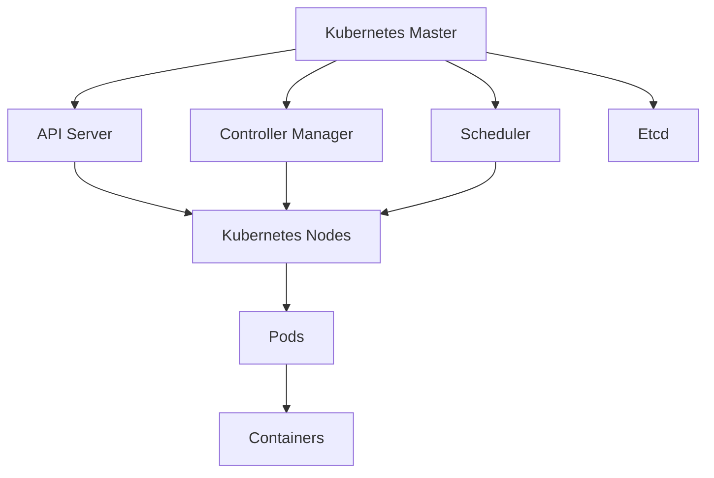
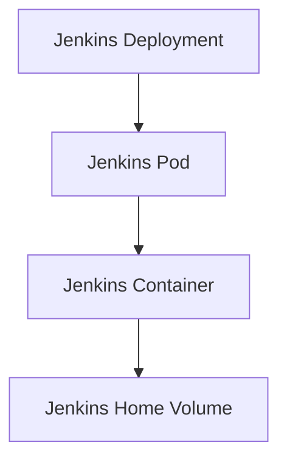

## Introduction to Kubernetes and Linode

Before diving into deploying Jenkins to Kubernetes on Linode, it's essential to understand the foundational concepts of Kubernetes and Linode. Kubernetes is an open-source system for automating deployment, scaling, and management of containerized applications. Linode, on the other hand, is a cloud hosting provider that offers virtual private servers (VPS) and managed Kubernetes clusters (Linode Kubernetes Engine, or LKE).

### What is Kubernetes?

Kubernetes is a portable, extensible, open-source platform for managing containerized workloads and services. It provides mechanisms for deploying, maintaining, and scaling applications. Kubernetes groups containers that make up an application into logical units called pods, which are managed and scaled together.

#### Why Kubernetes?

Kubernetes simplifies the deployment and management of containerized applications by providing:

- **Automation**: Automated rollouts and rollbacks.
- **Scaling**: Scaling applications on the fly.
- **Self-healing**: Automatic restarts, replacement, and replication of containers.
- **Service discovery and load balancing**: Exposing applications to the internet or internal networks.
- **Storage orchestration**: Mounting storage systems like local storage, cloud providers, and more.

### What is Linode?

Linode is a cloud hosting provider that offers various services, including VPS, managed Kubernetes clusters (LKE), and object storage. Linode is known for its simplicity, reliability, and affordability.

#### Why Linode?

Linode offers:

- **Affordable pricing**: Competitive pricing models.
- **Ease of use**: Simple and intuitive user interface.
- **Reliability**: High uptime and performance.
- **Managed Kubernetes**: Linode Kubernetes Engine (LKE) provides a managed Kubernetes service.

### Connecting to a Kubernetes Cluster Using `kubectl`

To interact with a Kubernetes cluster, you need to use `kubectl`, the Kubernetes command-line tool. This tool allows you to deploy applications, inspect resources, and manage the cluster.

#### Configuring `kubectl` to Connect to a Linode Kubernetes Cluster

To configure `kubectl` to connect to a Linode Kubernetes cluster, you need to provide the necessary credentials and cluster details. This process involves setting up a `kubeconfig` file, which contains the authentication information and cluster details required to communicate with the Kubernetes cluster.

### Step-by-Step Guide to Configuring `kubectl`

1. **Install `kubectl`**:
   Ensure that `kubectl` is installed on your machine. You can install it using the following command:

   ```sh
   curl -LO "https://dl.k8s.io/release/$(curl -L -s https://dl.k8s.io/release/stable.txt)/bin/linux/amd64/kubectl"
   chmod +x kubectl
   sudo mv kubectl /usr/local/bin/
   ```

2. **Install the Linode CLI Plugin**:
   The Linode CLI plugin helps manage Linode resources, including Kubernetes clusters. Install the plugin using the following command:

   ```sh
   pip install linode-cli
   ```

3. **Configure `kubectl` to Use the Linode Kubernetes Cluster**:
   To configure `kubectl` to use the Linode Kubernetes cluster, you need to create a `kubeconfig` file with the necessary credentials and cluster details.

   ```sh
   linode-cli k8s kubeconfig <cluster_id> --save
   ```

   Replace `<cluster_id>` with the ID of your Linode Kubernetes cluster.

4. **Verify the Configuration**:
   Verify that `kubectl` is configured correctly by running the following command:

   ```sh
   kubectl cluster-info
   ```

   This command should return information about the Kubernetes cluster, confirming that `kubectl` is properly configured.

### Detailed Example of Configuring `kubectl`

Let's walk through a detailed example of configuring `kubectl` to connect to a Linode Kubernetes cluster.

#### Step 1: Install `kubectl`

```sh
curl -LO "https://dl.k8s.io/release/$(curl -L -s https://dl.k8s.io/release/stable.txt)/bin/linux/amd64/kubectl"
chmod +x kubectl
sudo mv kubectl /usr/local/bin/
```

#### Step 2: Install the Linode CLI Plugin

```sh
pip install linode-cli
```

#### Step 3: Configure `kubectl` to Use the Linkine Kubernetes Cluster

First, list your Linode Kubernetes clusters to find the cluster ID:

```sh
linode-cli k8s list
```

Assuming the cluster ID is `12345678`, run the following command to save the `kubeconfig`:

```sh
linode-cli k8s kubeconfig 12345678 --save
```

This command will create a `kubeconfig` file in the default location (`~/.kube/config`) with the necessary credentials and cluster details.

#### Step 4: Verify the Configuration

```sh
kubectl cluster-info
```

This command should return information about the Kubernetes cluster, confirming that `kubectl` is properly configured.

### Understanding `kubeconfig` File

The `kubeconfig` file is a YAML file that contains the configuration details for connecting to a Kubernetes cluster. It includes the following sections:

- **apiVersion**: Specifies the version of the API.
- **kind**: Specifies the kind of resource (in this case, `Config`).
- **clusters**: Contains information about the clusters.
- **users**: Contains information about the users.
- **contexts**: Contains information about the contexts.
- **current-context**: Specifies the current context.

Here is an example of a `kubeconfig` file:

```yaml
apiVersion: v1
kind: Config
clusters:
- name: lke-cluster
  cluster:
    server: https://<cluster_endpoint>:443
    certificate-authority-data: <base64_encoded_certificate>
users:
- name: lke-user
  user:
    token: <token>
contexts:
- name: lke-context
  context:
    cluster: lke-cluster
    user: lke-user
current-context: lke-context
```

### Using `kubectl` to Execute Commands

Once `kubectl` is configured, you can use it to execute commands against the Kubernetes cluster. For example, to deploy a new pod, you can use the following command:

```sh
kubectl apply -f pod.yaml
```

Where `pod.yaml` is a YAML file defining the pod specification.

### Real-World Examples and Recent Breaches

Recent breaches involving Kubernetes clusters highlight the importance of proper configuration and security practices. For example, in 2021, a Kubernetes cluster was compromised due to misconfigured RBAC (Role-Based Access Control) policies, allowing unauthorized access to sensitive data.

#### How to Prevent / Defend

1. **Secure RBAC Policies**:
   - Define strict RBAC policies to limit access to resources.
   - Regularly audit RBAC policies to ensure they are up-to-date and secure.

2. **Use Secure Authentication Methods**:
   - Use TLS certificates for secure communication between the client and the server.
   - Use token-based authentication instead of plain-text passwords.

3. **Enable Network Policies**:
   - Use network policies to restrict traffic between pods and external networks.
   - Regularly review and update network policies to ensure they are effective.

4. **Monitor and Audit**:
   - Enable monitoring and logging to detect and respond to security incidents.
   - Regularly audit the cluster to identify and mitigate potential security risks.

### Complete Example of Deploying Jenkins to Kubernetes on Linode

Now that we have covered the basics of configuring `kubectl` to connect to a Linode Kubernetes cluster, let's walk through a complete example of deploying Jenkins to Kubernetes on Linode.

#### Step 1: Create a Jenkins Deployment

Create a `jenkins-deployment.yaml` file with the following content:

```yaml
apiVersion: apps/v1
kind: Deployment
metadata:
  name: jenkins
spec:
  replicas: 1
  selector:
    matchLabels:
      app: jenkins
  template:
    metadata:
      labels:
        app: jenkins
    spec:
      containers:
      - name: jenkins
        image: jenkins/jenkins:lts
        ports:
        - containerPort: 8080
        volumeMounts:
        - name: jenkins-home
          mountPath: /var/jenkins_home
      volumes:
      - name: jenkins-home
        emptyDir: {}
```

#### Step 2: Create a Jenkins Service

Create a `jenkins-service.yaml` file with the following content:

```yaml
apiVersion: v1
kind: Service
metadata:
  name: jenkins
spec:
  type: LoadBalancer
  ports:
  - port: 8080
    targetPort: 8080
  selector:
    app: jenkins
```

#### Step 3: Apply the Deployment and Service

Apply the deployment and service using the following commands:

```sh
kubectl apply -f jenkins-deployment.yaml
kubectl apply -f jenkins-service.yaml
```

#### Step 4: Verify the Deployment

Verify that the Jenkins deployment and service are running correctly using the following commands:

```sh
kubectl get pods
kubectl get services
```

### Mermaid Diagrams

#### Kubernetes Architecture Diagram



#### Jenkins Deployment Diagram



### Common Pitfalls and Best Practices

#### Common Pitfalls

1. **Misconfigured RBAC Policies**:
   - Ensure that RBAC policies are strictly defined and regularly audited.
   
2. **Insecure Authentication Methods**:
   - Use secure authentication methods such as TLS certificates and token-based authentication.
   
3. **Insufficient Monitoring and Logging**:
   - Enable monitoring and logging to detect and respond to security incidents.

#### Best Practices

1. **Regular Audits**:
   - Regularly audit the cluster to identify and mitigate potential security risks.
   
2. **Network Policies**:
   - Use network policies to restrict traffic between pods and external networks.
   
3. **Secure Storage**:
   - Use secure storage options such as encrypted volumes and secrets.

### Hands-On Labs

For hands-on practice, consider the following labs:

- **PortSwigger Web Security Academy**: Offers a variety of labs related to web application security.
- **OWASP Juice Shop**: A deliberately insecure web application for security training.
- **DVWA (Damn Vulnerable Web Application)**: A PHP/MySQL web application that is riddled with vulnerabilities.
- **WebGoat**: An interactive, gamified security training application.

These labs provide practical experience in deploying and securing applications on Kubernetes clusters.

### Conclusion

Deploying Jenkins to Kubernetes on Linode involves configuring `kubectl` to connect to the Linode Kubernetes cluster and deploying the Jenkins application using Kubernetes resources. By following best practices and regularly auditing the cluster, you can ensure the security and reliability of your Kubernetes environment.

---
<!-- nav -->
[[03-Introduction to Kubernetes Clusters on Linode|Introduction to Kubernetes Clusters on Linode]] | [[DevOps/DevOps Bootcamp/09-Container Orchestration (Kubernetes)/12-Deploying Jenkins to Kubernetes on Linode/00-Overview|Overview]] | [[05-Deploying Jenkins to Kubernetes on Linode|Deploying Jenkins to Kubernetes on Linode]]
