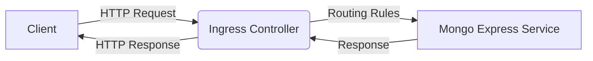

## Introduction to Kubernetes Ingress Controller and Services

In this section, we will delve into the intricacies of deploying a managed Kubernetes cluster with MongoDB, focusing specifically on the role of the Ingress controller and services within the Kubernetes ecosystem. Understanding these components is crucial for managing and securing applications deployed in a Kubernetes environment.

### What is Kubernetes?

Kubernetes is an open-source platform designed to automate deploying, scaling, and operating application containers. It groups containers that make up an application into logical units called `pods`, which are easy to deploy and manage. Kubernetes provides a framework for automating deployment, scaling, and operations of application containers across clusters of hosts.

### Kubernetes Services

A Kubernetes `Service` is an abstraction that defines a logical set of pods and a policy by which to access them. A Service can be thought of as a load balancer that routes traffic to the appropriate pods. There are several types of services:

- **ClusterIP**: Exposes the service on a cluster-internal IP. This is the default type.
- **NodePort**: Exposes the service on each Node’s IP at a static port (the `NodePort`). A ClusterIP service, to which the NodePort service will route, is automatically created.
- **LoadBalancer**: Exposes the service externally using a cloud provider’s load balancer.
- **ExternalName**: Maps the service to the contents of the `externalName` field (e.g., `foo.bar.example.com`), by returning a CNAME record with its value.

### Ingress Controller

An Ingress controller is a component that manages external access to the services in a cluster, typically HTTP. It acts as a reverse proxy and load balancer for the services in the cluster. An Ingress controller watches the Kubernetes API for Ingress resources and configures itself accordingly.

#### Why Use an Ingress Controller?

The primary reasons for using an Ingress controller include:

- **Centralized Routing**: Simplifies routing rules for multiple services.
- **SSL Termination**: Handles SSL termination, reducing the overhead on backend services.
- **Path-Based Routing**: Allows routing based on URL paths.
- **Load Balancing**: Provides load balancing across multiple instances of a service.

### Creating an Ingress Rule for MongoDB Express

To enable access to the MongoDB Express service from the browser, we need to create an Ingress rule. Let's walk through the process step-by-step.

#### Step 1: Define the Ingress Resource

First, we define the Ingress resource in a YAML file. Here is an example of an Ingress resource for MongoDB Express:

```yaml
apiVersion: networking.k8s.io/v1
kind: Ingress
metadata:
  name: mongo-express-ingress
  namespace: default
spec:
  rules:
  - host: mongoexpress.example.com
    http:
      paths:
      - path: /
        pathType: Prefix
        backend:
          service:
            name: mongo-express-service
            port:
              number: 8081
```

This YAML file defines an Ingress resource named `mongo-express-ingress`. The `host` field specifies the domain name (`mongoexpress.example.com`) that will be used to access the service. The `paths` field defines the URL path (`/`) and the corresponding backend service (`mongo-express-service`).

#### Step 2: Apply the Ingress Resource

Next, apply the Ingress resource to the Kubernetes cluster using the `kubectl` command:

```sh
kubectl apply -f mongo-express-ingress.yaml
```

#### Step 3: Verify the Ingress Resource

After applying the Ingress resource, verify that it has been correctly configured:

```sh
kubectl get ingress
```

This command should display the Ingress resource along with its status and associated domain name.

### Understanding Load Balancers and External IPs

When creating an Ingress resource, the Kubernetes cluster assigns an external IP address to the Ingress controller. This IP address is used to route traffic to the appropriate services within the cluster.

#### Load Balancer Type

For the Ingress controller to be accessible externally, the service type should be set to `LoadBalancer`. Here is an example of a service definition for the Ingress controller:

```yaml
apiVersion: v1
kind: Service
metadata:
  name: ingress-nginx-controller
  namespace: ingress-nginx
spec:
  type: LoadBalancer
  ports:
  - name: http
    port: 80
    targetPort: 80
  - name: https
    port: 443
    targetPort: 443
  selector:
    app.kubernetes.io/name: ingress-nginx
    app.kubernetes.io/part-of: ingress-nginx
```

This service definition creates a `LoadBalancer` type service named `ingress-nginx-controller` in the `ingress-nginx` namespace. The `selector` field ensures that the service routes traffic to the correct pods.

#### External IP Address

The external IP address assigned to the Ingress controller is the same as the IP address of the node balancer. This IP address is used to route traffic to the appropriate services within the cluster.

### Diagramming the Architecture

Let's visualize the architecture using a Mermaid diagram:



### Common Pitfalls and How to Prevent Them

#### Pitfall 1: Incorrect Host Configuration

One common pitfall is incorrectly configuring the `host` field in the Ingress resource. The `host` field must be a valid domain address and cannot be an IP address.

**How to Prevent:**

- Ensure the `host` field is a valid domain address.
- Use DNS management tools to map the domain address to the external IP address of the Ingress controller.

#### Pitfall 2: Missing Backend Service

Another common issue is missing or incorrectly configured backend services. If the backend service is not defined or is not running, the Ingress controller will not be able to route traffic correctly.

**How to Prevent:**

- Verify that the backend service is defined and running.
- Use `kubectl get svc` to check the status of the backend service.

### Real-World Examples and Recent CVEs

#### Example: MongoDB Express Vulnerability

In 2021, a vulnerability was discovered in MongoDB Express (CVE-2021-22816). This vulnerability allowed attackers to execute arbitrary JavaScript code on the server. To mitigate this vulnerability, ensure that MongoDB Express is properly secured and that the Ingress controller is configured to restrict access to authorized users.

#### Secure Configuration Example

Here is an example of a secure configuration for MongoDB Express:

```yaml
apiVersion: networking.k8s.io/v1
kind: Ingress
metadata:
  name: mongo-express-ingress
  namespace: default
spec:
  rules:
  - host: mongoexpress.example.com
    http:
      paths:
      - path: /
        pathType: Prefix
        backend:
          service:
            name: mongo-express-service
            port:
              number: 8081
  tls:
  - hosts:
    - mongoexpress.example.com
    secretName: tls-secret
```

In this example, TLS encryption is enabled using a TLS secret named `tls-secret`.

### Conclusion

Deploying a managed Kubernetes cluster with MongoDB requires careful configuration of the Ingress controller and services. By following the steps outlined in this chapter, you can ensure that your MongoDB Express service is accessible from the browser and properly secured. Always verify the configuration and use secure practices to prevent common pitfalls and vulnerabilities.

---
<!-- nav -->
[[02-Introduction to Kubernetes Clusters and Deployment|Introduction to Kubernetes Clusters and Deployment]] | [[DevOps/DevOps Bootcamp/09-Container Orchestration (Kubernetes)/13-Deploying Managed Kubernetes Cluster with MongoDB/00-Overview|Overview]] | [[04-Introduction to Kubernetes and Ingress Controllers|Introduction to Kubernetes and Ingress Controllers]]
