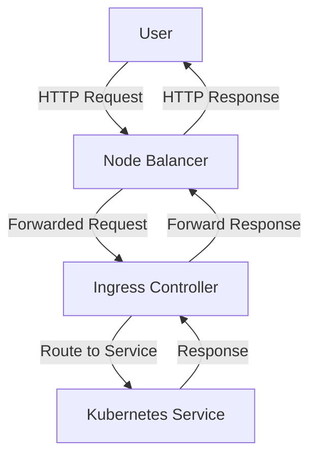

## Introduction to Kubernetes and Ingress Controllers

Kubernetes is an open-source system for automating deployment, scaling, and management of containerized applications. One of the key components in Kubernetes is the Ingress Controller, which manages external access to the services in a cluster, typically HTTP. An Ingress Controller provides a way to expose your services to the internet, allowing you to route traffic based on hostname, path, or other criteria.

### What is an Ingress Controller?

An Ingress Controller is a component that implements the Ingress resource in Kubernetes. It acts as a reverse proxy and load balancer, routing incoming requests to the appropriate services within the cluster. The Ingress Controller is responsible for managing the external access to the services in a cluster, typically via HTTP.

#### Why Use an Ingress Controller?

The primary reasons for using an Ingress Controller include:

1. **Load Balancing**: Distributes incoming traffic across multiple replicas of a service.
2. **Routing**: Allows you to route traffic based on the URL path or hostname.
3. **SSL Termination**: Handles SSL termination at the edge, reducing the overhead on backend services.
4. **Security**: Provides a layer of security by controlling access to services.

### Setting Up an Ingress Controller

To set up an Ingress Controller, you need to install a specific implementation. One popular choice is the NGINX Ingress Controller, which is widely used due to its robustness and flexibility.

#### Adding the Repository and Installing the Helm Chart

Before deploying the Ingress Controller, you need to add the repository containing the Helm chart for the Ingress Controller. Helm is a package manager for Kubernetes that simplifies the deployment and management of applications.

```bash
helm repo add ingress-nginx https://kubernetes.github.io/ingress-nginx
helm repo update
```

Next, you can install the Helm chart for the NGINX Ingress Controller:

```bash
helm install ingress-nginx ingress-nginx/ingress-nginx
```

This command installs the NGINX Ingress Controller into your Kubernetes cluster.

### Configuring the Ingress Controller

Once the Ingress Controller is installed, you can configure it by creating an `Ingress` resource. An `Ingress` resource defines how external traffic reaches the services in your cluster.

#### Example Ingress Rule File

Here is an example of an `Ingress` resource file:

```yaml
apiVersion: networking.k8s.io/v1
kind: Ingress
metadata:
  name: example-ingress
  namespace: default
spec:
  rules:
  - host: example.com
    http:
      paths:
      - path: /
        pathType: Prefix
        backend:
          service:
            name: example-service
            port:
              number: 80
```

This `Ingress` resource routes traffic from `example.com` to the `example-service` running in the `default` namespace.

### Checking the Deployment of the Ingress Controller

After deploying the Ingress Controller, you can check its status by listing the pods in the namespace where it was installed:

```bash
kubectl get pods -n ingress-nginx
```

You should see two pods running: one for the default backend and one for the Ingress Controller itself.

```bash
NAME                                    READY   STATUS    RESTARTS   AGE
ingress-nginx-controller-xxxxx-yyyyy    1/1     Running   0          1m
ingress-nginx-default-backend-xxxxx-yyyyy   1/1     Running   0          1m
```

### Creating Ingress Rules

With the Ingress Controller deployed, you can now define domain names or hostnames that will route to specific Kubernetes services. This allows you to expose your services to the internet.

#### Example Ingress Rule

Here is an example of an `Ingress` resource that routes traffic to a MongoDB service:

```yaml
apiVersion: networking.k8s.io/v1
kind: Ingress
metadata:
  name: mongodb-ingress
  namespace: default
spec:
  rules:
  - host: mongodb.example.com
    http:
      paths:
      - path: /
        pathType: Prefix
        backend:
          service:
            name: mongodb-service
            port:
              number: 27017
```

This `Ingress` resource routes traffic from `mongodb.example.com` to the `mongodb-service` running in the `default` namespace.

### Cloud Native Load Balancer

The Ingress Controller uses a cloud-native load balancer in the background to manage external access to the services in the cluster. This load balancer is dynamically created and provisioned as you create the Ingress Controller.

#### Node Balancer

If you are using a cloud provider like Linode, the node balancer is the entry point into your cluster. It provides an external IP address that is accessible from the browser.

```bash
linode-cli nodebalancers list
```

This command lists the node balancers in your Linode account. You can see the external IP address and the ports that are open on the node balancer.

### Security Considerations

When setting up an Ingress Controller, it is important to consider security. Here are some best practices:

1. **Use SSL/TLS**: Ensure that all traffic is encrypted using SSL/TLS.
2. **Limit Access**: Restrict access to the services exposed by the Ingress Controller.
3. **Monitor Traffic**: Monitor the traffic to detect any suspicious activity.

#### Secure Configuration Example

Here is an example of a secure `Ingress` resource:

```yaml
apiVersion: networking.k8s.io/v1
kind: Ingress
metadata:
  name: secure-ingress
  namespace: default
  annotations:
    nginx.ingress.kubernetes.io/ssl-redirect: "true"
spec:
  tls:
  - hosts:
    - example.com
    secretName: example-tls-secret
  rules:
  - host: example.com
    http:
      paths:
      - path: /
        pathType: Prefix
        backend:
          service:
            name: example-service
            port:
              number: 80
```

This `Ingress` resource ensures that all traffic is redirected to HTTPS and uses a TLS secret for encryption.

### How to Prevent / Defend

#### Detection

To detect any issues with your Ingress Controller, you can monitor the logs and metrics. Here is an example of how to view the logs:

```bash
kubectl logs -n ingress-nginx ingress-nginx-controller-xxxxx-yyyyy
```

#### Prevention

To prevent unauthorized access, ensure that you have proper authentication and authorization mechanisms in place. Here is an example of how to restrict access using an `Ingress` resource:

```yaml
apiVersion: networking.k8s.io/v1
kind: Ingress
metadata:
  name: restricted-ingress
  namespace: default
  annotations:
    nginx.ingress.kubernetes.io/auth-type: basic
    nginx.ingress.kubernetes.io/auth-secret: basic-auth-secret
spec:
  rules:
  - host: example.com
    http:
      paths:
      - path: /
        pathType: Prefix
        backend:
          service:
            name: example-service
            port:
              number: 80
```

This `Ingress` resource requires basic authentication to access the service.

### Conclusion

Deploying an Ingress Controller is a crucial step in exposing your services to the internet. By following the steps outlined in this chapter, you can set up and configure an Ingress Controller to route traffic to your services securely. Remember to monitor and secure your setup to prevent unauthorized access.

### Practice Labs

For hands-on practice with Kubernetes and Ingress Controllers, consider the following labs:

- **PortSwigger Web Security Academy**: Offers a variety of labs related to web application security, including Kubernetes.
- **OWASP Juice Shop**: A deliberately insecure web application for security training.
- **DVWA (Damn Vulnerable Web Application)**: Another web application for security training.
- **WebGoat**: An interactive web security training application.

These labs provide practical experience in deploying and securing Kubernetes clusters and Ingress Controllers.



This diagram illustrates the flow of traffic through the node balancer, Ingress Controller, and Kubernetes service.

---
<!-- nav -->
[[03-Introduction to Kubernetes Ingress Controller and Services|Introduction to Kubernetes Ingress Controller and Services]] | [[DevOps/DevOps Bootcamp/09-Container Orchestration (Kubernetes)/13-Deploying Managed Kubernetes Cluster with MongoDB/00-Overview|Overview]] | [[05-Introduction to Managed Kubernetes Clusters and Load Balancers|Introduction to Managed Kubernetes Clusters and Load Balancers]]
