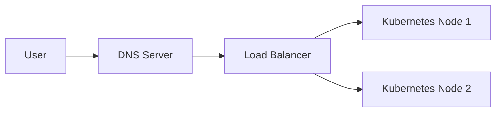

## Introduction to Managed Kubernetes Clusters and Load Balancers

In this section, we will delve into the process of deploying a managed Kubernetes cluster with MongoDB, focusing on the integration of a load balancer to manage incoming traffic efficiently. We will cover the theoretical foundations, practical steps, and security considerations involved in setting up such an environment.

### Background Theory

Kubernetes is an open-source system for automating deployment, scaling, and management of containerized applications. A managed Kubernetes cluster is a service provided by cloud providers like Linode, AWS, GCP, etc., where the provider manages the underlying infrastructure, allowing users to focus on deploying and managing their applications.

A load balancer is a device or software that distributes incoming network traffic across multiple servers. This ensures no single server bears too much load, improving performance and reliability. In the context of Kubernetes, the load balancer can be integrated with services to distribute traffic among pods.

### Setting Up the Environment

Let's start by setting up the environment using Linode. We will create a managed Kubernetes cluster and integrate it with a load balancer.

#### Creating a Managed Kubernetes Cluster

1. **Sign Up for Linode**: First, sign up for a Linode account if you haven't already.
2. **Create a Kubernetes Cluster**:
    - Navigate to the Linode dashboard.
    - Click on "Kubernetes" and then "Create".
    - Configure your cluster settings (number of nodes, region, etc.).
    - Click "Create".

#### Configuring the Load Balancer

Once the Kubernetes cluster is set up, we need to configure the load balancer.

1. **Create a Load Balancer**:
    - Navigate to the "Load Balancers" section in the Linode dashboard.
    - Click "Create Load Balancer".
    - Configure the load balancer settings (name, region, etc.).
    - Add the nodes of your Kubernetes cluster as backend nodes.

2. **Obtain the Load Balancer IP Address**:
    - After creating the load balancer, note down its IP address. This IP address will be used to route traffic to the Kubernetes cluster.

### Configuring DNS to Point to the Load Balancer

To ensure that incoming traffic is correctly routed to the Kubernetes cluster, we need to configure DNS to point to the load balancer's IP address.

#### DNS Configuration

1. **Register a Domain Name**:
    - Register a domain name (e.g., `myapp.com`) through a domain registrar.
    - Ensure the domain is properly configured with the DNS provider.

2. **Configure DNS Records**:
    - Log in to your DNS provider's control panel.
    - Create an `A` record that points the domain (`myapp.com`) to the load balancer's IP address.



### Configuring Ingress for Traffic Management

An ingress controller in Kubernetes is responsible for routing external traffic to services within the cluster. We will configure an ingress resource to forward traffic to the MongoDB service.

#### Ingress Resource Definition

1. **Create an Ingress Resource**:
    - Define an ingress resource in a YAML file.

```yaml
apiVersion: networking.k8s.io/v1
kind: Ingress
metadata:
  name: mongo-express-ingress
spec:
  rules:
  - host: myapp.com
    http:
      paths:
      - path: /
        pathType: Prefix
        backend:
          service:
            name: mongo-express-service
            port:
              number: 8081
```

2. **Apply the Ingress Resource**:
    - Apply the ingress resource to the Kubernetes cluster.

```bash
kubectl apply -f ingress.yaml
```

#### Verifying the Ingress Rule

After applying the ingress resource, verify that the rule is correctly applied.

```bash
kubectl get ingress
```

### Real-World Example: Recent Breaches and CVEs

Recent breaches and CVEs highlight the importance of proper configuration and security measures in Kubernetes environments.

#### Example: CVE-2021-25741

CVE-2021-25741 is a critical vulnerability in Kubernetes that allows attackers to bypass authentication and gain unauthorized access to the cluster. This vulnerability underscores the need for robust security practices, including proper configuration of ingress controllers and load balancers.

### Pitfalls and Common Mistakes

1. **Incorrect DNS Configuration**:
    - Failing to correctly configure DNS records can result in traffic not being routed to the correct destination.
    - Always double-check DNS configurations to ensure they point to the correct IP addresses.

2. **Improper Ingress Configuration**:
    - Incorrectly configuring ingress rules can lead to misrouting of traffic, potentially exposing sensitive services.
    - Always validate ingress rules to ensure they match the intended behavior.

### How to Prevent / Defend

#### Detection

1. **Monitoring Tools**:
    - Use monitoring tools like Prometheus and Grafana to monitor the health and performance of the Kubernetes cluster and load balancer.
    - Set up alerts for unusual traffic patterns or failed requests.

#### Prevention

1. **Secure Configuration**:
    - Ensure that all Kubernetes resources, including ingress controllers and load balancers, are configured securely.
    - Follow best practices for securing Kubernetes clusters, such as using network policies and RBAC (Role-Based Access Control).

2. **Regular Audits**:
    - Conduct regular security audits to identify and mitigate potential vulnerabilities.
    - Use tools like kube-bench to perform compliance checks against CIS (Center for Internet Security) benchmarks.

#### Secure Coding Fixes

Here is an example of a vulnerable ingress configuration and its secure counterpart:

**Vulnerable Configuration**:

```yaml
apiVersion: networking.k8s.io/v1
kind: Ingress
metadata:
  name: insecure-ingress
spec:
  rules:
  - host: myapp.com
    http:
      paths:
      - path: /
        pathType: Prefix
        backend:
          service:
            name: insecure-service
            port:
              number: 8081
```

**Secure Configuration**:

```yaml
apiVersion: networking.k8s.io/v1
kind: Ingress
metadata:
  name: secure-ingress
spec:
  rules:
  - host: myapp.com
    http:
      paths:
      - path: /
        pathType: Prefix
        backend:
          service:
            name: secure-service
            port:
              number: 8081
  tls:
  - hosts:
    - myapp.com
    secretName: tls-secret
```

### Hands-On Practice

For hands-on practice, consider the following labs:

- **PortSwigger Web Security Academy**: Offers comprehensive labs on web security, including Kubernetes and load balancer configurations.
- **OWASP Juice Shop**: A deliberately insecure web application for practicing web security skills.
- **DVWA (Damn Vulnerable Web Application)**: Another popular web application for learning web security.

These labs provide practical experience in setting up and securing Kubernetes clusters and load balancers.

### Conclusion

Deploying a managed Kubernetes cluster with MongoDB and integrating it with a load balancer requires careful planning and configuration. By following best practices and using the right tools, you can ensure a secure and efficient setup. Regular monitoring and auditing are essential to maintaining the integrity and security of your Kubernetes environment.

---
<!-- nav -->
[[04-Introduction to Kubernetes and Ingress Controllers|Introduction to Kubernetes and Ingress Controllers]] | [[DevOps/DevOps Bootcamp/09-Container Orchestration (Kubernetes)/13-Deploying Managed Kubernetes Cluster with MongoDB/00-Overview|Overview]] | [[06-Introduction to Managed Kubernetes Clusters and MongoDB Deployment|Introduction to Managed Kubernetes Clusters and MongoDB Deployment]]
