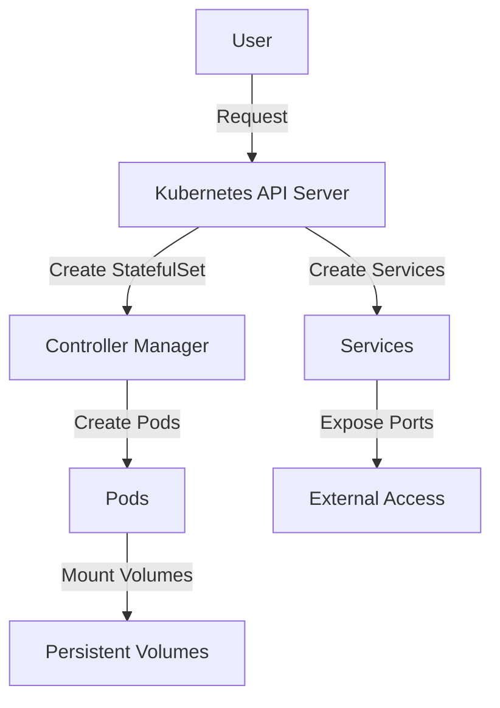

## Introduction to Managed Kubernetes Clusters and Stateful Sets

In the realm of modern DevOps practices, deploying applications in a scalable, reliable, and efficient manner is crucial. One of the most popular platforms for orchestrating containerized applications is Kubernetes. Kubernetes provides a robust framework for deploying, scaling, and managing containerized applications across clusters of hosts. In this context, a **Managed Kubernetes Cluster** refers to a Kubernetes cluster that is hosted and maintained by a cloud provider, such as Amazon EKS, Google GKE, or Azure AKS. These managed services handle the underlying infrastructure, allowing developers to focus on their applications rather than the operational aspects of the cluster.

### What is a Stateful Set?

A **Stateful Set** is a Kubernetes resource that manages stateful applications. Unlike a Deployment, which is designed for stateless applications, a Stateful Set ensures that each pod has a unique identity and persistent storage. This makes it ideal for applications that require consistent data storage, such as databases. Each pod in a Stateful Set is assigned a unique identifier, ensuring that even if the pod is rescheduled, it retains its identity and storage.

### Why Use Stateful Sets?

Stateful Sets are particularly useful for applications that require:

- Persistent storage: Data should persist even if the pod is rescheduled.
- Unique identities: Each pod should have a unique name and IP address.
- Ordered deployment and scaling: Pods should be started and stopped in a specific order.

For example, a database like MongoDB requires persistent storage and unique identities for each replica. Without these guarantees, data consistency and availability would be compromised.

### Real-World Example: MongoDB on Kubernetes

MongoDB is a popular NoSQL database that is often deployed on Kubernetes using a Stateful Set. A recent real-world example of MongoDB usage in a Kubernetes environment is the deployment of MongoDB in a microservices architecture for a large e-commerce platform. This setup ensures that each MongoDB replica has its own persistent volume and unique identity, providing high availability and data consistency.

### How to Deploy a Stateful Set with MongoDB

To deploy a Stateful Set with MongoDB on a Managed Kubernetes Cluster, you need to create a configuration file that defines the Stateful Set, services, and any additional configurations required. Let's break down the process step-by-step.

#### Step 1: Define the Stateful Set Configuration

The first step is to define the Stateful Set configuration. This includes specifying the image, version, and other necessary parameters for the MongoDB pods. Here is an example of a Stateful Set configuration file:

```yaml
apiVersion: apps/v1
kind: StatefulSet
metadata:
  name: mongodb-statefulset
spec:
  serviceName: "mongodb"
  replicas: 3
  selector:
    matchLabels:
      app: mongodb
  template:
    metadata:
      labels:
        app: mongodb
    spec:
      containers:
      - name: mongodb
        image: mongo:4.4.6
        ports:
        - containerPort: 27017
        volumeMounts:
        - name: mongodb-persistent-storage
          mountPath: /data/db
  volumeClaimTemplates:
  - metadata:
      name: mongodb-persistent-storage
    spec:
      accessModes: [ "ReadWriteOnce" ]
      resources:
        requests:
          storage: 10Gi
```

#### Step 2: Define the Services

Next, you need to define the services that will expose the MongoDB pods. This includes both a headless service for internal communication and a regular service for external access. Here is an example of the service definitions:

```yaml
apiVersion: v1
kind: Service
metadata:
  name: mongodb
spec:
  ports:
  - port: 27017
  clusterIP: None
  selector:
    app: mongodb
---
apiVersion: v1
kind: Service
metadata:
  name: mongodb-service
spec:
  ports:
  - port: 27017
    targetPort: 27017
  selector:
    app: mongodb
  type: LoadBalancer
```

### Using Helm Charts for Simplified Deployment

While manually defining the Stateful Set and services can be complex, a more streamlined approach is to use a Helm chart. Helm is a package manager for Kubernetes that simplifies the deployment of applications by packaging them into charts. A Helm chart is a collection of files that describe a related set of Kubernetes resources.

#### Finding a Helm Chart for MongoDB

One of the most popular sources for Helm charts is the Bitnami repository. Bitnami maintains a wide range of charts for various applications, including MongoDB. To use a Helm chart for MongoDB, you first need to add the Bitnami repository to your Helm client.

#### Adding the Bitnami Repository

To add the Bitnami repository, you can use the following Helm command:

```bash
helm repo add bitnami https://charts.bitnami.com/bitnami
```

After adding the repository, you can update your local Helm cache to ensure you have the latest versions of the charts:

```bash
helm repo update
```

#### Installing the MongoDB Helm Chart

Once the Bitnami repository is added, you can install the MongoDB chart using the `helm install` command. Here is an example of how to install the MongoDB chart:

```bash
helm install my-mongodb bitnami/mongodb --set auth.enabled=true,mongodbRootPassword=yourpassword,mongodbUsername=admin,mongodbPassword=yourpassword,mongodbDatabase=mydatabase
```

This command installs the MongoDB chart with authentication enabled and sets up a user and database.

### Understanding Helm Commands and Their Execution

When you execute Helm commands, they are executed against the Kubernetes cluster that you are connected to. This means that you need to ensure that your `kubectl` context is set to the correct cluster. You can check your current context using the following command:

```bash
kubectl config current-context
```

If you need to switch contexts, you can use the `kubectl config use-context` command:

```bash
kubectl config use-context my-cluster
```

### Mermaid Diagrams for Visualizing the Setup

To better understand the setup, let's visualize the components using a Mermaid diagram:



### Common Pitfalls and How to Prevent Them

#### Pitfall 1: Incorrect Image Version

Using an incorrect or outdated image version can lead to compatibility issues and security vulnerabilities. Always verify the image version and ensure it is up-to-date.

**How to Prevent:**

- Use a trusted image registry like Docker Hub or a private registry.
- Regularly update the image version in your deployment configuration.

#### Pitfall 2: Insufficient Storage Allocation

Insufficient storage allocation can lead to disk space exhaustion, causing the application to fail.

**How to Prevent:**

- Allocate sufficient storage based on the expected data size.
- Monitor storage usage and adjust as needed.

#### Pitfall 3: Misconfigured Authentication

Misconfigured authentication can lead to unauthorized access to the database.

**How to Prevent:**

- Enable authentication and use strong passwords.
- Regularly rotate passwords and monitor access logs.

### Secure Coding Practices

Here is an example of a vulnerable MongoDB deployment configuration and its secure counterpart:

**Vulnerable Configuration:**

```yaml
apiVersion: apps/v1
kind: StatefulSet
metadata:
  name: mongodb-statefulset
spec:
  serviceName: "mongodb"
  replicas: 3
  selector:
    matchLabels:
      app: mongodb
  template:
    metadata:
      labels:
        app: mongodb
    spec:
      containers:
      - name: mongodb
        image: mongo:4.4.6
        ports:
        - containerPort: 27017
        volumeMounts:
        - name: mongodb-persistent-storage
          mountPath: /data/db
  volumeClaimTemplates:
  - metadata:
      name: mongodb-persistent-storage
    spec:
      accessModes: [ "ReadWriteOnce" ]
      resources:
        requests:
          storage: 10Gi
```

**Secure Configuration:**

```yaml
apiVersion: apps/v1
kind: StatefulSet
metadata:
  name: mongodb-statefulset
spec:
  serviceName: "mongodb"
  replicas: 3
  selector:
    matchLabels:
      app: mongodb
  template:
    metadata:
      labels:
        app: mongodb
    spec:
      containers:
      - name: mongodb
        image: mongo:4.4.6
        ports:
        - containerPort: 27017
        volumeMounts:
        - name: mongodb-persistent-storage
          mountPath: /data/db
        env:
        - name: MONGO_INITDB_ROOT_USERNAME
          value: admin
        - name: MONGO_INITDB_ROOT_PASSWORD
          value: yourpassword
  volumeClaimTemplates:
  - metadata:
      name: mongodb-persistent-storage
    spec:
      accessModes: [ "ReadWriteOnce" ]
      resources:
        requests:
          storage: 10Gi
```

### Detection and Prevention Strategies

#### Detection

- **Monitoring:** Use tools like Prometheus and Grafana to monitor the health and performance of your MongoDB deployment.
- **Logging:** Enable detailed logging and use tools like ELK Stack to analyze logs for suspicious activity.

#### Prevention

- **Network Policies:** Implement network policies to restrict access to the MongoDB pods.
- **Regular Audits:** Conduct regular security audits to identify and mitigate vulnerabilities.

### Conclusion

Deploying a Managed Kubernetes Cluster with MongoDB using a Stateful Set and Helm charts provides a robust and scalable solution for managing stateful applications. By understanding the concepts, configurations, and best practices, you can ensure a secure and efficient deployment.

---
<!-- nav -->
[[06-Introduction to Managed Kubernetes Clusters and MongoDB Deployment|Introduction to Managed Kubernetes Clusters and MongoDB Deployment]] | [[DevOps/DevOps Bootcamp/09-Container Orchestration (Kubernetes)/13-Deploying Managed Kubernetes Cluster with MongoDB/00-Overview|Overview]] | [[08-Introduction to Managed Kubernetes Clusters with MongoDB|Introduction to Managed Kubernetes Clusters with MongoDB]]
