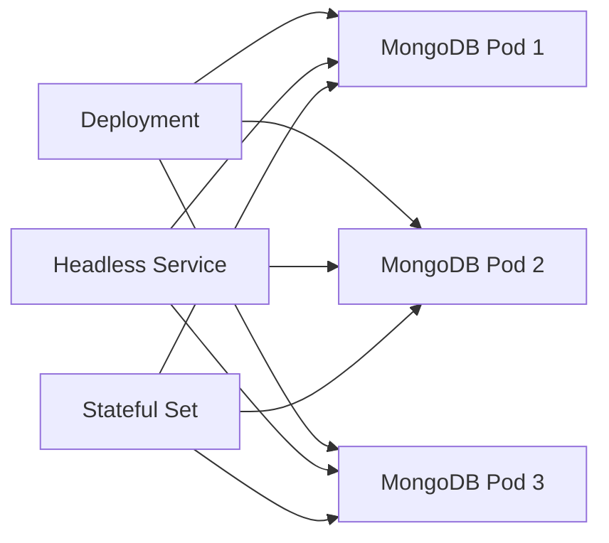
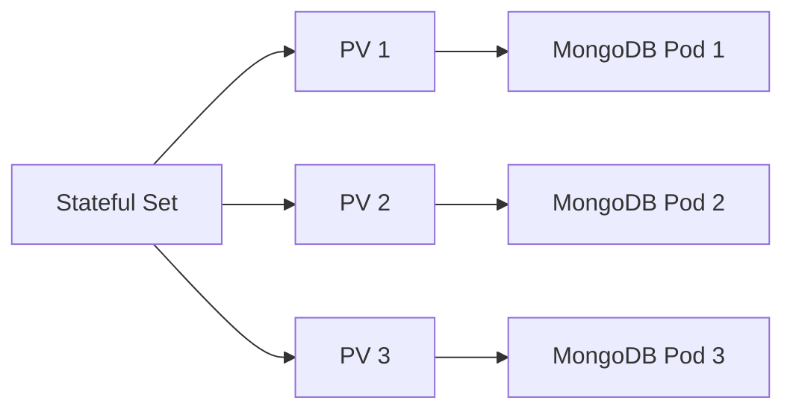

## Introduction to Managed Kubernetes Clusters with MongoDB

In this section, we delve into the deployment of a managed Kubernetes cluster with MongoDB, focusing on practical aspects and theoretical underpinnings. This setup leverages Helm charts and managed Kubernetes services to streamline the process, ensuring reliability and ease of maintenance.

### Background Theory

#### Kubernetes Overview

Kubernetes (often abbreviated as K8s) is an open-source system for automating deployment, scaling, and management of containerized applications. It groups containers that make up an application into logical units called *pods*, which can be managed and scaled together. Kubernetes provides mechanisms for deploying applications with zero downtime, rolling updates, and rollbacks.

#### Helm Charts

Helm is a package manager for Kubernetes that simplifies the deployment and management of applications. A *Helm chart* is a collection of files that describe a related set of Kubernetes resources. By using a chart, you can deploy complex applications with minimal effort. Helm charts are versioned and can be easily upgraded or rolled back.

#### Managed Kubernetes Services

Managed Kubernetes services, such as those offered by Linode, abstract away many of the complexities involved in setting up and maintaining a Kubernetes cluster. These services handle tasks such as node provisioning, upgrades, and monitoring, allowing users to focus on deploying and managing their applications.

### Deploying MongoDB with Helm

To deploy MongoDB on a managed Kubernetes cluster, we will use a Helm chart. This approach ensures that the deployment is consistent and can be easily managed.

#### Step-by-Step Deployment Process

1. **Install Helm**: Ensure that Helm is installed on your local machine. You can install it using the following command:

    ```bash
    curl https://raw.githubusercontent.com/helm/helm/main/scripts/get-helm-3 | bash
    ```

2. **Add MongoDB Helm Repository**: Add the MongoDB Helm repository to your local Helm client:

    ```bash
    helm repo add bitnami https://charts.bitnami.com/bitnami
    helm repo update
    ```

3. **Deploy MongoDB**: Use the `helm install` command to deploy MongoDB. Here is an example command:

    ```bash
    helm install mongodb bitnami/mongodb --set auth.rootPassword=<your-root-password>
    ```

    Replace `<your-root-password>` with a strong password of your choice.

4. **Verify Deployment**: Check the status of the deployed MongoDB pods and services:

    ```bash
    kubectl get all -n default
    ```

    This command lists all the pods, services, and other resources in the `default` namespace.

### Understanding the Deployment

#### Pods and Services

When you deploy MongoDB using a Helm chart, several resources are created in your Kubernetes cluster:

- **Pods**: Each MongoDB instance runs in a separate pod. In a typical deployment, you might have three pods, each representing a replica of the MongoDB database.
  
- **Services**: Multiple services are created to manage communication between the pods and external clients:
  - **MongoDB Headless Service**: This service allows direct communication between the pods, enabling replication and failover.
  - **MongoDB Stateful Set**: This resource manages the stateful nature of the MongoDB deployment, ensuring that each pod has a unique identity and persistent storage.



#### Persistent Storage

Persistent storage is crucial for databases like MongoDB to ensure data durability and availability. In this deployment, Linode Block Storage is used as the storage class.

- **Storage Class**: A storage class defines how storage is allocated to pods. In this case, the `Linode Block Storage` class is used to dynamically provision storage for each pod.

- **Persistent Volumes (PVs)**: When the stateful set is created, one PV is created for each pod. These PVs are bound to the pods and provide persistent storage.



### Accessing MongoDB

Once the deployment is complete, you can access MongoDB using the provided credentials. The root password is stored in a Kubernetes secret.

#### Retrieving the Root Password

The root password is stored in a Kubernetes secret named `mongodb`. You can retrieve it using the following command:

```bash
kubectl get secret mongodb -o jsonpath="{.data.mongodb-root-password}" | base64 --decode
```

This command decodes the base64-encoded password stored in the secret.

### Real-World Examples and Recent Breaches

#### Example: MongoDB Exposed to the Internet

In 2019, a large number of MongoDB instances were exposed to the internet due to misconfigurations. Attackers exploited these vulnerabilities to steal sensitive data and even ransom the data back to the owners.

**Security Impact**: Exposing MongoDB to the internet without proper authentication and encryption can lead to unauthorized access and data theft.

**Prevention**:
- **Secure Configuration**: Ensure that MongoDB is not accessible from the public internet. Use network policies to restrict access to trusted sources.
- **Authentication**: Enable authentication and use strong passwords. Avoid using default credentials.
- **Encryption**: Enable SSL/TLS encryption for data in transit.

**Secure Configuration Example**:

```yaml
apiVersion: v1
kind: Secret
metadata:
  name: mongodb-secret
type: Opaque
data:
  mongodb-root-password: <base64-encoded-password>
---
apiVersion: apps/v1
kind: StatefulSet
metadata:
  name: mongodb
spec:
  serviceName: "mongodb"
  replicas: 3
  selector:
    matchLabels:
      app: mongodb
  template:
    metadata:
      labels:
        app: mongodb
    spec:
      containers:
      - name: mongodb
        image: bitnami/mongodb:latest
        ports:
        - containerPort: 27017
        env:
        - name: MONGODB_ROOT_PASSWORD
          valueFrom:
            secretKeyRef:
              name: mongodb-secret
              key: mongodb-root-password
```

### How to Prevent / Defend

#### Detection

- **Monitoring**: Use tools like Prometheus and Grafana to monitor the health and performance of your MongoDB deployment.
- **Logging**: Enable logging and audit trails to track access and changes to the database.

#### Prevention

- **Network Policies**: Restrict access to MongoDB pods using Kubernetes network policies.
- **Role-Based Access Control (RBAC)**: Implement RBAC to control who can access the Kubernetes API and perform actions on the MongoDB deployment.

#### Secure Coding Fixes

**Vulnerable Code**:

```yaml
apiVersion: apps/v1
kind: StatefulSet
metadata:
  name: mongodb
spec:
  serviceName: "mongodb"
  replicas: 3
  selector:
    matchLabels:
      app: mongodb
  template:
    metadata:
      labels:
        app: mongodb
    spec:
      containers:
      - name: mongodb
        image: bitnami/mongodb:latest
        ports:
        - containerPort: 27017
        env:
        - name: MONGODB_ROOT_PASSWORD
          value: "weakpassword"
```

**Fixed Code**:

```yaml
apiVersion: v1
kind: Secret
metadata:
  name: mongodb-secret
type: Opaque
data:
  mongodb-root-password: <base64-encoded-strong-password>
---
apiVersion: apps/v1
kind: StatefulSet
metadata:
  name: mongodb
spec:
  serviceName: "mongodb"
  replicas: 3
  selector:
    matchLabels:
      app: mongodb
  template:
    metadata:
      labels:
        app: mongodb
    spec:
      containers:
      - name: mongodb
        image: bitnami/mongodb:latest
        ports:
        - containerPort: 27017
        env:
        - name: MONGODB_ROOT_PASSWORD
          valueFrom:
            secretKeyRef:
              name: mongodb-secret
              key: mongodb-root-password
```

### Hands-On Labs

For hands-on practice, consider the following labs:

- **PortSwigger Web Security Academy**: Offers a comprehensive set of labs covering various aspects of web security, including Kubernetes and MongoDB deployments.
- **OWASP Juice Shop**: A deliberately insecure web application for security training purposes. It includes challenges related to MongoDB and Kubernetes.
- **DVWA (Damn Vulnerable Web Application)**: Another popular web application for security training, which can be adapted to include MongoDB and Kubernetes scenarios.

These labs provide a practical way to apply the concepts learned in this chapter and gain hands-on experience with deploying and securing MongoDB on a managed Kubernetes cluster.

### Conclusion

Deploying MongoDB on a managed Kubernetes cluster using Helm charts offers a streamlined and reliable approach to managing containerized applications. By understanding the underlying concepts and following best practices for security and configuration, you can ensure a robust and secure deployment.

---
<!-- nav -->
[[07-Introduction to Managed Kubernetes Clusters and Stateful Sets|Introduction to Managed Kubernetes Clusters and Stateful Sets]] | [[DevOps/DevOps Bootcamp/09-Container Orchestration (Kubernetes)/13-Deploying Managed Kubernetes Cluster with MongoDB/00-Overview|Overview]] | [[09-Introduction to Managed Kubernetes Clusters|Introduction to Managed Kubernetes Clusters]]
