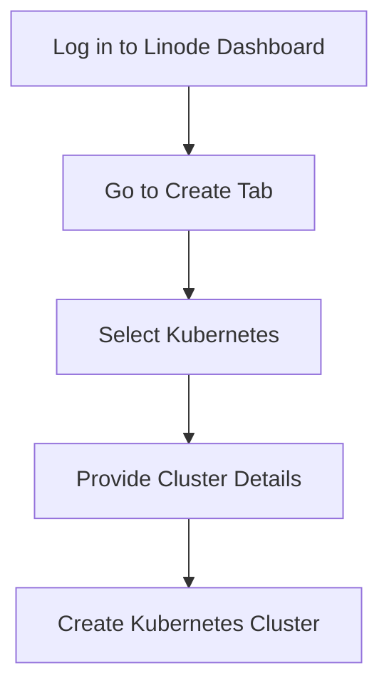
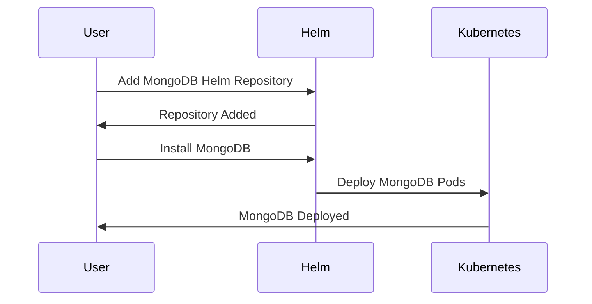
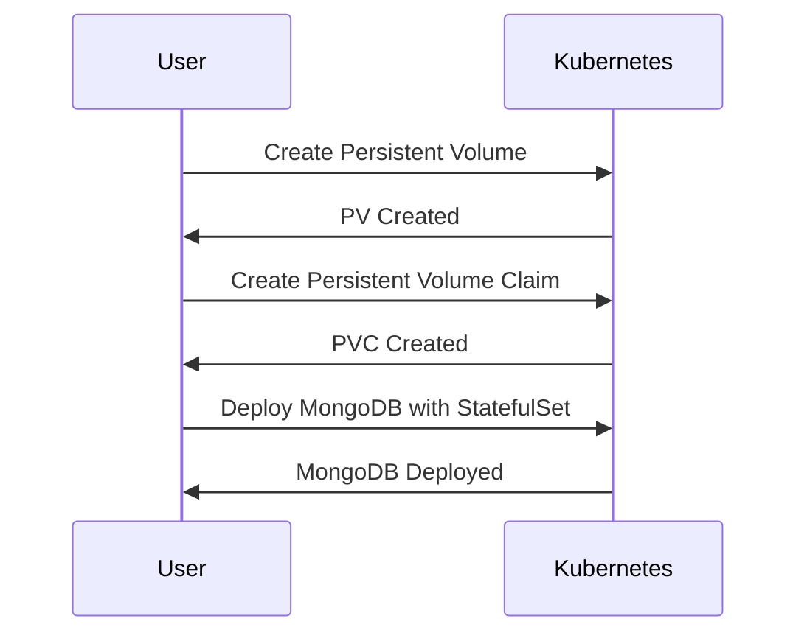
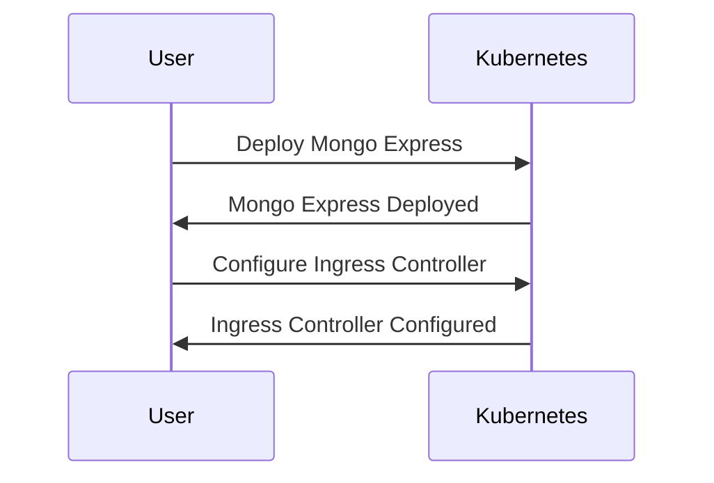
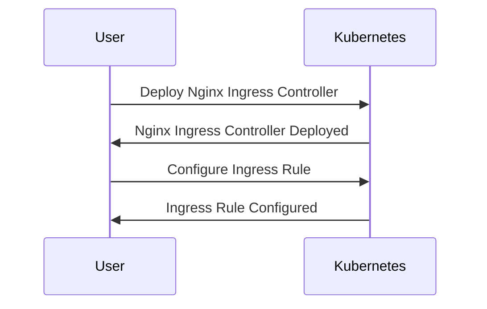

## Introduction to Managed Kubernetes Clusters

In this section, we will delve into the practical aspects of deploying a managed Kubernetes cluster on Linode, focusing specifically on deploying a replicated MongoDB database and configuring its persistence. We will also explore how to make the database accessible through a UI client from a browser using an Ingress controller. Additionally, we will utilize Helm to streamline the deployment process, showcasing its advantages and efficiency.

### What is Kubernetes?

Kubernetes, often abbreviated as K8s, is an open-source system for automating deployment, scaling, and management of containerized applications. It was originally designed by Google and is now maintained by the Cloud Native Computing Foundation. Kubernetes provides a framework for running distributed systems resiliently. It aims to make deploying and managing applications predictable and easier.

#### Why Use Kubernetes?

1. **Scalability**: Kubernetes allows you to scale your application automatically based on resource usage.
2. **Resilience**: It ensures that your application remains available even if individual components fail.
3. **Automation**: Kubernetes automates the deployment and management of your applications, reducing manual intervention.
4. **Resource Management**: It efficiently manages resources across a cluster of nodes.

### What is a Managed Kubernetes Cluster?

A managed Kubernetes cluster is a service provided by cloud providers that simplifies the deployment and management of Kubernetes clusters. Instead of setting up and maintaining the underlying infrastructure, users can focus on deploying and managing their applications.

#### Advantages of Managed Kubernetes Clusters

1. **Ease of Use**: Simplified setup and management.
2. **Reliability**: Providers ensure high availability and reliability.
3. **Security**: Enhanced security features and compliance.
4. **Cost Efficiency**: Pay-as-you-go pricing models.

### Linode Kubernetes Engine (LKE)

Linode Kubernetes Engine (LKE) is a managed Kubernetes service offered by Linode. LKE simplifies the process of deploying and managing Kubernetes clusters by handling the underlying infrastructure.

#### Setting Up a Kubernetes Cluster on Linode

To create a Kubernetes cluster on Linode, follow these steps:

1. **Log in to Linode Dashboard**:
    - Navigate to the Linode dashboard and log in with your credentials.

2. **Create a New Kubernetes Cluster**:
    - Go to the "Create" tab and select "Kubernetes".
    - Provide the necessary details such as cluster name, region, node pool configuration, etc.



### Deploying MongoDB Using Helm

Helm is a package manager for Kubernetes that simplifies the deployment and management of applications. It uses charts, which are collections of files that describe a related set of Kubernetes resources.

#### What is Helm?

Helm is a tool for managing Kubernetes applications. It streamlines the creation, deployment, and management of applications on Kubernetes. Helm charts are used to define, install, and upgrade even the most complex Kubernetes applications.

#### Installing MongoDB with Helm

To deploy MongoDB using Helm, follow these steps:

1. **Add MongoDB Helm Repository**:
    - Add the MongoDB Helm repository to your local Helm installation.

    ```sh
    helm repo add bitnami https://charts.bitnami.com/bitnami
    ```

2. **Install MongoDB**:
    - Install MongoDB using the Helm chart.

    ```sh
    helm install my-mongodb bitnami/mongodb --set replicaSet.enabled=true
    ```

3. **Verify Installation**:
    - Check the status of the deployed MongoDB pods.

    ```sh
    kubectl get pods
    ```



### Creating Replicated MongoDB Using StatefulSets

StatefulSets are used to manage stateful applications in Kubernetes. They provide stable, unique network identifiers and storage for each pod.

#### What is a StatefulSet?

A StatefulSet is a Kubernetes resource that manages a set of pods that are identical but have unique identities. This is particularly useful for stateful applications like databases.

#### Configuring Data Persistence

To ensure data persistence, we will use Linode Cloud Storage.

1. **Create a Persistent Volume (PV)**:
    - Define a PV using a YAML file.

    ```yaml
    apiVersion: v1
    kind: PersistentVolume
    metadata:
      name: mongodb-pv
    spec:
      capacity:
        storage: 10Gi
      accessModes:
        - ReadWriteOnce
      persistentVolumeReclaimPolicy: Retain
      storageClassName: linode-storage
      csi:
        driver: linode.com
        volumeHandle: <volume-id>
    ```

2. **Create a Persistent Volume Claim (PVC)**:
    - Define a PVC using a YAML file.

    ```yaml
    apiVersion: v1
    kind: PersistentVolumeClaim
    metadata:
      name: mongodb-pvc
    spec:
      accessModes:
        - ReadWriteOnce
      resources:
        requests:
          storage: 10Gi
      storageClassName: linode-storage
    ```

3. **Deploy MongoDB with StatefulSet**:
    - Define a StatefulSet using a YAML file.

    ```yaml
    apiVersion: apps/v1
    kind: StatefulSet
    metadata:
      name: mongodb-statefulset
    spec:
      serviceName: "mongodb"
      replicas: 3
      selector:
        matchLabels:
          app: mongodb
      template:
        metadata:
          labels:
            app: mongodb
        spec:
          containers:
          - name: mongodb
            image: mongo:latest
            ports:
            - containerPort: 27017
            volumeMounts:
            - name: mongodb-data
              mountPath: /data/db
      volumeClaimTemplates:
      - metadata:
          name: mongodb-data
        spec:
          accessModes: [ "ReadWriteOnce" ]
          resources:
            requests:
              storage: 10Gi
    ```



### Deploying a UI Client for MongoDB

MongoDB Express is a web-based user interface for MongoDB that allows you to interact with your database through a browser.

#### What is Mongo Express?

Mongo Express is a web-based administration tool for MongoDB. It provides a simple interface to manage your MongoDB databases, collections, and documents.

#### Deploying Mongo Express

1. **Deploy Mongo Express**:
    - Define a Deployment and Service using a YAML file.

    ```yaml
    apiVersion: apps/v1
    kind: Deployment
    metadata:
      name: mongo-express
    spec:
      replicas: 1
      selector:
        matchLabels:
          app: mongo-express
      template:
        metadata:
          labels:
            app: mongo-express
        spec:
          containers:
          - name: mongo-express
            image: mongoexpress:mongo4.4
            env:
            - name: ME_CONFIG_MONGODB_SERVER
              value: my-mongodb
            - name: ME_CONFIG_MONGODB_PORT
              value: "27017"
            ports:
            - containerPort: 8081
    ---
    apiVersion: v1
    kind: Service
    metadata:
      name: mongo-express-service
    spec:
      type: NodePort
      ports:
      - port: 8081
        targetPort: 8081
      selector:
        app: mongo-express
    ```

2. **Configure Ingress Controller**:
    - Deploy an Ingress controller using a YAML file.

    ```yaml
    apiVersion: networking.k8s.io/v1
    kind: Ingress
    metadata:
      name: mongo-express-ingress
    spec:
      rules:
      - host: mongo-express.example.com
        http:
          paths:
          - path: /
            pathType: Prefix
            backend:
              service:
                name: mongo-express-service
                port:
                  number: 8081
    ```



### Handling Browser Requests with Ingress

An Ingress controller is responsible for routing external traffic to services within the cluster. It acts as a reverse proxy and load balancer.

#### What is an Ingress Controller?

An Ingress controller is a component that implements the Ingress resource. It routes external traffic to internal services based on rules defined in the Ingress resource.

#### Configuring Ingress Rules

1. **Deploy Nginx Ingress Controller**:
    - Deploy the Nginx Ingress controller using a YAML file.

    ```yaml
    apiVersion: apps/v1
    kind: Deployment
    metadata:
      name: nginx-ingress-controller
    spec:
      replicas: 1
      selector:
        matchLabels:
          app: nginx-ingress
      template:
        metadata:
          labels:
            app: nginx-ingress
        spec:
          containers:
          - name: nginx-ingress-controller
            image: quay.io/kubernetes-ingress-controller/nginx-ingress-controller:0.41.2
            args:
            - /nginx-ingress-controller
            - --configmap=$(POD_NAMESPACE)/nginx-configuration
            - --default-backend-service=$(POD_NAMESPACE)/default-http-backend
            - --election-id=ingress-controller-leader
            - --ingress-class=nginx
            - --namespace=$(POD_NAMESPACE)
            ports:
            - containerPort: 80
            - containerPort: 443
    ---
    apiVersion: v1
    kind: Service
    metadata:
      name: nginx-ingress-controller
    spec:
      type: LoadBalancer
      ports:
      - port: 80
        targetPort: 80
      - port: 443
        targetPort: 443
      selector:
        app: nginx-ingress
    ```

2. **Configure Ingress Rule**:
    - Define an Ingress rule using a YAML file.

    ```yaml
    apiVersion: networking.k8s.io/v1
    kind: Ingress
    metadata:
      name: mongo-express-ingress
    spec:
      rules:
      - host: mongo-express.example.com
        http:
          paths:
          - path: /
            pathType: Prefix
            backend:
              service:
                name: mongo-express-service
                port:
                  number: 8081
    ```



### Security Considerations and Best Practices

When deploying a Kubernetes cluster and applications, it is crucial to consider security best practices to protect against vulnerabilities and breaches.

#### Common Vulnerabilities and Mitigations

1. **CVE-2021-25741**: This vulnerability affects Kubernetes versions prior to 1.21. It allows attackers to bypass RBAC policies and gain unauthorized access to resources.
    - **Mitigation**: Ensure you are running the latest version of Kubernetes and apply security patches regularly.

2. **CVE-2021-25742**: This vulnerability affects Kubernetes versions prior to 1.21. It allows attackers to escalate privileges and execute arbitrary commands.
    - **Mitigation**: Apply the necessary security patches and update your Kubernetes cluster to the latest version.

#### Secure Configuration Examples

1. **RBAC Policies**:
    - Define Role-Based Access Control (RBAC) policies to restrict access to sensitive resources.

    ```yaml
    apiVersion: rbac.authorization.k8s.io/v1
    kind: Role
    metadata:
      namespace: default
      name: pod-reader
    rules:
    - apiGroups: [""]
      resources: ["pods"]
      verbs: ["get", "watch", "list"]
    ---
    apiVersion: rbac.authorization.k8s.io/v1
    kind: RoleBinding
    metadata:
      name: read-pods
      namespace: default
    subjects:
    - kind: Group
      name: pod-readers
      apiGroup: rbac.authorization.k8s.io
    roleRef:
      kind: Role
      name: pod-reader
      apiGroup: rbac.authorization.k8s.io
    ```

2. **Network Policies**:
    - Define Network Policies to control traffic between pods.

    ```yaml
    apiVersion: networking.k8s.io/v1
    kind: NetworkPolicy
    metadata:
      name: deny-all
      namespace: default
    spec:
      podSelector: {}
      ingress: []
      egress: []
    ```

#### How to Prevent / Defend

1. **Detection**:
    - Use tools like `kube-bench` to audit your Kubernetes cluster for security compliance.
    - Monitor your cluster using tools like `Prometheus` and `Grafana`.

2. **Prevention**:
    - Regularly update your Kubernetes cluster and apply security patches.
    - Implement RBAC policies to restrict access to sensitive resources.
    - Use Network Policies to control traffic between pods.

3. **Secure Coding Fixes**:
    - **Vulnerable Code**:
        ```yaml
        apiVersion: v1
        kind: Pod
        metadata:
          name: vulnerable-pod
        spec:
          containers:
          - name: vulnerable-container
            image: vulnerable-image
            ports:
            - containerPort: 80
        ```
    - **Fixed Code**:
        ```yaml
        apiVersion: v1
        kind: Pod
        metadata:
          name: secure-pod
        spec:
          containers:
          - name: secure-container
            image: secure-image
            ports:
            - containerPort: 80
            securityContext:
              runAsNonRoot: true
              readOnlyRootFilesystem: true
        ```

4. **Configuration Hardening**:
    - Harden your Kubernetes configuration by disabling unnecessary API endpoints and enabling security features.

    ```yaml
    apiVersion: v1
    kind: ConfigMap
    metadata:
      name: kube-apiserver
      namespace: kube-system
    data:
      enable-admission-plugins: "NamespaceLifecycle,LimitRanger,ServiceAccount,DefaultStorageClass,DefaultTolerationSeconds,MutatingAdmissionWebhook,ValidatingAdmissionWebhook,ResourceQuota"
      admission-control-config-file: "/etc/kubernetes/admission-controls.yaml"
    ```

### Conclusion

In this section, we covered the practical aspects of deploying a managed Kubernetes cluster on Linode, focusing on deploying a replicated MongoDB database and configuring its persistence. We also explored how to make the database accessible through a UI client from a browser using an Ingress controller. Additionally, we utilized Helm to streamline the deployment process, showcasing its advantages and efficiency.

By following the steps outlined in this chapter, you can effectively set up and manage a Kubernetes cluster with MongoDB and ensure its security through best practices and mitigation strategies.

### Practice Labs

For hands-on experience with deploying a managed Kubernetes cluster with MongoDB, consider the following labs:

- **PortSwigger Web Security Academy**: Offers practical exercises for web application security.
- **OWASP Juice Shop**: Provides a vulnerable web application for learning security concepts.
- **DVWA (Damn Vulnerable Web Application)**: Another popular web application for security training.
- **WebGoat**: An interactive web application security training tool.

These labs will help you reinforce the concepts learned in this chapter and gain practical experience in deploying and securing a Kubernetes cluster with MongoDB.

---
<!-- nav -->
[[08-Introduction to Managed Kubernetes Clusters with MongoDB|Introduction to Managed Kubernetes Clusters with MongoDB]] | [[DevOps/DevOps Bootcamp/09-Container Orchestration (Kubernetes)/13-Deploying Managed Kubernetes Cluster with MongoDB/00-Overview|Overview]] | [[10-Deploying Managed Kubernetes Cluster with MongoDB|Deploying Managed Kubernetes Cluster with MongoDB]]
