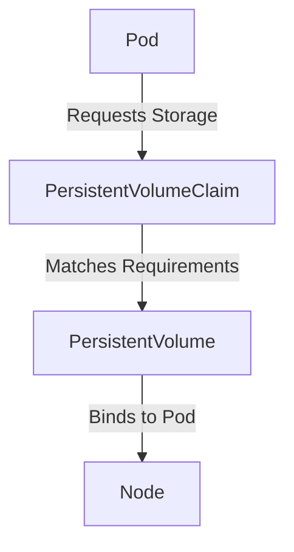

## Persistent Volumes and Nodes in Kubernetes

In Kubernetes, a **Persistent Volume (PV)** is a piece of storage in the cluster that has been provisioned by an administrator or dynamically using Storage Classes. It is a resource in the cluster just like a node. PVs are volume plugins like Volumes, but they have a lifecycle independent of any individual Pod that uses the PV. This API object captures details of the implementation of the storage, be that NFS, iSCSI, or a cloud-provider-specific storage system.

### What is a Persistent Volume?

A Persistent Volume (PV) is a piece of storage in the cluster that has been provisioned by an administrator or dynamically using Storage Classes. It is a resource in the cluster just like a node. PVs are volume plugins like Volumes, but they have a lifecycle independent of any individual Pod that uses the PV. This API object captures details of the implementation of the storage, be that NFS, iSCSI, or a cloud-provider-specific storage system.

### Why Use Persistent Volumes?

Persistent Volumes are essential for applications that require persistent storage, such as databases. They ensure that data remains available even if a Pod is rescheduled to a different node. Without persistent storage, data would be lost whenever a Pod is restarted or moved.

### How Persistent Volumes Work

When a Pod requires a Persistent Volume, it requests a specific amount of storage and specifies the access mode (e.g., ReadWriteOnce, ReadOnlyMany, ReadWriteMany). The Kubernetes scheduler then finds a suitable Persistent Volume that matches the requirements and binds it to the Pod.



### Example: Creating a Persistent Volume

Here is an example of creating a Persistent Volume using NFS:

```yaml
apiVersion: v1
kind: PersistentVolume
metadata:
  name: nfs-pv
spec:
  capacity:
    storage: 10Gi
  accessModes:
    - ReadWriteMany
  nfs:
    path: /exports/data
    server: nfs-server.example.com
```

### Persistent Volume Claims

A **Persistent Volume Claim (PVC)** is a request for storage by a user. It is similar to a Pod. Pods consume node resources and PVCs consume PV resources. Users define their requests in terms of PVCs and cluster administrators provision storage using PVs.

### Example: Creating a Persistent Volume Claim

Here is an example of creating a Persistent Volume Claim:

```yaml
apiVersion: v1
kind: PersistentVolumeClaim
metadata:
  name: data-pvc
spec:
  accessModes:
    - ReadWriteOnce
  resources:
    requests:
      storage: 10Gi
```

### Binding a Persistent Volume to a Pod

To bind a Persistent Volume to a Pod, you need to specify the PVC in the Pod's volume specification:

```yaml
apiVersion: v1
kind: Pod
metadata:
  name: my-pod
spec:
  containers:
  - name: my-container
    image: my-image
    volumeMounts:
    - mountPath: /data
      name: data-volume
  volumes:
  - name: data-volume
    persistentVolumeClaim:
      claimName: data-pvc
```

### How to Prevent / Defend

#### Detection
- Monitor the Kubernetes API for unauthorized changes to PVs and PVCs.
- Use tools like `kube-bench` to check for misconfigurations.

#### Prevention
- Ensure proper RBAC (Role-Based Access Control) policies are in place.
- Use Kubernetes secrets to store sensitive information securely.

#### Secure Code Fix
- Always validate input and ensure proper access controls are in place.

### Real-World Examples

- **CVE-2021-25741**: A vulnerability in Kubernetes allowed attackers to escalate privileges by manipulating Persistent Volumes. Ensure your Kubernetes version is up-to-date and apply necessary patches.

---
<!-- nav -->
[[17-Internal Services in Kubernetes Clusters|Internal Services in Kubernetes Clusters]] | [[DevOps/DevOps Bootcamp/09-Container Orchestration (Kubernetes)/13-Deploying Managed Kubernetes Cluster with MongoDB/00-Overview|Overview]] | [[19-Setting Up a Managed Kubernetes Cluster with MongoDB|Setting Up a Managed Kubernetes Cluster with MongoDB]]
