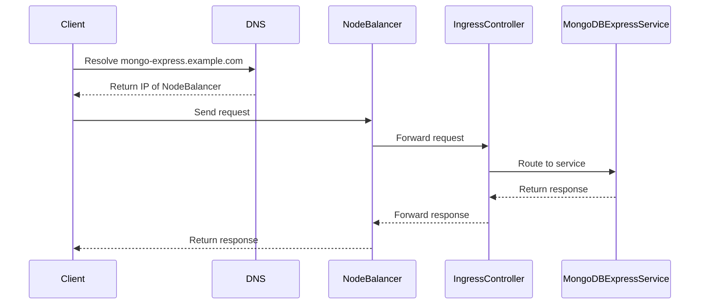

## Setting Up a Managed Kubernetes Cluster with MongoDB

### Prerequisites

Before we begin, ensure you have the following:

1. **Kubernetes Cluster**: A managed Kubernetes cluster (e.g., Linode, AWS EKS, GCP GKE).
2. **kubectl**: The Kubernetes command-line tool installed and configured to interact with your cluster.
3. **MongoDB Helm Chart**: The official MongoDB Helm chart for easy deployment.
4. **Ingress Controller**: An Ingress controller deployed in your cluster (e.g., NGINX Ingress Controller).

### Step-by-Step Deployment

#### Step 1: Deploy MongoDB Using Helm

First, deploy MongoDB using the official Helm chart. This simplifies the deployment process and ensures best practices are followed.

```bash
helm repo add bitnami https://charts.bitnami.com/bitnami
helm install my-mongodb bitnami/mongodb --set auth.enabled=true
```

This command installs MongoDB with authentication enabled. The `my-mongodb` release name can be customized as needed.

#### Step 2: Configure Ingress Rules

Next, configure the Ingress rules to route traffic to the MongoDB Express UI. Create an Ingress resource that maps the desired hostname to the MongoDB Express service.

```yaml
apiVersion: networking.k8s.io/v1
kind: Ingress
metadata:
  name: mongo-express-ingress
  annotations:
    kubernetes.io/ingress.class: "nginx"
spec:
  rules:
  - host: mongo-express.example.com
    http:
      paths:
      - path: /
        pathType: Prefix
        backend:
          service:
            name: mongo-express-service
            port:
              number: 8081
```

Apply the Ingress configuration:

```bash
kubectl apply -f mongo-express-ingress.yaml
```

#### Step 3: Access MongoDB Express UI

Access the MongoDB Express UI by navigating to the configured hostname (`mongo-express.example.com`). The Ingress controller will resolve the hostname to the IP address of the Node Balancer, which then forwards the request to the MongoDB Express service.

### Understanding the Request Flow

Let's break down the request flow in detail:

1. **DNS Resolution**: The client resolves the hostname (`mongo-express.example.com`) to the IP address of the Node Balancer.
2. **Node Balancer**: The Node Balancer receives the request and forwards it to the Ingress controller.
3. **Ingress Controller**: The Ingress controller examines the request and matches it against the defined Ingress rules.
4. **Service Routing**: Based on the Ingress rules, the request is forwarded to the MongoDB Express service at port 8081.
5. **Response**: The MongoDB Express service processes the request and returns the response to the client.

#### Mermaid Diagram: Request Flow



### Data Persistence with Volumes

To ensure data persistence, we use volumes. Volumes are mounted to the pods, providing a persistent storage solution.

#### Configuring Persistent Volumes

Create a PersistentVolumeClaim (PVC) to request storage from the cluster.

```yaml
apiVersion: v1
kind: PersistentVolumeClaim
metadata:
  name: mongodb-pvc
spec:
  accessModes:
    - ReadWriteOnce
  resources:
    requests:
      storage: 10Gi
```

Apply the PVC:

```bash
kubectl apply -f mongodb-pvc.yaml
```

#### Mounting Volumes to Pods

Mount the PVC to the MongoDB pods using the StatefulSet configuration.

```yaml
apiVersion: apps/v1
kind: StatefulSet
metadata:
  name: mongodb-statefulset
spec:
  serviceName: "mongodb-headless"
  replicas: 3
  selector:
    matchLabels:
      app: mongodb
  template:
    metadata:
      labels:
        app: mongodb
    spec:
      containers:
      - name: mongodb
        image: mongo:latest
        volumeMounts:
        - name: mongodb-storage
          mountPath: /data/db
  volumeClaimTemplates:
  - metadata:
      name: mongodb-storage
    spec:
      accessModes: [ "ReadWriteOnce" ]
      resources:
        requests:
          storage: 10Gi
```

Apply the StatefulSet:

```bash

kubectl apply -f mongodb-statefulset.yaml
```

### Scaling Down and Up

To demonstrate data persistence, we can scale down the StatefulSet to zero replicas and then scale it back up.

#### Scale Down

Scale down the StatefulSet to zero replicas:

```bash
kubectl scale statefulset mongodb-statefulset --replicas=0
```

Verify that the pods are terminating:

```bash
kubectl get pods
```

#### Scale Up

Scale the StatefulSet back to three replicas:

```bash
kubectl scale statefulset mongodb-statefulset --replicas=3
```

Verify that the pods are being recreated:

```bash
kubectl get pods
```

### Data Persistence Verification

Navigate to the MongoDB Express UI and verify that the data is still present despite the pods being deleted and recreated.

### Security Considerations

#### Potential Risks

1. **Insecure Configuration**: Misconfigured Ingress rules can expose services to unauthorized access.
2. **Data Exposure**: Improperly configured persistent storage can lead to data exposure.
3. **Authentication Bypass**: Weak authentication mechanisms can be exploited.

#### How to Prevent / Defend

##### Secure Ingress Configuration

Ensure that Ingress rules are properly configured to restrict access to authorized users.

```yaml
apiVersion: networking.k8s.io/v1
kind: Ingress
metadata:
  name: secure-mongo-express-ingress
  annotations:
    nginx.ingress.kubernetes.io/auth-type: basic
    nginx.ingress.kubernetes.io/auth-secret: basic-auth-secret
spec:
  rules:
  - host: mongo-express.example.com
    http:
      paths:
      - path: /
        pathType: Prefix
        backend:
          service:
            name: mongo-express-service
            port:
              number: 8081
```

Create a secret for basic authentication:

```bash
kubectl create secret generic basic-auth-secret --from-literal=username=admin --from-literal=password=secretpassword
```

##### Secure Persistent Storage

Ensure that persistent storage is properly secured and backed up.

```yaml
apiVersion: v1
kind: PersistentVolumeClaim
metadata:
  name: secure-mongodb-pvc
spec:
  accessModes:
    - ReadWriteOnce
  resources:
    requests:
      storage: 10Gi
  storageClassName: encrypted-storage
```

Use a storage class that supports encryption.

##### Strong Authentication Mechanisms

Enable strong authentication mechanisms for MongoDB.

```yaml
apiVersion: apps/v1
kind: StatefulSet
metadata:
  name: secure-mongodb-statefulset
spec:
  serviceName: "mongodb-headless"
  replicas: 3
  selector:
    matchLabels:
      app: mongodb
  template:
    metadata:
      labels:
        app: mongodb
    spec:
      containers:
      - name: mongodb
        image: mongo:latest
        env:
        - name: MONGO_INITDB_ROOT_USERNAME
          value: admin
        - name: MONGO_INITDB_ROOT_PASSWORD
          value: secretpassword
        volumeMounts:
        - name: mongodb-storage
          mountPath: /data/db
  volumeClaimTemplates:
  - metadata:
      name: mongodb-storage
    spec:
      accessModes: [ "ReadWriteOnce" ]
      resources:
        requests:
          storage: 10Gi
```

### Real-World Examples and Breaches

#### Example: MongoDB Exposed to the Internet

In 2019, a large number of MongoDB instances were exposed to the internet due to misconfiguration. Attackers exploited these instances to steal sensitive data and ransom the owners.

**CVE-2019-10149**: This CVE highlights the importance of securing MongoDB instances and ensuring proper authentication mechanisms are in place.

**Mitigation**: Ensure MongoDB instances are not exposed to the public internet and use strong authentication mechanisms.

### Hands-On Labs

For hands-on practice, consider the following labs:

- **PortSwigger Web Security Academy**: Offers exercises on securing web applications, including MongoDB deployments.
- **OWASP Juice Shop**: Provides a vulnerable web application for practicing security techniques.
- **Linode Kubernetes Lab**: Offers a guided lab for deploying and managing Kubernetes clusters on Linode.

### Conclusion

Deploying a managed Kubernetes cluster with MongoDB involves several key steps, including setting up an Ingress controller, configuring persistent storage, and ensuring data persistence. By following best practices and implementing robust security measures, you can effectively manage and secure your MongoDB deployment within a Kubernetes environment.

---
<!-- nav -->
[[18-Persistent Volumes and Nodes in Kubernetes|Persistent Volumes and Nodes in Kubernetes]] | [[DevOps/DevOps Bootcamp/09-Container Orchestration (Kubernetes)/13-Deploying Managed Kubernetes Cluster with MongoDB/00-Overview|Overview]] | [[DevOps/DevOps Bootcamp/09-Container Orchestration (Kubernetes)/13-Deploying Managed Kubernetes Cluster with MongoDB/20-Practice Questions & Answers|Practice Questions & Answers]]
