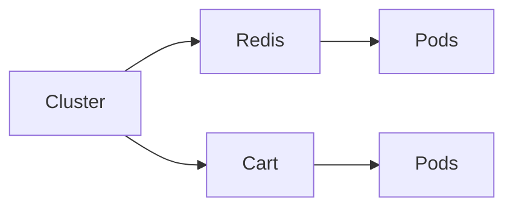

## Creating a Helmfile

Once the cluster is clean, the next step is to create a `Helmfile` to manage the deployment of microservices. A `Helmfile` is a YAML file that defines the Helm releases and their configurations.

### Structure of a Helmfile

A `Helmfile` consists of several key components:

1. **Releases**: Defines the Helm releases to be deployed.
2. **Charts**: Specifies the Helm charts to be used for each release.
3. **Values Files**: Contains custom values to override the defaults in the Helm charts.

#### Example Helmfile

```yaml
releases:
  - name: redis
    chart: ./charts/redis
    values:
      - ./values/redis-values.yaml

  - name: cart
    chart: ./charts/cart
    values:
      - ./values/cart-values.yaml
```

### Releases Attribute

The `releases` attribute is the top-level key in a `Helmfile`. Under this attribute, you define individual releases, each representing a Helm chart to be deployed.

#### Syntax of a Release

Each release is defined with the following structure:

```yaml
- name: <release-name>
  chart: <chart-path>
  values:
    - <values-file-path>
```

- **name**: The name of the release. This is the same name you would pass to `helm install`.
- **chart**: The path to the Helm chart to be used for this release.
- **values**: A list of paths to values files that override the default values in the chart.

### Chart Attribute

The `chart` attribute specifies the path to the Helm chart to be used for the release. This can be either a local path or a reference to a chart repository.

#### Example Charts

For instance, if you have a local chart for Redis located at `./charts/redis`, you would specify it as follows:

```yaml
chart: ./charts/redis
```

### Values Files

The `values` attribute allows you to provide custom values to override the defaults in the Helm chart. You can specify multiple values files or individual parameters.

#### Example Values File

```yaml
# redis-values.yaml
redis:
  image:
    tag: "6.2-alpine"
  persistence:
    enabled: true
    storageClass: "standard"
```

### Default Values

By default, Helm uses the values defined in the chart's `values.yaml` file. The values provided in the `Helmfile` override these defaults.

### How to Prevent / Defend

To ensure proper management of Helm releases:

1. **Version Control**: Keep your `Helmfile` and values files under version control to track changes.
2. **Testing**: Test your `Helmfile` in a staging environment before deploying to production.
3. **Documentation**: Document the purpose and usage of each release and values file for future reference.

### Real-World Examples

#### Example 1: Redis Deployment

Consider a scenario where you are deploying a Redis service using Helm. The `Helmfile` might look like this:

```yaml
releases:
  - name: redis
    chart: ./charts/redis
    values:
      - ./values/redis-values.yaml
```

#### Example 2: Cart Service Deployment

Similarly, for a Cart service, the `Helmfile` might look like this:

```yaml
releases:
  - name: cart
    chart: ./charts/cart
    values:
      - ./values/cart-values.yaml
```

### Mermaid Diagrams

#### Cluster Topology



### Conclusion

Deploying microservices with Helm requires a thorough understanding of both uninstallation and the creation of a `Helmfile`. By following best practices and using tools like `Helmfile`, you can ensure a clean and efficient deployment process. Always remember to test and document your configurations to maintain a secure and manageable cluster.

---
<!-- nav -->
[[01-Introduction to Helm and Microservices Deployment|Introduction to Helm and Microservices Deployment]] | [[DevOps/DevOps Bootcamp/09-Container Orchestration (Kubernetes)/14-Deploying Microservices with Helm Commands/00-Overview|Overview]] | [[03-Deploying Microservices with Helm Commands|Deploying Microservices with Helm Commands]]
