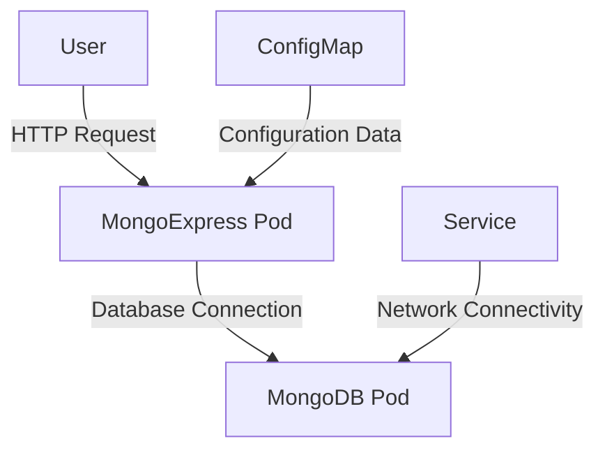

## Introduction to Config Maps in Kubernetes

In Kubernetes, Config Maps are used to store non-confidential data in key-value pairs. They are often used to externalize configuration details from an application’s container image, making it easier to manage and update these configurations without rebuilding the image. This is particularly useful for applications that require dynamic configuration settings, such as database connection strings, API keys, or other environment-specific parameters.

### What is a Config Map?

A Config Map is a Kubernetes object that stores configuration data as key-value pairs. These key-value pairs can be referenced by pods, deployments, and other Kubernetes resources. Unlike secrets, which are used to store sensitive information, Config Maps are designed for non-sensitive data.

#### Why Use Config Maps?

Using Config Maps offers several benefits:

1. **Decoupling Configuration from Code**: By storing configuration data outside of the application code, you can easily modify configurations without needing to rebuild and redeploy the application.
   
2. **Dynamic Configuration Management**: Config Maps allow you to change configuration settings dynamically at runtime, which is particularly useful in microservices architectures where services may need to adapt to changing environments.

3. **Environment-Specific Configurations**: Different environments (development, staging, production) can have different configurations, and Config Maps make it easy to manage these differences.

### How Config Maps Work

Config Maps are defined using YAML files. Here is a basic structure of a Config Map:

```yaml
apiVersion: v1
kind: ConfigMap
metadata:
  name: my-config-map
data:
  key1: value1
  key2: value2
```

In this example, `my-config-map` is the name of the Config Map, and it contains two key-value pairs: `key1` and `key2`.

#### Creating a Config Map

To create a Config Map, you can use the `kubectl create configmap` command or apply a YAML file using `kubectl apply`. Here is an example of creating a Config Map using a YAML file:

```yaml
apiVersion: v1
kind: ConfigMap
metadata:
  name: mongo-config-map
data:
  databaseURL: mongodb://mongo-service:27017/mydatabase
  serverName: mongo-service
```

To apply this Config Map, run:

```bash
kubectl apply -f config-map.yaml
```

### Referencing Config Maps in Deployments

Once a Config Map is created, you can reference it in your deployment YAML files. This allows you to inject configuration data into your pods at runtime. Here is an example of how to reference a Config Map in a deployment:

```yaml
apiVersion: apps/v1
kind: Deployment
metadata:
  name: mongo-express-deployment
spec:
  replicas: 1
  selector:
    matchLabels:
      app: mongo-express
  template:
    metadata:
      labels:
        app: mongo-express
    spec:
      containers:
      - name: mongo-express
        image: mongoexpress/mongo-express:latest
        env:
        - name: ME_CONFIG_MONGODB_SERVER
          valueFrom:
            configMapKeyRef:
              name: mongo-config-map
              key: serverName
        - name: ME_CONFIG_MONGODB_PORT
          value: "27017"
        - name: ME_CONFIG_MONGODB_URL
          valueFrom:
            configMapKeyRef:
              name: mongo-config-map
              key: databaseURL
```

In this example, the `ME_CONFIG_MONGODB_SERVER` and `ME_CONFIG_MONGODB_URL` environment variables are set using values from the `mongo-config-map` Config Map.

### Order of Execution

When deploying resources that depend on Config Maps, it is crucial to ensure that the Config Map is created before the deployment. This is because the deployment references the Config Map, and if the Config Map does not exist, the deployment will fail.

To ensure the correct order of execution, you can either:

1. **Create the Config Map First**: Manually create the Config Map before applying the deployment.
   
   ```bash
   kubectl apply -f config-map.yaml
   kubectl apply -f deployment.yaml
   ```

2. **Use a Single YAML File**: Combine the Config Map and deployment definitions into a single YAML file. Kubernetes will automatically handle the dependencies and create the Config Map before the deployment.

   ```yaml
   apiVersion: v1
   kind: ConfigMap
   metadata:
     name: mongo-config-map
   data:
     databaseURL: mongodb://mongo-service:27017/mydatabase
     serverName: mongo-service
   ---
   apiVersion: apps/v1
   kind: Deployment
   metadata:
     name: mongo-express-deployment
   spec:
     replicas: 1
     selector:
       matchLabels:
         app: mongo-express
     template:
       metadata:
         labels:
           app: mongo-express
       spec:
         containers:
         - name: mongo-express
           image: mongoexpress/mongo-express:latest
           env:
           - name: ME_CONFIG_MONGODB_SERVER
             valueFrom:
               configMapKeyRef:
                 name: mongo-config-map
                 key: serverName
           - name: ME_CONFIG_MONGODB_PORT
             value: "27017"
           - name: ME_CONFIG_MONGODB_URL
             valueFrom:
               configMapKeyRef:
                 name: mongo-config-map
                 key: databaseURL
   ```

### Common Pitfalls and Best Practices

#### Pitfall: Missing Config Map

If a Config Map is missing or not properly referenced, the deployment will fail. Always ensure that the Config Map exists and is correctly referenced in the deployment.

#### Best Practice: Use Descriptive Names

Use descriptive names for your Config Maps and keys to make it clear what the configuration data represents. This improves readability and maintainability.

#### Best Practice: Separate Environment-Specific Configurations

For different environments (development, staging, production), consider using separate Config Maps. This allows you to manage environment-specific configurations more effectively.

### Real-World Example: MongoDB and MongoExpress in Kubernetes

Let's walk through a complete example of deploying MongoDB and MongoExpress in Kubernetes using Config Maps.

#### Step 1: Create the MongoDB Service

First, create a service for MongoDB:

```yaml
apiVersion: v1
kind: Service
metadata:
  name: mongo-service
spec:
  ports:
  - port: 27017
  selector:
    app: mongo
```

Apply this service definition:

```bash
kubectl apply -f mongo-service.yaml
```

#### Step 2: Create the MongoDB Deployment

Next, create a deployment for MongoDB:

```yaml
apiVersion: apps/v1
kind: Deployment
metadata:
  name: mongo-deployment
spec:
  replicas: 1
  selector:
    matchLabels:
      app: mongo
  template:
    metadata:
      labels:
        app: mongo
    spec:
      containers:
      - name: mongo
        image: mongo:latest
        ports:
        - containerPort: 27017
```

Apply this deployment definition:

```bash
kubectl apply -f mongo-deployment.yaml
```

#### Step 3: Create the Config Map

Now, create a Config Map for MongoExpress:

```yaml
apiVersion: v1
kind: ConfigMap
metadata:
  name: mongo-config-map
data:
  databaseURL: mongodb://mongo-service:27017/mydatabase
  serverName: mongo-service
```

Apply this Config Map definition:

```bash
kubectl apply -f config-map.yaml
```

#### Step 4: Create the MongoExpress Deployment

Finally, create a deployment for MongoExpress:

```yaml
apiVersion: apps/v1
kind: Deployment
metadata:
  name: mongo-express-deployment
spec:
  replicas: 1
  selector:
    matchLabels:
      app: mongo-express
  template:
    metadata:
      labels:
        app: mongo-express
    spec:
      containers:
      - name: mongo-express
        image: mongoexpress/mongo-express:latest
        env:
        - name: ME_CONFIG_MONGODB_SERVER
          valueFrom:
            configMapKeyRef:
              name: mongo-config-map
              key: serverName
        - name: ME_CONFIG_MONGODB_PORT
          value: "27017"
        - name: ME_CONFIG_MONGODB_URL
          valueFrom:
            configMapKeyRef:
              name: mongo-config-map
              key: databaseURL
```

Apply this deployment definition:

```bash
kubectl apply -f mongo-express-deployment.yaml
```

### Mermaid Diagrams

Here is a mermaid diagram illustrating the architecture of the MongoDB and MongoExpress deployment:



### How to Prevent / Defend

#### Detection

To detect issues related to Config Maps, you can use Kubernetes monitoring tools such as Prometheus and Grafana. Set up alerts for missing Config Maps or failed deployments due to missing configurations.

#### Prevention

1. **Ensure Config Maps Exist Before Deployments**: Always create Config Maps before deploying services that depend on them.
   
2. **Use Descriptive Naming Conventions**: Use clear and descriptive names for Config Maps and keys to avoid confusion.

3. **Automate Deployment Order**: Use a single YAML file to define both Config Maps and deployments, ensuring that Kubernetes handles the dependencies correctly.

4. **Regularly Review Configurations**: Periodically review and audit Config Maps to ensure they contain the correct and up-to-date configuration data.

### Secure Coding Fixes

#### Vulnerable Pattern

```yaml
apiVersion: apps/v1
kind: Deployment
metadata:
  name: mongo-express-deployment
spec:
  replicas: 1
  selector:
    matchLabels:
      app: mongo-express
  template:
    metadata:
      labels:
        app: mongo-express
    spec:
      containers:
      - name: mongo-express
        image: mongoexpress/mongo-express:latest
        env:
        - name: ME_CONFIG_MONGODB_SERVER
          value: "mongo-service"
        - name: ME_CONFIG_MONGODB_PORT
          value: "27017"
        - name: ME_CONFIG_MONGODB_URL
          value: "mongodb://mongo-service:27017/mydatabase"
```

#### Secure Pattern

```yaml
apiVersion: apps/v1
kind: Deployment
metadata:
  name: mongo-express-deployment
spec:
  replicas: 1
  selector:
    matchLabels:
      app: mongo-express
  template:
    metadata:
      labels:
        app: mongo-express
    spec:
      containers:
      - name: mongo-express
        image: mongoexpress/mongo-express:latest
        env:
        - name: ME_CONFIG_MONGODB_SERVER
          valueFrom:
            configMapKeyRef:
              name: mongo-config-map
              key: serverName
        - name: ME_CONFIG_MONGODB_PORT
          value: "27017"
        - name: ME_CONFIG_MONGODB_URL
          valueFrom:
            configMapKeyRef:
              name: mongo-config-map
              key: databaseURL
```

### Conclusion

Config Maps are a powerful feature in Kubernetes that allow you to manage non-sensitive configuration data dynamically. By understanding how to create and reference Config Maps, you can improve the flexibility and maintainability of your Kubernetes deployments. Always ensure that Config Maps are created before the deployments that depend on them, and use descriptive naming conventions to avoid confusion. Regularly review and audit Config Maps to ensure they contain the correct and up-to-date configuration data.

### Hands-On Labs

For hands-on practice with deploying MongoDB and MongoExpress in Kubernetes using Config Maps, consider the following labs:

- **PortSwigger Web Security Academy**: Offers a comprehensive set of labs covering various aspects of web application security, including Kubernetes deployments.
- **OWASP Juice Shop**: A deliberately insecure web application for security training purposes, which includes Kubernetes deployment scenarios.
- **Kubernetes Goat**: A Kubernetes-based security training platform that provides hands-on experience with Kubernetes security practices.

These labs provide practical experience in deploying and managing Kubernetes resources, including Config Maps, in a controlled environment.

---
<!-- nav -->
[[DevOps/DevOps Bootcamp/09-Container Orchestration (Kubernetes)/15-Deploying MongoDB and MongoExpress in Kubernetes/00-Overview|Overview]] | [[02-Introduction to Kubernetes Deployment of MongoDB and MongoExpress|Introduction to Kubernetes Deployment of MongoDB and MongoExpress]]
