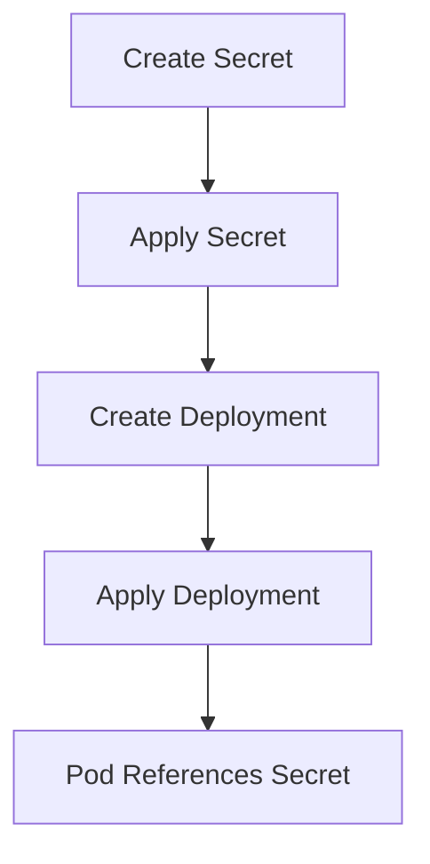

## Introduction to Kubernetes Secrets

In Kubernetes, secrets are used to store sensitive information such as passwords, API keys, and other confidential data securely. This ensures that sensitive data is not exposed in plain text within configuration files or source control repositories. Instead, secrets are stored in an encrypted format and can be referenced by pods and deployments.

### Why Use Secrets?

Using secrets in Kubernetes provides several benefits:

1. **Security**: Sensitive data is encrypted and stored securely within the cluster, reducing the risk of exposure.
2. **Isolation**: Secrets are isolated from the application code and configuration files, making it harder for unauthorized users to access them.
3. **Flexibility**: Secrets can be easily updated without redeploying the entire application, allowing for dynamic management of sensitive data.

### How Secrets Work

Secrets in Kubernetes are stored as base64-encoded strings. When a pod references a secret, Kubernetes decodes the secret and makes it available to the pod in a specified location, typically as environment variables or mounted volumes.

#### Example of a Secret Configuration

Here is an example of a secret configuration file (`mongo-secret.yaml`):

```yaml
apiVersion: v1
kind: Secret
metadata:
  name: mongodb-secret
type: Opaque
data:
  mongo-root-username: dXNlcm5hbWU=  # Base64 encoded username
  mongo-root-password: cGFzc3dvcmQ=  # Base64 encoded password
```

In this example:
- `apiVersion` specifies the version of the Kubernetes API.
- `kind` specifies the resource type, which is `Secret`.
- `metadata` contains the name of the secret.
- `type` specifies the type of the secret, which is `Opaque` for basic key-value pairs.
- `data` contains the key-value pairs of the secret, where the values are base64-encoded.

### Creating a Secret

To create a secret from the configuration file, run the following command:

```bash
kubectl apply -f mongo-secret.yaml
```

This command applies the configuration and creates the secret in the Kubernetes cluster.

### Referencing Secrets in Deployment Files

Once the secret is created, it can be referenced in deployment files. Here is an example of a deployment file (`mongo-deployment.yaml`) that references the secret:

```yaml
apiVersion: apps/v1
kind: Deployment
metadata:
  name: mongo-deployment
spec:
  replicas: 1
  selector:
    matchLabels:
      app: mongo
  template:
    metadata:
      labels:
        app: mongo
    spec:
      containers:
      - name: mongo
        image: mongo:latest
        env:
        - name: MONGO_ROOT_USERNAME
          valueFrom:
            secretKeyRef:
              name: mongodb-secret
              key: mongo-root-username
        - name: MONGO_ROOT_PASSWORD
          valueFrom:
            secretKeyRef:
              name: mongodb-secret
              key: mongo-root-password
```

In this deployment file:
- `env` section defines environment variables for the container.
- `valueFrom` specifies that the value should be retrieved from a secret using `secretKeyRef`.

### Applying the Deployment

To apply the deployment, run the following command:

```bash
kubectl apply -f mongo-deployment.yaml
```

### Mermaid Diagram: Secret Creation and Reference Flow

A mermaid diagram can help visualize the process of creating a secret and referencing it in a deployment:



### Real-World Examples and Recent Breaches

Recent breaches involving misconfigured secrets include:

- **CVE-2021-22554**: A vulnerability in Kubernetes allowed unauthorized access to secrets due to misconfigured RBAC permissions.
- **GitHub Data Exposure**: In 2021, GitHub exposed sensitive data due to misconfigured secrets in public repositories.

These examples highlight the importance of properly managing and securing secrets in Kubernetes.

### Common Pitfalls and How to Avoid Them

#### Pitfall 1: Exposing Secrets in Source Control

**Problem**: Storing secrets in plain text within source control repositories can lead to exposure.

**Solution**: Use secrets in Kubernetes and avoid storing sensitive data in plain text.

#### Pitfall 2: Misconfigured RBAC Permissions

**Problem**: Incorrectly configured Role-Based Access Control (RBAC) can allow unauthorized access to secrets.

**Solution**: Ensure RBAC permissions are correctly configured to restrict access to secrets.

### How to Prevent / Defend

#### Detection

- **Audit Logs**: Regularly review audit logs to detect unauthorized access attempts.
- **Monitoring Tools**: Use monitoring tools like Prometheus and Grafana to monitor access patterns.

#### Prevention

- **RBAC Configuration**: Configure RBAC permissions to restrict access to secrets.
- **Secret Management Tools**: Use secret management tools like HashiCorp Vault or Kubernetes Secrets Store CSI Driver.

#### Secure Coding Fixes

**Vulnerable Code**:

```yaml
apiVersion: v1
kind: Pod
metadata:
  name: my-pod
spec:
  containers:
  - name: my-container
    image: my-image
    env:
    - name: DB_PASSWORD
      value: "my-secret-password"
```

**Secure Code**:

```yaml
apiVersion: v1
kind: Pod
metadata:
  name: my-pod
spec:
  containers:
  - name: my-container
    image: my-image
    env:
    - name: DB_PASSWORD
      valueFrom:
        secretKeyRef:
          name: db-secret
          key: db-password
```

### Conclusion

Using secrets in Kubernetes is essential for securely managing sensitive data. By following best practices and using proper configurations, you can ensure that your applications remain secure and resilient against potential threats.

### Practice Labs

For hands-on practice with deploying MongoDB and MongoExpress in Kubernetes, consider the following labs:

- **Kubernetes Goat**: A hands-on lab for learning Kubernetes security.
- **PortSwigger Web Security Academy**: Offers exercises on securing web applications in Kubernetes.

By completing these labs, you can gain practical experience in deploying and securing applications in Kubernetes.

---
<!-- nav -->
[[02-Introduction to Kubernetes Deployment of MongoDB and MongoExpress|Introduction to Kubernetes Deployment of MongoDB and MongoExpress]] | [[DevOps/DevOps Bootcamp/09-Container Orchestration (Kubernetes)/15-Deploying MongoDB and MongoExpress in Kubernetes/00-Overview|Overview]] | [[04-Introduction to Kubernetes and MongoDB Deployment|Introduction to Kubernetes and MongoDB Deployment]]
