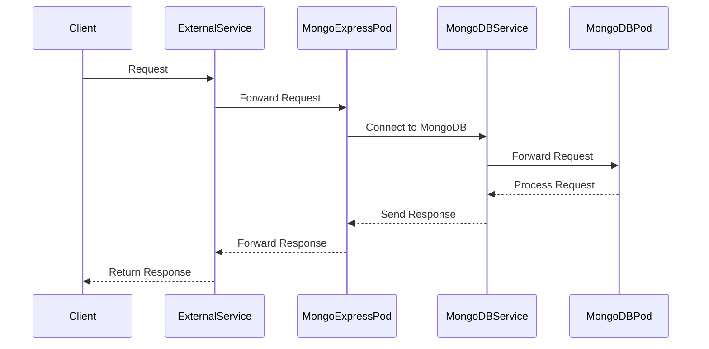

## Introduction to Kubernetes and MongoDB Deployment

Kubernetes is an open-source system for automating deployment, scaling, and management of containerized applications. It was originally designed by Google and is now maintained by the Cloud Native Computing Foundation. Kubernetes provides a framework for running distributed systems resiliently. It abstracts away the underlying infrastructure details and allows developers to focus on their applications rather than the operational complexities.

MongoDB is a popular NoSQL document-oriented database. It stores data in flexible, JSON-like documents, enabling the handling of diverse data types and structures. MongoDB is highly scalable and supports high availability through replication and sharding.

In this section, we will explore how to deploy MongoDB and MongoExpress in a Kubernetes cluster using `MiniCube`, a lightweight Kubernetes environment. We will cover the necessary steps, configurations, and concepts involved in setting up these services.

### Prerequisites

Before proceeding, ensure you have the following:

1. **MiniCube Installed**: MiniCube is a lightweight Kubernetes environment that simplifies the setup process. You can install MiniCube by following the instructions on the [MiniCube GitHub repository](https://github.com/kubeflow/minicube).

2. **Basic Understanding of Kubernetes**: Familiarity with Kubernetes concepts such as pods, services, deployments, and nodes is essential.

3. **Basic Understanding of MongoDB**: Knowledge of MongoDB operations and configurations will help in understanding the deployment process.

### Setting Up MongoDB and MongoExpress in MiniCube

To deploy MongoDB and MongoExpress in MiniCube, we will use the `minicube service` command. This command assigns an external service a public IP address, making it accessible from outside the cluster.

#### Step 1: Deploy MongoDB

First, we need to deploy MongoDB in our Kubernetes cluster. We can use a pre-existing Helm chart or manually define the resources using YAML files.

```yaml
# mongodb-deployment.yaml
apiVersion: apps/v1
kind: Deployment
metadata:
  name: mongodb-deployment
spec:
  replicas: 1
  selector:
    matchLabels:
      app: mongodb
  template:
    metadata:
      labels:
        app: mongodb
    spec:
      containers:
      - name: mongodb
        image: mongo:latest
        ports:
        - containerPort: 27017
        volumeMounts:
        - name: mongodb-data
          mountPath: /data/db
      volumes:
      - name: mongodb-data
        emptyDir: {}
---
apiVersion: v1
kind: Service
metadata:
  name: mongodb-service
spec:
  selector:
    app: mongodb
  ports:
    - protocol: TCP
      port: 27017
      targetPort: 27017
  type: NodePort
```

Apply the above YAML file to create the MongoDB deployment and service:

```sh
kubectl apply -f mongodb-deployment.yaml
```

#### Step 2: Deploy MongoExpress

Next, we deploy MongoExpress, a web-based interface for MongoDB. Similar to MongoDB, we can use a Helm chart or define the resources using YAML files.

```yaml
# mongoexpress-deployment.yaml
apiVersion: apps/v1
kind: Deployment
metadata:
  name: mongoexpress-deployment
spec:
  replicas: 1
  selector:
    matchLabels:
      app: mongoexpress
  template:
    metadata:
      labels:
        app: mongoexpress
    spec:
      containers:
      - name: mongoexpress
        image: mongo-express:latest
        ports:
        - containerPort: 8081
        env:
        - name: ME_CONFIG_MONGODB_SERVER
          value: mongodb-service
        - name: ME_CONFIG_MONGODB_PORT
          value: "27017"
---
apiVersion: v1
kind: Service
metadata:
  name: mongoexpress-service
spec:
  selector:
    app: mongoexpress
  ports:
    - protocol: TCP
      port: 8081
      targetPort: 8081
  type: NodePort
```

Apply the above YAML file to create the MongoExpress deployment and service:

```sh
kubectl apply -
```

#### Step 3: Expose MongoExpress Service

To expose the MongoExpress service externally, we use the `minicube service` command. This command assigns a public IP address to the service, making it accessible from outside the cluster.

```sh
minicube service mongoexpress-service
```

This command will open a browser window with the MongoExpress page. The command also assigns a URL with a public IP address and port to the MongoExpress service.

### Understanding the Request Flow

When you interact with MongoExpress, the following steps occur:

1. **Client Request**: A client sends a request to the MongoExpress service.
2. **External Service**: The request lands at the external service of MongoExpress, which is exposed via the `minicube service` command.
3. **Forwarding to Pod**: The external service forwards the request to the MongoExpress pod.
4. **Connecting to MongoDB**: The MongoExpress pod connects to the MongoDB service.
5. **Forwarding to MongoDB Pod**: The MongoDB service forwards the request to the MongoDB pod.
6. **Processing and Response**: The MongoDB pod processes the request and sends the response back through the same path.

### Mermaid Diagram of Request Flow



### Common Pitfalls and How to Prevent Them

#### 1. Incorrect Configuration of Services

**Issue**: Misconfiguration of services can lead to connectivity issues between the client and the MongoDB pod.

**Prevention**:
- Ensure correct configuration of service selectors and ports.
- Verify that the service type is set correctly (NodePort, LoadBalancer, etc.).

#### 2. Security Vulnerabilities

**Issue**: Exposing services externally can introduce security vulnerabilities if proper security measures are not implemented.

**Prevention**:
- Use network policies to restrict access to the services.
- Implement authentication and authorization mechanisms for MongoDB and MongoExpress.
- Regularly update and patch the deployed images to mitigate known vulnerabilities.

### Secure Configuration Example

Here is an example of a secure configuration for MongoDB and MongoExpress:

```yaml
# mongodb-deployment-secure.yaml
apiVersion: apps/v1
kind: Deployment
metadata:
  name: mongodb-deployment
spec:
  replicas: 1
  selector:
    matchLabels:
      app: mongodb
  template:
    metadata:
      labels:
        app: mongodb
    spec:
      containers:
      - name: mongodb
        image: mongo:latest
        ports:
        - containerPort: 27017
        volumeMounts:
        - name: mongodb-data
          mountPath: /data/db
        securityContext:
          runAsUser: 999
          runAsGroup: 999
      volumes:
      - name: mongodb-data
        emptyDir: {}
---
apiVersion: v1
kind: Service
metadata:
  name: mongodb-service
spec:
  selector:
    app: mongodb
  ports:
    - protocol: TCP
      port: 27017
      targetPort: 27017
  type: NodePort
---
# mongoexpress-deployment-secure.yaml
apiVersion: apps/v1
kind: Deployment
metadata:
  name: mongoexpress-deployment
spec:
  replicas: 1
  selector:
    matchLabels:
      app: mongoexpress
  template:
    metadata:
      labels:
        app: mongoexpress
    spec:
      containers:
      - name: mongoexpress
        image: mongo-express:latest
        ports:
        - containerPort: 8081
        env:
        - name: ME_CONFIG_MONGODB_SERVER
          value: mongodb-service
        - name: ME_CONFIG_MONGODB_PORT
          value: "27017"
        securityContext:
          runAsUser: 999
          runAsGroup: 
```

### Real-World Examples and CVEs

#### CVE-2021-29427: MongoDB Unauthorized Access

**Description**: A vulnerability in MongoDB allowed unauthorized access to the database.

**Impact**: Attackers could gain unauthorized access to sensitive data stored in MongoDB instances.

**Mitigation**: Ensure proper authentication and authorization mechanisms are in place. Regularly update MongoDB to the latest version to mitigate known vulnerabilities.

### Conclusion

Deploying MongoDB and MongoExpress in a Kubernetes cluster using MiniCube involves several steps, including creating deployments and services, exposing services externally, and ensuring proper security measures. By following the steps outlined in this chapter, you can successfully deploy and manage these services in a Kubernetes environment.

### Practice Labs

For hands-on practice, consider the following labs:

- **PortSwigger Web Security Academy**: Offers a comprehensive set of labs covering various aspects of web security.
- **OWASP Juice Shop**: A deliberately insecure web application for security training.
- **DVWA (Damn Vulnerable Web Application)**: A PHP/MySQL web application that is riddled with vulnerabilities for educational purposes.

These labs provide practical experience in deploying and securing applications in a Kubernetes environment.

---
<!-- nav -->
[[03-Introduction to Kubernetes Secrets|Introduction to Kubernetes Secrets]] | [[DevOps/DevOps Bootcamp/09-Container Orchestration (Kubernetes)/15-Deploying MongoDB and MongoExpress in Kubernetes/00-Overview|Overview]] | [[05-Introduction to MongoDB and MongoExpress Deployment in Kubernetes|Introduction to MongoDB and MongoExpress Deployment in Kubernetes]]
