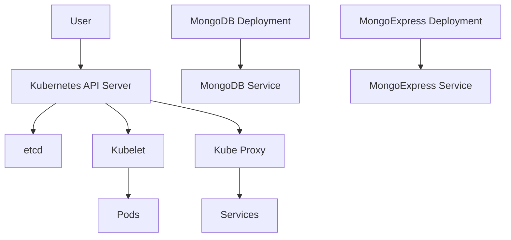
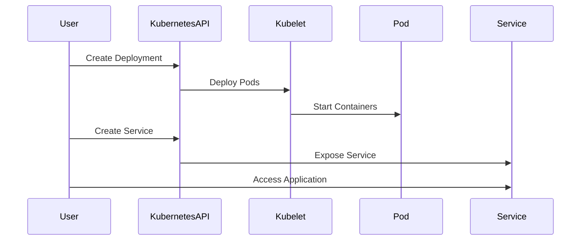

## Introduction to MongoDB and MongoExpress Deployment in Kubernetes

In this section, we will delve into the process of deploying MongoDB and MongoExpress within a Kubernetes cluster. This setup is crucial for managing and interacting with a MongoDB database through a web-based interface. We will cover the necessary steps to create a deployment and service for both MongoDB and MongoExpress, including setting up the required environment variables and configurations.

### Background Theory

#### What is MongoDB?
MongoDB is a popular NoSQL document-oriented database system. Unlike traditional relational databases, MongoDB stores data in flexible, schema-less documents. This makes it highly scalable and suitable for applications requiring high performance and availability.

#### What is MongoExpress?
MongoExpress is a web-based administration tool for MongoDB. It provides a user-friendly interface to manage MongoDB databases, collections, and documents. With MongoExpress, users can perform CRUD operations, view database statistics, and manage users and roles.

#### What is Kubernetes?
Kubernetes is an open-source platform designed to automate the deployment, scaling, and management of containerized applications. It provides a framework for running distributed systems resiliently, with features like self-healing, rolling updates, and load balancing.

### Setting Up MongoDB and MongoExpress in Kubernetes

To deploy MongoDB and MongoExpress in Kubernetes, we need to create several Kubernetes resources: deployments, services, and possibly secrets for storing sensitive information such as database credentials.

#### Step-by-Step Deployment Process

1. **Create a Deployment for MongoDB**
2. **Create a Service for MongoDB**
3. **Create a Deployment for MongoExpress**
4. **Create a Service for MongoExpress**

### Creating the MongoDB Deployment

First, we need to create a deployment for MongoDB. A deployment manages the desired state of the application, ensuring that the specified number of replicas are running.

```yaml
apiVersion: apps/v1
kind: Deployment
metadata:
  name: mongodb-deployment
spec:
  replicas: 1
  selector:
    matchLabels:
      app: mongodb
  template:
    metadata:
      labels:
        app: mongodb
    spec:
      containers:
      - name: mongodb
        image: mongo:latest
        ports:
        - containerPort: 27017
        env:
        - name: MONGO_INITDB_ROOT_USERNAME
          valueFrom:
            secretKeyRef:
              name: mongodb-secret
              key: mongo-root-username
        - name: MONGO_INITDB_ROOT_PASSWORD
          valueFrom:
            secretKeyRef:
              name: mongodb-secret
              key: mongo-root-password
```

#### Explanation of Key Components

- **`apiVersion`:** Specifies the version of the API being used.
- **`kind`:** Indicates the type of resource being created (`Deployment`).
- **`metadata`:** Contains metadata about the deployment, such as its name.
- **`spec`:** Defines the desired state of the deployment.
  - **`replicas`:** Number of replicas to run.
  - **`selector`:** Labels used to identify the pods managed by this deployment.
  - **`template`:** Describes the pod template.
    - **`metadata`:** Metadata for the pod template.
    - **`spec`:** Pod specification.
      - **`containers`:** List of containers in the pod.
        - **`name`:** Name of the container.
        - **`image`:** Docker image to use.
        - **`ports`:** Ports exposed by the container.
        - **`env`:** Environment variables passed to the container.
          - **`valueFrom`:** References a secret for sensitive data.

### Creating the MongoDB Service

Next, we create a service to expose the MongoDB deployment. This allows other components in the cluster to communicate with the MongoDB instance.

```yaml
apiVersion: v1
kind: Service
metadata:
  name: mongodb-service
spec:
  selector:
    app: mongodb
  ports:
    - protocol: TCP
      port: 27017
      targetPort: 27017
  type: ClusterIP
```

#### Explanation of Key Components

- **`apiVersion`:** Specifies the version of the API being used.
- **`kind`:** Indicates the type of resource being created (`Service`).
- **`metadata`:** Contains metadata about the service, such as its name.
- **`spec`:** Defines the desired state of the service.
  - **`selector`:** Labels used to identify the pods managed by this service.
  - **`ports`:** List of ports exposed by the service.
    - **`protocol`:** Protocol used (`TCP`).
    - **`port`:** Port number exposed by the service.
    - **`targetPort`:** Port number on the pod.
  - **`type`:** Type of service (`ClusterIP`).

### Creating the MongoExpress Deployment

Now, we create a deployment for MongoExpress. This deployment will reference the MongoDB service and pass the necessary environment variables.

```yaml
apiVersion: apps/v1
kind: Deployment
metadata:
  name: mongoexpress-deployment
spec:
  replicas: 1
  selector:
    matchLabels:
      app: mongoexpress
  template:
    metadata:
      labels:
        app: mongoexpress
    spec:
      containers:
      - name: mongoexpress
        image: mongo-express:latest
        ports:
        - containerPort: 8081
        env:
        - name: ME_CONFIG_MONGODB_SERVER
          value: mongodb-service
        - name: ME_CONFIG_MONGODB_PORT
          value: "27017"
        - name: ME_CONFIG_MONGODB_ADMINUSERNAME
          valueFrom:
            secretKeyRef:
              name: mongodb-secret
              key: mongo-root-username
        - name: ME_CONFIG_MONGODB_ADMINPASSWORD
          valueFrom:
            secretKeyRef:
              name:_mongodb-secret
              key: mongo-root-password
```

#### Explanation of Key Components

- **`apiVersion`:** Specifies the version of the API being used.
- **`kind`:** Indicates the type of resource being created (`Deployment`).
- **`metadata`:** Contains metadata about the deployment, such as its name.
- **`spec`:** Defines the desired state of the deployment.
  - **`replicas`:** Number of replicas to run.
  - **`selector`:** Labels used to identify the pods managed by this deployment.
  - **`template`:** Describes the pod template.
    - **`metadata`:** Metadata for the pod template.
    - **`spec`:** Pod specification.
      - **`containers`:** List of containers in the pod.
        - **`name`:** Name of the container.
        - **`image`:** Docker image to use.
        - **`ports`:** Ports exposed by the container.
        - **`env`:** Environment variables passed to the container.
          - **`ME_CONFIG_MONGODB_SERVER`:** MongoDB server name.
          - **`ME_CONFIG_MONGODB_PORT`:** MongoDB server port.
          - **`ME_CONFIG_MONGODB_ADMINUSERNAME`:** MongoDB admin username.
          - **`ME_CONFIG_MONGODB_ADMINPASSWORD`:** MongoDB admin password.

### Creating the MongoExpress Service

Finally, we create a service to expose the MongoExpress deployment. This allows users to access the MongoExpress web interface.

```yaml
apiVersion: v1
kind: Service
metadata:
  name: mongoexpress-service
spec:
  selector:
    app: mongoexpress
  ports:
    - protocol: TCP
      port: 8081
      targetPort: 8081
  type: LoadBalancer
```

#### Explanation of Key Components

- **`apiVersion`:** Specifies the version of the API being used.
- **`kind`:** Indicates the type of resource being created (`Service`).
- **`metadata`:** Contains metadata about the service, such as its name.
- **`spec`:** Defines the desired state of the service.
  - **`selector`:** Labels used to identify the pods managed by this service.
  - **`ports`:** List of ports exposed by the service.
    - **`protocol`:** Protocol used (`TCP`).
    - **`port`:** Port number exposed by the service.
    - **`targetPort`:** Port number on the pod.
  - **`type`:** Type of service (`LoadBalancer`).

### Mermaid Diagrams

#### Kubernetes Architecture Diagram



#### Request/Response Flow Diagram



### Common Pitfalls and How to Prevent Them

#### Pitfall 1: Incorrect Configuration of Environment Variables

**What Goes Wrong:**
If the environment variables are not correctly configured, the MongoExpress application may fail to connect to the MongoDB instance.

**How to Prevent:**
Ensure that the environment variables are correctly set and referenced. Use `kubectl describe` to verify the configuration.

```bash
kubectl describe deployment mongoexpress-deployment
```

#### Pitfall 2: Insufficient Resource Allocation

**What Goes Wrong:**
Insufficient CPU or memory allocation can lead to performance issues or crashes.

**How to Prevent:**
Set appropriate resource limits and requests in the deployment configuration.

```yaml
resources:
  requests:
    cpu: "200m"
    memory: "512Mi"
  limits:
    cpu: "500m"
    memory: "1Gi"
```

### Real-World Examples and CVEs

#### Example: MongoDB Authentication Bypass (CVE-2018-14627)

**Description:**
A vulnerability in MongoDB allowed unauthenticated users to bypass authentication and gain unauthorized access to the database.

**Impact:**
This could result in unauthorized data access and manipulation.

**Mitigation:**
Ensure that MongoDB is properly configured with authentication enabled and that strong passwords are used.

```yaml
env:
- name: MONGO_INITDB_ROOT_USERNAME
  valueFrom:
    secretKeyRef:
      name: mongodb-secret
      key: mongo-root-username
- name: MONGO_INITDB_ROOT_PASSWORD
  valueFrom:
    secretKeyRef:
      name: mongodb-secret
      key: mongo-root-password
```

### Secure Coding Practices

#### Vulnerable Code Example

```yaml
env:
- name: ME_CONFIG_MONGODB_ADMINUSERNAME
  value: "admin"
- name: ME_CONFIG_MONGODB_ADMINPASSWORD
  value: "password123"
```

#### Secure Code Example

```yaml
env:
- name: ME_CONFIG_MONGODB_ADMINUSERNAME
  valueFrom:
    secretKeyRef:
      name: mongodb-secret
      key: mongo-root-username
- name: ME_CONFIG_MONGODB_ADMINPASSWORD
  valueFrom:
    secretKeyRef:
      name: mongodb-secret
      key: mongo-root-password
```

### Hands-On Labs

For practical experience, consider using the following labs:

- **PortSwigger Web Security Academy:** Offers interactive labs for web application security.
- **OWASP Juice Shop:** A deliberately insecure web application for security training.
- **DVWA (Damn Vulnerable Web Application):** A PHP/MySQL web application that is riddled with vulnerabilities.

These labs provide a safe environment to practice and reinforce the concepts learned in this chapter.

### Conclusion

Deploying MongoDB and MongoExpress in Kubernetes requires careful planning and configuration. By following the steps outlined in this chapter, you can ensure a robust and secure setup. Remember to regularly review and update your configurations to mitigate potential security risks.

---
<!-- nav -->
[[04-Introduction to Kubernetes and MongoDB Deployment|Introduction to Kubernetes and MongoDB Deployment]] | [[DevOps/DevOps Bootcamp/09-Container Orchestration (Kubernetes)/15-Deploying MongoDB and MongoExpress in Kubernetes/00-Overview|Overview]] | [[06-Introduction to Secrets in Kubernetes|Introduction to Secrets in Kubernetes]]
