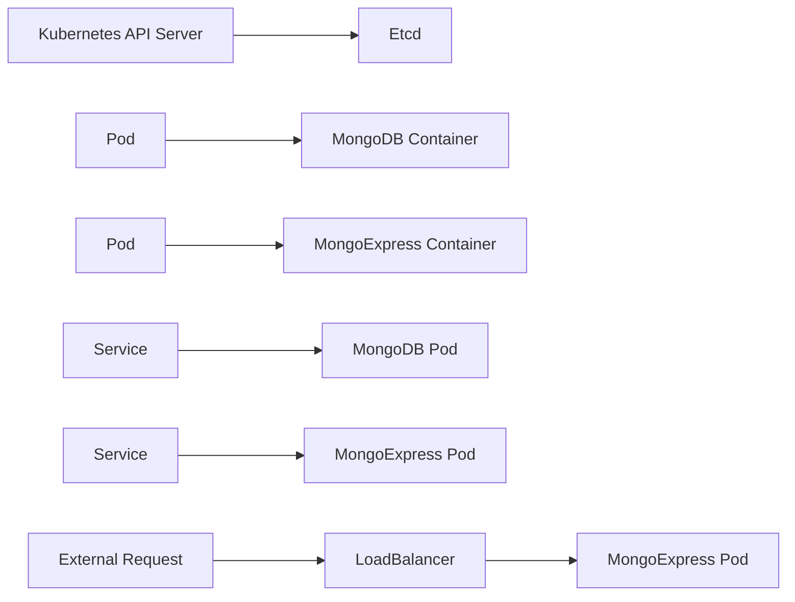

## Deploying MongoDB and MongoExpress in Kubernetes

In this section, we will delve into deploying two applications, MongoDB and MongoExpress, in a Kubernetes environment. This setup serves as a practical demonstration of a typical web application and its database, providing a foundational understanding that can be applied to various similar setups.

### Background Theory

#### What is MongoDB?
MongoDB is a NoSQL document-oriented database system. Unlike traditional relational databases, MongoDB stores data in flexible, schema-less documents. This makes it highly scalable and suitable for modern applications that require high performance and flexibility.

#### What is MongoExpress?
MongoExpress is a web-based interface for managing MongoDB databases. It provides a user-friendly interface to interact with MongoDB, making it easier to perform operations like querying, inserting, updating, and deleting data.

#### What is Kubernetes?
Kubernetes is an open-source platform for automating deployment, scaling, and management of containerized applications. It groups containers that make up an application into logical units called pods, which are deployed together.

### Setting Up MongoDB Pod and Service

#### Creating a MongoDB Pod
To deploy MongoDB in Kubernetes, we first need to create a pod. A pod is the smallest deployable unit in Kubernetes, consisting of one or more containers. Here’s how you can define a MongoDB pod using a YAML configuration file:

```yaml
apiVersion: v1
kind: Pod
metadata:
  name: mongodb-pod
spec:
  containers:
    - name: mongodb
      image: mongo:latest
      ports:
        - containerPort: 27017
```

This YAML file defines a pod named `mongodb-pod` with a single container running the latest version of the MongoDB image. The container listens on port 27017, which is the default port for MongoDB.

#### Creating an Internal Service
To ensure that other components within the Kubernetes cluster can communicate with the MongoDB pod, we need to create an internal service. An internal service allows communication between pods within the same cluster but restricts external access.

Here’s how you can define an internal service for MongoDB:

```yaml
apiVersion: v1
kind: Service
metadata:
  name: mongodb-service
spec:
  selector:
    app: mongodb
  ports:
    - protocol: TCP
      port: 27017
      targetPort: 27017
  type: ClusterIP
```

This YAML file defines a service named `mongodb-service`. The `selector` field ensures that the service routes traffic to the correct pod based on labels. The `type: ClusterIP` specifies that this is an internal service, allowing only internal cluster communication.

### Setting Up MongoExpress Deployment

#### Configuring Database URL and Credentials
To enable MongoExpress to connect to the MongoDB database, we need to provide the database URL and credentials. These details can be passed to the MongoExpress deployment using environment variables.

#### Creating a ConfigMap for Database URL
A ConfigMap is used to store non-confidential data in key-value pairs. We can use a ConfigMap to store the database URL.

Here’s how you can define a ConfigMap for the database URL:

```yaml
apiVersion: v1
kind: ConfigMap
metadata:
  name: mongodb-configmap
data:
  DB_URL: "mongodb://mongodb-service:27017/mydatabase"
```

This ConfigMap stores the database URL in the `DB_URL` key.

#### Creating a Secret for Credentials
A Secret is used to store sensitive data such as passwords, tokens, or keys. We can use a Secret to store the MongoDB credentials.

Here’s how you can define a Secret for the credentials:

```yaml
apiVersion: v1
kind: Secret
metadata:
  name: mongodb-secret
type: Opaque
data:
  DB_USERNAME: dXNlcm5hbWU=  # Base64 encoded username
  DB_PASSWORD: cGFzc3dvcmQ=  # Base64 encoded password
```

This Secret stores the base64-encoded username and password.

#### Referencing ConfigMap and Secret in Deployment
We can now create a deployment for MongoExpress, referencing the ConfigMap and Secret.

Here’s how you can define the MongoExpress deployment:

```yaml
apiVersion: apps/v1
kind: Deployment
metadata:
  name: mongoexpress-deployment
spec:
  replicas: 1
  selector:
    matchLabels:
      app: mongoexpress
  template:
    metadata:
      labels:
        app: mongoexpress
    spec:
      containers:
        - name: mongoexpress
          image: mongoexpress:mongo4.4
          env:
            - name: ME_CONFIG_MONGODB_SERVER
              valueFrom:
                configMapKeyRef:
                  name: mongodb-configmap
                  key: DB_URL
            - name: ME_CONFIG_MONGODB_AUTH_DATABASE
              value: "admin"
            - name: ME_CONFIG_MONGODB_AUTH_USERNAME
              valueFrom:
                secretKeyRef:
                  name: mongodb-secret
                  key: DB_USERNAME
            - name: ME_CONFIG_MONGODB_AUTH_PASSWORD
              valueFrom:
                secretKeyRef:
                  name:  mongodb-secret
                  key: DB_PASSWORD
          ports:
            - containerPort: 8081
```

This deployment defines a single replica of the MongoExpress container, referencing the database URL from the ConfigMap and the credentials from the Secret.

### Creating an External Service for MongoExpress

To make MongoExpress accessible through a browser, we need to create an external service. This service will allow external requests to communicate with the MongoExpress pod.

Here’s how you can define an external service for MongoExpress:

```yaml
apiVersion: v1
kind: Service
metadata:
  name: mongoexpress-service
spec:
  selector:
    app: mongoexpress
  ports:
    - protocol: TCP
      port: 8081
      targetPort: 8081
  type: LoadBalancer
```

This service uses `type: LoadBalancer`, which creates a load balancer to route external traffic to the MongoExpress pod.

### Mermaid Diagrams

#### Kubernetes Architecture Diagram



This diagram illustrates the architecture of the Kubernetes setup, showing the interaction between the API server, etcd, pods, services, and external requests.

### Common Pitfalls and How to Prevent/Defend

#### Pitfall: Exposing MongoDB Directly to the Internet
Exposing MongoDB directly to the internet without proper authentication and encryption can lead to unauthorized access and data breaches.

**How to Prevent/Defend:**
- **Use Internal Services:** Ensure that MongoDB is only accessible via internal services within the Kubernetes cluster.
- **Enable Authentication:** Configure MongoDB to require authentication for all connections.
- **Use TLS Encryption:** Enable TLS encryption for all connections to MongoDB to protect data in transit.

#### Pitfall: Storing Sensitive Data in Plain Text
Storing sensitive data like database credentials in plain text can lead to unauthorized access if the data is exposed.

**How to Prevent/Defend:**
- **Use Secrets:** Store sensitive data in Kubernetes Secrets, which are encrypted at rest.
- **Limit Access to Secrets:** Restrict access to Secrets to only the necessary components using RBAC (Role-Based Access Control).

#### Pitfall: Insecure Configuration of MongoExpress
Improper configuration of MongoExpress can lead to unauthorized access to the MongoDB database.

**How to Prevent/Defend:**
- **Use Environment Variables:** Pass sensitive data to MongoExpress using environment variables, ensuring that the data is not stored in plain text in the deployment configuration.
- **Enable Authentication:** Configure MongoExpress to require authentication before accessing the MongoDB database.

### Real-World Examples

#### Example: MongoDB Exposure Leads to Data Breach
In 2021, a MongoDB instance was exposed to the internet without proper authentication, leading to a data breach. The attackers were able to access and steal sensitive data from the database.

**Mitigation:**
- **Internal Services:** Ensure that MongoDB is only accessible via internal services within the Kubernetes cluster.
- **Authentication:** Enable authentication for all connections to MongoDB.
- **Monitoring:** Implement monitoring and alerting to detect unauthorized access attempts.

### Conclusion

Deploying MongoDB and MongoExpress in Kubernetes provides a robust and scalable solution for managing a web application and its database. By following best practices for securing the deployment, you can ensure that your application remains secure and reliable.

### Practice Labs

For hands-on practice, consider the following labs:
- **Kubernetes Goat:** A Kubernetes security training platform that includes exercises for deploying and securing MongoDB and MongoExpress.
- **OWASP WrongSecrets:** A series of challenges that focus on securely configuring and deploying applications in Kubernetes.

By completing these labs, you can gain practical experience in deploying and securing MongoDB and MongoExpress in a Kubernetes environment.

---
<!-- nav -->
[[06-Introduction to Secrets in Kubernetes|Introduction to Secrets in Kubernetes]] | [[DevOps/DevOps Bootcamp/09-Container Orchestration (Kubernetes)/15-Deploying MongoDB and MongoExpress in Kubernetes/00-Overview|Overview]] | [[DevOps/DevOps Bootcamp/09-Container Orchestration (Kubernetes)/15-Deploying MongoDB and MongoExpress in Kubernetes/08-Practice Questions & Answers|Practice Questions & Answers]]
