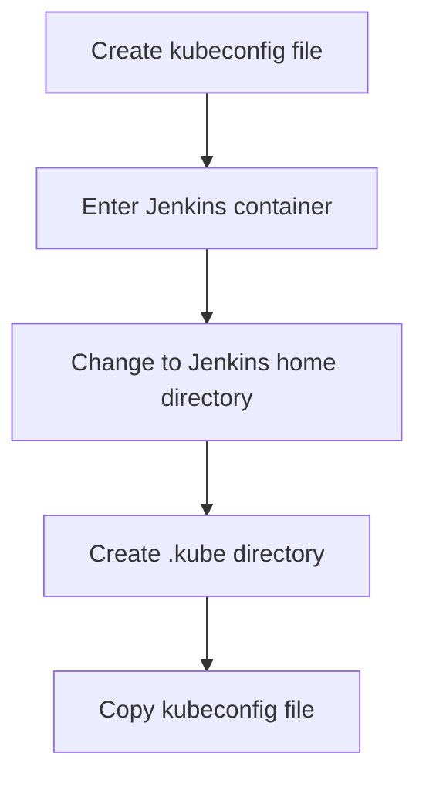

## Introduction to Deploying to an EKS Cluster from a Jenkins Pipeline

Deploying applications to an Amazon Elastic Kubernetes Service (EKS) cluster from a Jenkins pipeline is a common task in modern DevOps practices. This process involves several steps, including setting up the necessary configurations, copying files between different environments, and ensuring that the deployment is secure and efficient. In this chapter, we will delve into the details of deploying to an EKS cluster from a Jenkins pipeline, covering every aspect from the underlying concepts to practical implementation.

### Understanding the Components

Before diving into the specifics, it's important to understand the components involved:

1. **Amazon Elastic Kubernetes Service (EKS)**: EKS is a managed service that makes it easy to run Kubernetes on AWS without needing expertise in Kubernetes operations. It handles the installation, operation, and scaling of the Kubernetes control plane.

2. **Jenkins**: Jenkins is an open-source automation server that provides hundreds of plugins to support building, deploying, and automating any project. It is widely used in continuous integration and continuous delivery (CI/CD) pipelines.

3. **Kubernetes Configuration File**: This file contains essential information such as the cluster's server URL and the certificate authority data. It is crucial for establishing a secure connection between the client (in this case, Jenkins) and the Kubernetes cluster.

### Certificate Authority Data and Server URL

The certificate authority (CA) data and server URL are critical pieces of information required to establish a secure connection to the Kubernetes cluster. These details are typically found in the Kubernetes configuration file (`kubeconfig`).

#### Certificate Authority Data

The CA data is used to verify the identity of the server. It ensures that the client is communicating with the correct server and not a malicious entity. The CA data is usually provided in Base64 encoded format.

```yaml
apiVersion: v1
kind: Config
clusters:
- name: my-cluster
  cluster:
    server: https://<server-url>
    certificate-authority-data: <base64-encoded-ca-data>
```

#### Server URL

The server URL specifies the endpoint of the Kubernetes API server. This is the address to which the client sends requests to interact with the cluster.

### Copying the Configuration File

Once you have the CA data and server URL, you need to create a `kubeconfig` file and make it available within the Jenkins container. This involves several steps:

1. **Creating the `kubeconfig` File**: Ensure that the `kubeconfig` file is correctly formatted and contains the necessary information.

2. **Copying the File to the Jenkins Container**: The `kubeconfig` file needs to be placed in the appropriate directory within the Jenkins container.

### Jenkins User Home Directory

In Jenkins, the home directory is where various configuration files and data are stored. By default, the home directory is located at `/var/jenkins_home`.

```bash
cd /var/jenkins_home
pwd
```

This command changes the directory to the Jenkins home directory and prints the current working directory.

### Creating the `.kube` Directory

To store the `kubeconfig` file, you need to create a `.kube` directory within the Jenkins home directory.

```bash
mkdir -p /var/jenkins_home/.kube
```

### Copying the `kubeconfig` File

Now, you need to copy the `kubeconfig` file from the server to the Jenkins container. This can be done using the `docker cp` command.

```bash
docker cp <source-file> <container-id>:/var/jenkins_home/.kube/
```

### Example Scenario

Let's walk through a complete example scenario to illustrate the process:

1. **Create the `kubeconfig` File**:
   ```bash
   cat <<EOF > kubeconfig
   apiVersion: v1
   kind: Config
   clusters:
   - name: my-cluster
     cluster:
       server: https://<server-url>
       certificate-authority-data: <base64-encoded-ca-data>
   EOF
   ```

2. **Enter the Jenkins Container**:
   ```bash
   docker exec -it <container-id> bash
   ```

3. **Change to the Jenkins Home Directory**:
   ```bash
   cd /var/jenkins_home
   pwd
   ```

4. **Create the `.kube` Directory**:
   ```bash
   mkdir -p .kube
   ```

5. **Copy the `kubeconfig` File**:
   ```bash
   docker cp kubeconfig <container-id>:/var/jenkins_home/.kube/config
   ```

### Mermaid Diagrams

To visualize the process, we can use Mermaid diagrams:



### Common Pitfalls and How to Prevent Them

#### Incorrect Path

Ensure that the path specified in the `docker cp` command is correct. An incorrect path can result in the file not being copied properly.

**Secure Fix**:
Always double-check the paths and ensure they match the actual directory structure.

#### Missing Permissions

Ensure that the Jenkins user has the necessary permissions to read and write to the `.kube` directory.

**Secure Fix**:
Set appropriate permissions using `chmod` and `chown` commands.

```bash
chmod 755 /var/jenkins_home/.kube
chown jenkins:jenkins /var/jenkins_home/.kube
```

### Real-World Examples

#### Recent CVEs and Breaches

One notable example is the Kubernetes API server vulnerability (CVE-2020-8558), which allowed unauthorized access to the Kubernetes API server. Ensuring that the `kubeconfig` file is securely stored and accessed is crucial to preventing such vulnerabilities.

### Hands-On Labs

For practical experience, consider the following labs:

- **PortSwigger Web Security Academy**: Offers a comprehensive set of labs for web application security.
- **OWASP Juice Shop**: A deliberately insecure web application for security training.
- **DVWA (Damn Vulnerable Web Application)**: Another popular web application for security testing.

These labs provide a safe environment to practice and reinforce the concepts learned in this chapter.

### Conclusion

Deploying to an EKS cluster from a Jenkins pipeline involves several steps, including creating and copying the `kubeconfig` file, ensuring proper directory structure, and handling permissions. By following the detailed steps and precautions outlined in this chapter, you can ensure a secure and efficient deployment process.

---
<!-- nav -->
[[02-Introduction to Deploying to an EKS Cluster from Jenkins Pipeline|Introduction to Deploying to an EKS Cluster from Jenkins Pipeline]] | [[DevOps/DevOps Bootcamp/09-Container Orchestration (Kubernetes)/16-Deploying to EKS Cluster from Jenkins Pipeline/00-Overview|Overview]] | [[04-Introduction to Kubernetes and EKS Clusters|Introduction to Kubernetes and EKS Clusters]]
