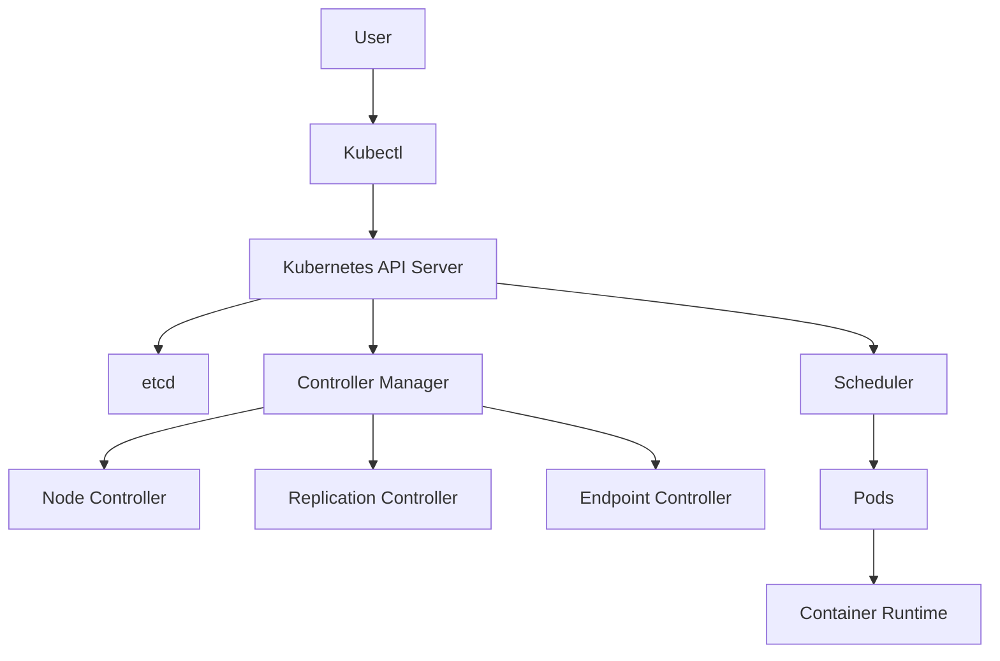
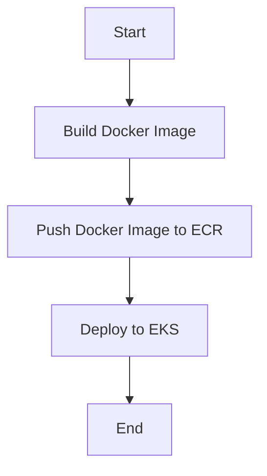

## Introduction to Kubernetes and EKS Clusters

Kubernetes (often abbreviated as K8s) is an open-source system for automating deployment, scaling, and management of containerized applications. It was originally designed by Google and is now maintained by the Cloud Native Computing Foundation. Kubernetes provides a framework for running distributed systems resiliently. It manages and scales application containers across a cluster of nodes.

Amazon Elastic Kubernetes Service (EKS) is a managed service that makes it easy to run Kubernetes on AWS without needing to stand up or maintain your own Kubernetes control plane. EKS supports the Kubernetes API, so you can use any Kubernetes-compatible tool with EKS.

### Why Use EKS?

Using EKS offers several benefits:

1. **Managed Control Plane**: AWS manages the Kubernetes control plane, including etcd, API server, controller manager, and scheduler.
2. **High Availability**: EKS clusters are highly available and span multiple Availability Zones within a region.
3. **Security**: EKS integrates with AWS Identity and Access Management (IAM) and AWS PrivateLink for enhanced security.
4. **Integration with AWS Services**: EKS integrates seamlessly with other AWS services like VPC, IAM, and CloudWatch.

### Kubernetes Configuration File

The Kubernetes configuration file (`config`) is essential for connecting to a Kubernetes cluster. This file contains all the necessary information for authentication and authorization. It is typically stored in the `~/.kube` directory on your local machine.

#### Structure of the Kubernetes Configuration File

A typical Kubernetes configuration file looks like this:

```yaml
apiVersion: v1
kind: Config
clusters:
- name: my-cluster
  cluster:
    server: https://<cluster-endpoint>
    certificate-authority-data: <base64-encoded-ca-cert>
users:
- name: my-user
  user:
    token: <token>
contexts:
- context:
    cluster: my-cluster
    user: my-user
  name: my-context
current-context: my-context
```

### Creating the Kubernetes Configuration File

To create a Kubernetes configuration file for connecting to an EKS cluster, you need to follow these steps:

1. **Install the AWS CLI and AWS IAM Authenticator**:
   Ensure you have the AWS Command Line Interface (CLI) and the AWS IAM Authenticator installed. These tools are necessary for authenticating with the EKS cluster.

2. **Generate the Configuration File**:
   You can generate the configuration file using the `aws eks update-kubeconfig` command. This command updates your `~/.kube/config` file with the necessary information to connect to your EKS cluster.

   ```bash
   aws eks update-kubeconfig --name <cluster-name> --region <region>
   ```

   This command will add a new context to your `~/.kube/config` file, allowing you to switch between different clusters using `kubectl`.

### Connecting to the EKS Cluster from Jenkins

When deploying to an EKS cluster from a Jenkins pipeline, you need to ensure that Jenkins has access to the necessary credentials and configuration files. Instead of storing credentials directly in Jenkins, you can use a Kubernetes configuration file to authenticate with the EKS cluster.

#### Steps to Connect Jenkins to EKS

1. **Create a Kubernetes Configuration File**:
   Create a Kubernetes configuration file that contains the necessary information to authenticate with the EKS cluster. This file should be placed in the Jenkins container.

2. **Configure Jenkins to Use the Configuration File**:
   Configure Jenkins to use the Kubernetes configuration file for authentication. This can be done by setting the `KUBECONFIG` environment variable in the Jenkins container.

   ```bash
   export KUBECONFIG=/path/to/kubeconfig
   ```

3. **Run Kubernetes Commands from Jenkins**:
   Once the configuration file is set up, you can run Kubernetes commands from the Jenkins pipeline using `kubectl`.

   ```groovy
   pipeline {
       agent any
       stages {
           stage('Deploy to EKS') {
               steps {
                   script {
                       sh 'kubectl apply -f deployment.yaml'
                   }
               }
           }
       }
   }
   ```

### Example of a Complete Jenkins Pipeline

Here is a complete example of a Jenkins pipeline that deploys to an EKS cluster:

```groovy
pipeline {
    agent any
    environment {
        KUBECONFIG = '/path/to/kubeconfig'
    }
    stages {
        stage('Build Docker Image') {
            steps {
                script {
                    sh 'docker build -t my-image .'
                }
            }
        }
        stage('Push Docker Image to ECR') {
            steps {
                script {
                    sh 'aws ecr get-login-password --region <region> | docker login --username AWS --password-stdin <account-id>.dkr.ecr.<region>.amazonaws.com'
                    sh 'docker tag my-image:latest <account-id>.dkr.ecr.<region>.amazonaws.com/my-image:latest'
                    sh 'docker push <account-id>.dkr.ecr.<region>.amazonaws.com/my-image:latest'
                }
            }
        }
        stage('Deploy to EKS') {
            steps {
                script {
                    sh 'kubectl apply -f deployment.yaml'
                }
            }
        }
    }
}
```

### Mermaid Diagrams

#### Kubernetes Architecture Diagram



#### Jenkins Pipeline Diagram



### Common Pitfalls and How to Avoid Them

#### Pitfall 1: Incorrect Configuration File

**Problem**: If the Kubernetes configuration file is incorrect or missing, Jenkins will not be able to connect to the EKS cluster.

**Solution**: Ensure that the configuration file is correctly generated and placed in the Jenkins container. Verify the contents of the file to ensure it contains the correct cluster endpoint, certificate authority data, and user credentials.

#### Pitfall 2: Insufficient Permissions

**Problem**: If the user specified in the configuration file does not have sufficient permissions to perform the required actions, the deployment will fail.

**Solution**: Ensure that the user has the necessary permissions to deploy to the EKS cluster. This can be done by assigning the appropriate IAM roles and policies to the user.

### Real-World Examples

#### Example 1: CVE-2021-25741

CVE-2021-25741 is a vulnerability in Kubernetes that allows an attacker to escalate privileges and gain unauthorized access to the cluster. This vulnerability affects versions of Kubernetes prior to 1.21.1.

**Impact**: An attacker could exploit this vulnerability to gain unauthorized access to the Kubernetes cluster and potentially compromise the entire infrastructure.

**Mitigation**: Ensure that your Kubernetes cluster is updated to the latest version. Regularly review and update the configuration files to ensure they contain the latest security patches.

### How to Prevent / Defend

#### Detection

1. **Monitor Logs**: Monitor the logs of the Kubernetes API server and the nodes for any suspicious activity.
2. **Use Security Tools**: Use security tools like Falco, Aqua Security, or Sysdig to monitor and detect any unauthorized access attempts.

#### Prevention

1. **Update Regularly**: Keep your Kubernetes cluster and all related components up to date with the latest security patches.
2. **Use IAM Roles**: Use IAM roles and policies to restrict access to the EKS cluster. Ensure that users have the minimum necessary permissions to perform their tasks.

#### Secure Coding Fixes

**Vulnerable Code**:

```yaml
apiVersion: v1
kind: Pod
metadata:
  name: my-pod
spec:
  containers:
  - name: my-container
    image: my-image:latest
    securityContext:
      privileged: true
```

**Secure Code**:

```yaml
apiVersion: v1
kind: Pod
metadata:
  name: my-pod
spec:
  containers:
  - name: my-container
    image: my-image:latest
    securityContext:
      privileged: false
```

### Conclusion

Deploying to an EKS cluster from a Jenkins pipeline requires careful configuration and management of credentials. By following the steps outlined in this chapter, you can ensure that your Jenkins pipeline is securely connected to your EKS cluster and can deploy applications reliably and efficiently.

### Practice Labs

For hands-on practice with deploying to EKS clusters from Jenkins pipelines, consider the following labs:

- **PortSwigger Web Security Academy**: Offers a variety of labs focused on web application security, including some that involve deploying to Kubernetes clusters.
- **AWS Official Workshops**: Provides detailed workshops on deploying applications to EKS clusters using various CI/CD tools, including Jenkins.
- **CloudGoat**: A cloud security training platform that includes labs on securing and deploying applications to EKS clusters.

By completing these labs, you can gain practical experience in deploying to EKS clusters from Jenkins pipelines and reinforce the concepts covered in this chapter.

---
<!-- nav -->
[[03-Introduction to Deploying to an EKS Cluster from a Jenkins Pipeline|Introduction to Deploying to an EKS Cluster from a Jenkins Pipeline]] | [[DevOps/DevOps Bootcamp/09-Container Orchestration (Kubernetes)/16-Deploying to EKS Cluster from Jenkins Pipeline/00-Overview|Overview]] | [[05-Deploying to EKS Cluster from Jenkins Pipeline|Deploying to EKS Cluster from Jenkins Pipeline]]
