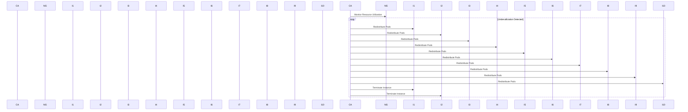

## Introduction to EKS Cluster Autoscaling with AWS Auto Scaling Groups

In the context of modern cloud-native applications, managing the scalability and efficiency of your infrastructure is crucial. Amazon Elastic Kubernetes Service (EKS) provides a managed Kubernetes environment that can run your containerized applications at scale. One of the key features of EKS is its ability to integrate with AWS Auto Scaling Groups to manage the number of worker nodes dynamically based on the workload demands. This integration allows for efficient resource utilization and cost optimization.

### What is EKS?

Amazon Elastic Kubernetes Service (EKS) is a managed service that makes it easy to run Kubernetes on AWS without needing to install and operate your own Kubernetes control plane. EKS supports the standard Kubernetes APIs, so you can use existing tools to interact with the service. You can also use EKS to run your Kubernetes applications across multiple Availability Zones within an AWS Region for high availability.

### What is an Auto Scaling Group?

An Auto Scaling Group (ASG) is a collection of Amazon EC2 instances that are treated as a logical grouping for the purposes of automatic scaling. An ASG can automatically adjust the number of active instances in the group based on predefined conditions such as CPU usage, network traffic, or other application metrics.

### Why Use Auto Scaling Groups with EKS?

Using Auto Scaling Groups with EKS allows you to dynamically scale the number of worker nodes in your cluster based on the current demand. This ensures that you have enough capacity to handle spikes in workload while avoiding unnecessary costs during periods of low demand. Additionally, it helps in maintaining high availability and fault tolerance by automatically replacing unhealthy instances.

### How Does Autoscaling Work in EKS?

To understand how autoscaling works in EKS, let's break down the components involved:

1. **Node Group**: A Node Group is a set of worker nodes in an EKS cluster. Each node group is associated with an Auto Scaling Group.
2. **Auto Scaling Group**: The Auto Scaling Group manages the number of EC2 instances in the node group. It defines the minimum and maximum number of instances that can be active at any given time.
3. **Cluster Autoscaler**: The Cluster Autoscaler is a Kubernetes controller that runs inside the EKS cluster. It monitors the cluster's resource utilization and adjusts the size of the node group by communicating with the Auto Scaling Group.

### Configuring Autoscaling in EKS

Let's dive into the configuration process step-by-step:

#### Step 1: Create an EKS Cluster

First, you need to create an EKS cluster. This can be done using the AWS Management Console, AWS CLI, or Infrastructure as Code (IaC) tools like Terraform.

```bash
# Using AWS CLI
aws eks create-cluster --name my-cluster --role-arn arn:aws:iam::123456789012:role/eksClusterRole --resources-vpc-config subnetIds=subnet-12345678,subnet-23456789,securityGroupIds=sg-12345678
```

#### Step 2: Create a Node Group

Next, you need to create a node group and associate it with an Auto Scaling Group.

```bash
# Using AWS CLI
aws eks create-nodegroup --cluster-name my-cluster --nodegroup-name my-node-group --scaling-config minSize=2,maxSize=10,desiredSize=2 --subnets subnet-12345678 subnet-23456789 --instance-types t3.medium --ami-type AL2_x86_64 --remote-access ssh-key=my-ssh-key --tags key1=value1,key2=value2
```

#### Step 3: Deploy the Cluster Autoscaler

The Cluster Autoscaler needs to be deployed into the EKS cluster. This can be done using a Helm chart or by manually deploying the required Kubernetes manifests.

```yaml
# Example Helm deployment
helm repo add eks https://aws.github.io/eks-charts
helm install cluster-autoscaler eks/cluster-autoscaler \
  --set autoDiscovery.clusterName=my-cluster \
  --set awsRegion=us-west-2 \
  --namespace kube-system
```

### How Autoscaling Works in Practice

Let's consider a scenario where you have a node group with 10 EC2 instances. The Cluster Autoscaler is monitoring the resource utilization of these instances. If it detects that most of the instances are underutilized, it will perform the following actions:

1. **Pod Redistribution**: The Cluster Autoscaler will redistribute the pods from the underutilized instances to the remaining instances.
2. **Instance Termination**: Once the pods are redistributed, the Cluster Autoscaler will terminate the underutilized instances.

Here’s a detailed sequence diagram illustrating this process:



### Real-World Examples and Case Studies

#### Example 1: Netflix Autoscaling

Netflix uses Kubernetes and EKS extensively for their streaming services. They rely heavily on autoscaling to handle the fluctuating demand during peak hours. By leveraging Auto Scaling Groups and the Cluster Autoscaler, Netflix ensures that their infrastructure scales seamlessly to meet user demand without manual intervention.

#### Example 2: Airbnb Autoscaling

Airbnb uses EKS and Auto Scaling Groups to manage their microservices architecture. During high-demand periods, such as holidays, their infrastructure automatically scales to handle the increased load. This ensures that users have a seamless experience without any downtime or performance degradation.

### Pitfalls and Common Mistakes

#### Misconfiguration of Minimum and Maximum Instances

One common mistake is setting the minimum and maximum instance counts incorrectly. If the minimum count is too high, it can lead to unnecessary costs. Conversely, if the maximum count is too low, it may not be able to handle sudden spikes in demand.

**How to Prevent / Defend:**

1. **Monitor Usage Patterns**: Use AWS CloudWatch to monitor the usage patterns of your instances and adjust the minimum and maximum counts accordingly.
2. **Use Reserved Instances**: Consider using Reserved Instances for the minimum count to reduce costs.

#### Incorrect Pod Distribution

Another issue is incorrect pod distribution, leading to inefficient resource utilization. This can happen if the Cluster Autoscaler is not configured correctly or if the pod scheduling policies are not optimal.

**How to Prevent / Defend:**

1. **Optimize Pod Scheduling Policies**: Use Kubernetes scheduler plugins like `NodeAffinity` and `Taints/Tolerations` to ensure pods are distributed efficiently.
2. **Regular Audits**: Regularly audit the pod distribution and make necessary adjustments.

### Detection and Prevention

#### Detection

1. **CloudWatch Alarms**: Set up CloudWatch alarms to monitor the number of active instances and trigger alerts if the counts exceed the expected range.
2. **Kubernetes Metrics Server**: Use the Kubernetes Metrics Server to monitor resource utilization and detect underutilized instances.

#### Prevention

1. **Proper Configuration**: Ensure that the Cluster Autoscaler is properly configured with the correct minimum and maximum instance counts.
2. **Security Best Practices**: Follow security best practices to prevent unauthorized access to the Auto Scaling Group and the EKS cluster.

### Secure Coding Fixes

#### Vulnerable Code Example

```yaml
apiVersion: autoscaling/v1
kind: HorizontalPodAutoscaler
metadata:
  name: my-hpa
spec:
  scaleTargetRef:
    apiVersion: apps/v1
    kind: Deployment
    name: my-deployment
  minReplicas: 1
  maxReplicas: 10
  targetCPUUtilizationPercentage: 50
```

#### Secure Code Example

```yaml
apiVersion: autoscaling/v1
kind: HorizontalPodAutoscaler
metadata:
  name: my-hpa
spec:
  scaleTargetRef:
    apiVersion: apps/v1
    kind: Deployment
    name: my-deployment
  minReplicas: 2
  maxReplicas: 1
  targetCPUUtilizationPercentage: 50
```

### Conclusion

Autoscaling in EKS with AWS Auto Scaling Groups is a powerful feature that enables dynamic scaling of your infrastructure based on demand. By understanding the components involved and configuring them correctly, you can ensure efficient resource utilization and cost optimization. Regular monitoring and auditing are essential to maintain optimal performance and security.

### Hands-On Labs

For practical experience, consider the following labs:

- **PortSwigger Web Security Academy**: Focuses on web application security but can provide insights into securing Kubernetes deployments.
- **AWS Official Workshops**: Provides hands-on labs specifically designed for EKS and Auto Scaling Groups.

By completing these labs, you can gain a deeper understanding of how to effectively implement and manage autoscaling in EKS.

---
<!-- nav -->
[[DevOps/DevOps Bootcamp/09-Container Orchestration (Kubernetes)/17-EKS Cluster Autoscaling with AWS Auto Scaling Groups/00-Overview|Overview]] | [[02-Introduction to Kubernetes and AWS Load Balancers|Introduction to Kubernetes and AWS Load Balancers]]
