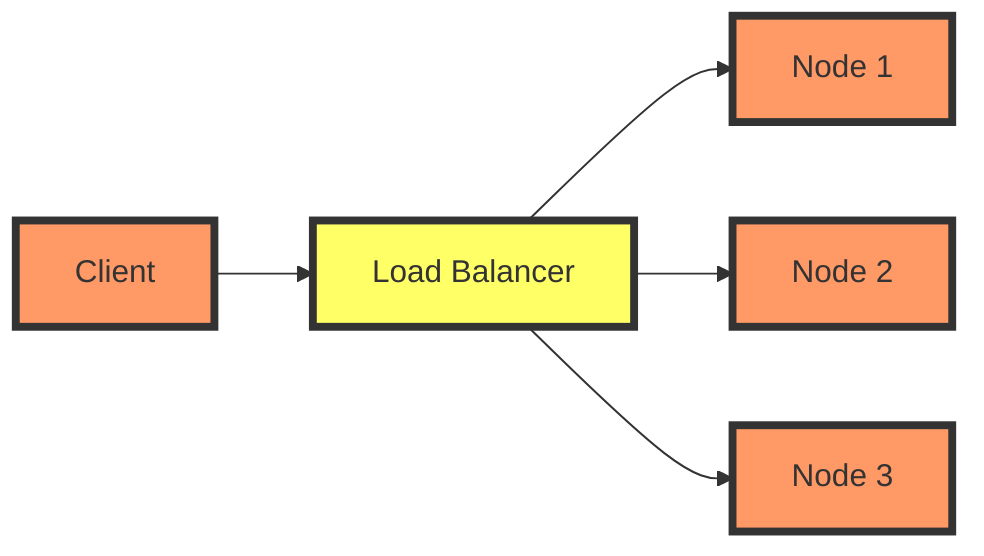

## Introduction to Load Balancers in Kubernetes

In Kubernetes, a load balancer is a service that distributes incoming traffic across multiple pods. This ensures that no single pod bears too much load, which can lead to performance degradation or even failure. The load balancer service type is particularly useful in production environments where high availability and scalability are critical.

### What is a Load Balancer?

A load balancer is a device or software that acts as a middleman between clients and servers. Its primary function is to distribute incoming network traffic across multiple servers or services. This distribution helps to ensure that no single server becomes overwhelmed with requests, thereby improving the overall performance and reliability of the system.

#### Why Use a Load Balancer?

1. **Scalability**: A load balancer can dynamically distribute traffic based on the current load, allowing you to scale your infrastructure up or down as needed.
2. **High Availability**: By distributing traffic across multiple servers, a load balancer can ensure that your application remains available even if some servers fail.
3. **Performance Optimization**: Load balancers can optimize the performance of your application by directing traffic to the least busy servers.

### How Does a Load Balancer Work?

When you create a service with the `type: LoadBalancer` in Kubernetes, the following steps occur:

1. **Service Creation**: A service is created with the `type: LoadBalancer`.
2. **Load Balancer Provisioning**: Depending on the cloud provider, a load balancer is provisioned. For example, in AWS, an Elastic Load Balancer (ELB) is created.
3. **DNS Name Assignment**: The load balancer is assigned a DNS name, which can be used to access the service.
4. **Port Configuration**: The load balancer is configured to forward traffic from a specific port (usually port 80 for HTTP) to the node port of the service.

### Example: Creating a Load Balancer Service in Kubernetes

Let's walk through an example of creating a load balancer service in Kubernetes.

```yaml
apiVersion: v1
kind: Service
metadata:
  name: nginx-service
spec:
  type: LoadBalancer
  selector:
    app: nginx
  ports:
    - protocol: TCP
      port: 80
      targetPort: 8080
```

This YAML defines a service named `nginx-service` with the `type: LoadBalancer`. The service selects pods labeled with `app: nginx` and forwards traffic from port 80 to port 8080 on the pods.

### Understanding the Load Balancer DNS Name

Once the load balancer is created, it is assigned a DNS name. This DNS name can be accessed via the Kubernetes dashboard or by running the following command:

```sh
kubectl get svc nginx-service
```

The output will include the DNS name of the load balancer:

```sh
NAME            TYPE           CLUSTER-IP       EXTERNAL-IP     PORT(S)        AGE
nginx-service   LoadBalancer   10.100.200.100   192.168.1.100   80:30204/TCP   5m
```

Here, `192.168.1.100` is the external IP address of the load balancer, and `10.100.200.100` is the cluster IP address.

### Accessing the Application via the Load Balancer

To access the application, you can use the DNS name or the external IP address of the load balancer. For example, if the DNS name is `nginx-service.example.com`, you can access the application by navigating to `http://nginx-service.example.com`.

### Port Configuration in Load Balancers

In the example above, the load balancer is configured to forward traffic from port 80 to port 8080 on the pods. This is specified in the `ports` section of the service definition.

```yaml
ports:
  - protocol: TCP
    port: 80
    targetPort: 8080
```

Here, `port: 80` specifies the port on the load balancer, and `targetPort: 8080` specifies the port on the pods.

### Understanding Node Ports

Node ports are used to expose services outside the cluster. When a service is exposed via a node port, the port is opened on each node in the cluster. The load balancer then forwards traffic from its own port to the node port.

In the example above, the node port is `30204`. This means that traffic from the load balancer's port 80 is forwarded to port `30204` on the nodes.

### Real-World Example: CVE-2021-20225

CVE-2021-20225 is a vulnerability in Kubernetes that allows an attacker to bypass authentication and gain unauthorized access to the API server. This vulnerability can be exploited if the load balancer is misconfigured or if the security settings are not properly enforced.

#### How to Prevent / Defend Against CVE-2021-20225

1. **Secure Load Balancer Configuration**: Ensure that the load balancer is configured securely. This includes setting up proper authentication and authorization mechanisms.
2. **Use Network Policies**: Implement network policies to restrict traffic to and from the load balancer.
3. **Regular Audits**: Regularly audit the load balancer configuration to ensure that it is secure and up-to-date.

### Complete Example: Secure Load Balancer Configuration

Here is an example of a secure load balancer configuration:

```yaml
apiVersion: v1
kind: Service
metadata:
  name: secure-nginx-service
spec:
  type: LoadBalancer
  selector:
    app: nginx
  ports:
    - protocol: TCP
      port: 80
      targetPort: 8080
  loadBalancerSourceRanges:
    - 10.0.0.0/24
```

In this example, the `loadBalancerSourceRanges` field restricts access to the load balancer to a specific range of IP addresses (`10.0.0.0/24`).

### Mermaid Diagram: Load Balancer Architecture



### Common Pitfalls and Best Practices

1. **Misconfigured Load Balancers**: Ensure that the load balancer is correctly configured to avoid misrouting traffic.
2. **Security Settings**: Always enforce proper security settings, including authentication and authorization.
3. **Regular Audits**: Regularly audit the load balancer configuration to ensure that it is secure and up-to-date.

### Conclusion

Understanding and configuring load balancers in Kubernetes is crucial for ensuring high availability and scalability. By following best practices and securing the load balancer configuration, you can ensure that your application remains reliable and secure.

### Practice Labs

For hands-on practice with load balancers in Kubernetes, consider the following labs:

- **PortSwigger Web Security Academy**: Offers a variety of labs related to web security, including load balancer configurations.
- **OWASP Juice Shop**: Provides a vulnerable web application that can be used to practice securing load balancers.
- **Kubernetes Goat**: A hands-on lab for practicing Kubernetes security, including load balancer configurations.

By completing these labs, you can gain practical experience in configuring and securing load balancers in Kubernetes.

---
<!-- nav -->
[[02-Introduction to Kubernetes and AWS Load Balancers|Introduction to Kubernetes and AWS Load Balancers]] | [[DevOps/DevOps Bootcamp/09-Container Orchestration (Kubernetes)/17-EKS Cluster Autoscaling with AWS Auto Scaling Groups/00-Overview|Overview]] | [[04-Subnets and Availability Zones in VPC|Subnets and Availability Zones in VPC]]
