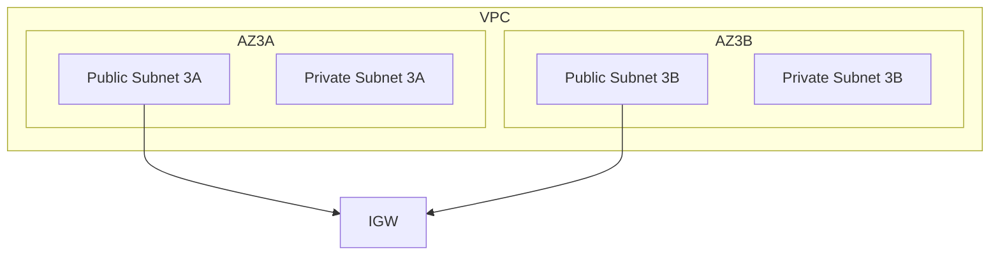

## Subnets and Availability Zones in VPC

### Introduction to VPC and Subnets

In Amazon Web Services (AWS), a Virtual Private Cloud (VPC) is a logically isolated section of the AWS Cloud where you can launch resources in a virtual network that you define. A VPC allows you to control the IP address range, create subnets, configure route tables, and set up network gateways. This setup provides a high level of security and control over your network environment.

#### What is a Subnet?

A subnet is a range of IP addresses within a VPC. Subnets are used to divide a VPC into smaller segments, allowing you to place resources in specific locations based on their networking requirements. There are two types of subnets:

1. **Public Subnets**: These subnets are connected to an Internet Gateway (IGW), allowing resources within them to communicate directly with the internet.
2. **Private Subnets**: These subnets are not connected to an IGW, meaning resources within them cannot communicate directly with the internet. They are typically used for backend services that should not be exposed to the public internet.

#### Why Use Public and Private Subnets?

Using both public and private subnets helps to enhance the security of your infrastructure. By placing publicly accessible services (like load balancers) in public subnets and sensitive backend services in private subnets, you can limit the exposure of critical resources to the internet.

### Availability Zones (AZ)

An Availability Zone (AZ) is a distinct location within a region that is engineered to be isolated from failures in other AZs. Each AZ has independent power, cooling, and networking. Using multiple AZs helps to ensure high availability and fault tolerance.

#### How AZs Work

When you create a VPC, you can specify the number of AZs you want to use. In the given example, the VPC spans two AZs (3A and 3B). This means that resources can be distributed across these AZs to improve availability and reduce the risk of a single point of failure.

### Example VPC Configuration

Let's consider a VPC with four subnets: two public and two private, each located in different AZs.



### Pod Placement and Load Balancers

#### Pods in Private Subnets

Pods, which are the smallest deployable units in Kubernetes, are typically placed in private subnets. This ensures that they are not directly accessible from the internet, enhancing security.

#### Load Balancers in Public Subnets

Load balancers, which distribute incoming application traffic across multiple targets, are placed in public subnets. This allows them to receive traffic from the internet and distribute it to the appropriate pods in private subnets.

### IP Address Assignment

#### Private Subnet IPs

Pods in private subnets receive IP addresses from the private subnet's IP address range. This range is defined when the subnet is created and is typically a private IP address range (e.g., 10.0.0.0/24).

#### Public Subnet IPs

Load balancers in public subnets receive both public and private IP addresses. The public IP address is assigned from the public subnet's IP address range, which is routable on the internet. The private IP address is assigned from the private subnet's IP address range.

### Example IP Address Assignment

Consider a VPC with the following subnets:

- Public Subnet 3A: 10.0.1.0/24
- Private Subnet 3A: 10.0.2.0/24
- Public Subnet 3B: 10.0.3.0/24
- Private Subnet 3B: 10.0.4.0/24

A pod in Private Subnet 3A might have the IP address `10.0.2.10`, while a load balancer in Public Subnet 3A might have the public IP address `54.123.45.67` and the private IP address `10.0.1.10`.

### Recent Real-World Examples

#### CVE-2021-20225: AWS Elastic Load Balancing

In 2021, a vulnerability was discovered in AWS Elastic Load Balancing (ELB) that allowed attackers to bypass security groups and access resources in private subnets. This vulnerability highlights the importance of properly configuring security groups and ensuring that only necessary ports are exposed.

**Detection and Prevention:**

- **Detection**: Monitor security group rules and network traffic to identify unauthorized access attempts.
- **Prevention**: Ensure that security groups are configured to allow traffic only from trusted sources. Use network ACLs to further restrict traffic.

**Secure Code Fix:**

```yaml
# Vulnerable Security Group Rule
{
  "IpPermissions": [
    {
      "IpProtocol": "-1",
      "UserIdGroupPairs": [
        {
          "GroupId": "sg-0123456789abcdef0"
        }
      ]
    }
  ]
}

# Secure Security Group Rule
{
  "IpPermissions": [
    {
      "IpProtocol": "tcp",
      "FromPort": 80,
      "ToPort": 80,
      "IpRanges": [
        {
          "CidrIp": "0.0.0.0/0"
        }
      ]
    }
  ]
}
```

### Common Pitfalls and Best Practices

#### Pitfall: Incorrect Subnet Configuration

Incorrectly configuring subnets can lead to security vulnerabilities. For example, placing sensitive resources in public subnets can expose them to the internet.

**Best Practice**: Always place sensitive resources in private subnets and use load balancers in public subnets to manage external traffic.

#### Pitfall: Overly Permissive Security Groups

Overly permissive security groups can allow unauthorized access to resources.

**Best Practice**: Configure security groups to allow traffic only from trusted sources and use network ACLs to further restrict traffic.

### Conclusion

Understanding the role of subnets and availability zones in a VPC is crucial for building a secure and scalable infrastructure. By properly configuring public and private subnets, and ensuring that sensitive resources are placed in private subnets, you can significantly enhance the security of your AWS environment.

### Hands-On Labs

For practical experience with VPC and subnet configuration, consider the following labs:

- **CloudGoat**: A hands-on lab for learning about AWS security best practices.
- **flaws.cloud**: A platform for practicing cloud security skills, including VPC and subnet configuration.

These labs provide real-world scenarios and challenges to help you master the concepts covered in this chapter.

---
<!-- nav -->
[[03-Introduction to Load Balancers in Kubernetes|Introduction to Load Balancers in Kubernetes]] | [[DevOps/DevOps Bootcamp/09-Container Orchestration (Kubernetes)/17-EKS Cluster Autoscaling with AWS Auto Scaling Groups/00-Overview|Overview]] | [[05-Understanding Port Mapping in Kubernetes Services|Understanding Port Mapping in Kubernetes Services]]
