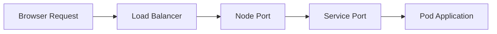
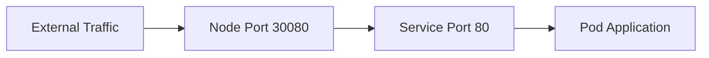
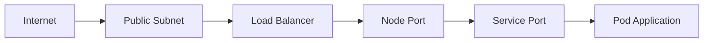

## Understanding Port Mapping in Kubernetes Services

### Service Ports and Node Ports

In Kubernetes, services are used to expose applications running in pods to other parts of the cluster or to external clients. One of the key concepts in Kubernetes services is port mapping, which involves how incoming requests are routed through different layers of the system.

#### Service Port

The **service port** is the port number that the service listens on within the Kubernetes cluster. This is the port that your application inside the pod expects to receive traffic on. For instance, if you have a web application that runs on port 80, the service port would also be set to 80.



#### Node Port

The **node port** is the port that is opened on each node in the cluster. This port is used to forward traffic from the external world to the service port inside the cluster. The node port is typically a high-numbered port (30000-32767) to avoid conflicts with other services.

For example, if you have a service that listens on port 80 inside the cluster, you might configure a node port of 30080. This means that any traffic coming into the node on port 30080 will be forwarded to the service port 80.



### Load Balancer and Subnets

When deploying a Kubernetes cluster, especially in a cloud environment like AWS, the choice of subnets plays a crucial role in how your services are exposed to the internet.

#### Public and Private Subnets

In AWS, a VPC (Virtual Private Cloud) can be divided into public and private subnets. Public subnets allow direct access to the internet, whereas private subnets do not. This distinction is important for security and network design.

- **Public Subnets**: These subnets have a route to an Internet Gateway (IGW), allowing instances in these subnets to communicate directly with the internet. They are typically used for load balancers, NAT gateways, and other services that need to be publicly accessible.
  
- **Private Subnets**: These subnets do not have a route to the IGW. Instances in these subnets cannot communicate directly with the internet. They are typically used for backend services, databases, and other internal components.

#### Load Balancer Placement

When setting up a load balancer in a Kubernetes cluster, it is important to place it in a public subnet. This ensures that external traffic can reach the load balancer and be forwarded to the appropriate services within the cluster.



### Example Configuration

Let's consider a practical example where we create a VPC with two public and two private subnets, and deploy a load balancer in the public subnets.

#### Step 1: Create VPC and Subnets

First, we create a VPC and define two public and two private subnets.

```bash
aws ec2 create-vpc --cidr-block 10.0.0.0/16
aws ec2 create-subnet --vpc-id vpc-xxxxxxxx --cidr-block 10.0.1.0/24 --availability-zone us-west-2a
aws ec2 create-subnet --vpc-id vpc-xxxxxxxx --cidr-block 10.0.2.0/24 --availability-zone us-west-2b
aws ec2 create-subnet --vpc-id vpc-xxxxxxxx --cidr-block 10.0.3.0/24 --availability-zone us-west-2a
aws ec2 create-subnet --vpc-id vpc-xxxxxxxx --cidr-block 10.0.4.0/24 --availability-zone us-west-2b
```

#### Step 2: Configure Internet Gateway

Next, we attach an Internet Gateway to the VPC and create routes to the public subnets.

```bash
aws ec2 create-internet-gateway
aws ec2 attach-internet-gateway --internet-gateway-id igw-xxxxxxxx --vpc-id vpc-xxxxxxxx
aws ec2 create-route --route-table-id rtb-xxxxxxxx --destination-cidr-block 0.0.0.0/0 --gateway-id igw-xxxxxxxx
```

#### Step 3: Deploy Load Balancer

Finally, we deploy a load balancer in the public subnets.

```yaml
apiVersion: v1
kind: Service
metadata:
  name: my-load-balancer
spec:
  type: LoadBalancer
  ports:
    - protocol: TCP
      port: 80
      targetPort: 80
  selector:
    app: my-app
```

### Pitfalls and Best Practices

#### Common Mistakes

- **Incorrect Subnet Configuration**: Placing the load balancer in a private subnet can result in connectivity issues.
- **Security Group Misconfiguration**: Incorrect security group rules can block necessary traffic.

#### Best Practices

- **Use Network Policies**: Implement network policies to control traffic between pods.
- **Regular Audits**: Regularly audit your VPC and subnet configurations to ensure they align with your security requirements.

### How to Prevent / Defend

#### Detection

- **Logging and Monitoring**: Use tools like AWS CloudTrail and VPC Flow Logs to monitor network traffic and detect unauthorized access.
- **Security Groups**: Review security group rules to ensure they are correctly configured to allow only necessary traffic.

#### Prevention

- **Secure Subnet Configuration**: Ensure that load balancers are placed in public subnets and that private subnets are properly isolated.
- **IAM Role Management**: Use IAM roles with least privilege to manage access to resources.

#### Secure Code Fix

Here is an example of a vulnerable configuration and the corrected version:

**Vulnerable Configuration**

```yaml
apiVersion: v1
kind: Service
metadata:
  name: my-load-balancer
spec:
  type: LoadBalancer
  ports:
    - protocol: TCP
      port: 80
      targetPort: 80
  selector:
    app: my-app
```

**Corrected Configuration**

```yaml
apiVersion: v1
kind: Service
metadata:
  name: my-load-balancer
spec:
  type: LoadBalancer
  ports:
    - protocol: TCP
      port: 80
      targetPort: 80
  selector:
    app: my-app
  loadBalancerIP: <public-ip>
```

### Real-World Examples

#### Recent Breaches

- **CVE-2021-21277**: This vulnerability in Kubernetes allowed attackers to bypass authentication and gain unauthorized access to the cluster. Proper subnet and security group configuration can help mitigate such risks.

### Hands-On Labs

To practice these concepts, you can use the following labs:

- **PortSwigger Web Security Academy**: Offers exercises on configuring Kubernetes services and load balancers.
- **OWASP Juice Shop**: Provides a hands-on environment to test and secure Kubernetes deployments.

By thoroughly understanding and implementing these principles, you can ensure that your Kubernetes services are securely exposed to the internet while maintaining robust network isolation.

---
<!-- nav -->
[[04-Subnets and Availability Zones in VPC|Subnets and Availability Zones in VPC]] | [[DevOps/DevOps Bootcamp/09-Container Orchestration (Kubernetes)/17-EKS Cluster Autoscaling with AWS Auto Scaling Groups/00-Overview|Overview]] | [[DevOps/DevOps Bootcamp/09-Container Orchestration (Kubernetes)/17-EKS Cluster Autoscaling with AWS Auto Scaling Groups/06-Practice Questions & Answers|Practice Questions & Answers]]
